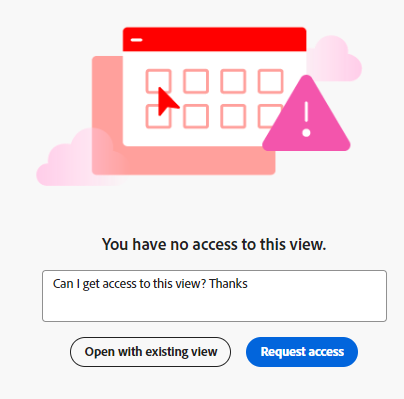

# Request permissions to a view or a workspace

You can request permissions to a view or a workspace when someone shares a link with you to the view or the workspace to which you do not have access. 

Requesting permissions to a view is similar to requesting permissions to a workspace. 

This article describes how to request access to a view or a workspace when someone shares a link with you and you cannot access the shared page. 

For information about granting permissions to views and workspaces, see the following articles:

* [Share views](/help/quicksilver/planning/access/share-views.md)
* [Share workspaces](/help/quicksilver/planning/access/share-workspaces.md)

## Access requirements

+++ Expand to view access requirements for Workfront Planning. 

You must have the following to be able to access Workfront Planning:  

 <table style="table-layout:auto"> 
<col> 
</col> 
<col> 
</col> 
<tbody> 
    <tr> 
<tr> 
<td> 
   
 Products
 </td> 
   <td> 
   <ul><li>
 Adobe Workfront
</li> 
   <li>
 Adobe Workfront Planning
</li></ul></td> 
  </tr>   
<tr> 
   <td role="rowheader">
Adobe Workfront plan*
</td> 
   <td> 

Any of the following Workfront plans:
 
<ul><li>Select</li> 
<li>Prime</li> 
<li>Ultimate</li></ul> 

Workfront Planning is not available for legacy Workfront plans
 
   </td> 
<tr> 
   <td role="rowheader">
Adobe Workfront Planning plan*
</td> 
   <td> 

Any 
 

For more information about what is included in each Workfront Planning plan, see <a href="https://business.adobe.com/products/workfront/pricing.html">Adobe Workfront pricing and packaging</a>. 
 
   </td> 
 <tr> 
   <td role="rowheader">
Adobe Workfront platform
</td> 
   <td> 

Your organization's instance of Workfront must be onboarded to the Adobe Unified Experience to be able to access all the capabilities of Workfront Planning.
 

For more information, see <a href="/help/quicksilver/workfront-basics/navigate-workfront/workfront-navigation/adobe-unified-experience.md">Adobe Unified Experience for Workfront</a>. 
 
   </td> 
   </tr> 
  </tr> 
  <tr> 
   <td role="rowheader">
Adobe Workfront license*
</td> 
   <td>
 Standard, Light, or Contributor

   
Workfront Planning is not available for legacy Workfront licenses
 
  </td> 
  </tr> 
  <tr> 
   <td role="rowheader">
Access level configuration
</td> 
   <td> 
There are no access level controls for Adobe Workfront Planning
   
</td> 
  </tr> 
<tr> 
   <td role="rowheader">
Object permissions
</td> 
   <td>  
After your request for permission is granted, you could gain the following permissions:

   <ul><li>
View or Manage for a view
</li>
   <li>
View, Contribute, or Manage to a workspace
</li></ul>  
   
Only users with Manage permissions to a workspace and a view can share a view publicly.
</td> 
  </tr> 
<tr> 
   <td role="rowheader">
Layout template
</td> 
   <td> 
All users, including Workfront administrators,  must be assigned a layout template that includes the Planning area in the Main Menu. 
 </td> 
  </tr> 
</tbody> 
</table> 

 *For more information about Workfront access requirements, see [Access requirements in Workfront documentation](/help/quicksilver/administration-and-setup/add-users/access-levels-and-object-permissions/access-level-requirements-in-documentation.md).

 +++

## Request permissions to a view or workspace

Requesting permissions to a view is similar to requesting permission to a workspace. 

When someone shares with you a link to a workspace or a view where you do not have access:

1. Click the link shared with you for the view or the workspace. 
    
    A **You have no access** page displays to inform you that you do not have access to the view or the workspace.

    

1. (Conditional) If the link shared is for a view for a workspace where you have access, click **Open with existing view**. If you have permissions to access the workspace, the record type page opens in the default view.

1. (Optional and conditional) If you do not have permissions to view the workspace, add a personalized message in the box available, then click **Request access**. 

    All users with Manage permissions to the view or the workspace receive the following notifications for the access request:
      * An in-app notification
         
      * An email notification
         
   
1. (Conditional) When the view or workspace manager grants you permissions to the view or workspace, you receive an email notification and an in-app notification with a confirmation that the permission was granted. <!--check this - I was not able to test this, but Isk confirmed.-->

