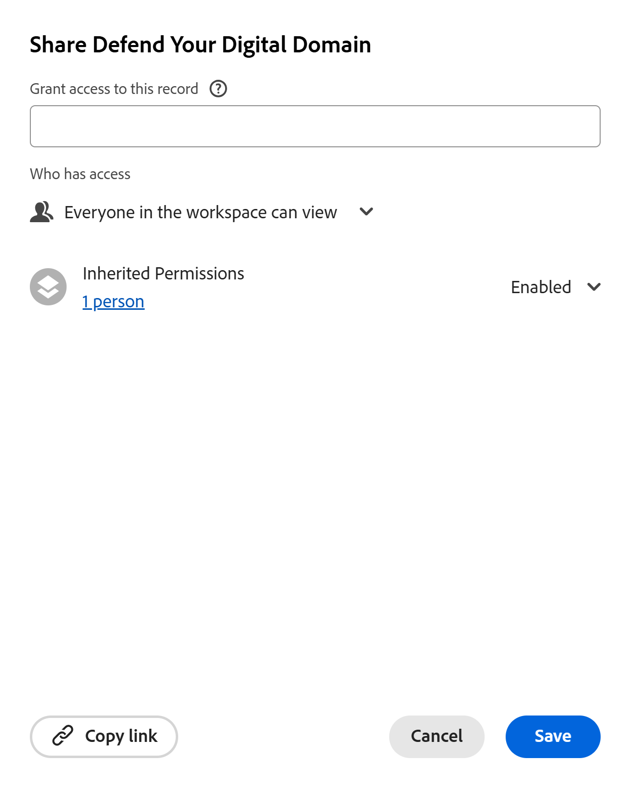
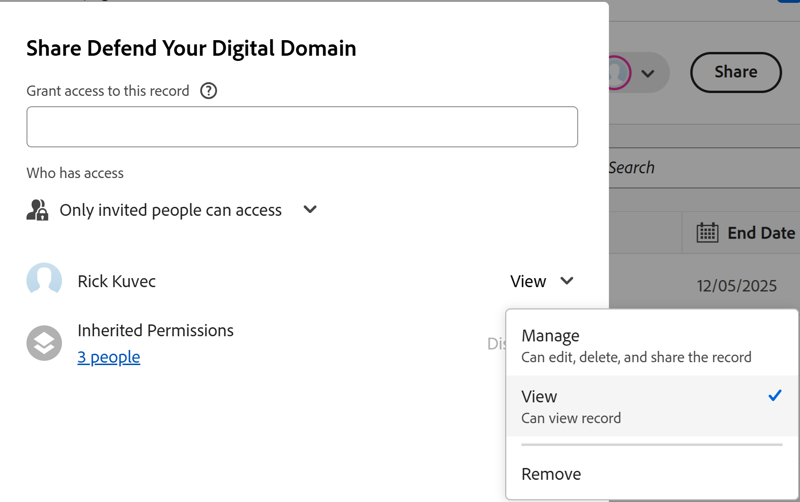

<!--update metadata with real information at release-->

# Share records

<!--this will NOT be available in Preview ever - find a way to add this in this article that is prominent-->

<!--The information on this page refers to functionality not yet generally available. It is available only in the Preview environment for all customers. After the monthly releases to Production, the same features are also available in the Production environment for customers who enabled fast releases.    

For information about fast releases, see [Enable or disable fast releases for your organization](/help/quicksilver/administration-and-setup/set-up-workfront/configure-system-defaults/enable-fast-release-process.md). -->

{{planning-important-intro}}

You can adjust people's permissions to individual records in a record type. 

You can share an Adobe Workfront Planning record in the following ways: 

* Share a link to the record. 

    For more information, see [Share records using a link](/help/quicksilver/planning/records/share-records.md).

* Share all records in a workspace with other users by sharing the workspace and the record type.

   For more information see the following articles:

   * [Share a workspace](/help/quicksilver/planning/access/share-workspaces.md)

   * [Share a record type](/help/quicksilver/planning/access/share-record-types.md)

* Share a record using the **Share** option.

    This article describes how you can share a record with others using the **Share** option. 

>[!IMPORTANT]
>
>Users with access to a workspace automatically gain at least View permissions to all the records in the workspace. 
>Sharing views does not give users permissions to records. Only sharing workspaces can grant users permissions to record types and records. 
>
>For general information about sharing objects in Workfront Planning, also see [Overview of sharing permissions in Adobe Workfront Planning](/help/quicksilver/planning/access/sharing-permissions-overview.md). 

## Access requirements

+++ Expand to view access requirements for the functionality in this article. 

<!--at GA, check that the Workfront plans article linked below has Planning info-->

 <table style="table-layout:auto"> 
<col> 
</col> 
<col> 
</col> 
<tbody> 
    <tr> 
<tr> 
   <td role="rowheader">
Adobe Workfront package
</td> 
   <td> 

Any Workfront and Planning package
 
Or

Any Workflow and Planning package
 
 </tr>
   
  <tr> 
   <td role="rowheader">
Adobe Workfront license
</td> 
   <td>
Any
 
   
<b>NOTE</b>

   
Only people with a Standard license can be granted Manage permissions to records. All other licenses can only have View permissions and the Manage option is dimmed for them.

  </td> 
  </tr> 
  <tr> 
   <td role="rowheader">
Access level configuration
</td> 
   <td> 
There are no access level controls for Adobe Workfront Planning
   
</td> 
  </tr> 
<tr> 
   <td role="rowheader">
Object permissions
</td> 
   <td>  
Manage permissions to a workspace, a record type, and the record
  
   
<b>IMPORTANT</b>

   
Only users with Manage permissions to a workspace can share a record
</td> 
  </tr>
<tr>
   <td role="rowheader">
Layout template
</td>
   <td> Users with a Light or Contributor license must be assigned a layout template that includes Planning.
   
Standard users and System Administrators have the Planning areas enabled by default.

</li></ul>
  
</td>
  </tr>
 
</tbody> 
</table> 

For more information about Workfront access requirements, see [Access requirements in Workfront documentation](/help/quicksilver/administration-and-setup/add-users/access-levels-and-object-permissions/access-level-requirements-in-documentation.md).

+++

## Considerations when sharing records

<!--maybe use the Share record types as example here and touch on the same points: help/quicksilver/planning/access/share-record-types.md; in addition to using Lilit's information-->

<!--checking on the below with Lilit-->

* You can share records with the following entities: people, groups, teams, companies or job roles.
* You can grant the following levels of permissions to a record: 

   * View 
   * Manage 
* When you share a workspace and a record type with users, they also receive the same permissions to the records in the workspace, by default. 
   When users have Contribute permissions to a workspace or record type, they receive Manage permissions to the records of that record type. 
* When you remove an entity from a workspace, all sharing permissions are removed from the record types and all records in it.  
* A user's access to the record is determined through the combination of the following 3 settings: 

   * Their permissions inherited from the record type and workspace
   * Permissions individually added in the record sharing dialog 
   * The following permissions:

      * **Everyone in the workspace can view**: This makes the record viewable by everyone in the workspace <!-- is this OK to say "workspace? should it be "record"??-->
      * **Only invited people can access**: This is selected by default and allows restricting access to the record to specific people. 

      >[!NOTE]
      >
      >If you choose to grant the **Everyone in the workspace can view permission** to a record type or a record, then everyone listed in the sharing list of the workspace permissions will have the same permissions on the record type and the record, even when inherited permissions are disabled. 

* When you share a record with a user, they are added with the same permission as they have on the record type, by default. 

   For example: 
   
   * If they have View permissions to the record type, they gain View permissions to the record
   * If they have Contribute or Manage permissions to the record type, they gain Manage permissions to the record

* As a workspace manager, you can share a record with a user that does not have permissions to the record type or the workspace. In this case, there is a warning next to the added entity notifying that they don't have access to the workspace or the record type. <!--ensure this is this way, because in devtest the warning only shows record type, but logged a bug to add "workspace" to the warning too--> You can continue adding the user to the record which will also add them to the record type and workspace, or cancel the sharing.

* When a user has Manage or Contribute permissions to the workspace and the record type and you add them to the record permissions, the View permissions are dimmed. They retain the same permissions to the record as they have to the record type, and you cannot give them lower permissions to the record. <!--Lilit is checking on this, it is not working correctly-->

   When they have View permissions to the workspace or the record type, they retain View permissions to the records. You can grant them Manage permissions to the record by disabling Inherited permissions and selecting the Only invited people can access setting. <!-- I think this is right, but because of the above not working, I can't test-->

<!-- not sure what this means, confusing, hiding for now: * If you don't have permissions to add people to the workspace, you will only see and add users, teams, groups, roles, and companies that are already added to the workspace. You cannot add any other entity that is not already part of the workspace.-->

* You can disable inherited permissions for a single record, in which case you can give them permissions to  individual records, or they can gain permissions if they belong to **Everyone in the workspace can view** option. 

* If multiple sharing permissions apply for the same user, they receive the highest permission of those permissions.  

   For example, if a record is shared with a user with View permissions, and their group with Manage access, they get Manage permissions to the record.

<!--Too granular??

If the inheritance has not been disabled, the user gets the maximum of inherited+individual+wildcard access 

If the inherited permissions are disabled, the user gets the maximum of wildcard+individual permissions -->

* If a formula field or a lookup field from a connected record is based on a field on a record on which you have no permissions, you will see the correct calculation which factors in the record you cannot otherwise access.

<!-- not sure if any of the Share record types points might match here - ask Lilit??-->

## Share record permissions

As a workspace manager, you can adjust permissions to individual records. 

{{step1-to-planning}}

1. Open the workspace whose records you want to share. 
1. Click the record type whose records you want to share. 

1. Do one of the following: 

   * From the table view, hover over the name of a record, click the **More** menu , then click **Share**. 
   * From the table view, select a record, then click **Share** on the blue toolbar at the bottom of the list.
   * From any view, click the name of a record, then click **Share** in the upper-right corner of the record's details page.

   The **Share** box opens.

   

1. (Optional) In the **Who has access** area, the **Everyone in the workspace can view** option is selected by default.  All users that have **View** or higher permissions to the workspace and record type have the same permissions to the record. 

1. (Optional) Click the number of users under the **Inherited permissions** option to view users, teams, groups, companies, or job roles that inherit permissions from the workspace.

   >[!TIP]
   >
   >You cannot remove individual entities from the Inherited permissions list.

1. (Optional and conditional) If you want to share the record with specific entities and give them a different access to the record type than they already have for the workspace, do the following:

   1. Select **Disable** from the **Inherited permissions** drop-down menu.

   >[!TIP]
   >
   >Workspace managers continue to have Manage permissions to the record type and the record.

   1. (Optional) Select **Only invited people can access** from the **Who has access** area.

   1. In the **Grant access to this record type** field, add the users, teams, groups, companies, or job roles that you want to grant a different permission level to than they have for the workspace or the record type.
   1. Choose one of the following permission levels:

      * View
      * Manage

      <!--checking on the below with Lilit-->

   >[!IMPORTANT]
   >
   >* In addition to teams, groups, companies, and job roles, you can share only with users that have been added to the Adobe Admin Console. You cannot add Workfront-only users. For information, see [Manage users in the Adobe Admin Console](/help/quicksilver/administration-and-setup/add-users/create-and-manage-users/admin-console.md).  
   >* If users have Contribute or Manage permissions to the workspace and the record type, they will keep Manage permissions to the record. The View permission is dimmed. <!--this is not dimmed at this time, Lilit to check-->
   >* You cannot give users a lesser permission to the record if they have Contribute or higher to the record type. 
   > For more information, see [Overview of sharing permissions in Adobe Workfront Planning](/help/quicksilver/planning/access/sharing-permissions-overview.md). 

1. To give users who do not have permissions to the workspace access to view a record, in the **Grant access to this view** field, start typing the name of a user, a group, team, company, or job role, then click it when it displays in the list. 

   The entity you selected is added to the record and also to the record type and the workspace with **View** permissions. 

   System administrators always receive Manage permissions to records shared with them, and there is an indication that a user is a System administrator.

1. (Optional) Click **Copy link** to copy a link to the record to your clipboard and share it with others. The link will open the record's details page. 
1. Click **Save**.

   The record is now shared with other users. 
   
   The users you shared the record with receive both an in-app and email notification about having been given permissions to the following entities:

   * The record
   * The record type, if they never had permissions before
   * The workspace, if they had not had permissions to the workspace before the record was shared with them.

   For information, see [Adobe Workfront Planning notifications: article index](/help/quicksilver/planning/notifications/notifications-information.md). 

1. Share the copied link with others. Users who receive the link must be active users and log in to Workfront to be able to access the record type page and display it in the selected view. They must have permissions to the record type to be able to view it. For more information, also see [Share records using a link](/help/quicksilver/planning/records/share-records.md). 

## Remove permissions to a record 

You can remove users' permissions from a record. However, they will retain at least View permissions to the workspace which also gives them at least View permissions to the record type. You must remove their access from the workspace if you want them to have no permissions to the record types or records in the workspace. 

{{step1-to-planning}}

1. Open the workspace whose records you want to stop sharing, then click a record type card. This opens the record type page.
1. Do one of the following: 

   * From the table view, hover over the name of a record, click the **More** menu , then click **Share**. 
   * From the table view, select a record, then click **Share** on the blue toolbar at the bottom of the list.
   * From any view, click the name of a record, then click **Share** in the upper-right corner of the record's details page.

   The **Share** box opens.
1. Find the user, group, team, company, or job role that whose permissions you want to remove, expand the permissions drop-down menu to the right of their name, then click **Remove**. <!--check the screen shot below - the UI text for View might not be accurate-->

   

1. Click **Save**.

   People no longer have the indicated permissions to the record. However, they they still have permissions to the record type and the workspace, unless you also remove them from those permissions. 
   
   There is no notification for the users that have been removed from accessing the record that they no longer have these permissions. 
