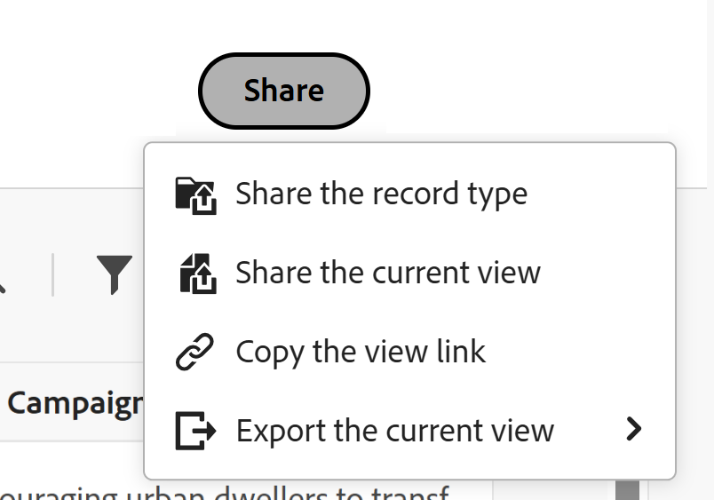

# Share views

<!--there are several mentions on how to share public links for global record types in secondary workspaces in this articel; you have to update all of these mentions when something changes-->

The highlighted information on this page refers to functionality not yet generally available. It is available only in the Preview environment for all customers. After the monthly releases to Production, the same features are also available in the Production environment for customers who enabled fast releases.    

For information about fast releases, see [Enable or disable fast releases for your organization](/help/quicksilver/administration-and-setup/set-up-workfront/configure-system-defaults/enable-fast-release-process.md). 

{{planning-important-intro}}

You can share a view with others to ensure collaboration when working with records in Adobe Workfront Planning. 

>[!IMPORTANT]
>
>* Granting permissions to a workspace does not give other users permissions to the views on the record type pages. You must grant permissions to individual views in a record type page to share them with other users. 
>
>* Granting permissions to a view does not change permissions to viewing the records. Record permissions are granted by sharing workspaces.
>
>* When you share a view, you give others permissions to access all the elements of the view. For example, when you give them Manage permissions to a view, they can modify the grouping, filter, sort, or bar appearance. 

<!--
This article describes how you can share a view with others. For information about requesting, granting, or denying permissions to a view, see [Request permissions to a view or a workspace](/help/quicksilver/planning/access/request-permissions.md). -->

## Access requirements

+++ Expand to view access requirements for the functionality in this article. 

<!--at GA, check that the Workfront plans article linked below has Planning info-->

 <table style="table-layout:auto"> 
<col> 
</col> 
<col> 
</col> 
<tbody> 
    <tr> 
<tr> 
   <td role="rowheader">
Adobe Workfront package
</td> 
   <td> 

Any Workfront and Planning package
 
Or

Any Workflow and Planning package
 
 </tr>
   
  <tr> 
   <td role="rowheader">
Adobe Workfront license
</td> 
   <td>
Any
 
  </td> 
  </tr> 
  <tr> 
   <td role="rowheader">
Access level configuration
</td> 
   <td> 
There are no access level controls for Adobe Workfront Planning
   
</td> 
  </tr> 
<tr> 
   <td role="rowheader">
Object permissions
</td> 
   <td>  
Manage permissions to a view
 
   
<b>IMPORTANT</b>
 
   
Only users with Manage permissions to a workspace can share a view publicly.
</td> 
  </tr> 
<tr>
   <td role="rowheader">
Layout template
</td>
   <td> Users with a Light or Contributor license must be assigned a layout template that includes Planning.
   
Standard users and System Administrators have the Planning areas enabled by default.

</li></ul>
  
</td>
  </tr>
 
</tbody> 
</table> 

For more information about Workfront access requirements, see [Access requirements in Workfront documentation](/help/quicksilver/administration-and-setup/add-users/access-levels-and-object-permissions/access-level-requirements-in-documentation.md).

+++

<!--Old:
<table style="table-layout:auto"> 
<col> 
</col> 
<col> 
</col> 
<tbody> 
    <tr> 
<tr> 
<td> 
   
 Products
 </td> 
   <td> 
   <ul><li>
 Adobe Workfront
</li> 
   <li>
 Adobe Workfront Planning
</li></ul></td> 
  </tr>   
<tr> 
   <td role="rowheader">
Adobe Workfront plan*
</td> 
   <td> 

Any of the following Workfront plans:
 
<ul><li>Select</li> 
<li>Prime</li> 
<li>Ultimate</li></ul> 

Workfront Planning is not available for legacy Workfront plans
 
   </td> 
<tr> 
   <td role="rowheader">
Adobe Workfront Planning package*
</td> 
   <td> 

Any 
 

For more information about what is included in each Workfront Planning plan, contact your Workfront account manager. 
 
   </td> 
 <tr> 
   <td role="rowheader">
Adobe Workfront platform
</td> 
   <td> 

Your organization's instance of Workfront must be onboarded to the Adobe Unified Experience to be able to access Workfront Planning.
 

Your organization must be onboarded to the Adobe Unified Experience for users to be able to request and grant permissions to a view from a permission request. 

Users must be added to the Adobe Admin Console in order to gain permissions to Workfront Planning views.

For more information, see <a href="/help/quicksilver/workfront-basics/navigate-workfront/workfront-navigation/adobe-unified-experience.md">Adobe Unified Experience for Workfront</a>. 
 
   </td> 
   </tr> 
  </tr> 
  <tr> 
   <td role="rowheader">
Adobe Workfront license*
</td> 
   <td>
 Standard

   
Workfront Planning is not available for legacy Workfront licenses
 
  </td> 
  </tr> 
  <tr> 
   <td role="rowheader">
Access level configuration
</td> 
   <td> 
There are no access level controls for Adobe Workfront Planning
   
</td> 
  </tr> 
<tr> 
   <td role="rowheader">
Object permissions
</td> 
   <td>  
Manage permissions to a view
  
   
Only users with Manage permissions to a workspace can share a view publicly.
</td> 
  </tr> 

</tbody> 
</table> -->

## Considerations when sharing views

* You can share a view in the following ways:

   * Internally, with Workfront users, groups, teams, companies, and job roles
   * Publicly, with users outside Workfront
   * By copying and then sharing a link to a view
   * By exporting it to an Excel or a CSV file. You can export only the table view to a file. For information, see [Manage the table view](/help/quicksilver/planning/views/manage-the-table-view.md). 

* For general information about sharing objects in Workfront Planning, also see [Overview of sharing permissions in Adobe Workfront Planning](/help/quicksilver/planning/access/sharing-permissions-overview.md). 
* You can give View or Manage permissions to a view to internal Workfront users. 

* Users with Manage permissions can modify the view settings, share, duplicate, or delete it. 

* You can share views with people outside your organization with a public link.  

* When you share a view publicly, the link is accessible by anyone outside of your company for a limited time, indicated by the expiration date. There is no login required to view the shared view.  

   >[!NOTE]
   >
   >You cannot share a view publicly from a global record type in a secondary workspace. For more information, see [Add existing record types from another workspace](/help/quicksilver/planning/architecture/add-existing-record-types-from-another-workspace.md). 

* People outside your organization who have access to a view cannot create other views, edit the shared view, or add, delete, or edit record information in the view. 

## Share permissions to a view internally

You can share views you created or views you have Manage permissions to with users, groups, teams, companies, and job roles in Workfront Planning. 

>[!NOTE]
>
>System Administrators cannot view or share views they did not create themselves. They can only access or share views that are shared with them.
>
>System administrators can have only Manage permissions to a view. 

{{step1-to-planning}}

1. Open the workspace whose view you want to share, then click a record type card. 

   This opens the record type page.

1. From the view's tab, do one of the following:

   * Click the view's tab, hover over the view in the drop-down menu, click the **More** menu , then click **Share**.

      

   * Click **Share** in the upper-right corner of the screen, then **Share the current view**.

       

   The **Share view** box opens and the **Internal sharing** tab should be selected by default.

1. (Optional) In the **Who has access** area, select from the following options: 

   * **Only invited people can access**: You must specify users, groups, team, company, or job role that you want to share the view with. This is the default option.

   >[!NOTE]
   >
   >In addition to teams, groups, companies, and job roles, you can share only with users that have been added to the Adobe Admin Console. You cannot add Workfront-only users. For information, see [Manage users in the Adobe Admin Console](/help/quicksilver/administration-and-setup/add-users/create-and-manage-users/admin-console.md). 

   * **Everyone in the workspace can view**: All users that have View or higher permissions to workspaces can access the view. 

1. In the **Grant access to this view** field, start typing the name of a user, a group, team, company, or job role then click it when it displays in the list.  

   

1. Select one of the following permission levels from the drop-down menu: 
    * View
    * Manage

        For information about permission levels and what actions users can perform for each level, see [Overview of sharing permissions in Adobe Workfront Planning](/help/quicksilver/planning/access/sharing-permissions-overview.md).

        System administrators always receive Manage permissions to views shared with them.

1. Click **Save**.

   The view updates with a people icon  to indicate that the view is now shared with other users. 

   The users you shared the view with receive both an in-app and email notification about having permissions to it.

   >[!TIP]
   >
   >Views without a people or a global icon are views you created and are not shared with others. Unshared views are only visible to you. 

1. Share the copied link with others. Users who receive the link must be active users and log in to Workfront to be able to access the record type page and display it in the selected view. 

## Share permissions to a view publicly

You can share views you created or views you have Manage permissions to with people that do not have a Workfront license and who might be external to your organization.

You cannot share a view publicly from a global record type in its secondary workspace. 

>[!IMPORTANT]
>
>Only users with Manage permissions to a workspace can share the views of the workspace publicly.

To share a view publicly in Workfront Planning: 

{{step1-to-planning}}

1. Open the workspace whose view you want to share, then click a record type card. 

   This opens the record type page.

1. From the view tab, do one of the following: 

   * Hover over the tab name of the view you want to share and click the **More** menu  to the right of the view name, then click **Share**. 

   
   * Click **Share** > **Share the current view**

   The **Share view** box opens.

1. Click **Public sharing**.

   

1. Enable the **Create public link** setting.

   A link becomes available. This is a public link. When shared, anyone with the link, including people from outside your organization can access the record type page, and view records and fields on the page. 

   >[!TIP]
   >
   >The **Create public link** setting is dimmed for a global record type in its secondary workspace.

1. Click the **Copy link** icon  to copy the link to your clipboard. 

1. Manually enter a date, or use the calendar in the **Link expiration date** field to select an expiration date for the public link. The record page view will not be accessible after the selected date. 

1. Click **Save**.

   The view updates with a global icon  to indicate that the view is shared publicly.  

   >[!TIP]
   >
   >Views without a people or a global icon are views you created and are not shared with others. Unshared views are only visible to you. 

1. (Optional) Paste the link you copied to an email, chat message, document, or in a Workfront comment to share it with others. 

## Copy a link to a view

You can copy a link to a view to your clipboard and include it in other application or share it with others.

To copy a link to a publicly-shared view, see the section [Share permissions to a view publicly](#share-permissions-to-a-view-publicly) in this article. 

This section describes how you share a view internally. 

>[!IMPORTANT]
>
>First, you must share the view with users before you share the link to the view in order for them to view it.

{{step1-to-planning}}

1. Open the workspace whose view you want to copy and share the link to, then click a record type card. 

   This opens the record type page.

1. From a view's tab, do one of the following: 

   * Hover over the tab of the view you want to share and click the **More** menu  to the right of the view name, then click **Share** > **Copy link** in the **Share view** box. 
   * Click **Share** > **Copy the view link** from the record type page.

   A link to the view is copied to your clipboard and you receive a confirmation at the bottom of the screen. 

   You can now paste the link to another application or send it to others. 

## Grant permissions to a view from a permission request

Users who access a link to a view to which they do not have permissions can request permissions to the view. All users with Manage permissions to the view receive the permission request and can grant or deny the permissions. 

1. (Conditional) If you are are the manager of a view, you might receive a request from another user to access the view in the following areas:
   
   * An in-app notification
      
   * An email notification
      
1. (Conditional) From the notification area in Workfront, click the in-app notification
   Or
   From the email notification, click **View all notifications**, then click the notification in the list.

   The **Pending access requests** box displays. 

      
1. (Optional) For the user whose permissions you want to approve, select one of the following options from the drop-down menu to the right of the user's name: 
   * **View**
   * **Manage**
1. Select the user for whom you want to approve or deny the permission, then click **Approve all** or **Deny all**. 
1. Click the left-pointing arrow to the left of **Pending access requests**, then click **Save**.

   If you approved the request, the users are added to the sharing box of the view. The user requesting the permission receives an email confirmation that their request was approved. <!--will they also get an in-app notification??-->

## Remove permissions to a view

{{step1-to-planning}}

1. Open the workspace whose view you want to stop sharing, then click a record type card. This opens the record type page.
1. From the view tab, do one of the following:

   * Hover over the tab name of the view you want to share and click the **More** menu  to the right of the view name, then click **Share**. 

   * Click **Share** > **Share the current view**

   The **Share view** box opens.
1. To remove the internal sharing of a view, do the following: 

   1. Ensure the **Internal sharing** tab is selected.
   1. Find the user, group, team, company, or job role  what you want to remove, expand the permissions drop-down menu to the right of the name of the entity you are sharing the view with, then click **Remove**.

1. To remove the public sharing of a view, do the following: 

   1. Click the **Public sharing** tab.
   1. Deselect the **Create public link** option. 

1. Click **Save**.

   People no longer have access to the view. There is no notification for the users that have been removed from accessing the view that they no longer have this access.
