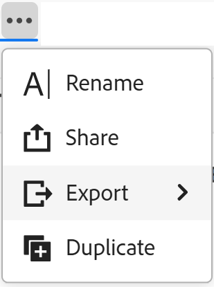
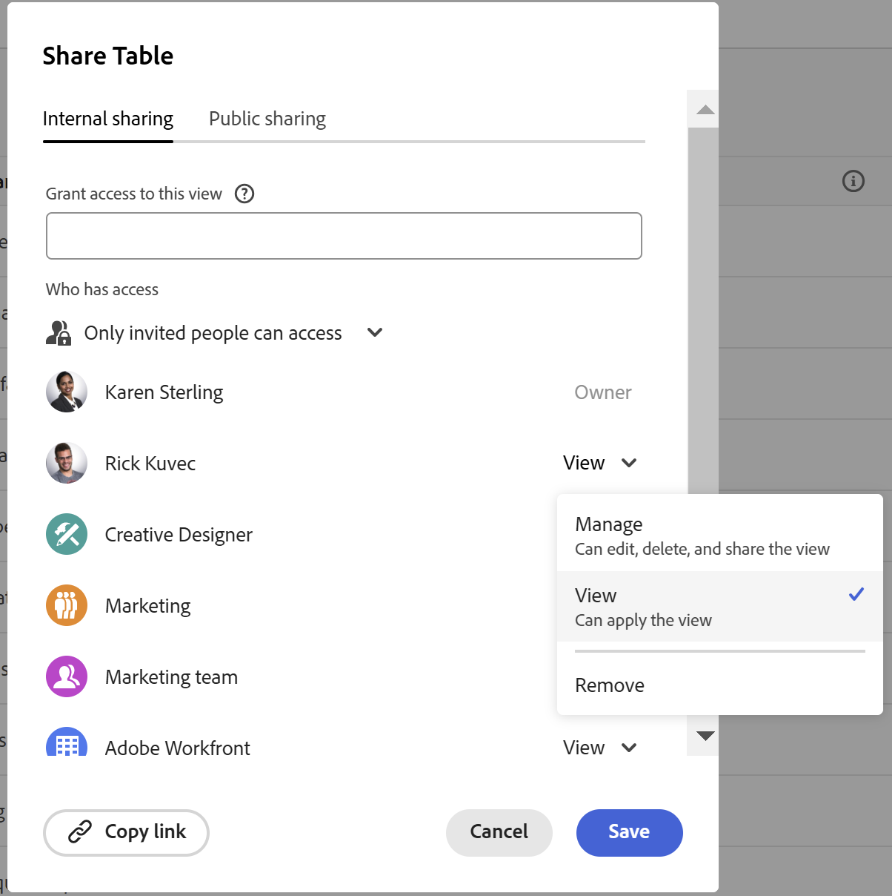
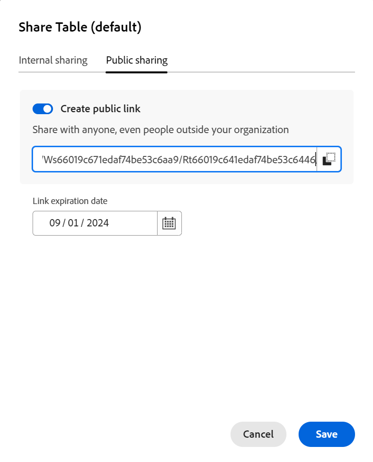
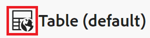
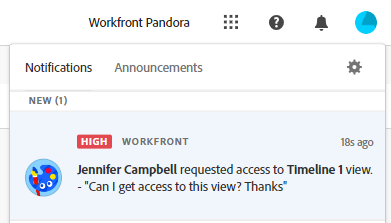

# Share views

{{planning-important-intro}}

You can share a view with others to ensure collaboration when working with records in Adobe Workfront Planning. 

>[!IMPORTANT]
>
>* Granting permissions to a workspace does not give other users permissions to the views on the record type pages. You must grant permissions to individual views in a record type page to share them with other users. 
>
>* Granting permissions to a view does not change permissions to viewing the records. Record permissions are granted by sharing workspaces.
>
>* When you share a view, you give others permissions to access all the elements of the view. For example, when you give them Manage permissions to a view, they can modify the grouping, filter, sort, or bar appearance. 

You can share a view with the following entities: 

* Internally, with Workfront users and groups
* Publicly, with users outside Workfront

<!--
This article describes how you can share a view with others. For information about requesting, granting, or denying permissions to a view, see [Request permissions to a view or a workspace](/help/quicksilver/planning/access/request-permissions.md). -->

## Access requirements

+++ Expand to view access requirements for Workfront Planning. 

<!--at GA, check that the Workfront plans article linked below has Planning info-->

You must have the following to be able to access Workfront Planning:  

 <table style="table-layout:auto"> 
<col> 
</col> 
<col> 
</col> 
<tbody> 
    <tr> 
<tr> 
<td> 
   
 Products
 </td> 
   <td> 
   <ul><li>
 Adobe Workfront
</li> 
   <li>
 Adobe Workfront Planning
</li></ul></td> 
  </tr>   
<tr> 
   <td role="rowheader">
Adobe Workfront plan*
</td> 
   <td> 

Any of the following Workfront plans:
 
<ul><li>Select</li> 
<li>Prime</li> 
<li>Ultimate</li></ul> 

Workfront Planning is not available for legacy Workfront plans
 
   </td> 
<tr> 
   <td role="rowheader">
Adobe Workfront Planning plan*
</td> 
   <td> 

Any 
 

For more information about what is included in each Workfront Planning plan, contact your Workfront account manager. 
 
   </td> 
 <tr> 
   <td role="rowheader">
Adobe Workfront platform
</td> 
   <td> 

Your organization's instance of Workfront must be onboarded to the Adobe Unified Experience to be able to access all the capabilities of Workfront Planning.
 

Your organization must be onboarded to the Adobe Unified Experience for users to be able to request and grant permissions to a view from a permission request. 

For more information, see <a href="/help/quicksilver/workfront-basics/navigate-workfront/workfront-navigation/adobe-unified-experience.md">Adobe Unified Experience for Workfront</a>. 
 
   </td> 
   </tr> 
  </tr> 
  <tr> 
   <td role="rowheader">
Adobe Workfront license*
</td> 
   <td>
 Standard

   
Workfront Planning is not available for legacy Workfront licenses
 
  </td> 
  </tr> 
  <tr> 
   <td role="rowheader">
Access level configuration
</td> 
   <td> 
There are no access level controls for Adobe Workfront Planning
   
</td> 
  </tr> 
<tr> 
   <td role="rowheader">
Object permissions
</td> 
   <td>  
Manage permissions to a view
  
   
Only users with Manage permissions to a workspace can share a view publicly.
</td> 
  </tr> 
<tr> 
   <td role="rowheader">
Layout template
</td> 
   <td> 
All users, including Workfront administrators,  must be assigned a layout template that includes the Planning area in the Main Menu. 
 </td> 
  </tr> 
</tbody> 
</table> 

 *For more information about Workfront access requirements, see [Access requirements in Workfront documentation](/help/quicksilver/administration-and-setup/add-users/access-levels-and-object-permissions/access-level-requirements-in-documentation.md).

<!--OLD: 

<table style="table-layout:auto">
 <col>
 </col>
 <col>
 </col>
 <tbody>
    <tr>
<tr>
<td>
   
 Product
 </td>
   <td>
   
 Adobe Workfront
 </td>
  </tr>  
 <td role="rowheader">
Adobe Workfront agreement
</td>
   <td>

Your organization must be enrolled in the early access stage for Workfront Planning 

   </td>
  </tr>
  <tr>
   <td role="rowheader">
Adobe Workfront plan
</td>
   <td>

Any

   </td>
  </tr>
  <tr>
   <td role="rowheader">
Adobe Workfront license*
</td>
   <td>
   
New: Standard

   Or
   
Current: Plan 
 
  </td>
  </tr>
  
  <tr>
   <td role="rowheader">
Access level configurations
</td>
   <td> There are no access controls for Adobe Workfront Planning
  
</td>
  </tr>

  <tr>
   <td role="rowheader">
Permissions
</td>
   <td> 
Manage permissions to a view
  
   
Only users with Manage permissions to a workspace can share a view publicly.

</td>
  </tr>

<tr>
   <td role="rowheader">
Layout template
</td>
   <td> 
All users, including Workfront administrators,  must be assigned a layout template that includes the Planning area in the Main Menu. 
 
For information, see <a href="/help/quicksilver/planning/access/access-overview.md">Access overview</a>. 
 
</td>
  </tr>
 </tbody>
</table>

*For information, see [Access requirements in Workfront documentation](/help/quicksilver/administration-and-setup/add-users/access-levels-and-object-permissions/access-level-requirements-in-documentation.md).-->

+++

## Considerations when sharing views

* You can give View or Manage permissions to a view to internal Workfront users. 

* Users with Manage permissions can modify the view settings, share, duplicate, or delete it. 

* You can share views with people outside your organization with a public link.  

* When you share a view publicly, the link is accessible by anyone outside of your company for a limited time, indicated by the expiration date. There is no login required to view the shared view.  

* People outside your organization who have access to a view cannot create other views, edit the shared view, or add, delete, or edit record information in the view. 

## Share permissions to a view internally

You can share views you created or views you have Manage permissions to with users or groups in Workfront. 

>[!NOTE]
>
>System Administrators cannot view or share views they did not create themselves. They can only access or share views that are shared with them.
>
>System administrators can have only Manage permissions to a view. 

{{step1-to-planning}}

1. Open the workspace whose view you want to share, then click a record type card. 

   This opens the record type page.

1. From the view tab, hover over the view you want to share and click the **More** menu  to the right of the view name, then click **Share**. 

   

   The **Internal sharing** tab should be selected by default.

1. (Optional) In the **Who has access** area, select from the following options: 

   * **Only invited people can access**: You must specify users or groups that you want to share the view with. This is the default option.
   * **Everyone in the workspace can view**: All users that have View or higher permissions to workspaces can access the view. 

1. In the **Grant view access to** field, start typing the name of a user or a group, then click it when it displays in the list.  

    

1. Select one of the following permission levels from the drop-down menu: 
    * View
    * Manage

        For information about permission levels and what actions users can perform for each level, see [Overview of sharing permissions in Adobe Workfront Planning](/help/quicksilver/planning/access/sharing-permissions-overview.md).

        System administrators always receive Manage permissions to views shared with them.

1. Click **Copy link** to copy a link to the view to your clipboard. 
1. Click **Save**.

   The view updates with a people icon  to indicate that the view is now shared with other users. 

   >[!TIP]
   >
   >Views without a people or a global icon are views you created and are not shared with others. Unshared views are only visible to you. 

1. Share the copied link with others. Users who receive the link must be active users and log in to Workfront to be able to access the record type page and display it in the selected view. 

## Share permissions to a view publicly

You can share views you created or views you have Manage permissions to with people that do not have a Workfront license and who might be external to your organization.

>[!IMPORTANT]
>
>Only users with Manage permissions to a workspace can share the views of the workspace publicly.

To share a view publicly in Workfront Planning: 

{{step1-to-planning}}

1. Open the workspace whose view you want to share, then click a record type card. 

   This opens the record type page.

1. From the view tab, hover over the view you want to share and click the **More** menu  to the right of the view name, then click **Share**. 

   

1. Click **Public sharing**.

   

1. Enable the **Create public link** setting.

   A link becomes available. This is a public link. When shared, anyone with the link, including people from outside your organization can access the record type page, and view records and fields on the page. 

1. Click the **Copy link** icon  to copy the link to your clipboard. 

1. Manually enter a date, or use the calendar in the **Link expiration date** field to select an expiration date for the public link. The record page view will not be accessible after the selected date. 

1. Click **Save**.

   The view updates with a global icon  to indicate that the view is shared publicly.  

   >[!TIP]
   >
   >Views without a people or a global icon are views you created and are not shared with others. Unshared views are only visible to you. 

1. (Optional) Paste the link you copied to an email, chat message, document, or in a Workfront comment to share it with others. 

## Grant permissions to a view from a permission request

Users who access a link to a view to which they do not have permissions can request permissions to the view. All users with Manage permissions to the view receive the permission request and can grant or deny the permissions. 

1. (Conditional) If you are are the manager of a view, you might receive a request from another user to access the view in the following areas:
   
   * An in-app notification
      
   * An email notification
      
1. (Conditional) From the notification area in Workfront, click the in-app notification
   Or
   From the email notification, click **View all notifications**, then click the notification in the list.

   The **Pending access requests** box displays. 

      
1. (Optional) For the user whose permissions you want to approve, select one of the following options from the drop-down menu to the right of the user's name: 
   * **View**
   * **Manage**
1. Select the user for whom you want to approve or deny the permission, then click **Approve all** or **Deny all**. 
1. Click the left-pointing arrow to the left of **Pending access requests**, then click **Save**.

   If you approved the request, the users are added to the sharing box of the view. The user requesting the permission receives an email confirmation that their request was approved. <!--will they also get an in-app notification??-->

## Remove permissions to a view

{{step1-to-planning}}

1. Open the workspace whose view you want to stop sharing, then click a record type card. This opens the record type page.
1. Hover over the tab name of the view you want to remove sharing from and click the **More** menu , then click **Share**.
1. To remove the internal sharing of a view, do the following: 

   1. Ensure the **Internal sharing** tab is selected.
   1. Find the user or group what you want to remove, expand the permissions drop-down menu to the right of the user's or group's name, then click **Remove**.

1. To remove the public sharing of a view, do the following: 

   1. Click the **Public sharing** tab.
   1. Deselect the **Create public link** option. 

1. Click **Save**.

   People no longer have access to the view. There is no notification for the users that have been removed from accessing the view that they no longer have this access.
