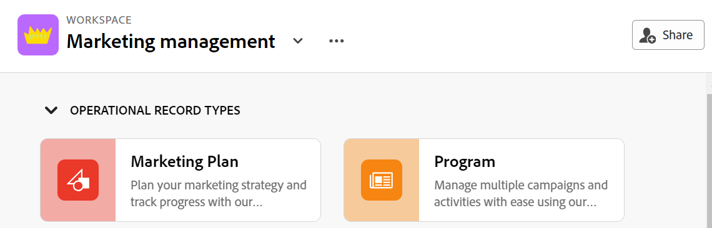
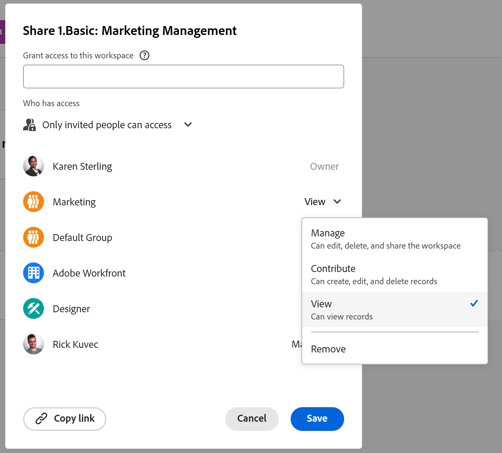

<!--update the metadata and description when we turn this article live; also, update title after Bob adds Planning as a product ??-->

# Share workspaces

{{planning-important-intro}}

You can share a workspace with others to ensure collaboration when working in Adobe Workfront Planning. 

>[!NOTE]
>
>Granting permissions to a workspace does not give other users permissions to the views on the record type pages. You must grant permissions to individual views in a record type page to share them with other users. For information, see [Share a view](/help/quicksilver/planning/access/share-views.md). 

## Access requirements

+++ Expand to view access requirements for Workfront Planning. 

<table style="table-layout:auto">
 <col>
 </col>
 <col>
 </col>
 <tbody>
    <tr>
<tr>
<td>
   
 Product
 </td>
   <td>
   
 Adobe Workfront
 </td>
  </tr>  
 <td role="rowheader">
Adobe Workfront agreement
</td>
   <td>

Your organization must be enrolled in the early access stage for Workfront Planning 

   </td>
  </tr>
  <tr>
   <td role="rowheader">
Adobe Workfront plan
</td>
   <td>

Any

   </td>
  </tr>
  <tr>
   <td role="rowheader">
Adobe Workfront license*
</td>
   <td>
   
New: Standard

   Or
   
Current: Plan 
 
  </td>
  </tr>
  
  <tr>
   <td role="rowheader">
Access level configurations
</td>
   <td> There are no access controls for Adobe Workfront Planning
  
</td>
  </tr>

  <tr>
   <td role="rowheader">
Permissions
</td>
   <td> 
Manage permissions to a workspace
  
</td>
  </tr>

<tr>
   <td role="rowheader">
Layout template
</td>
   <td> 
All users, including Workfront administrators,  must be assigned a layout template that includes the Planning area in the Main Menu. 
 
For information, see <a href="/help/quicksilver/planning/access/access-overview.md">Access overview</a>. 
 
</td>
  </tr>
 </tbody>
</table>

*For information, see [Access requirements in Workfront documentation](/help/quicksilver/administration-and-setup/add-users/access-levels-and-object-permissions/access-level-requirements-in-documentation.md).

+++

## Share permissions to a workspace

The following users can share a workspace with other users:

* System administrators can share all workspaces, including the ones that they did not create.
* All other users can share only workspaces for which they have Manage permissions to. 

To share a workspace with others: 

{{step1-to-planning}}

1. Open the workspace you want to share, then click **Share** in the upper-right corner of the screen. 

    

1. In the **Grant workspace access to** field, start typing the name of a user or a group, then click it when it displays in the list. 

    

1. Select one of the following permission levels from the drop-down menu: 
    * View
    * Contribute
    * Manage

        For information about permission levels and what actions users can perform for each level, see [Overview of sharing permissions in Adobe Workfront Planning](/help/quicksilver/planning/access/sharing-permissions-overview.md).
1. Click **Copy link** to copy a link to the workspace to your clipboard. 
1. Share the copied link with others. Users who receive the link must be active users and log in to Workfront to be able to access the workspace. 
1. Click **Save**.

## Remove permissions to a workspace

{{step1-to-planning}}

1. Open the workspace you want to remove permissions to, then click **Share** in the upper-right corner of the screen. 
1. Click the drop-down menu to the right of a user or group name, then click **Remove**. 
1. Click **Save**.

    The user or the users that belong to the group removed no longer have access to the workspace or its objects. 