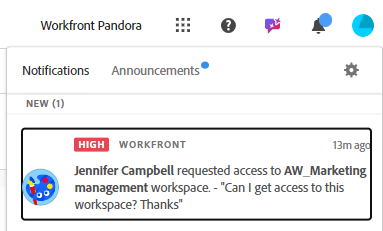
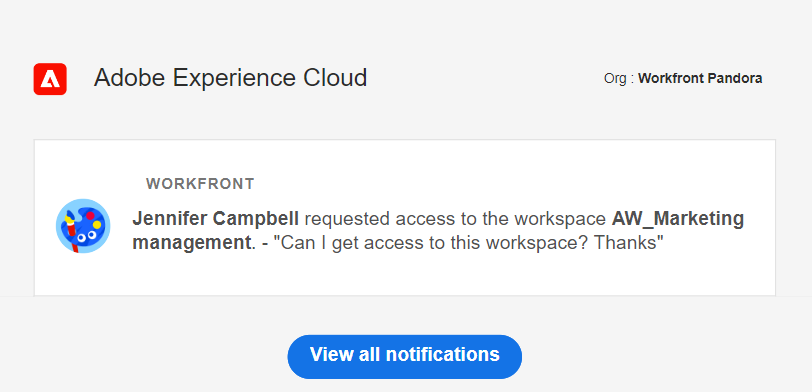

# Share workspaces

{{planning-important-intro}}

You can share a workspace with others to ensure collaboration when working in Adobe Workfront Planning. 

<!--
This article describes how you can share a view with others. For information about requesting, granting, or denying permissions to a view, see [Request permissions to a view or a workspace](/help/quicksilver/planning/access/request-permissions.md). -->

>[!NOTE]
>
>Granting permissions to a workspace does not give other users permissions to the views on the record type pages. You must grant permissions to individual views in a record type page to share them with other users. For information, see [Share a view](/help/quicksilver/planning/access/share-views.md). 

## Access requirements

+++ Expand to view access requirements for Workfront Planning. 

You must have the following to be able to access Workfront Planning:  

 <table style="table-layout:auto"> 
<col> 
</col> 
<col> 
</col> 
<tbody> 
    <tr> 
<tr> 
<td> 
   
 Products
 </td> 
   <td> 
   <ul><li>
 Adobe Workfront
</li> 
   <li>
 Adobe Workfront Planning
</li></ul></td> 
  </tr>   
<tr> 
   <td role="rowheader">
Adobe Workfront plan*
</td> 
   <td> 

Any of the following Workfront plans:
 
<ul><li>Select</li> 
<li>Prime</li> 
<li>Ultimate</li></ul> 

Workfront Planning is not available for legacy Workfront plans
 
   </td> 
<tr> 
   <td role="rowheader">
Adobe Workfront Planning plan*
</td> 
   <td> 

Any 
 

For more information about what is included in each Workfront Planning plan, contact your Workfront account manager. 
 
   </td> 
 <tr> 
   <td role="rowheader">
Adobe Workfront platform
</td> 
   <td> 

Your organization's instance of Workfront must be onboarded to the Adobe Unified Experience to be able to access all the capabilities of Workfront Planning.

Your organization must be onboarded to the Adobe Unified Experience for users to be able to request and grant permissions to a workspace from a permission request. 
 

For more information, see <a href="/help/quicksilver/workfront-basics/navigate-workfront/workfront-navigation/adobe-unified-experience.md">Adobe Unified Experience for Workfront</a>. 
 
   </td> 
   </tr> 
  </tr> 
  <tr> 
   <td role="rowheader">
Adobe Workfront license*
</td> 
   <td>
 Standard 

   
Workfront Planning is not available for legacy Workfront licenses
 
  </td> 
  </tr> 
  <tr> 
   <td role="rowheader">
Access level configuration
</td> 
   <td> 
There are no access level controls for Adobe Workfront Planning
   
</td> 
  </tr> 
<tr> 
   <td role="rowheader">
Object permissions
</td> 
   <td>  
Manage permissions to a workspace
  </td> 
  </tr> 
<tr> 
   <td role="rowheader">
Layout template
</td> 
   <td> 
All users, including Workfront administrators,  must be assigned a layout template that includes the Planning area in the Main Menu. 
 </td> 
  </tr> 
</tbody> 
</table> 

 *For more information about Workfront access requirements, see [Access requirements in Workfront documentation](/help/quicksilver/administration-and-setup/add-users/access-levels-and-object-permissions/access-level-requirements-in-documentation.md).

+++

<!--

OLD: 
 
<table style="table-layout:auto">
 <col>
 </col>
 <col>
 </col>
 <tbody>
    <tr>
<tr>
<td>
   
 Product
 </td>
   <td>
   
 Adobe Workfront
 </td>
  </tr>  
 <td role="rowheader">
Adobe Workfront agreement
</td>
   <td>

Your organization must be enrolled in the early access stage for Workfront Planning 

   </td>
  </tr>
  <tr>
   <td role="rowheader">
Adobe Workfront plan
</td>
   <td>

Any

   </td>
  </tr>
  <tr>
   <td role="rowheader">
Adobe Workfront license*
</td>
   <td>
   
New: Standard

   Or
   
Current: Plan 
 
  </td>
  </tr>
  
  <tr>
   <td role="rowheader">
Access level configurations
</td>
   <td> There are no access controls for Adobe Workfront Planning
  
</td>
  </tr>

  <tr>
   <td role="rowheader">
Permissions
</td>
   <td> 
Manage permissions to a workspace
  
</td>
  </tr>

<tr>
   <td role="rowheader">
Layout template
</td>
   <td> 
All users, including Workfront administrators,  must be assigned a layout template that includes the Planning area in the Main Menu. 
 
For information, see <a href="/help/quicksilver/planning/access/access-overview.md">Access overview</a>. 
 
</td>
  </tr>
 </tbody>
</table>

*For information, see [Access requirements in Workfront documentation](/help/quicksilver/administration-and-setup/add-users/access-levels-and-object-permissions/access-level-requirements-in-documentation.md).-->

## Share permissions to a workspace

The following users can share a workspace with other users:

* System administrators can share all workspaces, including the ones that they did not create.
* All other users can share only workspaces for which they have Manage permissions to. 

To share a workspace with others: 

{{step1-to-planning}}

1. Open the workspace you want to share, then click **Share** in the upper-right corner of the screen. 

    

1. In the **Grant workspace access to** field, start typing the name of a user or a group, then click it when it displays in the list. 

    

1. Select one of the following permission levels from the drop-down menu: 
    * View
    * Contribute
    * Manage

        For information about permission levels and what actions users can perform for each level, see [Overview of sharing permissions in Adobe Workfront Planning](/help/quicksilver/planning/access/sharing-permissions-overview.md).
1. Click **Copy link** to copy a link to the workspace to your clipboard. 
1. Share the copied link with others. Users who receive the link must be active users and log in to Workfront to be able to access the workspace. 
1. Click **Save**.

## Grant permissions to a workspace from a permission request

Users who access a link to a workspace to which they do not have permissions can request permissions to the workspace. All users with Manage permissions to the workspace receive the permission request and can grant or deny the permissions. 

1. (Conditional) If you are are the manager of a workspace, you might receive a request from another user to access the view in the following areas:
   
   * An in-app notification
      
   * An email notification
      
1. (Conditional) From the notification area in Workfront, click the in-app notification
   Or
   From the email notification, click **View all notifications**, then click the notification in the list.

   The **Pending access requests** box displays. 

      

1. (Optional) For the user whose permissions you want to approve, select one of the following options from the drop-down menu to the right of the user's name: 
   * **View**
   * **Contribute**
   * **Manage**
1. Select the user for whom you want to approve or deny the permission, then click **Approve all** or **Deny all**. 
1. Click the left-pointing arrow to the left of **Pending access requests**, then click **Save**.

   If you approved the request, the users are added to the sharing box of the workspace. The user requesting the permission receives an email confirmation that their request was approved. <!--will they also get an in-app notification??-->

## Remove permissions to a workspace

{{step1-to-planning}}

1. Open the workspace you want to remove permissions to, then click **Share** in the upper-right corner of the screen. 
1. Click the drop-down menu to the right of a user or group name, then click **Remove**. 
1. Click **Save**.

    The user or the users that belong to the group removed no longer have access to the workspace or its objects.
