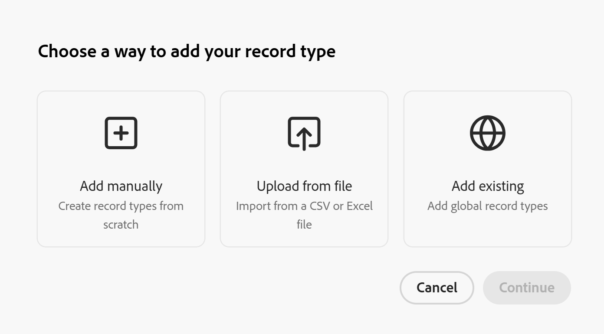

<!-- add these to the metadata, when making this public: 

feature: Workfront Planning
role: User, Admin
author: Alina
recommendations: noDisplay, noCatalog
-->

# Add existing record types

The information on this page refers to functionality not yet generally available. It is available only in the Preview environment for all customers. After the monthly releases to Production, the same features are also available in the Production environment for customers who enabled fast releases.    

For information about fast releases, see [Enable or disable fast releases for your organization](/help/quicksilver/administration-and-setup/set-up-workfront/configure-system-defaults/enable-fast-release-process.md). 

As a workspace manager, you can import or add an existing record type to a another workspace. 

You must first designate a record type as a centralized before workspace managers can import it into other workspaces.

You can designate a record type as centralized when you create or edit it, as you are defining its cross-workspace settings. 

For information, see [Configure cross-workspace capabilities for record types](/help/quicksilver/planning/architecture/configure-record-type-cross-workspace-capabilities.md). 

## Access requirements

+++ Expand to view the access requirements for the functionality in this article.

<table style="table-layout:auto"> 
<col> 
</col> 
<col> 
</col> 
<tbody> 
    <tr> 
<tr> 
<td> 
   
 Products
 </td> 
   <td> 
   <ul><li>
 Adobe Workfront
</li> 
   <li>
 Adobe Workfront Planning
</li></ul></td> 
  </tr>   
<tr> 
   <td role="rowheader">
Adobe Workfront plan*
</td> 
   <td> 

Any of the following Workfront plans:
 
<ul><li>Select</li> 
<li>Prime</li> 
<li>Ultimate</li></ul> 

Workfront Planning is not available for legacy Workfront plans
 
   </td> 
<tr> 
   <td role="rowheader">
Adobe Workfront Planning package*
</td> 
   <td> 

Any 
 

For more information about what is included in each Workfront Planning plan, contact your Workfront account manager. 
 
   </td> 
 <tr> 
   <td role="rowheader">
Adobe Workfront platform
</td> 
   <td> 

Your organization's instance of Workfront must be onboarded to the Adobe Unified Experience to be able to access Workfront Planning.
 

For more information, see <a href="/help/quicksilver/workfront-basics/navigate-workfront/workfront-navigation/adobe-unified-experience.md">Adobe Unified Experience for Workfront</a>. 
 
   </td> 
   </tr> 
  </tr> 
  <tr> 
   <td role="rowheader">
Adobe Workfront license*
</td> 
   <td>
 Standard

   
Workfront Planning is not available for legacy Workfront licenses
 
  </td> 
  </tr> 
  <tr> 
   <td role="rowheader">
Access level configuration
</td> 
   <td> 
There are no access level controls for Adobe Workfront Planning
   
</td> 
  </tr> 
<tr> 
   <td role="rowheader">
Object permissions
</td> 
   <td>   
Manage permissions to a workspace</a> 
  
   
System Administrators have permissions to all workspaces, including the ones they did not create
  </td> 
  </tr>  
</tbody> 
</table> 

 *For more information about Workfront access requirements, see [Access requirements in Workfront documentation](/help/quicksilver/administration-and-setup/add-users/access-levels-and-object-permissions/access-level-requirements-in-documentation.md).

+++   

## Overview of centralized record types

Considerations when adding existing record types from another workspace

* When there are no record types configured to be added to another workspace, the option to import them from another workspace does not display, when creating a record type. <!--add this a tip in the steps below, and/ or add a Conditional step that this is possible only when these record types are first enabled-->
* After adding the record type from another workspace, the following information is also added from the existing record type:

   * Fields
   * Records
   * Record connections

* You can edit the record type, including its fields, only in its original workspace. You cannot edit it from the workspaces where it was added. 
* Records added from all workspaces will be visible to all users accessing them from all workspaces, even if they are created in a workspace where they have no permissions. 

## Create a record type from an existing record type

1. Start creating a record type, as described in the article [Create record types](/help/quicksilver/planning/architecture/create-record-types.md), then click **Add existing**. <!--check this - the option might have been renamed in the UI-->

   

1. Click **Continue**.
1. In the **Choose record type** box, click the card for the record type that you want to add from an existing workspace, then click **Add**.

   The record type is added to the workspace you selected and the following things occur:

   * The **cross-workspace record type** icon  is added to the card of the imported record type.
   * The read-only **Workspace** field is added to the imported record type. The field displays what workspace each record was created in. 
   
      >[!NOTE]
      >
      >* You cannot edit the imported record type or its fields. You can edit the record type and its fields from the original workspace.

1. (Optional) Click on the **More** menu  in the imported record type's card, or to the right of the record type's name on its page, then click **Delete**.
1. (Conditional) Type **delete** in the field provided, then click **Permanently delete**.

   This removes the imported record type from the selected workspace. The original record type and its fields remain in their original workspace.
   
   <!--**************************ASK LILIT ON THIS ONE, NOT SURE IF THIS IS TRUE: Any records added in the current workspace are saved in the original workspace.**********-->
   

