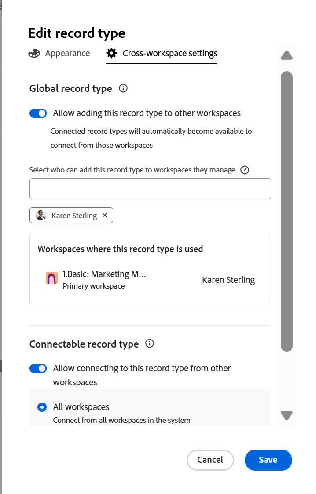
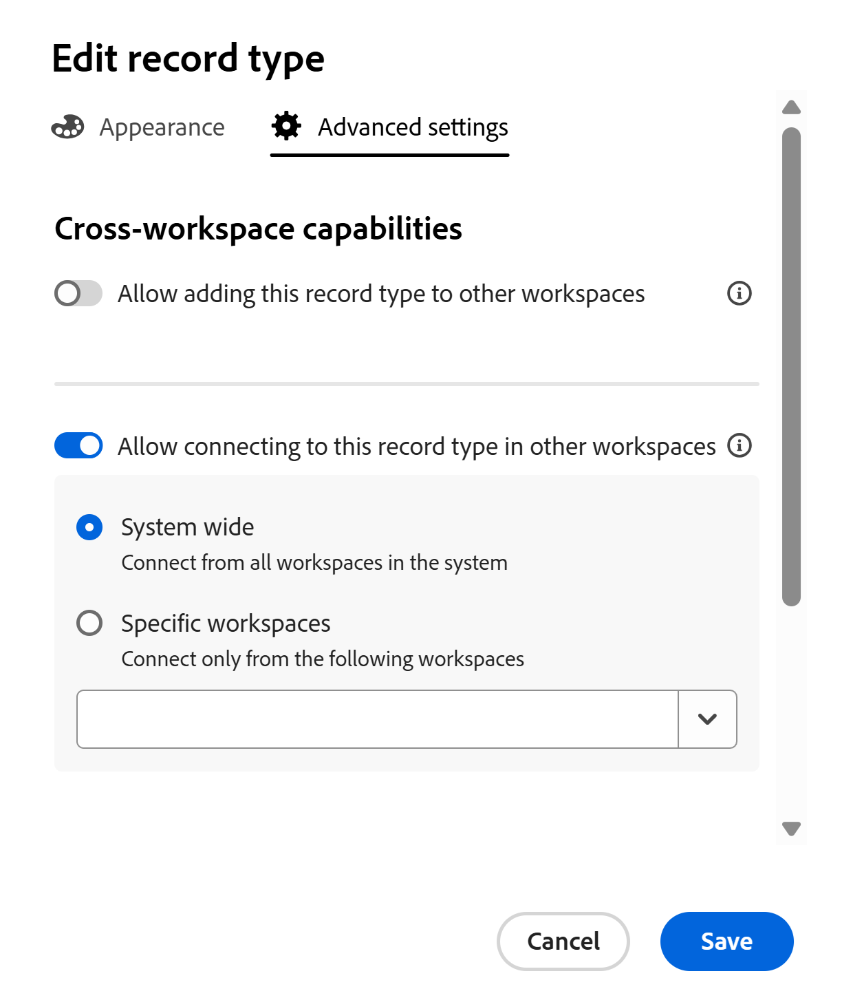

<!-- add these to the metadata, when making this public: 

feature: Workfront Planning
role: User, Admin
author: Alina
recommendations: noDisplay, noCatalog

-->

<!--*******************THIS TITLE MIGHT NEED TO CHANGE WHEN WE HAVE THE FINAL NAME FOR THE "GLOBAL" RECORD TYPE - NOT SURE IF WE ARE GOING TO USE "GLOBAL" OR "DYNAMIC", OR ???? ***************; also update TOC file, the miniTOC,  etc when this is finalized-->

<!--this article is linked to the UI - do not delete or change the URL-->
<!--add more info here about permissions, how users gain permissions from the original record type, per Lilit: users who add this to another space gain View permissions on that space when they add records to this added record type - this info is in the UI - this is what she sent in figma:

Hey, Alina, Lusine. As this page contains not only the "global record types" but also cross-workspace connectivity setting, we shouldn't have this message that's highlighting only the global rt features. I think we should have explanation for each setting both in enabled and disabled states. 

So we'd have the "Allow adding this record type to other workspaces" setting in enabled or disabled state, and display an explanation text below it explaining the capability, as well as a link to help articles for more context. I'd like to include the following key points in the message:  

Once enabled, this record type can be added in other workspaces by designated people 

Members of those workspaces can create and manage records in scope of their workspace 

Any records added by other workspace members will be rolled up to this workspace with view access so members of the current workspace can create views for cross-workspace records.  

Then for the second setting for cross-workspace connections, we'll need a similar explanation text would highlight that the other workspaces can create connections and gain view access to the records in this record type, but will not see the record type in their workspace. (not sure what she means by this last bit, asking in figma also)

-->

# Configure cross-workspace capabilities for record types

<!--this is linked to the UI in the info icon when you enable a record to be either centralized or connectable-->

The information on this page refers to functionality not yet generally available. It is available only in the Preview environment for all customers. After the monthly releases to Production, the same features are also available in the Production environment for customers who enabled fast releases.    

For information about fast releases, see [Enable or disable fast releases for your organization](/help/quicksilver/administration-and-setup/set-up-workfront/configure-system-defaults/enable-fast-release-process.md). 

You can configure record types to work across multiple workspaces. 

The following are cross-workspace capabilities of record types:

* You can designate a record type as centralized. Users can add centralized record types to other workspaces they can manage. 
* You can designate a record type as a connectable. Users can connect to this record type from other workspaces. 

You must first define the cross-workspace capabilities of a record type before workspace managers can either connect it from or add it into other workspaces.

You define the cross-workspace capabilities of a record type when you create or edit a record type. 

For information, see one of the following articles: 

* [Create record types](/help/quicksilver/planning/architecture/create-record-types.md)
* [Edit record types](/help/quicksilver/planning/architecture/edit-record-types.md)

## Access requirements

+++ Expand to view the access requirements for the functionality in this article.

<table style="table-layout:auto"> 
<col> 
</col> 
<col> 
</col> 
<tbody> 
    <tr> 
<tr> 
</tr>   
<tr> 
   <td role="rowheader">
Adobe Workfront package
</td> 
   <td> 

To configure connectable record types: 

<ul> 
<li>
Any Workfront package and any Planning package
</li>
Or
<li>
Workflow and Planning Prime and Ultimate packages</li></ul>

To configure global record types:

<ul> 
<li>
Any Workfront package and a Planning Plus package
</li>
Or
<li>
Workflow and Planning Prime and Ultimate packages</li></ul>

For more information about what is included in each Workfront Planning package, contact your Workfront account representative. 
 
   </td> 
  <tr> 
   <td role="rowheader">
Adobe Workfront license
</td> 
   <td>
Standard

   </td> 
  </tr> 
  <tr> 
   <td role="rowheader">
Object permissions
</td> 
   <td>   
Manage permissions to a workspace</a> 
  
   
System Administrators have permissions to all workspaces, including the ones they did not create
  </td> 
  </tr>  
</tbody> 
</table> 

For more information about Workfront access requirements, see [Access requirements in Workfront documentation](/help/quicksilver/administration-and-setup/add-users/access-levels-and-object-permissions/access-level-requirements-in-documentation.md).

+++   

<!--Old:

<table style="table-layout:auto"> 
<col> 
</col> 
<col> 
</col> 
<tbody> 
    <tr> 
<tr> 

  </tr>   
<tr> 
   <td role="rowheader">
Adobe Workfront package
</td> 
   <td> 
<ul><li>
Any Workfront package
</li>

And

<li>
Any Planning package to create connectable record types
</li>
<li>
Planning Plus package to create centralized record types
</li>
</ul>
***********Or:
<ul><li>
Any Workflow package
 </li>
And
<li>
Planning Prime or Ultimate package
</li></ul>************

For more information about what is included in each Workfront Planning package, contact your Workfront account manager. 
 
   </td> 

  <tr> 
   <td role="rowheader">
Adobe Workfront license
</td> 
   <td>
Standard

   </td> 
  </tr> 
  <tr> 
   <td role="rowheader">
Object permissions
</td> 
   <td>   
Manage permissions to a workspace</a> 
  
   
System Administrators have permissions to all workspaces, including the ones they did not create
  </td> 
  </tr>  
</tbody> 
</table> -- >

## Configure centralized record types

<!--this is a UI term; don't change the title of this section-->
<!--IMPORTANT: not sure if we can call these centralized yet - checking with Lilit as of Sept 2; you might need to revert this to what the screen shot shows below?????-->

As a workspace manager, you can configure a record type to be a centralized record type. A centralized record type can be added to other workspaces. 

A workspace manager can add a centralized record type to a workspace they manage. The record type's original fields are also added. 

Users can add records to a centralized record type from any workspace they have Contribute permissions and where the centralized record type is added, including its original workspace. They can view records from workspace they have only View permissions to.

For more information, see [Cross-workspace record types overview](/help/quicksilver/planning/architecture/cross-workspace-record-types-overview.md).

To configure a record type as centralized: 

{{step1-to-planning}}

1. Click the workspace whose record types you want to configure as centralized. 

   The workspace page opens and the record types display. 
1. Do one of the following:

   * Hover over the card of a record type and click the **More** menu  in the upper-right corner of the record type card
   * Click a record type card to open the record type page, then click the **More** menu  to the right of the record type name.
1. Click **Edit**.

   

   >[!TIP]
   >
   >If a record type has already been designated as a centralized record type and it's been added to other workspaces the Edit option is dimmed. 

1. In the **Edit record type** box, click the **Advanced settings** tab.
1. Enable the **Allow adding this record type to other workspaces** setting.

   

   >[!TIP]
   >
   >After you add a centralized record type to another workspace, this setting can no longer be disabled.

1. In the **Select who can add this record type to workspaces they manage** field, add entities that you want to allow to add this record type to workspaces they manage. 

   Your name is automatically added in the field. 

   You can add individual users, or groups, teams, job roles, or companies whose users you want to allow to add this record type to the workspaces they manage. 

   You must designate at least one entity (user, team, group, role, or company) to be able to enable this setting. 
   
   You can edit this field, after you save the record type. 

1. (Optional) Remove your name from the **Select who can add this record type to workspaces they manage** field.

1. Click **Save**.

   The following things occur:

      * The record type and its fields are now available to be added to another workspace by the people you designated. 

      >[!NOTE]
      >
      >You can edit the record type's appearance and settings and its original fields only from its original workspace. 
         
      * The record type card displays a centralized icon  to indicate that the record type is available to be added to other workspaces. 
      * A system-generated **Workspace** field is added to the table view of the record type and its records' details. 
      
         The Workspace field displays the workspace from where each record is created.
         
         This field is read-only and cannot be deleted.
1. (Optional) Go to another workspace and create a record type by using an existing record type. Select the record type you enabled in the steps above. 

   For information, see [Add existing record types from another workspace](/help/quicksilver/planning/architecture/add-existing-record-types-from-another-workspace.md). 

## Configure connectable record types

<!--this is a UI term; don't change the title of this section-->

You can configure a record type to be connected to from other workspaces when you create or edit the record type. 

To configure a record type to connect to from other workspaces when you edit the record type:  

{{step1-to-planning}}

1. Click the workspace whose record types you want to edit. 

   The workspace page opens and the record types display. 
1. Do one of the following:

   * Hover over the card of a record type and click the **More** menu  in the upper-right corner of the record type card, then click **Edit**
   * Click a record type card to open the record type page, click the **More** menu  to the right of the record type name, then click **Edit**. 

   

1. In the **Edit record type** box, click the **Advanced settings** tab.
1. Enable the **Allow connecting to this record type in other workspaces** setting. <!-- check the setting name, I sent this to Lilit to say FROM instead of IN-->

   

   When enabled, the record type is accessible and can be connected to from other workspaces.

1. Choose from which workspaces the record type can be accessed. Choose from the following options:

   * **System wide**: Users can connect to this record type from all workspaces where they have Manage permissions.
   * **Specific workspaces**: Add the names of the workspaces where workspace managers can connect to this record type.
1. Click **Save**.

   The following things occur:

      * The record type and its fields are now available to connect to from the workspaces you designated. 
      * The record type card displays a cross-workspace connection icon  to indicate that the record type is available to be connected to from any workspace you designated in your configuration.

   The record type becomes available to connect to from the designated workspaces. 
1. (Optional) Go to another workspace and add a connection to the record type you enabled for cross-workspace connectability in the steps above. 

   For information, see [Connect record types](/help/quicksilver/planning/architecture/connect-record-types.md). 

