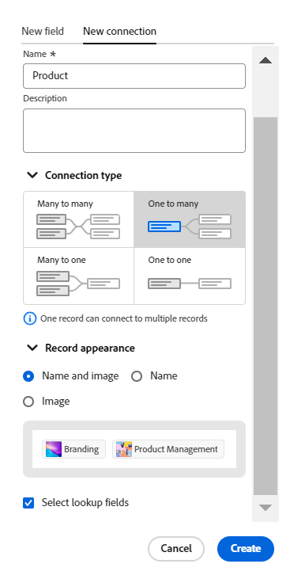
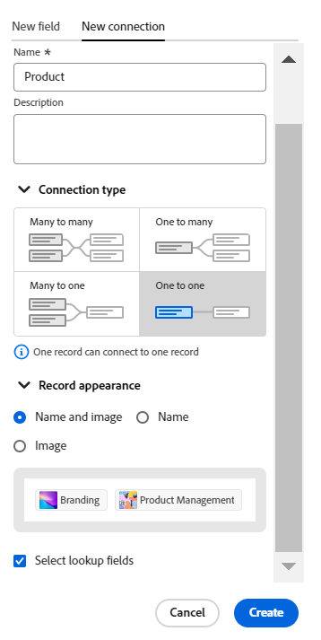
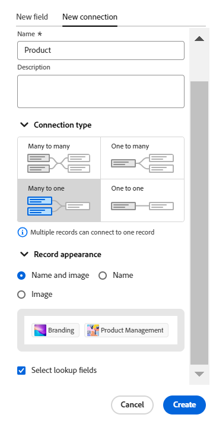
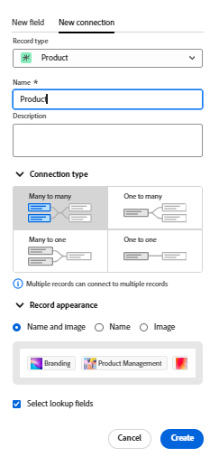

<!--update metadata at GA-->
<!--add mini TOC when live, already added to big TOC to get the link-->

# Connected record types overview

<!--REMOVE THE CONTENT BELOW FROM THE "CONNECT RECORD TYPES" ARTICLE WHEN YOU TURN THIS ARTICLE LIVE- THIS IS THE SAME CONTENT AS THERE, DUPLICATED-->

You can indicate that individual record types relate to one another or to objects from other applications by connecting them. 

This article is an overview of record type connections and describes the types of connections you can establish between record and object types. 

For information about you connect record types, see [Connect record types](/help/quicksilver/planning/architecture/connect-record-types.md). 

## Considerations about connecting record types

* You can connect the following entities in Adobe Workfront Planning:

    * Two record types. 

        By default, you can connect two record types from the same workspace. You can also set up record types to connect with record types from other workspaces. 
    * A record type and an object type from another application. 

* You can connect Workfront Planning record types with the following object types from the following applications:

    * Adobe Workfront:

        * Projects
        * Portfolios
        * Programs
        * Companies
        * Groups

    * Adobe Experience Manager Assets:

        * Images
        * Folders

        >[!IMPORTANT]
        >
        >You must have an Adobe Experience Manager Assets license, and your organization's instance of Workfront must be onboarded to the Adobe Business Platform or the Adobe Admin Console to connect Workfront Planning records to Adobe Experience Manager Assets.
        >
        >If you have questions about onboarding to the Adobe Admin Console, see the [Adobe Unified Experience FAQ](/help/quicksilver/workfront-basics/navigate-workfront/workfront-navigation/unified-experience-faq.md).

* After you create individual records for a record type, you can select the records you connect to from the linked record type field. For information, see [Connect records](/help/quicksilver/planning/records/connect-records.md). 

* After you connect a record type with another record type or with an object type from another application, the following scenarios exist: 
    
    * **When you connect two record types**: A linked record field is created on the record type you're connecting from. A similar linked record field is created on the record type you are connecting to. 

        For example, if you connect the "Campaign" record type with the "Product" record type, a linked record field that you name "Linked Product" is created on the Campaign record type. A linked record type automatically named "Campaign" is created on the Product record type. 

    * **When you connect a record type with an object type from another application**: 
    
        * A linked record field is created on the record type you're connecting from. No linked record field is automatically created on the other application's object type. 
        
        * Planning records fields are not accessible from Workfront objects.
        * Planning record fields are accessible from Experience Manager assets when your Workfront administrator configures the metadata mapping through the integration between Workfront and Adobe Experience Manager Assets. For more information, see [Configure asset metadata mapping between Adobe Workfront and Experience Manager Assets](https://experienceleague.adobe.com/docs/experience-manager-cloud-service/content/assets/integrations/configure-asset-metadata-mapping.html?lang=en).

    * **When you add linked (or lookup) fields from the record or object you connect to**: In addition to creating a linked record field, you can also connect to fields from the connected record or object type which are called lookup fields. A linked (or lookup field) with information from the record you're connecting to displays on the record that you're connecting from.

        You can connect fields from other record types or another application's objects to the Workfront Planning record type. 
    
        Linked fields are read-only and they automatically display information from connected records or objects when you connect the records or the objects. 

        You can refer to lookup fields from other record or object types in formulas, filters, or groupings.

        For example, if you connect the "Campaign" record type with a Workfront project and you select to bring the Planned Completion Date field of the project to the Workfront Planning record, a linked field called Planned Completion Date (from Project) is automatically created for the campaign. You cannot manually edit this linked field. The Planned Completion Date (from Project) field displays the Planned Completion Date of the linked projects.  

        >[!IMPORTANT]
        >
        >Everyone with View or higher permissions to the workspace can view the information in the lookup fields, regardless of their permissions or access level in the application of the linked object types <!--or their permissions in other workspaces-->.

<!--see the commented out text above for the release of cross-workspace connections-->

* Linked record fields are preceded by a relationship icon . 
    
    Linked fields are preceded by an icon that identifies the field type. For example, linked (or lookup) fields are preceded by icons that indicate that a field is a number, a paragraph, or a date. 

## Connection types

After you establish a connection between two record types or between a record and an object type from another application, you can add records in the connected record fields. 

Depending on how many records you can add to a connected record field, the following are the connection types you can choose from when connecting record types: 

* [One to many](#one-to-many-connection-type)
* [One to one](#many-to-one-connection-type)
* [Many to one](#many-to-one-connection-type)
* [Many to many](#many-to-many-connection-type)

>[!WARNING]
>
>These options are not available when connecting the following: 
>* Two records from different workspaces
>
>* A record type and AEM assets

<!-- add screen shots for each type of connection below-->

### One-to-many connection type

When you select the one-to-many connection type between record types, you can later connect one record with multiple records you're connecting to. 

For example, if you connect campaigns with projects, you can connect one campaign with multiple projects. But one project can be connected only to one campaign. 

When you select this connection type, you can later change it only to a many-to-many connection type. 
 
### One-to-one connection type

When you select the one-to-one connection type between record types, you can later connect one record with one other record that you're connecting to. 

For example, if you connect campaigns with projects, you can connect one campaign with one project. One project can be connected only to one campaign. 

When you select this connection type, you can later change it to any other connection type. 

### Many-to-one connection type

When you select the many-to-one connection type between record types, you can later connect many records with only one record you're connecting to. 

For example, if you connect campaigns with projects, you can connect multiple campaigns with one project. One project can be connected to several campaign. 

When you select this connection type, you can later change it only to a many-to-many connection type. 

### Many-to-many connection type

When you select the many-to-many connection type between record types, you can later connect many records with multiple records you're connecting to. 

For example, if you connect campaigns with projects, you can connect several campaigns with multiple projects. You can also connect multiple projects to multiple campaigns. 

When you select this connection type, you cannot change the connection type after you save it. 

