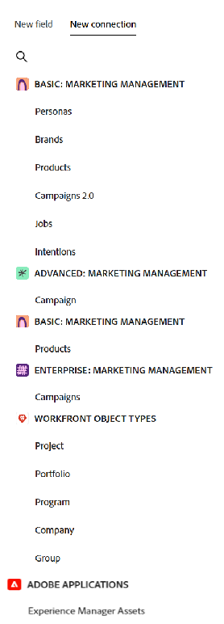
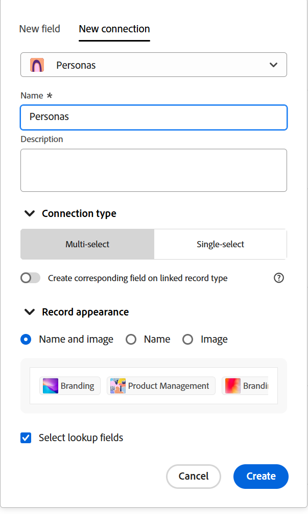
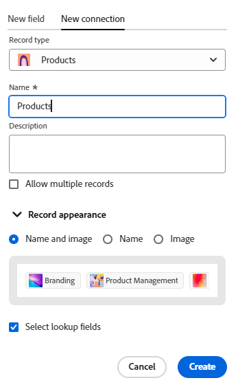

# Connect record types

The highlighted information on this page refers to functionality not yet generally available. It is available only in the Preview environment for all customers. After the monthly releases to Production, the same features are also available in the Production environment for customers who enabled fast releases.    

For information about fast releases, see [Enable or disable fast releases for your organization](/help/quicksilver/administration-and-setup/set-up-workfront/configure-system-defaults/enable-fast-release-process.md). 

{{planning-important-intro}}

<!--
You can use Adobe Workfront Planning to design fully-customizable workspaces that contain record types needed in your organization. A way to indicate how individual record types relate to one another is to connect them. Also, you can connect Workfront Planning record types with object types from other applications to enhance your users' experience and keep their focus in one application. -->

You can connect record types to one another or you can connect record types with object types from other applications. 

Connecting record types is helpful when you have several types of work objects affecting one another. For example, you might work with campaigns and each campaign might cater to multiple brands. To indicate this relationship, you can connect campaigns to brands. Additionally, the work for each campaign might be planned out in multiple projects in Workfront. To indicate this, you can connect the campaigns to the relevant projects. Connecting record types, and subsequently connecting individual records achieves this relationship in Workfront Planning. 

This article describes how you can connect two Workfront Planning record types, or a Workfront Planning record type with an object from another application. 

After you establish the connection between records or object types, a connection field is added to a Planning record type. In the connection field, you can connect individual records to one another, and display fields from the linked record or object types on a Workfront Planning record. 

<!--
>[!CAUTION]
>
>One record type can have up to 30 connection fields.-->

For general information about connection types, see [Connected record types overview](/help/quicksilver/planning/architecture/connect-record-types-overview.md).

For information about connecting records or records with objects from other applications, see [Connect records](/help/quicksilver/planning/records/connect-records.md). 

For an example of connecting record types and records, see [Example of connecting record types and records](/help/quicksilver/planning/architecture/example-connect-record-types-and-records.md). 

<!--ensure this last linked article is right; the title and the link should have changed-->

## Access requirements

+++ Expand to view access requirements. 

<table style="table-layout:auto"> 
<col> 
</col> 
<col> 
</col> 
<tbody> 
    <tr> 
<tr> 
<td> 
   
 Products
 </td> 
   <td> 
   <ul><li>
 Adobe Workfront
</li> 
   <li>
 Adobe Workfront Planning
</li>
   <li>
 Adobe Experience Manager Assets, if you want to connect AEM assets with Planning record types

   
You must have an Adobe Experience Manager Assets license and an integration between AEM Assets and Workfront.
    For information, see <a href="/help/quicksilver/documents/adobe-workfront-for-experience-manager-assets-essentials/workfront-for-aem-asset-essentials.md">Adobe Workfront for Experience Manager Assets and Assets Essentials: article index</a>. 

   </li>
   </ul></td> 
  </tr>   
<tr> 
   <td role="rowheader">
Adobe Workfront plan*
</td> 
   <td> 

Any of the following Workfront plans:
 
<ul><li>Select</li> 
<li>Prime</li> 
<li>Ultimate</li></ul> 

Workfront Planning is not available for legacy Workfront plans
 
   </td> 
<tr> 
   <td role="rowheader">
Adobe Workfront Planning package*
</td> 
   <td> 

Any 
 

For more information about what is included in each Workfront Planning plan, contact your Workfront account manager. 
 
   </td> 
 <tr> 
   <td role="rowheader">
Adobe Workfront platform
</td> 
   <td> 

Your organization's instance of Workfront must be onboarded to the Adobe Unified Experience to be able to access Workfront Planning.
 

For more information, see <a href="/help/quicksilver/workfront-basics/navigate-workfront/workfront-navigation/adobe-unified-experience.md">Adobe Unified Experience for Workfront</a>. 
 
   </td> 
   </tr> 
  </tr> 
  <tr> 
   <td role="rowheader">
Adobe Workfront license*
</td> 
   <td> 
Standard
 
   
Workfront Planning is not available for legacy Workfront licenses
 
  </td> 
  </tr> 
  <tr> 
   <td role="rowheader">
Access level configuration
</td> 
   <td> 
There are no access level controls for Adobe Workfront Planning
   
</td> 
  </tr> 
<tr> 
   <td role="rowheader">
Object permissions
</td> 
   <td>   
Manage permissions to a workspace</a> 
  
   
System Administrators have permissions to all workspaces, including the ones they did not create.
</td> 
  </tr> 
 
</tbody> 
</table> 

 *For more information about Workfront access requirements, see [Access requirements in Workfront documentation](/help/quicksilver/administration-and-setup/add-users/access-levels-and-object-permissions/access-level-requirements-in-documentation.md).   

+++

## Connect record types

<!--when changes here, also update the article for "Connect records"-->

{{step1-to-planning}} 

1. Click the workspace whose record types you want to connect, 

    Or

    From a workspace, expand the downward-pointing arrow to the right of an existing workspace name, search for a workspace, then select it when it displays in the list.
1. Click the card of a record type to open the record type page. 
1. Click the **+** icon in the upper-right corner of the table view, then click the **New connection** tab.

    

1. Search for a record type, or select one of the following: 

    * A record type from the current workspace

        

        >[!TIP]
        >
        > 
        >If you don't have other record types in the selected workspace, the workspace section does not display. 
        
    * A record type from another workspace that was configured to connect from other workspaces. 
    
        >[!TIP]
        >
        >The **Allow connecting to this record type in other workspaces** setting must be enabled for a record type in the **Advanced settings** tab of the **Edit record type** box, for a record type to be accessible from other workspaces. If there are no record types that are configured to connect from other workspaces, the workspace section does not display.
        > 

        For information, see [Edit record types](/help/quicksilver/planning/architecture/edit-record-types.md). 

        

    * A **Project, Portfolio, Program, Company**, or **Group** from the **Workfront Object Types** section.

        

    * **Experience Manager Assets** from the **Adobe Applications** section. <!--update screen shot??-->

        

        A New connection tab opens for your selected record or object type. 

1. Update the **Name** field with the name of the new connected field, as it will appear in the table view or the record page of the original record type. This creates the connected record column (or field) in the table view of the original record type. By default, the name of the field is the name of the record or object you connect to. 

    >[!TIP]
    >
    >You can have multiple connections to the same record or object type. If you do not edit the connected field name, Workfront adds a numeral after the name of the connected record, to indicate the number of connected record types by the same name. 

1. Update the **Description** field by adding information about the connected record field. The description of a field displays when you hover over the field's column in a table. 
1. (Conditional) When you connect record types from two different workspaces or a record and an Adobe Experience Manager asset object, select the **Allow multiple records**. By selecting it, you indicate that you allow users to add multiple records when the connected record type field displays on the original records. This is selected by default.  
    
    
    
1. (Conditional) When you connect record types from the same workspace, or a Planning record type with a Workfront object type, do one of the following, depending on which environment you are using: 

    * In the Production environment, select one of the following **Connection type** options to indicate how many records users can connect to and from:

        * Many to many
        * One to many
        * Many to one
        * One to one      

        

    

    * In the Preview environment, do the following: 
        1. Select one of the following:

            * **Multi-select**: Select this to allow one record from the current record type to connect with multiple records from the connection record type.
            * **Single-select**: Select this to allow one record from the current record type to connect with one record from the connection record type.

        2. Enable the **Create corresponding field on linked record type**. When enabled, a connection field is created on the record type you are connected to, in addition to the connection field added to the current record type. This is disabled by default.

            >[!TIP]
            >
            >There is a limit of 500 fields for one record type. We recommend to keep this setting off, especially for taxonomical record types, to avoid reaching this limit.

            <!--There is a limit of 30 connected fields for a record type.-->

        3. (Conditional) If you enabled **Create corresponding field on linked record type**, choose from the following options to indicate how many records users can connect to and from:

            * Many to many
            * One to many
            * Many to one
            * One to one  

        
    

        For more information about connection types, see [Connected record types overview](/help/quicksilver/planning/architecture/connect-record-types-overview.md).

        >[!NOTE]
        >
        >If you select One to many or One to one for the Connection type and you later want to connect a record or an object that is already connected elsewhere, you will receive a warning that connecting it again will remove it from the original connection. You can allow the removal or select another record.

1. (Conditional and optional) When you select to connect a Workfront object, choose a **Custom form** from the **Link only objects that match these criteria** section. Only objects that have the selected custom forms attached can be linked to the selected record type. You can select more than one form.  

    >[!NOTE]
    >
    > You must create custom forms in Workfront for the selected objects before they display in this list.

1. (Conditional) When you select to connect to Experience Manager Assets, choose a repository from the **Experience Manager repository** drop-down menu in the **Link assets from the following repository** section. This is a required field. Only repositories you have access to in Experience Manager Assets display in this field. 

    >[!NOTE]
    >
    >Your Workfront administrator can map Workfront Planning fields to Experience Manager Assets fields through the Metadata mapping in Workfront. For more information, see [Configure asset metadata mapping between Adobe Workfront and Experience Manager Assets](https://experienceleague.adobe.com/en/docs/experience-manager-cloud-service/content/assets/integrations/configure-asset-metadata-mapping). 

1. (Conditional) When you select to connect to Experience Manager Assets or to a Workfront Planning record type, choose one of the following options in the **Record appearance** area:

    * **Name and image**: Both the name and the thumbnail or icon of the connected records will display in the connected record field. This is the default option. 
    * **Name**: Only the name of the connected records will display in the connected record field.
    * **Image**: Only the thumbnail or icon of the connected records will display in the connected record field.

    Records without a thumbnail image display the record type icon instead. An example of how the connected records will display shows in the **Record appearance** area. 

    >[!NOTE]
    >
    >* When you allow multiple records to be linked, displaying only the thumbnail might save space in smaller areas, like record views.
    >
    >* The name of a record is the primary field of the record. For more information, see [Primary field overview](/help/quicksilver/planning/fields/primary-field-overview.md). 
    >
    >* Selecting a record appearance is not available when selecting Workfront object types. 
    >
    >* What you select in the Record appearance area determines how the records display in connections everywhere in the system, including all the views and details pages. 

1. Select the **Select lookup fields** to add fields from the  record type you are connecting to. The lookup fields are fields associated with the record or object type that you are linking to. Linking them displays information from the record or object you're linking to on the record you are linking from. This is selected by default. 

    >[!TIP]
    >
    >* You cannot add Workfront typeahead fields (including fields like Project Owner, or Project Sponsor) as lookup fields.
    >
    >* Workfront objects' date field information displays in 24 hour format in Workfront Planning, regardless of how it displays in Workfront. 
    >
    >   For example, if a project's Planned Start Date displays as 3:00 PM in Workfront, it will display as 15:00 in Workfront Planning in an imported lookup field. 

1. Click **Create**.

1. (Conditional) If you selected the **Select lookup field** setting, the **Add lookup fields** box opens. 

    Click the **+** icon  to add fields from the **Unselected fields** area. 

    Or
  
    Click the **-** icon to remove fields from the **Selected fields** area

    

    The values for the connected fields populate automatically after you link records or objects. 

    >[!IMPORTANT]
    >
    >    Everyone with View or higher permissions to the workspace can view the information in the linked fields, regardless of their permissions or access level in the application of the linked object types.

1. (Optional) Click **Skip** to skip adding fields from the linked record or object type. The name or Primary field of the linked record is the only visible field in the table view of the record type you connect from. 

1. Choose an aggregator for the lookup fields you add. 

    >[!NOTE]
    >
    >You cannot add aggregators for the following field types:
    >
    >    * Paragraph
    >    * Checkbox

    The values for the linked fields display either separated by commas or as a summarized value according to the aggregator you choose, when users select more than one linked record in the linked record field. 

    If the lookup field contains multiple values that are not summarized, consider the following when using the field in sorting or grouping in a view:  

    * The sorting is done by the first value 

    * Records are grouped by each unique combination of field values 

    * The timeline view is built based on the first date value of the connected record type, when it displays in the view

    >[!IMPORTANT]
    >
    > You must select an aggregator value when adding lookup date fields, if you want the fields to be available to add as Start and End Dates for the timeline and calendar views. For example, you can select the MAX or the MIN aggregator for a lookup date field. 

      

    >[!NOTE]
    >
    > Aggregators are not available when connecting record types to Experience Manager Assets.  

    Select from the following:

    * **None**: Displays the values that come from multiple records separated by commas. This is the default selection. 
    * **MAX**: Displays the highest value from all the values that come from multiple records selected in the linked record field. 
    * **MIN**: Displays the lowest value from all the values that come from multiple records selected in the linked record field. 
    * **SUM**:  Displays the total of all the values that come from multiple records selected in the linked record field.
    * **AVG**: Displays the average of all the values that come from multiple records selected in the linked record field.
    * **UNIQUE**: Removes duplicates from the lookup field values and only shows the unique values. This is not available for the following field types:
        * Paragraph
        * Checkbox
        * People

    >[!NOTE]
    >
    >For example, you can link the Product record (linked record) from the Campaign record (original record) and name it "Product field." You can also choose to link the Budget field of the Product record from the Campaign record and call it "Product Budget." If you allowed to select multiple records in the "Product field," you can select Product 1 with a Budget of $100,000 and Product 2 with a Budget of $110,000, and Product 3 with a Budget of $100,000. You can view the following Budget information in the linked field from the original record, depending on which aggregator you choose: 
    >
    >* **None**: $100,000, $110,000, $100,000
    >* **MAX**: $110,000
    >* **MIN**: $100,000
    >* **SUM**: $310,000
    >* **AVG**: $103,000.33 
    >* **UNIQUE**: $100,000 
    >

1. (Optional) Use the **search** icon  to search for a field.

1. Click **Add fields** to save your changes.

    The following items are added: 

    * A linked record field on the record type you are linking from. The linked record field will display individual records from the linked record type, after you manually add them. For information about adding records, see [Connect records](/help/quicksilver/planning/records/connect-records.md). The name of the linked record field is the name you selected in step 6. <!--accurate--> 
    
    * A linked (or lookup) field (or fields) that display information about the linked record or object types after you manually add the records or objects in the linked record field. Lookup fields are created only when the **Select lookup fields** setting is selected when creating the connection. Lookup fields are automatically named according to this pattern: 

        `<Name of the original field on the linked record> (from <Name of your linked field>)`

        For example, if you linked a Campaign record type with a Program record type and name the Program linked record field "Program information," then selected to also display the Program's Budget field in the Campaign's table view, the linked field is automatically named `Budget (from Program information)` in the campaign's table view. 

    * When you link record types to one another, a linked record field is also added on the record type you are linking to, <!--only when you enable the Create corresponding field on linked record type setting.--> The name of the linked record field on the linked record type is the name of the record type that you link from. 
    
        For example, if you link the "Product" record type from the "Campaign" record type and you named the connected field of the Campaign "Linked Product", a "Campaign" linked record field is created for the Product record type. 

        >[!TIP]
        >
        > A linked record field  is not created for objects from another application to the record type you are linking from in Workfront Planning. <!--We recommend not creating links on taxonomical record types, as there is a limit of 500 fields for every record type.--> 

    <!--see the span preview text in the TIP above; it might not show up in green-->

1. (Optional and conditional) From either the original record type or the linked record type table view, click the downward-pointing arrow in the header of the linked record fields, then click one of the following:

    * **Edit field**: Update the **Name** and the **Description** information of the field. 
    * **Edit lookup fields**: Add or remove any of the linked record's fields. 

    

    To add or remove lookup fields, follow the directions in steps 16-17 above. <!--ensure these step numbers stay accurate--> 

    >[!NOTE]
    >
    > You cannot add lookup fields that belong to record types that you are linking from to object types from another application.  
    >
    > For example, you cannot add the lookup field of "Campaign Status" to a Workfront project you are linking to from the campaigns.
    
1. (Optional) Click the downward-pointing arrow in the header of a linked record field or the header of a lookup field from the record type you are linking from, then click **Delete**. 

    The record field or the lookup field are deleted. If you delete a record field, any lookup fields associated with the linked record are also deleted.
