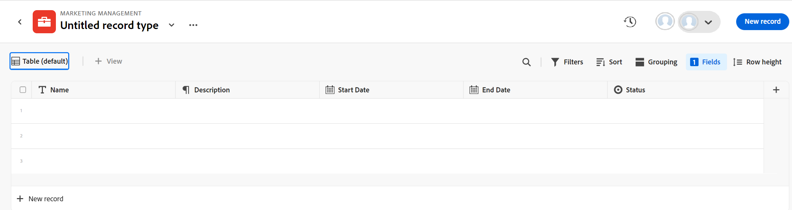
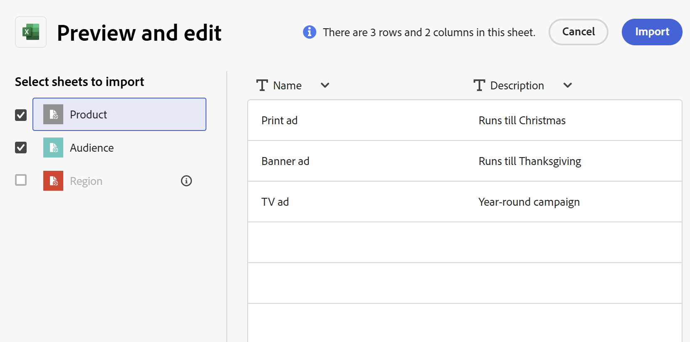
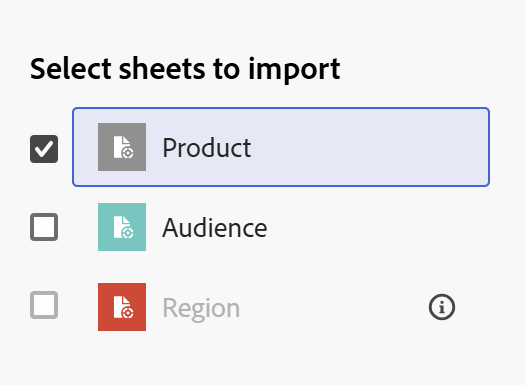

<!--update the metadata with real information when making this available in TOC and in the left nav-->
<!--this is linked to the UI in an empty workspace screen-->

# Create record types

{{maestro-important-intro}}

Record types are the object types of Adobe Workfront Planning. In Workfront Planning, you can create custom record types which illustrate the work-related items needed in your organization's lifecycle. 

For more information about record types, see [Record types overview](/help/quicksilver/maestro/architecture/overview-of-record-types.md).

## Access requirements

You must have the following access to perform the steps in this article: 

<table style="table-layout:auto">
 <col>
 </col>
 <col>
 </col>
 <tbody>
    <tr>
<tr>
<td>
   
 Product
 </td>
   <td> Adobe Workfront
   </td>
  </tr>  
 <td role="rowheader">
Adobe Workfront agreement
</td>
   <td>

Your organization must be enrolled in the Adobe Workfront Planning closed beta program. Contact your account representative to inquire about this new offering. 

   </td>
  </tr>
  <tr>
   <td role="rowheader">
Adobe Workfront plan
</td>
   <td>

Any

   </td>
  </tr>
  <tr>
   <td role="rowheader">
Adobe Workfront license
</td>
   <td>
   
Current: Plan

   Or
   
New: Standard 
 
  </td>
  </tr>
  
  <tr>
   <td role="rowheader">
Access level configurations
</td>
   <td> 
There are no access level controls for Workfront Planning
  
</td>
  </tr>
<tr>
   <td role="rowheader">
Layout template
</td>
   <td> 
Your Workfront or group administrator must add the Planning area in your layout template. For information, see <a href="/help/quicksilver/planning/access/access-overview.md">Access overview</a>. 
  
</td>
  </tr>
<tr>
   <td role="rowheader">
Permissions
</td>
   <td> 
Manage permissions to a workspace</a> 
  
   
System Administrators have permissions to all workspaces, including the ones they did not create
</td>
  </tr>
 </tbody>
</table>

<!--Maybe enable this at GA - but Planning is not supposed to have Access controls in the Workfront Access Level: 
>[!NOTE]
>
>If you don't have access, ask your Workfront administrator if they set additional restrictions in your access level. For information on how a Workfront administrator can change your access level, see [Create or modify custom access levels](../administration-and-setup/add-users/configure-and-grant-access/create-modify-access-levels.md). -->

<!-- Notes to add for the table: for the "Workfront plans" row: the above is only for closed beta; when going to GA - activate the following plans:    

Current plan: Prime and Ultimate

Legacy plan: Enterprise
-->

<!-- Notes for the table: for the "Workfront access" row: 
For more information, see <a href="../../administration-and-setup/add-users/access-levels-and-object-permissions/wf-licenses.md" class="MCXref xref">Adobe Workfront licenses overview</a>.
--> 

## Considerations about creating record types 

* You can create record types in a workspace in the following ways:

    * Automatically: 
        * When you create a workspace using a template. 
        
            For information, see [Create workspaces](/help/quicksilver/planning/architecture/create-workspaces.md).

        * When you import them using an Excel or CSV file. 

            >[!IMPORTANT]
            >
            >This functionality has been temporarily disabled since March 21, 2024. It will be enabled at a later date.

        <!--this should not ne known anymore: * When you add objects from another application to a linked record field of a record. This creates a read-only record type in Workfront Planning which is connected to object types from the original application. 
        For information about connecting record types with object types from another application, see [Connect record types](/help/quicksilver/maestro/architecture/connect-record-types.md).
        For information about connecting objects with records, see [Connect records](/help/quicksilver/planning/records/connect-records.md). -->
    * Manually:

        * From scratch.

            This article describes how you create record types from scratch.    

* You can move record types within a section and from one section of a workspace to another. You cannot move record types from one workspace to another workspace. 

## Create record types using a workspace template

You can create record types automatically when you create a workspace using a Workfront Planning template. Each template contains sample record types. 

When you create a workspace from a template, the record types are grouped in the following sections:

* Operational record types
* Taxonomies

You can manually add record types in both the Operational Record Types and Taxonomies sections. 

For information about creating workspaces, see [Create workspaces](/help/quicksilver/planning/architecture/create-workspaces.md).

For information about what record types are included with each template, see [List of workspace templates](/help/quicksilver/planning/architecture/workspace-templates.md). 

## Create a record type from scratch

{{step1-to-maestro}}

The last-accessed workspace should open by default. 

1. (Optional) Expand the downward-pointing arrow to the right of an existing workspace name and select the workspace that you want to create record types for.
1. (Optional) Click **Add section** to add a new section to the workspace.
1. Click **Add record type**. 
1. (Conditional) When creating record types by importing an Excel or CSV file is enabled, click **From scratch**. Otherwise, the **Add record type** box opens. 

    

1. Update the following information:

    * Replace "Untitled record type" with the name of your future record type. <!--did they bring back the field label here and did they rename it to "Name"-->
    * **Description**: Add more information about the record type.  
    * Select a color and shape for the icon associated with the record type. Do the following: 
        * Select a color to identify your new record type. This is the color of the record type icon. Gray is selected by default.
        * Select an icon from the list, or start typing the name of an icon to describe what it represents, then select it when it displays. This is the icon of the record type. A file icon is selected by default. 

1. Click **Create**.

    The record type card is added to the section and the workspace you selected. 
    The Description of the record type displays on the card. 

    

1. (Optional) Hover over the record type card, click the **More** icon  in the upper-right corner, then click **Edit** to modify information about the record type. 
1. (Optional) Click the record type card to open the record type page. 

    

    The record type page displays in the table view by default. The columns of the table are fields associated with the new record type. Each row is a unique record that you must add. 

    >[!TIP]
    >
    >    If you import a record type from an Excel or CSV file, records are also imported.

    By default, the following fields display in the table view columns of an operational record type:

    * Name
    * Description
    * Start Date
    * End Date
    * Status

1. (Optional) Update the record type name in the header of the page

    Or

    Click the **More** icon  to the right of the record type name and click **Edit** to rename it or change the information about it. For more information, see [Edit record types](/help/quicksilver/planning/architecture/edit-record-types.md). 

1. (Optional) Click **+ New record** to add records of the selected record type. For more information, see [Create records](../records/create-records.md). 
1. (Optional) Click the **+** icon in the upper-right corner of the table to add more fields to the record type. 

    For more information about creating fields, see [Create fields](/help/quicksilver/planning/fields/create-fields.md).
    
1. (Optional) Click the left-pointing arrow to the left of the record type name, in the header, to go back to the selected workspace. 

1. (Optional) From the workspace, click and hold a record type card to drag and drop the record type in a desired spot, or to move it to another section. 

    The changes are saved automatically.

    For additional information about adding records, deleting or editing record types, or updating the view in the record type page, see the following articles:

      * [Create records](../records/create-records.md)
      * [Delete record types](/help/quicksilver/planning/architecture/delete-record-types.md)
      * [Edit record types](/help/quicksilver/planning/architecture/edit-record-types.md)
      * [Manage record views](../views/manage-record-views.md) 

## Create record types by importing an Excel or CSV file

>[!IMPORTANT]
>
>This functionality has been temporarily disabled since March 21, 2024. It will be enabled at a later date.

Consider the following when importing record types using an Excel or CSV file: 

* Each sheet of the Excel file becomes a record type. 
* The columns of each sheet become the fields associated with each record type. 
* Fields are unique for their respective record types. 
* Each row in each sheet becomes a unique record associated with its respective record type. 
* Each sheet of the Excel file should not exceed the following: 
    * 50,000 rows
    * 500 columns
* The Excel file should not be larger than 5MB.
* Empty sheets are not supported. 

To import record types using an Excel file: 

{{step1-to-maestro}}

The last-accessed workspace should open by default. 

1. (Optional) Expand the downward-pointing arrow to the right of an existing workspace name and select the workspace that you want to create record types for.
1. Click **Add record type**. 
1. Click **Excel/CSV**.
1. Drag and drop an Excel or CSV file previously saved on your computer, or click **Select a CSV or Excel file** to browse for one. 
1. Click **Review your data**.
    
    The Preview and edit box displays with the following information: 

    * The names of the sheets or of the future record types display in the left panel. Workfront Planning selects an icon and a color for each new record type by default.
    * The first sheet or record type is selected and the names of the fields associated with it display as the column headers. The type of each field is selected by default. 
    * Each row represents a new record. Only the first 10 records display in the Preview and edit box. 

    

1. (Optional) Click the name of each sheet in the left panel to review the information it contains. 

    >[!NOTE]
    >
    >    Sheets that are empty are not supported and are dimmed. 

1. (Optional) Click the **Select sheets to import** drop-down menu and deselect the sheets that you don't want to import. 

    

    Sheets you deselected display with a gray background. 

1. Click **Import** when you are ready to import your file. 

    The following information imports in to Workfront Planning:

    * New record types
    * New fields associated with each record type
    * New records associated with each record type

    You can start managing fields and records on the record types pages. 
    
    Everyone with access to Workfront Planning can now view and edit the imported record types and their information. <!--this will change with permissions-->

<!--## Connect record types with object types from another application

You can connect a record type and an object type from another application. This creates a read-only record type in Workfront Planning that corresponds to the object type in the other application. 

For example, you can create record types by connecting Workfront Planning record types with Workfront projects. As a result, the Workfront project object type is imported into Workfront Planning as a read-only record type. By default, the record type is named "Workfront Project." (********************)has this name changed? Lusine wanted to change it at some point***********)
    
You can import the following objects from the following applications: 

* From Workfront:

    * Projects
    * Portfolios
    * Programs
    * Company
    * Group

For more information, see [Connect record types](../architecture/connect-record-types.md). 
-->