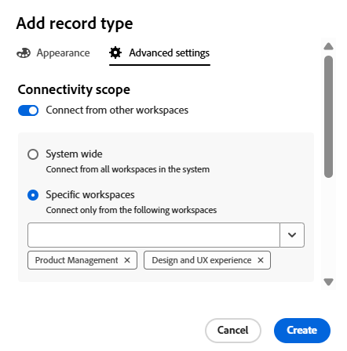

<!--this is linked to the UI in an empty workspace screen-->

# Create record types

<!--The information on this page refers to functionality not yet generally available. It is available only in the Preview environment for all customers. After the monthly releases to Production, the same features are also available in the Production environment for customers who enabled fast releases.    

For information about fast releases, see [Enable or disable fast releases for your organization](/help/quicksilver/administration-and-setup/set-up-workfront/configure-system-defaults/enable-fast-release-process.md). -->

{{planning-important-intro}}

Record types are the object types of Adobe Workfront Planning. In Workfront Planning, you can create custom record types which illustrate the work-related items needed in your organization's lifecycle. 

For more information about record types, see [Record types overview](/help/quicksilver/planning/architecture/overview-of-record-types.md).

## Access requirements

+++ Expand to view the access requirements for the functionality in this article. 

<table style="table-layout:auto"> 
<col> 
</col> 
<col> 
</col> 
<tbody> 
    <tr> 
<tr> 
</tr>   
<tr> 
   <td role="rowheader">
Adobe Workfront package
</td> 
   <td> 

To enable connectable record types: 

<ul> 
<li>
Any Workfront package and any Planning package
</li>
Or
<li>
Workflow and Planning Prime and Ultimate packages</li></ul>

To enable global record types:

<ul> 
<li>
Any Workfront package and a Planning Plus package
</li>
Or
<li>
Workflow and Planning Prime and Ultimate packages</li></ul>

For more information about what is included in each Workfront Planning package, contact your Workfront account representative. 
 
   </td> 
  <tr> 
   <td role="rowheader">
Adobe Workfront license
</td> 
   <td>
Standard

   </td> 
  </tr> 
  <tr> 
   <td role="rowheader">
Object permissions
</td> 
   <td>   
Manage permissions to a workspace
  
   
System Administrators have permissions to all workspaces, including the ones they did not create
  </td> 
  </tr>  
</tbody> 
</table>

For more information about Workfront access requirements, see [Access requirements in Workfront documentation](/help/quicksilver/administration-and-setup/add-users/access-levels-and-object-permissions/access-level-requirements-in-documentation.md).

+++   

<!--Old:
 <table style="table-layout:auto"> 
<col> 
</col> 
<col> 
</col> 
<tbody> 
    <tr> 
<tr> 
<td> 
   
 Products
 </td> 
   <td> 
   <ul><li>
 Adobe Workfront
</li> 
   <li>
 Adobe Workfront Planning
</li></ul></td> 
  </tr>   
<tr> 
   <td role="rowheader">
Adobe Workfront plan*
</td> 
   <td> 

Any of the following Workfront plans:
 
<ul><li>Select</li> 
<li>Prime</li> 
<li>Ultimate</li></ul> 

Workfront Planning is not available for legacy Workfront plans
 
   </td> 
<tr> 
   <td role="rowheader">
Adobe Workfront Planning package*
</td> 
   <td> 

Any 
 

For more information about what is included in each Workfront Planning plan, contact your Workfront account manager. 
 
   </td> 
 <tr> 
   <td role="rowheader">
Adobe Workfront platform
</td> 
   <td> 

Your organization's instance of Workfront must be onboarded to the Adobe Unified Experience to be able to access Workfront Planning.
 

For more information, see <a href="/help/quicksilver/workfront-basics/navigate-workfront/workfront-navigation/adobe-unified-experience.md">Adobe Unified Experience for Workfront</a>. 
 
   </td> 
   </tr> 
  </tr> 
  <tr> 
   <td role="rowheader">
Adobe Workfront license*
</td> 
   <td>
 Standard

   
Workfront Planning is not available for legacy Workfront licenses
 
  </td> 
  </tr> 
  <tr> 
   <td role="rowheader">
Access level configuration
</td> 
   <td> 
There are no access level controls for Adobe Workfront Planning
   
</td> 
  </tr> 
<tr> 
   <td role="rowheader">
Object permissions
</td> 
   <td>   
Manage permissions to a workspace
  
   
System Administrators have permissions to all workspaces, including the ones they did not create
  </td> 
  </tr> 
</tbody> 
</table> -->

## Considerations about creating record types 

* You can create record types in a workspace in the following ways:

    * Automatically: 
        * When you create a workspace using a template. 
        
            For information, see [Create workspaces](/help/quicksilver/planning/architecture/create-workspaces.md).

        * When you import them using a CSV or Excel file. 

            For more information, see [Create Record Types by importing information from a CSV or Excel file](/help/quicksilver/planning/architecture/import-file-to-create-record-types.md).

        >[!TIP]
        >
        >When you import a record type from a CSV or Excel file, you can also import records and fields. 

    * Manually:

        * From scratch.

            This article describes how you create record types from scratch.    

        <!--
        * By importing them from another workspace or adding cross-workspace record types
            For information, see [Add existing record types from another workspace](/help/quicksilver/planning/architecture/add-existing-record-types-from-another-workspace.md). -->

* You can move record types within a section and from one section of a workspace to another. You cannot move record types from one workspace to another workspace. 

## Create record types using a workspace template

You can create record types automatically when you create a workspace using a Workfront Planning template. Each template contains sample record types. 

When you create a workspace from a template, the record types are grouped in the following sections:

* Operational record types
* Taxonomies

You can manually add record types in both the Operational Record Types and Taxonomies sections. 

For information about creating workspaces, see [Create workspaces](/help/quicksilver/planning/architecture/create-workspaces.md).

For information about what record types are included with each template, see [List of workspace templates](/help/quicksilver/planning/architecture/workspace-templates.md). 

## Create a record type from scratch

{{step1-to-planning}}

1. Click the workspace where you want to create a record type, 

    Or

    From a workspace, expand the downward-pointing arrow to the right of an existing workspace name, search for a workspace, then select it when it displays in the list.
1. (Optional) Click **Add section** to add a new section to the workspace.
1. Click **Add record type**, then **Add manually**. 

    The Add record type box opens.
    <!--1. (Conditional) When creating record types by importing an Excel or CSV file is enabled, click **From scratch**. Otherwise, the **Add record type** box opens. -->

    

1. Update the following information on the **Appearance** tab:

    * Replace "Untitled record type" with the name of your future record type. <!--did they bring back the field label here and did they rename it to "Name"-->
    * **Description**: Add more information about the record type.  
    * Select a color and shape for the icon associated with the record type. Do the following: 
        * Select a color to identify your new record type. This is the color of the record type icon. Gray is selected by default.
        * Select an icon from the list, or start typing the name of an icon to describe what it represents, then select it when it displays. This is the icon of the record type. A file icon is selected by default. 

    <!--old setting:
    1. (Optional and conditional) If you are a system administrator, click **Advanced settings** and update the following information in the **Connectivity scope** section: 
        * Enable the **Connect from other workspace** setting. When enabled, the record type is accessible and can be connected from other workspaces. 
        * Choose from which workspaces the record type can be accessed. Choose from the following options:
            * **System wide**: Users can connect to this record type from all workspaces where they have manage permissions. 
            * **Specific workspaces**: Add the names of the workspaces where workspace managers can connect to this record type. 
    -->

1. (Optional and conditional) If you are a system administrator, click **Advanced settings** and update the following information in the **Cross-workspace capability** section: <!--the info here is duplicated in the Edit record types article-->
    * Enable the **Allow connecting to this record type in other workspaces** setting: This allows workspace managers to connect to this record type from other workspaces.  
    You can designate which workspaces this record type can be connected from. You can make it available for all workspaces or designate specific ones where you can import it.
    For more information, see [Configure cross-workspace capabilities for record types](/help/quicksilver/planning/architecture/configure-record-type-cross-workspace-capabilities.md).    
    
    
    

    <!--replace last point with this when we release dynamic record types; the preview tags might need to be edited, too:
        

        1. (Optional and conditional) If you are a system administrator, click **Advanced settings** and update the following information in the **Cross-workspace capability** section: **** the info here is duplicated in the Edit record types article ***
            * Enable the **Allow adding this record type to other workspaces** setting: This allows workspace managers to add this record type to other workspaces. 
                You can designate specific users who can add this record type to other workspaces. 
            * Enable the **Allow connecting to this record type in other workspaces** setting: This allows workspace managers to connect to this record type from other workspaces.  
                You can designate which workspaces this record type can be connected from. You can make it available for all workspaces or designate specific ones where you can import it.
            For more information, see [Configure cross-workspace capabilities for record types](/help/quicksilver/planning/architecture/configure-record-type-cross-workspace-capabilities.md).  

            ******** replace screen shot below **********
             
        -->

1. Click **Save**.

    The record type card is added to the section and the workspace you selected. 
    The Description of the record type displays on the card. 

    

    If you selected to connect this record from other workspaces, the **connect from other spaces** icon  displays on the record card. 

    <!--If you configured the cross-workspace capabilities for the record, the **connect from other spaces** icon  and the **add to other workspaces** icon  also display on the card. -->

1. (Optional) Hover over the record type card, click the **More** icon  in the upper-right corner, then click **Edit** to modify information about the record type. 
1. (Optional) Click the record type card to open the record type page. 

    

    The record type page displays in the table view by default. The columns of the table are fields associated with the new record type. Each row is a unique record that you must add. 

    By default, the following fields display in the table view columns of an operational record type:

    * Name
    * Description
    * Start Date
    * End Date
    * Status

1. (Optional) Update the record type name in the header of the page

    Or

    Click the **More** icon  to the right of the record type name and click **Edit** to rename it or change the information about it. For more information, see [Edit record types](/help/quicksilver/planning/architecture/edit-record-types.md). 

1. (Optional) Click **+ New record** to add records of the selected record type. For more information, see [Create records](/help/quicksilver/planning/records/create-records.md). 
1. (Optional) Click the **+** icon in the upper-right corner of the table to add more fields to the record type. 

    For more information about creating fields, see [Create fields](/help/quicksilver/planning/fields/create-fields.md).
    
1. (Optional) Click the left-pointing arrow to the left of the record type name, in the header, to go back to the selected workspace. 

1. (Optional) From the workspace, click and hold a record type card to drag and drop the record type in a desired spot, or to move it to another section. 

    The changes are saved automatically.

    For additional information about adding records, deleting or editing record types, or updating the view in the record type page, see the following articles:

      * [Create records](/help/quicksilver/planning/records/create-records.md)
      * [Delete record types](/help/quicksilver/planning/architecture/delete-record-types.md)
      * [Edit record types](/help/quicksilver/planning/architecture/edit-record-types.md)
      * [Manage record views](/help/quicksilver/planning/views/manage-record-views.md) 

## Create record types by importing information from a CSV or Excel file

You can import the following when importing information from a CSV or Excel file: 

* Record types
* Records
* Record fields

For more information, see [Create Record Types by importing information from a CSV or Excel file](/help/quicksilver/planning/architecture/import-file-to-create-record-types.md). 

<!--

## Create record types by importing them from another workspace 

You can add record types to a workspace by importing them from another workspace. You can only add record types that have been configured as centralized record types. 

For information, see [Add existing record types from another workspace](/help/quicksilver/planning/architecture/add-existing-record-types-from-another-workspace.md).

--> 