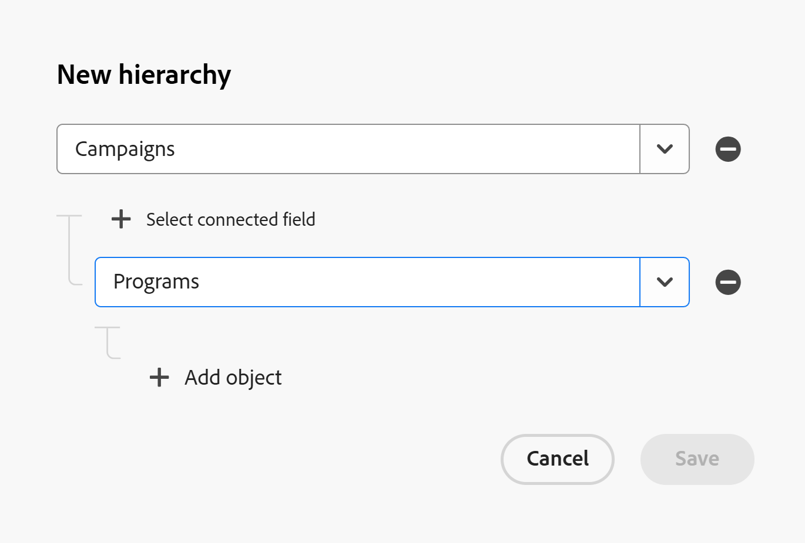

<!--update the metadata with real information when making this available in TOC and in the left nav:

---
title: Create Workspace Hierarchies
description: You can create multiple workspace hierarchies between the record types in a workspace. 
feature: Workfront Planning
role: User, Admin
author: Alina
recommendations: noDisplay, noCatalog
hide: yes 
hidefromtoc: yes 
---

-->

# Create workspace hierarchies

The information on this page refers to functionality not yet generally available. It is available only in the Preview environment for all customers. After the monthly releases to Production, the same features are also available in the Production environment for customers who enabled fast releases.    

For information about fast releases, see [Enable or disable fast releases for your organization](/help/quicksilver/administration-and-setup/set-up-workfront/configure-system-defaults/enable-fast-release-process.md). 

As a workspace manager, you can create multiple workspace hierarchies between record types in Adobe Workfront Planning. 

After record types are connected within a workspace, you can create a hierarchy that organizes those connections. Hierarchies organize record and object types into parent–child relationships and can contain up to four levels of object types. 

If a connection between two record types does not already exist, it can be created as you set up the hierarchy. Once defined, the hierarchy establishes a structured path across related record types within the workspace.

Hierarchies will generate breadcrumbs for the record types and their respective records <!--ensure this is the case: does the breadcrumb show for both the RT and the record??--> that display in their headers. This way, users know where they are in the hierarchy at any stage of their workflow. 

For general information about hierarchies and breadcrumbs, see [Hierarchy and breadcrumb overview](/help/quicksilver/planning/architecture/hierarchy-and-breadcrumb-overview.md). 

## Access requirements

<!--check the access to see if you oversimplified???-->

+++ Expand to view access requirements to perform the steps in this article:  

<table style="table-layout:auto"> 
<col> 
</col> 
<col> 
</col> 
<tbody> 
    <tr> 
<tr> 
</tr>   
<tr> 
   <td role="rowheader">
Adobe Workfront package
</td> 
   <td> 
<ul> 
<li>
Any Workfront and any Planning package
</li>
Or
<li>
Any Workflow and any Planning package
</li></ul>

For more information about what is included in each Workfront Planning package, contact your Workfront account representative. 
 
   </td> 
  <tr> 
   <td role="rowheader">
Adobe Workfront license
</td> 
   <td>
Standard

   </td> 
  </tr> 
  <tr> 
   <td role="rowheader">
Object permissions
</td> 
   <td>   
Manage permissions to a workspace
  
   
System Administrators have permissions to all workspaces, including the ones they did not create
  </td> 
  </tr>  
</tbody> 
</table> 

 For more information about Workfront access requirements, see [Access requirements in Workfront documentation](/help/quicksilver/administration-and-setup/add-users/access-levels-and-object-permissions/access-level-requirements-in-documentation.md).

+++

## Create a workspace hierarchy

{#step1-to-planning}

1. Click a workspace card.
1. Click the **More** menu  to the right of the workspace name, then click **Settings**. 
   The **Hierarchies** section opens by default. 
1. Click **New hierarchy** in the upper-right corner of the **Hierarchies** page.
1. Click **Add object** and select an object type from the dropdown menu. This is going to be the first object type in your hierarchy. <!--logged bug to correct to "Add object type"-->
   
   The first object type can only be a Planning record type. 
   
   Workfront projects cannot be selected as parents of other object types in a hierarchy.

1. Click **Add object** to add a second object type which is the first child in your hierarchy, then select another object type in the dropdown menu.
   Each additional object types become children of the previous object types.

   

1. Click **Select connected field** to indicate which field connects the two objects.
1. (Conditional) If there are multiple connection fields, select one from the list, 

   Or

   Click **Add new connection** to add a new connection field. 
   
   This creates a connection field from the record type you're using as a parent and a corresponding connection field to it from the record type you're using as a child. 
   
   If you are creating a connection to Workfront projects, no field is created on the project.

1. (Conditional) If there are no connected fields available, click **Create connection** and add a new connection, then click **Save**. 

1. (Conditional) If you are adding a new connection, do the following: 

   1. Add a name for your connected field in the **Name** box.
   1. Select from the following connection types: 

      * **Many to many**
      * **One to many**
      * **Many to one**
      * **One to one**

   1. Select one of the following types of record appearances:

      * **Name and image**
      * **Name**
      * **Image**

      For more information, see [Connect record types](/help/quicksilver/planning/architecture/connect-record-types.md).
   
   1. Click **Save**.

1. (Conditional) If the **Create corresponding field on linked record type** was not selected when the connected field was created, you will get an error and must do the following first: <!--check back on these steps; this is supposed to be seamless, but now you have to abandon creating a hierarchy to do this-->

   1. Click **Cancel** in the **New hierarchy** box.
   1. Click the back arrow to the left of the workspace name, then click the card of the record type you want to choose as a parent. 
   1. Open the table view of the record type you selected in the step above, then go to the connection field with the object type you want to use as the child, hover over the column header, then click **Edit** field. 
   1. Turn on the **Create corresponding field on linked record type** setting, then click **Save**.
   1. Return to the workspace's **Settings** area and click **New hierarchy** again, then follow the steps to create a hierarchy. 

1. (Optional) Continue adding up to 4 object types to your hierarchies following the steps above. You can add all your object types first and then add the connection fields between them. 
1. (Optional) Click the **Remove** icon  to remove a connection. 
1. Click **Save** to save your hierarchy. 

   >[!TIP]
   >
   >The **Save** button is dimmed if you don't have all the connected fields in place.

   The following things occur: 
   
   * The hierarchy is added to the **Hierarchies** section of the workspace.
   * The records that populate the connection fields display all the connections in their breadcrumbs, when you go to a record's page.
1. (Optional) Hover over a hierarchy, then click the **More** menu. 

   

1. Click one of the following:

   * **Edit**: This opens the **Edit hierarchy** box where you can make changes. 
   * **Delete**: This deletes the hierarchy permanently. Deleted hierarchies cannot be recovered. Connection fields are not deleted. 

   
