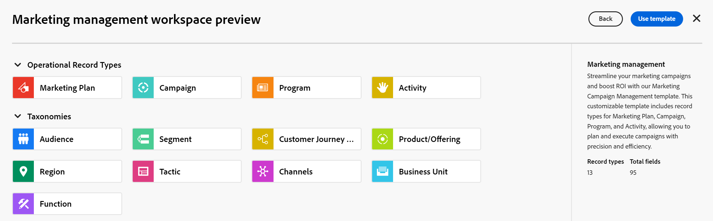

<!--udpate the metadata with real information when making this avilable in TOC and in the left nav-->

# Create workspaces

{{planning-important-intro}}

In Adobe Workfront Planning, workspaces are centralized locations for teams to plan work. 

A workspace is a collection of record types used by a team and represents the team's work lifecycle. You can fully customize workspaces in Adobe Workfront Planning. 

## Access requirements

You must have the following access to perform the steps in this article: 

<table style="table-layout:auto">
 <col>
 </col>
 <col>
 </col>
 <tbody>
    <tr>
<tr>
<td>
   
 Product
 </td>
   <td>
   
 Adobe Workfront
 </td>
  </tr>  
 <td role="rowheader">
Adobe Workfront agreement
</td>
   <td>

Your organization must be enrolled in the early access stage for Workfront Planning 

   </td>
  </tr>
  <tr>
   <td role="rowheader">
Adobe Workfront plan
</td>
   <td>

Any

   </td>
  </tr>
  <tr>
   <td role="rowheader">
Adobe Workfront license*
</td>
   <td>
   
New: Standard

   Or
   
Current: Plan
 
  </td>
  </tr>
  
  <tr>
   <td role="rowheader">
Access level configuration
</td>
   <td> 
There are no access level controls for Adobe Workfront Planning

</td>
  </tr>

<tr>
   <td role="rowheader">
Permissions
</td>
   <td> 
You receive Manage permissions to the workspaces you create. 
  
</td>
  </tr>

<tr>
   <td role="rowheader">
Layout template
</td>
   <td> 
You must add the Planning area to your layout template. For information, see <a href="/help/quicksilver/planning/access/access-overview.md">Access overview</a>. 
  
</td>
  </tr>

 </tbody>
</table>

For more information about access requirements, see [Access requirements in Workfront documentation](/help/quicksilver/administration-and-setup/add-users/access-levels-and-object-permissions/access-level-requirements-in-documentation.md). 

<!--Maybe enable this at GA - but Planning is not supposed to have Access controls in the Workfront Access Level: 
>[!NOTE]
>
>If you don't have access, ask your Workfront administrator if they set additional restrictions in your access level. For information on how a Workfront administrator can change your access level, see [Create or modify custom access levels](../administration-and-setup/add-users/configure-and-grant-access/create-modify-access-levels.md). -->

<!-- Notes to add for the table: for the "Workfront plans" row: the above is only for closed beta; when going to GA - activate the following plans:    

Current plan: Prime and Ultimate

Legacy plan: Enterprise
-->

<!-- Notes for the table: for the "Workfront access" row: 
For more information, see <a href="../../administration-and-setup/add-users/access-levels-and-object-permissions/wf-licenses.md" class="MCXref xref">Adobe Workfront licenses overview</a>.
--> 

## Considerations about workspaces

* You can create workspaces for specific organizational units within your organization, to match the unique way each unit works. 
* The record types that a workspace contains should reflect the work lifecycle of an organizational unit. 
* When you create a workspace, only you have the permission to access and manage your workspace. You must share it with other users in order for them to collaborate with you in the same space. For information, see [Share a workspace](/help/quicksilver/planning/access/share-workspaces.md). System administrators can manage all workspaces, even the ones that they did not create. 
* You can have the following: 

   * Up to 50 sections in one workspace.
   * Up to a total of 1,000 record types from all sections in one workspace. All record types are unique to each workspace. <!--this might change-->
   * Up to 1,000 workspaces in your organization's Workfront instance. 

## Create a workspace

You can create a workspace and add record types to it to organize your objects in Workfront Planning. For more informaton about editing a workspace, see [Edit workspaces](/help/quicksilver/planning/architecture/edit-workspaces.md).

{{step1-to-planning}}

   This opens the Workspaces area of Workfront Planning.

1. (Conditional) If you don't have any workspaces in your environment, click **Create workspace**

   Or, from an existing workspace, click the downward-pointing arrow to the right of the workspace name, then click **Create workspace**. 

   

    
1. (Optional and conditional) Click **Preview** inside any of the following predefined workspace templates:

    * Marketing management
    * Sales management
    * Product management
    
    There is an indication of what operational record types, taxonomies and how many fields are associated with each template.

    

    For information about Workfront Planning workspace templates, see [List of workspace templates](/help/quicksilver/planning/architecture/workspace-templates.md).

1. Click **Use template** to start creating the workspace from the selected template

    Or

    Click **Create workspace** to create a workspace from scratch.

    One for the following types of workspaces is created:
    
    * An empty workspace named **Untitled workspace** where you can start adding record types manually, when you create a workspace from scratch. 
    * A workspace named after the template you selected that is populated with sample record types. You can further customize the record types and the workspace.
     
1. Click inside the name of the workspace in the header of the new workspace to rename it, then press Enter. 

1. (Optional and conditional) If you created the workspace from a template, click inside the name of the **Operational Record Types** or **Taxonomies** sections 

   Or 

   Hover the name of a section, then click the **More** menu , then click **Rename** to rename the section. 

      >[!TIP]
      >
      >You can rename any section from any workspace, even if you didn't create the section. 

   For more information about editing workspaces, including editing workspace sections, see [Edit workspaces](/help/quicksilver/planning/architecture/edit-workspaces.md). 

1. (Optional) Click **Add record type** to add record types to the workspace in any section.
    
   For information, see [Create record types](/help/quicksilver/planning/architecture/create-record-types.md).

   For more information about editing and deleting record types in a workspace, see [Edit workspaces](/help/quicksilver/planning/architecture/edit-workspaces.md).

