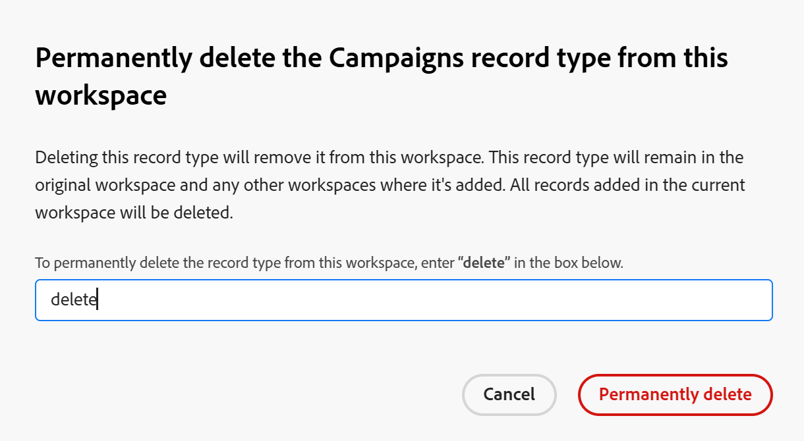

<!--keep the global record type reference in yellow till January 2026-->

# Delete record types

The highlighted information on this page refers to functionality not yet generally available. It is available only in the Preview environment for all customers. After the monthly releases to Production, the same features are also available in the Production environment for customers who enabled fast releases.    

For information about fast releases, see [Enable or disable fast releases for your organization](/help/quicksilver/administration-and-setup/set-up-workfront/configure-system-defaults/enable-fast-release-process.md). 

{{planning-important-intro}}

You can delete record types when they are no longer relevant. 

However, deleting record types also deletes all information associated with the record types. For more information, see the [Considerations when deleting record types](#considerations-when-deleting-record-types) section in this article. 

For information about record types, see [Record types overview](/help/quicksilver/planning/architecture/overview-of-record-types.md).

<!-- last sentence might need to be deleted when we can recover or replace deleted record types-->

## Access requirements

+++ Expand to view the access requirements for the functionality in this article. 

<table style="table-layout:auto"> 
<col> 
</col> 
<col> 
</col> 
<tbody> 
    <tr> 
<tr> 
</tr>   
<tr> 
   <td role="rowheader">
Adobe Workfront package
</td> 
   <td> 
<ul> 
<li>
Any Workfront and any Planning package
</li>

Or

<li>
Any Workflow and any Planning package
</li></ul>

To delete global record types:

<ul><li>
Any Workfront package and a Planning Plus package
</li>

Or

<li>
Any Workflow and a Planning Prime or Ultimate package
</li></ul>

For more information about what is included in each Workfront Planning package, contact your Workfront account representative. 
 
   </td> 
  <tr> 
   <td role="rowheader">
Adobe Workfront license
</td> 
   <td>
Standard

   </td> 
  </tr> 
  <tr> 
   <td role="rowheader">
Object permissions
</td> 
   <td>   
Manage permissions to a workspace
  
   
System Administrators have permissions to all workspaces, including the ones they did not create
  </td> 
  </tr>  
</tbody> 
</table>

For more information about Workfront access requirements, see [Access requirements in Workfront documentation](/help/quicksilver/administration-and-setup/add-users/access-levels-and-object-permissions/access-level-requirements-in-documentation.md).

+++   

<!--Old:
<table style="table-layout:auto"> 
<col> 
</col> 
<col> 
</col> 
<tbody> 
    <tr> 
<tr> 
<td> 
   
 Products
 </td> 
   <td> 
   <ul><li>
 Adobe Workfront
</li> 
   <li>
 Adobe Workfront Planning
</li></ul></td> 
  </tr>   
<tr> 
   <td role="rowheader">
Adobe Workfront plan*
</td> 
   <td> 

Any of the following Workfront plans:
 
<ul><li>Select</li> 
<li>Prime</li> 
<li>Ultimate</li></ul> 

Workfront Planning is not available for legacy Workfront plans
 
   </td> 
<tr> 
   <td role="rowheader">
Adobe Workfront Planning package*
</td> 
   <td> 

Any 
 

For more information about what is included in each Workfront Planning plan, contact your Workfront account manager. 
 
   </td> 
 <tr> 
   <td role="rowheader">
Adobe Workfront platform
</td> 
   <td> 

Your organization's instance of Workfront must be onboarded to the Adobe Unified Experience to be able to access Workfront Planning.
 

For more information, see <a href="/help/quicksilver/workfront-basics/navigate-workfront/workfront-navigation/adobe-unified-experience.md">Adobe Unified Experience for Workfront</a>. 
 
   </td> 
   </tr> 
  </tr> 
  <tr> 
   <td role="rowheader">
Adobe Workfront license*
</td> 
   <td>
 Standard

   
Workfront Planning is not available for legacy Workfront licenses
 
  </td> 
  </tr> 
  <tr> 
   <td role="rowheader">
Access level configuration
</td> 
   <td> 
There are no access level controls for Adobe Workfront Planning
   
</td> 
  </tr> 
<tr> 
   <td role="rowheader">
Object permissions
</td> 
   <td>   
Manage permissions to a workspace and record type
  
   
System Administrators have permissions to all workspaces, including the ones they did not create
</td> 
  </tr> 
</tbody> 
</table> 
-->

## Considerations when deleting record types

<!--check this and ensure these are still true - some things might change with / after closed beta-->

* You can delete only record types from workspaces to which you have Manage permissions.
* Deleting record types removes the following information associated with them:

   * All records of that type.
   * All fields associated with the record type. 
   * All views (including filters, groupings, and sorting criteria) of the record type.
* The record type is removed from all users accessing the workspace.
* You cannot recover deleted record types or their information. 
* We recommend recreating the fields and the records associated with the record type that you want to delete on another record type before deleting them.

* You cannot delete a global record type that has been added to other workspaces. 

   For more information, see the section [Delete global record types](#delete-global-record-types) in this article. 

## Delete record types

{{step1-to-planning}}

1. Click the workspace whose record types you want to delete, 

    Or

    From a workspace, expand the downward-pointing arrow to the right of an existing workspace name, search for a workspace, then select it when it displays in the list.

    The workspace opens and the record types display. 
1. Do one of the following:

   * Hover over the record type card, click the **More** menu, then **Delete**. 
   * Click the card for the record type that you want to delete, and from the record type page, click the **More** menu  to the right of the record type name, then click **Delete**. 

   

1. Type **delete** in the confirmation box, then click **Permanently delete**. This is not case sensitive. 
   
   The selected record type, along with their fields, associated records, and views are deleted and cannot be recovered. 

## Delete global record types

The following scenarios exist when deleting global record types:

* If a record type configured as global has not yet been added to another workspace, you can delete it from its original workspace. 

* If a record type configured as a global record type has been added to at least one other workspace, you cannot delete it from its original workspace. You must first remove (by deleting) global record types from the secondary workspaces where they were added and then you can permanently delete the global record type from its original workspace. 

### Delete a global record type from the original workspace

You can delete a record type from its original workspace if it's no longer relevant. 

1. Go to the global record type in its original workspace. 

1. (Conditional) Do one of the following, depending on whether the global record type has been added to secondary workspaces: 

   * If the record type was not added to a secondary workspace, click on the **More** menu  on the record type's card, or to the right of the record type's name on its page, then click **Delete**. 
   * If the record type was added to at least one other secondary workspace, first, go to the secondary workspace and delete the global record from that space. 

      For information, see the section [Delete a global record type from a secondary workspace](#delete-a-global-record-type-from-a-secondary-workspace) in this article. 
   
1. (Conditional) Continue deleting the record type, as described in the section [Delete record types](#delete-record-types-1) in this article.

   The following things occur: 

   * The global record type is removed from the original workspace and the record type, its records and fields cannot be recovered.
   * All global record types from the secondary workspaces and their records are also removed.

### Delete a global record type from a secondary workspace

You can delete a record type you added from another workspace if no longer needed. 

Consider the following:

* Deleting a global record type from a secondary workspace will only remove it from the secondary workspace. The record type remains in the original workspace. 

* When you delete a global record type from a secondary workspace, the following are also deleted:

   * The records added from the secondary workspace.

   <!--Coming later: * The fields added from the secondary workspace.-->

* Global record types deleted from their secondary workspaces cannot be recovered. 

* The original record type remains in its original workspace as well as in other workspaces where it's been added. 

To delete a global record type from a secondary workspace: 

1. Go to the global record type in its secondary workspace. 

1. (Optional) Click on the **More** menu  on the record type's card, or to the right of the record type's name on its page, then click **Delete**.
1. (Conditional) Type **delete** in the field provided, then click **Permanently delete**.

   

   The following things occur: 

   * The record type created from a global record type is removed from the selected workspace. 
   * The original record type with its fields remain in their original workspace. 
   * The record type remains in all other workspaces where it's been added.
   * The records <!--and fields--> added to the record type from the current workspace are deleted. All other records added from additional workspaces where the global record type was added are preserved in their respective workspaces and in the original workspace. <!--Fields are preserved in the workspaces where they were added.
   

   
