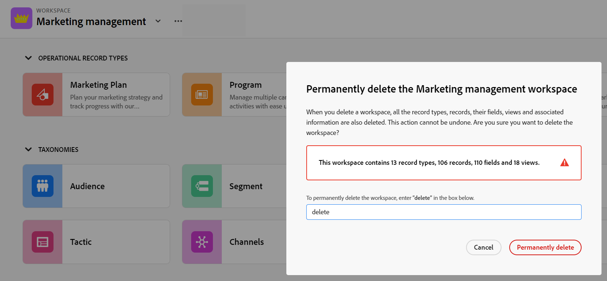

# Delete workspaces

<!--
The highlighted information on this page refers to functionality not yet generally available. It is available only in the Preview environment for all customers. After the release to Preview, the same features are also available monthly in the Production environment for customers who enabled fast releases.    

For information about fast releases, see [Enable or disable fast releases for your organization](/help/quicksilver/administration-and-setup/set-up-workfront/configure-system-defaults/enable-fast-release-process.md). 
-->

{{planning-important-intro}}

In Adobe Workfront Planning, workspaces are centralized locations for teams to plan work. For more information, see [Create workspaces](/help/quicksilver/planning/architecture/create-workspaces.md). 

You can delete workspaces that are no longer relevant. 

We recommend recreating some or all of the record types, records, fields, and views associated with the workspace that you want to delete in another workspace before deleting it.

## Access requirements

+++ Expand to view the access requirements for the functionality in this article. 

<table style="table-layout:auto"> 
<col> 
</col> 
<col> 
</col> 
<tbody> 
    <tr> 
<tr> 
</tr>   
<tr> 
   <td role="rowheader">
Adobe Workfront package
</td> 
   <td> 
<ul> 
<li>
Any Workfront and any Planning package
</li>
Or
<li>
Any Workflow and any Planning package
</li></ul>

For more information about what is included in each Workfront Planning package, contact your Workfront account representative. 
 
   </td> 
  <tr> 
   <td role="rowheader">
Adobe Workfront license
</td> 
   <td>
Standard

   </td> 
  </tr> 
  <tr> 
   <td role="rowheader">
Object permissions
</td> 
   <td>   
Manage permissions to a workspace
  
   
System Administrators have permissions to all workspaces, including the ones they did not create
  </td> 
  </tr>  
</tbody> 
</table> 

For more information about Workfront access requirements, see [Access requirements in Workfront documentation](/help/quicksilver/administration-and-setup/add-users/access-levels-and-object-permissions/access-level-requirements-in-documentation.md).

+++   

<!--
Old:

<table style="table-layout:auto"> 
<col> 
</col> 
<col> 
</col> 
<tbody> 
    <tr> 
<tr> 
<td> 
   
 Products
 </td> 
   <td> 
   <ul><li>
 Adobe Workfront
</li> 
   <li>
 Adobe Workfront Planning
</li></ul></td> 
  </tr>   
<tr> 
   <td role="rowheader">
Adobe Workfront plan*
</td> 
   <td> 

Any of the following Workfront plans:
 
<ul><li>Select</li> 
<li>Prime</li> 
<li>Ultimate</li></ul> 

Workfront Planning is not available for legacy Workfront plans
 
   </td> 
<tr> 
   <td role="rowheader">
Adobe Workfront Planning package*
</td> 
   <td> 

Any 
 

For more information about what is included in each Workfront Planning plan, contact your Workfront account manager. 
 
   </td> 
 <tr> 
   <td role="rowheader">
Adobe Workfront platform
</td> 
   <td> 

Your organization's instance of Workfront must be onboarded to the Adobe Unified Experience to be able to access Workfront Planning.
 

For more information, see <a href="/help/quicksilver/workfront-basics/navigate-workfront/workfront-navigation/adobe-unified-experience.md">Adobe Unified Experience for Workfront</a>. 
 
   </td> 
   </tr> 
  </tr> 
  <tr> 
   <td role="rowheader">
Adobe Workfront license*
</td> 
   <td>
 Standard 

   
Workfront Planning is not available for legacy Workfront licenses
 
  </td> 
  </tr> 
  <tr> 
   <td role="rowheader">
Access level configuration
</td> 
   <td> 
There are no access level controls for Adobe Workfront Planning
   
</td> 
  </tr> 
<tr> 
   <td role="rowheader">
Object permissions
</td> 
   <td>   
Manage permissions to a workspace
  
   
System Administrators have permissions to all workspaces, including the ones they did not create
 </td> 
  </tr> 
</tbody> 
</table>
-->

## Considerations about deleting workspaces

* When you delete workspaces, all the record types, records, their fields, and views are also deleted. 
* Deleted workspaces and the information they contain cannot be recovered. 

## Delete a workspace

{{step1-to-planning}}

1. (Conditional) If you are a Workfront administrator, click one of the following:

   * **Workspaces I'm on** to access workspaces you created
   * **All workspaces** to access workspaces shared with you or workspaces you created

   >[!NOTE]
   >
   >You cannot delete the workspaces on the **Sample workspaces** tab. We recommend using the multi-workspace template bundle to create workspaces similar to those on the Sample workspace tab. For information, see [Create workspaces](/help/quicksilver/planning/architecture/create-workspaces.md).

1. (Optional) Click **Show all** to display additional workspaces. The **Show all** link displays only when you have more than two rows of workspace cards.
1. (Optional) ClicK **Show less** to limit the number of workspaces that display on the screen. 
1. To delete a workspace, do one of the following:

   * Hover over the workspace card, then click the **More** menu  in the upper-right corner of the card
      Or 
   * Click the **search** icon  in the upper-right corner of the Workspaces page to search for a workspace by name and click a workspace card to open the workspace, then click the **More** menu  to the right of the workspace name.

   >[!TIP]
   >
   >You can use the following keyboard combination to open the global search box from any Workfront Planning page and search for workspaces:
   >
   >* CTRL+K for Windows
   >* ⌘+K for Mac
   
1. Click **Delete**.

   

1. Type "**delete**" in the space provided, then click **Permanently delete**. This is not case sensitive. 

    The workspace is deleted and cannot be recovered. Any record types, records, fields, and views associated with them are also deleted. <!--ensure this is right at or before GA-->

