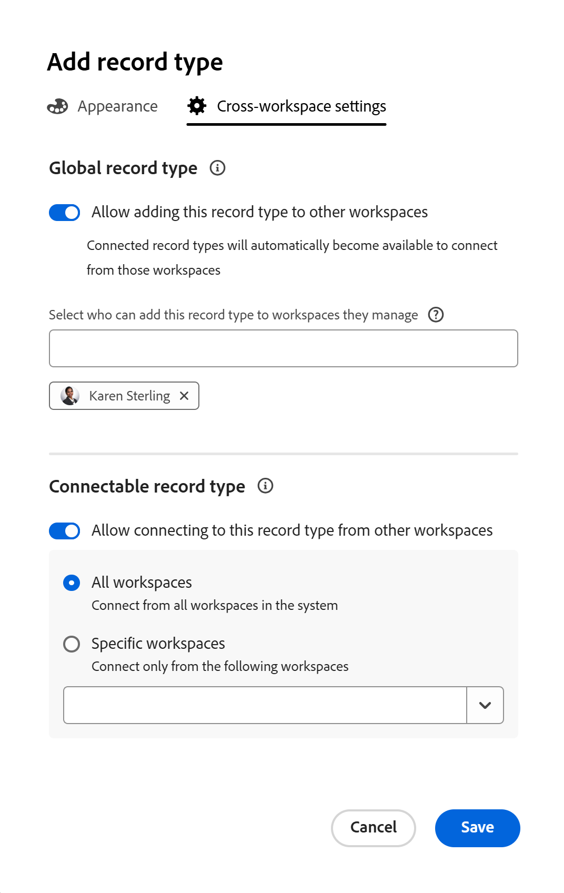
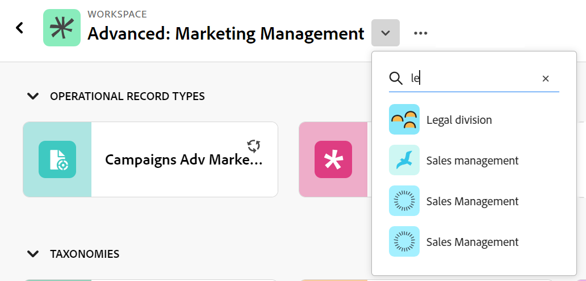

# Edit record types

{{planning-important-intro}}

Record types are the object types of Adobe Workfront Planning. You can edit the appearance of record types that you or anyone else created. For information about creating Workfront Planning record types, see [Create record types](/help/quicksilver/planning/architecture/create-record-types.md). 

## Access requirements

+++ Expand to view access requirements for Workfront Planning. 

You must have the following to be able to access Workfront Planning:  

 <table style="table-layout:auto"> 
<col> 
</col> 
<col> 
</col> 
<tbody> 
    <tr> 
<tr> 
<td> 
   
 Products
 </td> 
   <td> 
   <ul><li>
 Adobe Workfront
</li> 
   <li>
 Adobe Workfront Planning
</li></ul></td> 
  </tr>   
<tr> 
   <td role="rowheader">
Adobe Workfront plan*
</td> 
   <td> 

Any of the following Workfront plans:
 
<ul><li>Select</li> 
<li>Prime</li> 
<li>Ultimate</li></ul> 

Workfront Planning is not available for legacy Workfront plans
 
   </td> 
<tr> 
   <td role="rowheader">
Adobe Workfront Planning plan*
</td> 
   <td> 

Any 
 

For more information about what is included in each Workfront Planning plan, see <a href="https://business.adobe.com/products/workfront/pricing.html">Adobe Workfront pricing and packaging</a>. 
 
   </td> 
 <tr> 
   <td role="rowheader">
Adobe Workfront platform
</td> 
   <td> 

Your organization's instance of Workfront must be onboarded to the Adobe Unified Experience to be able to access all the capabilities of Workfront Planning.
 

For more information, see <a href="/help/quicksilver/workfront-basics/navigate-workfront/workfront-navigation/adobe-unified-experience.md">Adobe Unified Experience for Workfront</a>. 
 
   </td> 
   </tr> 
  </tr> 
  <tr> 
   <td role="rowheader">
Adobe Workfront license*
</td> 
   <td>
 Standard 

   
Workfront Planning is not available for legacy Workfront licenses
 
  </td> 
  </tr> 
  <tr> 
   <td role="rowheader">
Access level configuration
</td> 
   <td> 
There are no access level controls for Adobe Workfront Planning
   
</td> 
  </tr> 
<tr> 
   <td role="rowheader">
Object permissions
</td> 
   <td>   
Manage permissions to a workspace</a> 
  
   
System Administrators have permissions to all workspaces, including the ones they did not create

   
Only system administrators can enable record types to connect from other workspaces
 </td> 
  </tr> 
<tr> 
   <td role="rowheader">
Layout template
</td> 
   <td> 
All users, including Workfront administrators,  must be assigned a layout template that includes the Planning area in the Main Menu. 
 </td> 
  </tr> 
</tbody> 
</table> 

 *For more information about Workfront access requirements, see [Access requirements in Workfront documentation](/help/quicksilver/administration-and-setup/add-users/access-levels-and-object-permissions/access-level-requirements-in-documentation.md).

+++   

<!--
OLD:

<table style="table-layout:auto">
 <col>
 </col>
 <col>
 </col>
 <tbody>
    <tr>
<tr>
<td>
   
 Product
 </td>
   <td>
   
 Adobe Workfront
 
To connect Adobe Workfront Planning record types with Experience Manager Assets, you must have an Adobe Experience Manager Assets license and your organization's instance of Workfront must be onboarded to the Adobe Business Platform or the Adobe Admin Console.
 </td>
  </tr>  
 <td role="rowheader">
Adobe Workfront agreement
</td>
   <td>

Your organization must be enrolled in the early access stage for Workfront Planning 

   </td>
  </tr>
  <tr>
   <td role="rowheader">
Adobe Workfront plan
</td>
   <td>

Any

   </td>
  </tr>
  <tr>
   <td role="rowheader">
Adobe Workfront license*
</td>
   <td>
   
New: Standard

   
Current: Plan
 
  </td>
  </tr>
  
  <tr>
   <td role="rowheader">
Access level configurations
</td>
   <td> 
There are no access level controls for Workfront Planning
  
</td>
  </tr>

  <tr>
   <td role="rowheader">
Permissions
</td>
   <td> 
Manage permissions to a workspace</a> 
  
   
System Administrators have permissions to all workspaces, including the ones they did not create

   
Only system administrators can enable record types to connect from other workspaces

</td>
  </tr>
<tr>
   <td role="rowheader">
Layout template
</td>
   <td> 
Your Workfront or group administrator must add the Planning area in your layout template. For information, see <a href="/help/quicksilver/planning/access/access-overview.md">Access overview</a>. 
  
</td>
  </tr>

 </tbody>
</table>

*For information, see [Access requirements in Workfront documentation](/help/quicksilver/administration-and-setup/add-users/access-levels-and-object-permissions/access-level-requirements-in-documentation.md).-->

## Edit record types

{{step1-to-planning}}

1. Click the workspace whose record types you want to edit, 

   The workspace page opens and the record types display. 
1. Do one of the following:

   * Hover over the card of a record type and click the **More** menu  in the upper-right corner of the record type card, then click **Edit**
      Or
   * Click a record type card to open the record type page, click the **More** menu  to the right of the record type name, then click **Edit**. 

   

1. In the **Edit record type** box, the **Appearance** tab opens by default. 

    

   Update the following information in the **Appearance** tab: 

    * Edit the record type name, if needed. <!--did they add a field label for this?-->
    * **Description**: Edit or add a description for the record type with more information about it. 
    * Edit the color and shape of the icon associated with the record type. Do the following: 
        * Select a color to identify the record type. This is the color of the record type icon. 
        * Select an icon from the list, or start typing the name of an icon to describe what it represents, then select it when it displays. This is the icon of the record type. A file icon is selected by default. 

1. (Conditional) If you are a system administrator, click the **Advanced settings** tab in the **Edit record type** box. 

   

1. (Conditional) As a system administrator, update the following information in the **Advanced settings** tab: 

      * **Connect from other workspaces**: Select this toggle to allow users to connect to this record type from other workspaces. This is deselected by default.
      * **System wide**: Select this option to allow users to connect to this record from all workspaces in the system.
      * **Specific workspaces**: Select this option to restrict the workspaces from which users can connect to this record type, then expand the drop down menu and select the workspaces you want users to connect to this record type from. You can start typing the name of a workspace, and select it when it displays in the list. 

1. Click **Save**.

      The record type card on the workspace displays a connectivity icon  in the upper-right corner to indicate that the record is now accessible from other workspaces. 

1. (Optional) Click the record type card from the workspace area to open the record type's page, then rename the record type in the header.  

1. (Optional) To edit another record type, from the record type page, expand the downward-pointing arrow to the right of a record type name, search for a record type, then select it when it displays in the list.

   