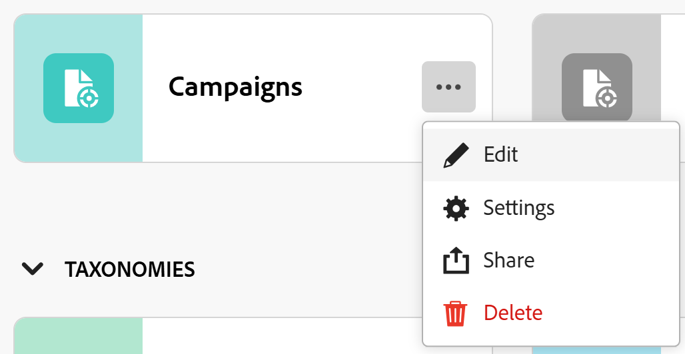

# Edit record types

The highlighted information on this page refers to functionality not yet generally available. It is available only in the Preview environment for all customers. After the monthly releases to Production, the same features are also available in the Production environment for customers who enabled fast releases.    

For information about fast releases, see [Enable or disable fast releases for your organization](/help/quicksilver/administration-and-setup/set-up-workfront/configure-system-defaults/enable-fast-release-process.md). 

{{planning-important-intro}}

Record types are the object types of Adobe Workfront Planning. You can edit the appearance of record types that you or anyone else created. For information about creating Workfront Planning record types, see [Create record types](/help/quicksilver/planning/architecture/create-record-types.md). 

## Access requirements

+++ Expand to view the access requirements for the functionality in this article. 

<table style="table-layout:auto"> 
<col> 
</col> 
<col> 
</col> 
<tbody> 
    <tr> 
<tr> 
</tr>   
<tr> 
   <td role="rowheader">
Adobe Workfront package
</td> 
   <td> 

Any Workfront and Planning package

Any Workfront and Planning package

<b>NOTE</b>

To configure connectable record types: 

<ul> 
<li>
Any Workfront package and any Planning package
</li>

Or

<li>
Any Workflow and a Planning Prime or Ultimate package
</li></ul>

To configure global record types:

<ul> 
<li>
Any Workfront package and a Planning Plus package
</li>

Or

<li>
Any Workflow and a Planning Prime or Ultimate package
</li></ul>

For more information about what is included in each Workfront Planning package, contact your Workfront account representative. 
 

   </td> </tr>
  <tr> 
   <td role="rowheader">
Adobe Workfront license
</td> 
   <td>
Standard

   </td> 
  </tr> 
  <tr> 
   <td role="rowheader">
Object permissions
</td> 
   <td>   
Manage permissions to a workspace
  
   
System Administrators have permissions to all workspaces, including the ones they did not create
  </td> 
  </tr>  
</tbody> 
</table>

For more information about Workfront access requirements, see [Access requirements in Workfront documentation](/help/quicksilver/administration-and-setup/add-users/access-levels-and-object-permissions/access-level-requirements-in-documentation.md).

+++   

<!--Old:
<table style="table-layout:auto"> 
<col> 
</col> 
<col> 
</col> 
<tbody> 
    <tr> 
<tr> 
<td> 
   
 Products
 </td> 
   <td> 
   <ul><li>
 Adobe Workfront
</li> 
   <li>
 Adobe Workfront Planning
</li></ul></td> 
  </tr>   
<tr> 
   <td role="rowheader">
Adobe Workfront plan*
</td> 
   <td> 

Any of the following Workfront plans:
 
<ul><li>Select</li> 
<li>Prime</li> 
<li>Ultimate</li></ul> 

Workfront Planning is not available for legacy Workfront plans
 
   </td> 
<tr> 
   <td role="rowheader">
Adobe Workfront Planning package*
</td> 
   <td> 

Any 
 

For more information about what is included in each Workfront Planning plan, contact your Workfront account manager. 
 
   </td> 
 <tr> 
   <td role="rowheader">
Adobe Workfront platform
</td> 
   <td> 

Your organization's instance of Workfront must be onboarded to the Adobe Unified Experience to be able to access Workfront Planning.
 

For more information, see <a href="/help/quicksilver/workfront-basics/navigate-workfront/workfront-navigation/adobe-unified-experience.md">Adobe Unified Experience for Workfront</a>. 
 
   </td> 
   </tr> 
  </tr> 
  <tr> 
   <td role="rowheader">
Adobe Workfront license*
</td> 
   <td>
 Standard 

   
Workfront Planning is not available for legacy Workfront licenses
 
  </td> 
  </tr> 
  <tr> 
   <td role="rowheader">
Access level configuration
</td> 
   <td> 
There are no access level controls for Adobe Workfront Planning
   
</td> 
  </tr> 
<tr> 
   <td role="rowheader">
Object permissions
</td> 
   <td>   
Manage permissions to a workspace and record type 
  
   
System Administrators have permissions to all workspaces, including the ones they did not create

   
Only system administrators can enable record types to connect from other workspaces
 </td> 
  </tr> 

</tbody> 
</table> -->

## Edit record types

{{step1-to-planning}}

1. Click the workspace whose record types you want to edit. 

   The workspace page opens and the record types display. 
1. Do one of the following:

   * Hover over the card of a record type and click the **More** menu  in the upper-right corner of the record type card, then click **Edit** 
   or **Settings**
      Or
   * Click a record type card to open the record type page, click the **More** menu  to the right of the record type name, then click **Edit** or **Settings**. 

   

1. In the **Edit record type** box, the **Appearance** tab opens by default. <!--update screen shot below at production-->

    

   Update the following information in the **Appearance** tab: 

    * Edit the record type name, if needed. <!--did they add a field label for this?-->
    * **Description**: Edit or add a description for the record type with more information about it. 
    * Edit the color and shape of the icon associated with the record type. Do the following: 
        * Select a color to identify the record type. This is the color of the record type icon. 
        * Select an icon from the list, or start typing the name of an icon to describe what it represents, then select it when it displays. This is the icon of the record type. A file icon is selected by default.

1. (Optional and conditional) If you are a system administrator, click the **Advanced settings** or **Cross-workspace settings** tab and update information about the cross-workspace capabilities of the record type. 

   For more information, see [Configure cross-workspace capabilities for record types](/help/quicksilver/planning/architecture/configure-record-type-cross-workspace-capabilities.md). <!--update screen shot at production - Jan 2026-->

   

1. Click **Save**.

   If you selected to connect this record from other workspaces, the **Connectable record** icon  displays on the record card. 

    If you selected to allow adding this record to other workspaces, the **Global record** icon  displays on the record card. 

1. (Optional) Click the record type card from the workspace area to open the record type's page, then rename the record type in the header.  

1. (Optional) To edit another record type, from the record type page, expand the downward-pointing arrow to the right of a record type name, search for a record type, then select it when it displays in the list.

   
