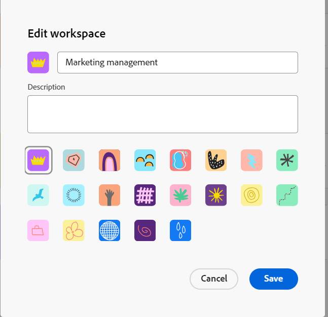
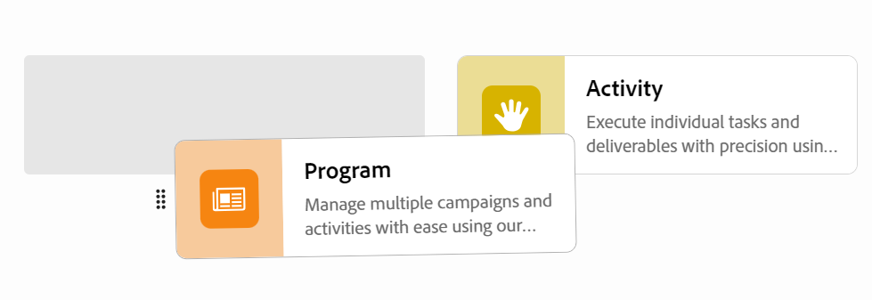

# Edit workspaces

{{planning-important-intro}}

In Adobe Workfront Planning, workspaces are centralized locations for teams to plan work. 

A workspace is a collection of record types used by a team and represents the team's work lifecycle. You can fully customize workspaces in Adobe Workfront Planning. 

For information about creating workspaces, see [Create workspaces](/help/quicksilver/planning/architecture/create-workspaces.md). 

All changes you make to a workspace are visible to all those who have at least View permissions to the workspace.

## Access requirements

+++ Expand to view access requirements for Workfront Planning. 

You must have the following to be able to access Workfront Planning:  

 <table style="table-layout:auto"> 
<col> 
</col> 
<col> 
</col> 
<tbody> 
    <tr> 
<tr> 
<td> 
   
 Products
 </td> 
   <td> 
   <ul><li>
 Adobe Workfront
</li> 
   <li>
 Adobe Workfront Planning
</li></ul></td> 
  </tr>   
<tr> 
   <td role="rowheader">
Adobe Workfront plan*
</td> 
   <td> 

Any of the following Workfront plans:
 
<ul><li>Select</li> 
<li>Prime</li> 
<li>Ultimate</li></ul> 

Workfront Planning is not available for legacy Workfront plans
 
   </td> 
<tr> 
   <td role="rowheader">
Adobe Workfront Planning plan*
</td> 
   <td> 

Any 
 

For more information about what is included in each Workfront Planning plan, see <a href="https://business.adobe.com/products/workfront/pricing.html">Adobe Workfront pricing and packaging</a>. 
 
   </td> 
 <tr> 
   <td role="rowheader">
Adobe Workfront platform
</td> 
   <td> 

Your organization's instance of Workfront must be onboarded to the Adobe Unified Experience to be able to access all the capabilities of Workfront Planning.
 

For more information, see <a href="/help/quicksilver/workfront-basics/navigate-workfront/workfront-navigation/adobe-unified-experience.md">Adobe Unified Experience for Workfront</a>. 
 
   </td> 
   </tr> 
  </tr> 
  <tr> 
   <td role="rowheader">
Adobe Workfront license*
</td> 
   <td>
 Standard

   
Workfront Planning is not available for legacy Workfront licenses
 
  </td> 
  </tr> 
  <tr> 
   <td role="rowheader">
Access level configuration
</td> 
   <td> 
There are no access level controls for Adobe Workfront Planning
   
</td> 
  </tr> 
<tr> 
   <td role="rowheader">
Object permissions
</td> 
   <td>  
Manage permissions to the workspace 
   </td> 
  </tr> 
<tr> 
   <td role="rowheader">
Layout template
</td> 
   <td> 
All users, including Workfront administrators,  must be assigned a layout template that includes the Planning area in the Main Menu. 
 </td> 
  </tr> 
</tbody> 
</table> 

 *For more information about Workfront access requirements, see [Access requirements in Workfront documentation](/help/quicksilver/administration-and-setup/add-users/access-levels-and-object-permissions/access-level-requirements-in-documentation.md).

+++   

<!--OLD

<table style="table-layout:auto">
 <col>
 </col>
 <col>
 </col>
 <tbody>
    <tr>
<tr>
<td>
   
 Product
 </td>
   <td>
   
 Adobe Workfront
 </td>
  </tr>  
 <td role="rowheader">
Adobe Workfront agreement
</td>
   <td>

Your organization must be enrolled in the early access stage for Workfront Planning 

   </td>
  </tr>
  <tr>
   <td role="rowheader">
Adobe Workfront plan
</td>
   <td>

Any

   </td>
  </tr>
  <tr>
   <td role="rowheader">
Adobe Workfront license*
</td>
   <td>
   
New: Standard

   
Current: Plan
 
  </td>
  </tr>
  
  <tr>
   <td role="rowheader">
Access level configuration
</td>
   <td> 
There are no access level controls for Workfront Planning

</td>
  </tr>

<tr>
   <td role="rowheader">
Permissions
</td>
   <td> 
Manage permissions to the workspace 
  
</td>
  </tr>

<tr>
   <td role="rowheader">
Layout template
</td>
   <td> 
You must add the Planning area to your layout template. For information, see <a href="/help/quicksilver/planning/access/access-overview.md">Access overview</a>. 
  
</td>
  </tr>

 </tbody>
</table>

For more information about access requirements, see [Access requirements in Workfront documentation](/help/quicksilver/administration-and-setup/add-users/access-levels-and-object-permissions/access-level-requirements-in-documentation.md). 

-->

## Edit a workspace

{{step1-to-planning}}
    
1. (Conditional) If you are a Workfront administrator, click **Workspaces I'm on** to access workspaces you created, or **Other workspaces** to access workspaces others shared with you. 

<!--***********Replace the steps from the next below till the "Update the following information in the Edit workspace box:" (but keep this last step)*******-->

1. (Optional) Click **Show all** to display additional workspaces. The **Show all** link displays only when you have more than two rows of workspace cards.
1. (Optional) ClicK **Show less** to limit the number of workspaces that display on the screen. 
1. To edit a workspace, do one of the following:

   * Hover over the workspace card, then click the **More** menu  in the upper-right corner of the card
      Or
   * Click a workspace card to open the workspace, then click the **More** menu  to the right of the workspace name. 
1. Click **Edit**.

   The **Edit workspace** box displays.

   

1. Update the following information in the **Edit workspace** box:

   * Add a name for the workspace. <!--did they add a label for this field?-->
   * **Description**: Add information about the workspace. 
   * Select an icon to associate with the workspace. 

1. Click **Save** to close the Edit workspace box and apply your changes.

1. (Optional) To add a new workspace section, do one of the following:

   * Click **Add section** at the bottom of the workspace.
   * Hover over the name of a section and click the **More** menu , then click **Add section above** or **Add section below**.  

1. (Optional) To change the location of a section, do one of the following:

   * Hover over the name of a section and click the **grab** icon , then drag and drop it in the right spot. 
   * Hover over the name of a section and click the **More** menu , then click **Move up** or **Move down**. The section moves up or down inside the workspace. 

1. (Optional) To delete a workspace section, do the following: 
   
   1. Hover over the name of a section, then click the **More** menu , then click **Delete**. <!--add screen shot when UI is final?-->
   1. Select a new section to move all record types to it, then click **Delete**. <!--check the button name; logged a bug to change it to "Delete" from "Delete section".-->

      All record types are moved to the selection section, and the section is deleted. 

1. (Optional) Click **Add record type** to add record types to the workspace.
    
    For information, see [Create record types](/help/quicksilver/planning/architecture/create-record-types.md).

1. (Optional) Hover over a record type card, click the **More** menu  in the upper-right corner, then click **Edit** to modify the appearance of a record type. 

   For information, see [Edit record types](/help/quicksilver/planning/architecture/edit-record-types.md). 

1. (Optional) Hover over a record type card, click the **More** menu  in the upper-right corner, then click **Delete** to delete a record type. 

   For information, see [Delete record types](/help/quicksilver/planning/architecture/delete-record-types.md).

1. (Optional) Press-click a record type card to drag it and drop it in a new spot. You can drag and drop record types from one workspace section to another. 

   

1. (Optional) Click **Share** in the upper-right corner of the workspace to share the workspace with others.

    For information, see [Share workspaces](/help/quicksilver/planning/access/share-workspaces.md).
