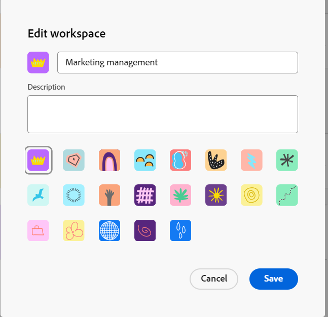

# Edit workspaces

The information on this page refers to functionality not yet generally available. It is available only in the Preview environment for all customers. After the monthly releases to Production, the same features are also available in the Production environment for customers who enabled fast releases.    

For information about fast releases, see [Enable or disable fast releases for your organization](/help/quicksilver/administration-and-setup/set-up-workfront/configure-system-defaults/enable-fast-release-process.md). 

{{planning-important-intro}}

In Adobe Workfront Planning, workspaces are centralized locations for teams to plan work. 

A workspace is a collection of record types used by a team and represents the team's work lifecycle. You can fully customize workspaces in Adobe Workfront Planning. 

For information about creating workspaces, see [Create workspaces](/help/quicksilver/planning/architecture/create-workspaces.md). 

All changes you make to a workspace are visible to all those who have at least View permissions to the workspace.

You can edit a workspace in the following ways: 

* Manually. 

   This article describes how you can manually edit a workspace. 

* Using the AI-powered Planning Designer. This capability is currently available only in a limited Beta program. 

   For information, see [Get started with the Adobe Workfront Planning Designer](/help/quicksilver/planning/general/planning-ai-designer.md).

## Access requirements

+++ Expand to view the access requirements for the functionality in this article. 

<table style="table-layout:auto"> 
<col> 
</col> 
<col> 
</col> 
<tbody> 
    <tr> 
<tr> 
</tr>   
<tr> 
   <td role="rowheader">
Adobe Workfront package
</td> 
   <td> 
<ul> 
<li>
Any Workfront and any Planning package
</li>
Or
<li>
Any Workflow and any Planning package
</li></ul>

For more information about what is included in each Workfront Planning package, contact your Workfront account representative. 
 
   </td> 
  <tr> 
   <td role="rowheader">
Adobe Workfront license
</td> 
   <td>
Standard

   </td> 
  </tr> 
  <tr> 
   <td role="rowheader">
Object permissions
</td> 
   <td>   
Manage permissions to a workspace
  
   
System Administrators have permissions to all workspaces, including the ones they did not create
  </td> 
  </tr>  
</tbody> 
</table> 

For more information about Workfront access requirements, see [Access requirements in Workfront documentation](/help/quicksilver/administration-and-setup/add-users/access-levels-and-object-permissions/access-level-requirements-in-documentation.md).

+++   

<!--
Old:
<table style="table-layout:auto"> 
<col> 
</col> 
<col> 
</col> 
<tbody> 
    <tr> 
<tr> 
<td> 
   
 Products
 </td> 
   <td> 
   <ul><li>
 Adobe Workfront
</li> 
   <li>
 Adobe Workfront Planning
</li></ul></td> 
  </tr>   
<tr> 
   <td role="rowheader">
Adobe Workfront plan*
</td> 
   <td> 

Any of the following Workfront plans:
 
<ul><li>Select</li> 
<li>Prime</li> 
<li>Ultimate</li></ul> 

Workfront Planning is not available for legacy Workfront plans
 
   </td> 
<tr> 
   <td role="rowheader">
Adobe Workfront Planning package*
</td> 
   <td> 

Any 
 

For more information about what is included in each Workfront Planning plan, contact your Workfront account manager. 
 
   </td> 
 <tr> 
   <td role="rowheader">
Adobe Workfront platform
</td> 
   <td> 

Your organization's instance of Workfront must be onboarded to the Adobe Unified Experience to be able to access Workfront Planning.
 

For more information, see <a href="/help/quicksilver/workfront-basics/navigate-workfront/workfront-navigation/adobe-unified-experience.md">Adobe Unified Experience for Workfront</a>. 
 
   </td> 
   </tr> 
  </tr> 
  <tr> 
   <td role="rowheader">
Adobe Workfront license*
</td> 
   <td>
 Standard

   
Workfront Planning is not available for legacy Workfront licenses
 
  </td> 
  </tr> 
  <tr> 
   <td role="rowheader">
Access level configuration
</td> 
   <td> 
There are no access level controls for Adobe Workfront Planning
   
</td> 
  </tr> 
<tr> 
   <td role="rowheader">
Object permissions
</td> 
   <td>  
Manage permissions to the workspace 
   </td> 
  </tr> 
</tbody> 
</table>
-->

## Edit a workspace

{{step1-to-planning}}
    
1. (Conditional) If you are a Workfront administrator, click one of the following:

   * **Workspaces I'm on** to access workspaces you created
   * **All workspaces** to access workspaces shared with you or workspaces you created

   >[!NOTE]
   >
   >You cannot edit the workspaces on the **Sample workspaces** tab. We recommend using the multi-workspace template bundle to create workspaces similar to those on the Sample workspace tab and edit your own. For information, see [Create workspaces](/help/quicksilver/planning/architecture/create-workspaces.md). 
  
1. (Optional) Click **Show all** to display additional workspaces. The **Show all** link displays only when you have more than two rows of workspace cards.
1. (Optional) ClicK **Show less** to limit the number of workspaces that display on the screen. 
1. To edit a workspace, do one of the following:

   * Hover over the workspace card, then click the **More** menu  in the upper-right corner of the card
      Or 
   * Click the **search** icon  in the upper-right corner of the Workspaces page to search for a workspace by name and click a workspace card to open the workspace, then click the **More** menu  to the right of the workspace name. 

   >[!TIP]
   >
   >You can use the following keyboard combination to open the global search box from any Workfront Planning page and search for workspaces :
   >
   >* CTRL+K for Windows  
   >* ⌘+K for Mac 
   >
   >
   
1. Click **Edit**.

   The **Edit workspace** box displays.

   

1. Update the following information in the **Edit workspace** box:

   * Add a name for the workspace. <!--did they add a label for this field?-->
   * **Description**: Add information about the workspace. 
   * Select an icon to associate with the workspace. 

1. Click **Save** to close the Edit workspace box and apply your changes.

1. (Optional) To add a new workspace section, do one of the following:

   * Click **Add section** at the bottom of the workspace.
   * Hover over the name of a section and click the **More** menu , then click **Add section above** or **Add section below**.  

1. (Optional) To change the location of a section, do one of the following:

   * Hover over the name of a section and click the **grab** icon , then drag and drop it in the right spot. 
   * Hover over the name of a section and click the **More** menu , then click **Move up** or **Move down**. The section moves up or down inside the workspace. 

1. (Optional) To delete a workspace section, do the following: 
   
   1. Hover over the name of a section, then click the **More** menu , then click **Delete**. <!--add screen shot when UI is final?-->
   1. Select a new section to move all record types to it, then click **Delete**. <!--check the button name; logged a bug to change it to "Delete" from "Delete section".-->

      All record types are moved to the selection section, and the section is deleted. 

1. (Optional) Click **Add record type** to add record types to the workspace.
    
    For information, see [Create record types](/help/quicksilver/planning/architecture/create-record-types.md).

1. (Optional) Hover over a record type card, click the **More** menu  in the upper-right corner, then click **Edit** to modify the appearance of a record type. 

   For information, see [Edit record types](/help/quicksilver/planning/architecture/edit-record-types.md). 

1. (Optional) Hover over a record type card, click the **More** menu  in the upper-right corner, then click **Delete** to delete a record type. 

   For information, see [Delete record types](/help/quicksilver/planning/architecture/delete-record-types.md).

1. (Optional) Press-click a record type card to drag it and drop it in a new spot. You can drag and drop record types from one workspace section to another. 

   

1. (Optional) Click **Share** in the upper-right corner of the workspace to share the workspace with others.

    For information, see [Share workspaces](/help/quicksilver/planning/access/share-workspaces.md).
