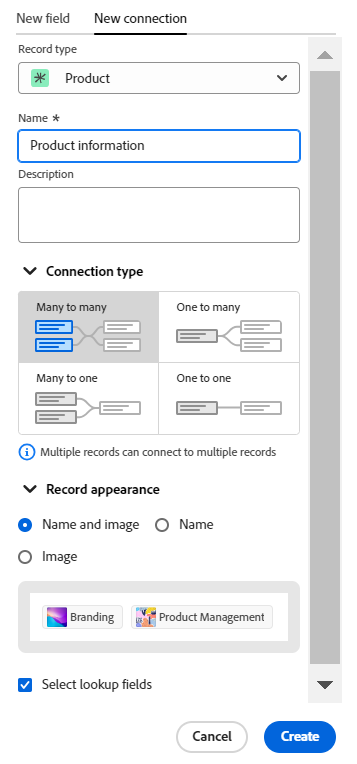
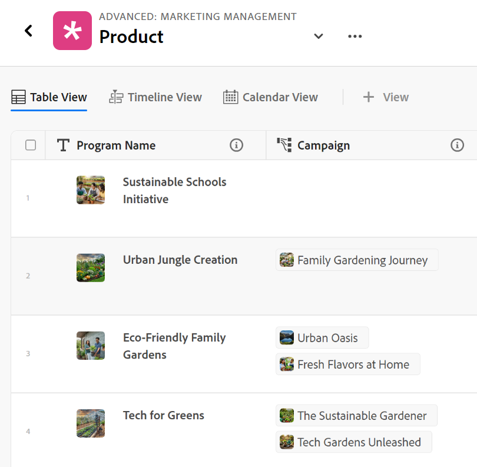
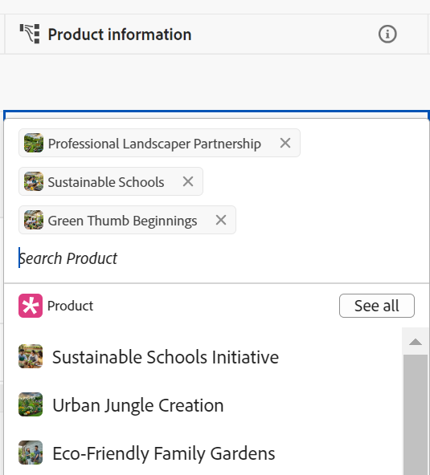
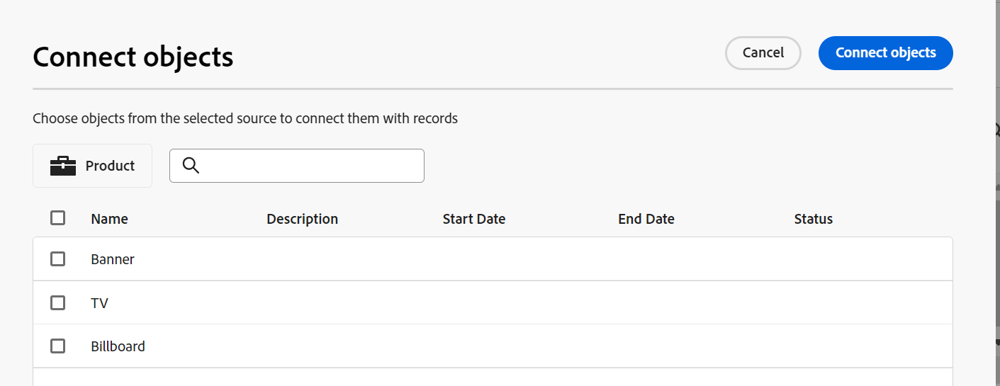
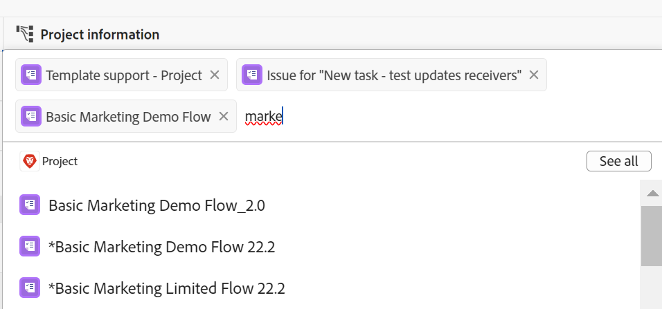
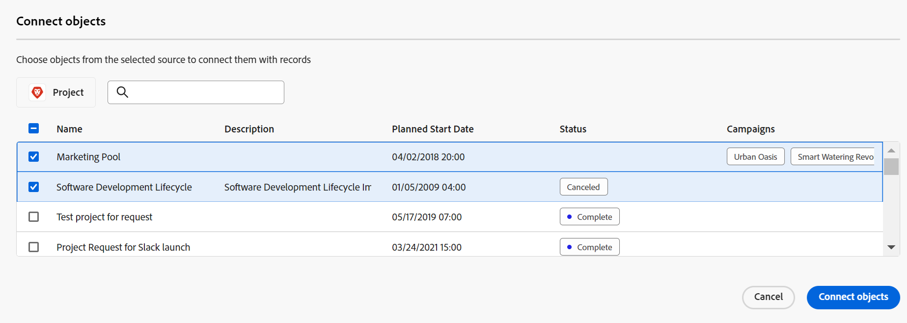
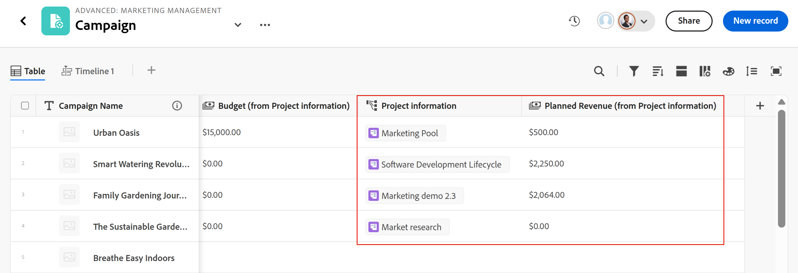

# Example of connecting record types and records

{{planning-important-intro}}

This article describes an example of the following:

* How to create a connection between two Workfront Planning record types and two records.

* How to create a connection between a Workfront Planning record type and a Workfront project object type, as well as a connection between a record and a project.

For more information, also see the following articles:

* [Connect record types](/help/quicksilver/planning/architecture/connect-record-types.md)
* [Connect records](/help/quicksilver/planning/records/connect-records.md)

## Connect two Workfront Planning record types and records (example)

For example, you have a record type named Campaign as your original record type. 

You also have another record type called Product, which has a currency field called Budget. 

You want to create a field on the record type of Campaign where you can show the values of the Budget field of the record type Product. 

To do this:

1. Open the table view for the Campaign record type in a workspace. 
1. Click the **+** icon in the upper-right corner of the table view to add a new field, then click **New connection**, then click **Product** in the selected workspace section. 
1. Add the following information, for example:

    * **Record type**: Product <!--did they change the casing here?-->
    * **Name**: Give the new field a name. For example, "Product information." This is the name of the linked record field. 
    * **Description**: Add a description for the new field. For example, "These are the Products that I want my Campaigns associated with." The description of the field displays when hovering over the field in the column header. 
    * **Allow multiple records**: If you leave this option selected, this allows users to select multiple records when the linked record type field (Product information) displays on the original records (Campaigns). In our case, users can select multiple Products to be connected to one Campaign. 
    * **Select lookup fields**: If you leave this option selected, the **Add lookup fields** box opens next, to allow you to link Product fields with the Campaign record type. You can click **Skip** to skip this step and add Product fields later. 

    

1. (Optional) Deselect the **Title** toggle in the **Record appearance** section to display only the record's thumbnail image in the connected fields. If enabled, records display both the thumbnail and the title. The toggle is enabled by default. 
1. (Conditional) If you selected the **Select lookup fields option** in the previous step, from the list of fields associated with the **Product** record type, click the **+** icon for the **Budget** field, then click **Add fields**. This creates a field called **Budget (from Product information)**, which is the name of the linked field. Any information for the Product Budget displays in this field for the Campaign records. 

    

    >[!TIP]
    >
    >    If you want to view the Budget of all selected products as one total number, select **SUM** in the drop-down menu to the right of the field name. When users select multiple products in the **Product information** linked record field, the **Budget (from Product information)** field adds all their Budget values together and displays the total. <!-- check the shot below - added a bug with a couple of UI changes here-->
    >
    > If you select **None**, instead of **SUM**, the individual budgets of the selected products display separated by commas.

    This generates the following fields: 
    
    * In the Campaign record table view and in the Campaign record page of a campaign: 

        * **Product information** (the linked record field): This displays the name or names of the Products when you add them. 
        * **Budget (from Product information)** (the linked field): This will display the Budgets of the Products selected in the Product information field. 

    * In the Product record table view and in the Product record page of a product: 

        * **Campaign**: This indicates that the Product record type is linked from the Campaign record type.

        

    >[!TIP]
    >
    >    Linked record fields are preceded by the relationship icon . 

1. From the **Campaign** record type table view, create a campaign by adding a new row in the Campaign record type page's table. 

1. Double-click inside the **Product information** column of the new campaign. 

    

1. Do one of the following:

    * Click a connected product's name from the list to add it to the selected record. The product is added automatically.
    * Start typing the name of a product and click it when it displays in the list. The product is added automatically. 
    * Click **See all** to display all products. 

1. (Conditional) If you clicked **See all** in the previous step, the **Connect objects** box displays. 

    

1. Start typing the name of a product in the search box, then select it when it displays in the list

    Or

    Select the Product records that you want to connect with the Campaign records, then click **Connect objects**.

    >[!TIP]
    >
    >    You can open a Campaign's record page, find the linked record field and click the **+** icon in the field to add products from the connected Product record type. 

    The following columns are populated in the Campaign record type table: 
    * The **Product information** field populates for the Campaign record with the selected Products. 
    * **The Budget (from Product information)** field populates with the Budget value for each selected Product, or with a total of all budgets of the selected products (if you selected SUM for your aggregator). 

    

    >[!TIP]
    >
    >When you do not select an aggregator for the multiple values, all values from the selected Products display separated by commas. 

1. To populate the **Campaign** field from the **Product** table view, repeat steps 5-7 starting from the Product record type table view and selecting campaign information. This will also update the Product information field in the Campaign record type page's table. <!--ensure the step numbers remain correct--> 

## Connect a Workfront Planning record type with a Workfront project object type and connect a record with individual projects

>[!IMPORTANT]
>
>    Everyone with View or higher permissions to the workspace can view the information in the linked fields, regardless of their permissions or access level in Workfront.

For example, you have a record type named Campaign as your original record type. 

You also have projects in Workfront with a field called "Planned Revenue." 

You want to create a connection field on the record type of Campaign where you can show the values of the Planned Revenue field of the projects in Workfront that are connected to campaigns in Workfront Planning. 

To do this:

1. Go to a Workspace where you want to connect the Campaign record type with Workfront projects. 
1. Open the table view for the Campaign record type in the selected workspace.
1. Click the **+** icon in the upper-right corner of the table view to add a new field, then click **New connection**, then click **Project** in the **Workfront object types** section. 
1. Add the following information, for example:

    * **Record type**: Project (from the Workfront sub-section) 
    * **Name**: Give the new field a name, for example "Project information." 
    * **Description**: Add a description for the new field. For example, "These are the Projects that I want my Campaigns associated with." The description displays in the table view, as you hover over the field name in the column header. 
    * * **Allow multiple records**: Leaving this option selected allows users to select multiple projects when the linked project type field (Project information) displays on the original records (Campaigns).
    * **Select lookup fields**: If you leave this option selected, the **Add lookup fields** box opens next, to allow you to link Project fields with the Campaign record type. You can click **Skip** to skip this step and add Project fields later. 

     

1. (Conditional) If you selected the **Select lookup fields option** in the previous step, from the list of fields associated with the **Project** object type, click the **+** icon for the **Planned Revenue** field, then click **Add fields**. This creates a field called **Planned Revenue (from Project information)**, which is the name of the linked field. Any information from the Project Planned Revenue field will automatically display in this field for the Campaign records.  

    >[!TIP]
    >
    >    If you want to view the Planned Revenue of all selected projects as one total number, select **SUM** in the drop-down menu to the right of the field name. When users select multiple projects in the **Project information** linked object field, the **Planned Revenue (from Product information)** field adds all their values together and displays the total. <!-- check the shot below - added a bug with a couple of UI changes here-->
    >
    > If you select **None**, instead of **SUM**, the individual Planned Revenues display separated by commas.

    

    This generates the following fields: 
    
    * In the Campaign record table view and in the Campaign record page: 

        * **Project information** (the linked object field): This displays the name or names of the Projects. 
        * **Planned Revenue (from Project information)** (the linked field): This will display the Planned Revenues of the Projects selected in the Project information field. 

    >[!TIP]
    >
    >    Linked object fields are preceded by the relationship icon . 

1. From the **Campaign** record type table view, create a campaign by adding a new row in the table. 

1. Double-click inside the Project information** column of the new campaign. 

    

1. Do one of the following:

    * Click a project's name from the list to add it to the selected record. The project is added automatically.
    * Start typing the name of a project and click it when it displays in the list. The project is added automatically. 
    * Click **See all** to display all projects. 

1. (Conditional) If you clicked **See all** in the previous step, the **Connect objects** box displays. 

    

1. Start typing the name of a project in the search box, then select it when it displays in the list

    Or

    Select the Project records that you want to connect with the Campaign records, then click **Connect objects**.

    >[!TIP]
    >
    >    You can open a Campaign's page, find the linked project field and click the **+** icon in the field to add projects from the connected Product record type. 

    This adds the following to the selected workspace: 
    
    * In the Campaign record type table: 
        * The **Project information** field populates for the Campaign record with the selected projects. 
        * The **Planned Revenue (from Product information)** field populates with the Budget value for each selected Product. This is a read-only field. 

    

    >[!TIP]
    >
    >When you do not select an aggregator for the multiple values, and you select multiple objects in the object-linked field, all values display separated by commas. 

1. Click the name of a project in the connected record field. 

    This opens the project in Workfront, if you have at least View permissions to the project. 
1. (Optional) Update information about the project in Workfront, if you have permissions to do so. 

1. (Optional) From the Campaign table view, hover over the **Project information** field header, and click the downward-pointing arrow, then click **Edit lookup fields.**
1. Click the **+** icon for any project fields that you want to add to the Project's Workfront Planning record in the **Unselected fields** section. 
1. Click the **-** icon for any project fields that you want to remove from the Workfront Project Planning record in the **Selected fields** section.
1. Click **Save**.

    Additional linked fields are added to the Campaign record type. 
