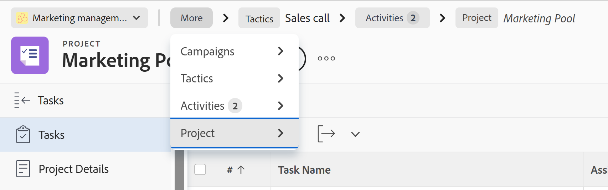

# Hierarchy and breadcrumb overview

The information on this page refers to functionality not yet generally available. It is available only in the Preview environment for all customers. After the monthly releases to Production, the same features are also available in the Production environment for customers who enabled fast releases.    

For information about fast releases, see [Enable or disable fast releases for your organization](/help/quicksilver/administration-and-setup/set-up-workfront/configure-system-defaults/enable-fast-release-process.md). 

As a workspace manager, you can define flexible but structured hierarchies between connected record types and other object types in Adobe Workfront Planning. 

Hierarchies are connections between record types, or between record types and a Workfront project. 

For information about creating hierarchies, see [Create workspace hierarchies](/help/quicksilver/planning/architecture/create-workspace-hierarchies.md). 

The following are benefits of using hierarchies in your workspaces: 

* To organize work in a way that reflects how your teams actually plan, operate, and deliver. 
* For users to understand where they are, how record types connect, and how strategy flows into execution by referring to a set of breadcrumbs that indicate their place in the system. 
* To offer a better navigation, and create clarity and continuity across all workflows. 
* To define flows that fit how your organization works, supporting both flexibility and consistency across all stages of work.

## Considerations when working with hierarchies

* You can create up to 5 hierarchies for one workspace.
* You can have up to 4 record and object types connected in one hierarchy. 
* You can connect only the following object types in a workspace hierarchy:
    * Record types that belong to the workspace you're building the hierarchies in. 
    * Workfront projects. Workfront projects cannot be added as parents of other record types. They are always the last object type in a hierarchy. 
* You cannot add the following object types in a hierarchy:
    * Record types from other workspaces, even when they are set as connectable or global record types. You can add global record types to hierarchies only when they have been added to the workspace you're building the hierarchy from. 
    * All other Workfront objects.
    * AEM Assets.
* Hierarchies can include both Planning record types and Workfront projects at the same time.

        For example, you can have a Campaign record type with Planning Tactics and Workfront Projects as the children in the same workspace hierarchy. 
* If a connection between the selected record types already exists, the system reuses the existing connection.
* If no connection exists, Workfront will create one as part of the hierarchy setup.
* The **Create corresponding field on linked record type** setting must be turned on for the connected field for records and object types that you want to include in a hierarchy. 
* You cannot delete a record type if it is part of a hierarchy. 
* You cannot delete a connection field if the record type referenced in the field is part of a hierarchy. You must first remove the record type from the hierarchy or delete the hierarchy before you can delete the record type. 
* You can delete a lookup field from a connected record type. The information in the field cannot be recovered.
* The following are rules for hierarchy setup:
    * A record type can only have one parent record type in a given workspace. 
    
        For example, a Tactic record type cannot have both a Campaign and a Goal record type as a parent in the same workspace. 
    * A record type can be the parent in multiple hierarchies. 

        For example, you can have three different hierarchies in one workspace, and each of them can have Campaigns as their parent record type. 
    * A record can be connected to multiple parent records of the same type, when you connect one to many or many to many record types.
        
        For example, Tactic A can belong to both Campaign X and Campaign Y. 
    * A record type can connect to only one child record type at a time. A child record type can also be a parent for another record type.  
        
        For example, a Campaign record type can be the parent to only one other record type in the same hierarchy (Tactics), and Tactics can in turn be the parent of Programs which can be a parent to Projects.
    * A record type cannot be the parent in one hierarchy and the child in another hierarchy in the same workspace. 
    * Global record types may appear in multiple workspaces inside multiple hierarchies, after they are added to those workspaces. 
        
        For example, if a Campaign is a global record type and part of a hierarchy in Workspace 1, it can be added as an existing record type to Workspace 2 and can be part of a hierarchy there. But it cannot be part of a hierarchy in Workspace 2 only when designated as a global record type in Workspace 1, but not added to Workspace 2. 
    * When connected record types are part of hierarchies, you can connect one record from a child record type to up to 10 records from a parent record type.

        For example, if you create a hierarchy between Campaigns as the parent and Persona as the child record, you can connect the same persona to up to 10 campaigns. 
    
## Considerations when viewing breadcrumbs

When you create hierarchies between record types, they generate breadcrumbs for records that belong to those record types. 

For example, if you create a hierarchy and connect Campaigns with Tactics, then with Activities, and then with Projects, when you navigate to a record of any of the types connected in the hierarchy, you can view where in the hierarchy the record is placed. 

Consider the following: 

* If a record type is part of multiple hierarchies, you can switch between hierarchies from the record's breadcrumb on the record's page.
* If the record type in a hierarchy has multiple records, you can select records from the breadcrumb. 
* Breadcrumbs work across Workfront and Planning. 

    For example, when looking at a project which is connected to Planning campaigns and tactics, and also to Workfront portfolios and programs, you can switch between both the Planning and the Workfront object types from the breadcrumb. 

    For more information, see [Create workspace hierarchies](/help/quicksilver/planning/architecture/create-workspace-hierarchies.md).
* When you edit a record, the changes are visible from all the workspaces and all hierarchies the record is part of.

