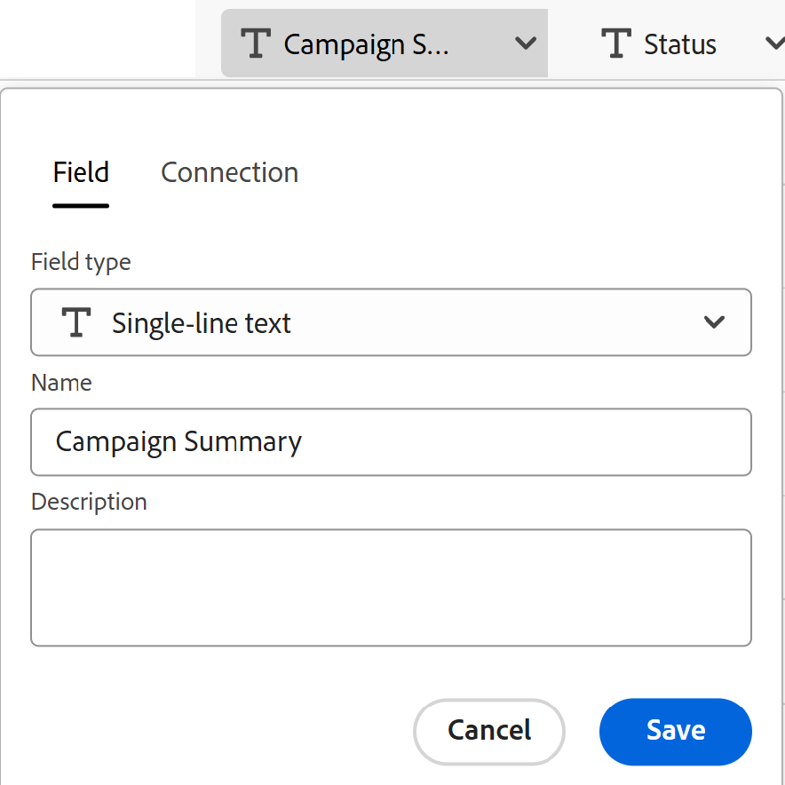
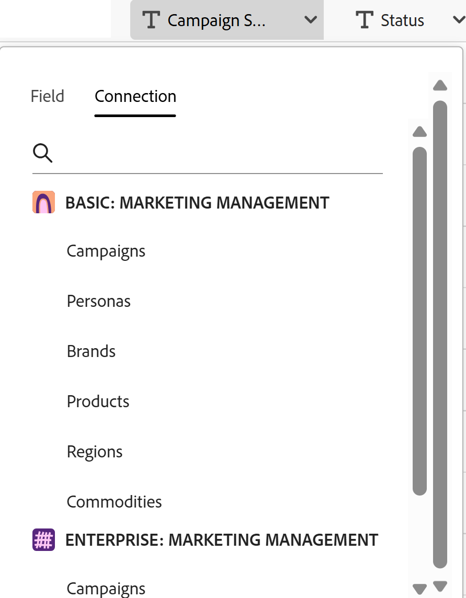

# Create record types by importing information from a CSV or Excel file

The information on this page refers to functionality not yet generally available. It is available only in the Preview environment for all customers. After the monthly releases to Production, the same features are also available in the Production environment for customers who enabled fast releases.    

For information about fast releases, see [Enable or disable fast releases for your organization](/help/quicksilver/administration-and-setup/set-up-workfront/configure-system-defaults/enable-fast-release-process.md). 

{{planning-important-intro}}

Record types are the object types of Adobe Workfront Planning. In Workfront Planning, you can create custom record types which illustrate the work items needed in your organization's lifecycle by importing information from a CSV or Excel file.

## Access requirements

+++ Expand to view access requirements.  

<table style="table-layout:auto"> 
<col> 
</col> 
<col> 
</col> 
<tbody> 
    <tr> 
<tr> 
<td> 
   
 Products
 </td> 
   <td> 
   <ul><li>
 Adobe Workfront
</li> 
   <li>
 Adobe Workfront Planning
</li></ul></td> 
  </tr>   
<tr> 
   <td role="rowheader">
Adobe Workfront plan*
</td> 
   <td> 

Any of the following Workfront plans:
 
<ul><li>Select</li> 
<li>Prime</li> 
<li>Ultimate</li></ul> 

Workfront Planning is not available for legacy Workfront plans
 
   </td> 
<tr> 
   <td role="rowheader">
Adobe Workfront Planning package*
</td> 
   <td> 

Any 
 

For more information about what is included in each Workfront Planning plan, contact your Workfront account manager. 
 
   </td> 
 <tr> 
   <td role="rowheader">
Adobe Workfront platform
</td> 
   <td> 

Your organization's instance of Workfront must be onboarded to the Adobe Unified Experience to be able to access Workfront Planning.
 

For more information, see <a href="/help/quicksilver/workfront-basics/navigate-workfront/workfront-navigation/adobe-unified-experience.md">Adobe Unified Experience for Workfront</a>. 
 
   </td> 
   </tr> 
  </tr> 
  <tr> 
   <td role="rowheader">
Adobe Workfront license*
</td> 
   <td>
 Standard

   
Workfront Planning is not available for legacy Workfront licenses
 
  </td> 
  </tr> 
  <tr> 
   <td role="rowheader">
Access level configuration
</td> 
   <td> 
There are no access level controls for Adobe Workfront Planning
   
</td> 
  </tr> 
<tr> 
   <td role="rowheader">
Object permissions
</td> 
   <td>   
Manage permissions to a workspace</a> 
  
   
System Administrators have permissions to all workspaces, including the ones they did not create
  </td> 
  </tr> 
 
</tbody> 
</table> 

 *For more information about Workfront access requirements, see [Access requirements in Workfront documentation](/help/quicksilver/administration-and-setup/add-users/access-levels-and-object-permissions/access-level-requirements-in-documentation.md).

+++   

## Considerations about importing record types using an Excel or CSV file

* Each sheet of the Excel file becomes a record type. The name of the sheet becomes the name of the record type.
* If there is only one sheet, or if you import a CSV file, the name of the file becomes the name of the record type. 
* The columns headers in each sheet become the fields associated with each record type. 
* Fields are unique for their respective record types. 
* Each row in each sheet becomes a unique record associated with its respective record type. 
* Each sheet of the Excel file should not exceed the following: 
    * 25,000 rows
    * 500 columns
* The file should not be larger than 5MB.
* Empty sheets are not supported. 
* Fields of the following types are not supported and cannot be mapped to fields on the import sheet:

    * Connection fields to Workfront and AEM Assets object types.
    * Lookup fields from connected Planning records or Workfront and AEM Assets objects
    * Formula fields
    * Created date, Created by
    * Last modified date, Last modified by
    * Approved date, Approved by
    * People

To import record types using an Excel or CSV file: 

{{step1-to-planning}}

1. Click the workspace where you want to create record types, 

    Or

    From a workspace, expand the downward-pointing arrow to the right of an existing workspace name, search for a workspace, then select it when it displays in the list.
1. Click **Add record type**. 
1. Click **Upload from file**.
1. Drag and drop an Excel or CSV file previously saved on your computer, or click **Select a CSV or Excel file** to browse for one, then select it. 
1. Click **Preview and edit**.
    
    The **Preview and edit** box displays with the following information: 

    * The names of the sheets or of the future record types display in the left panel. Workfront Planning selects an icon and a color for each new record type by default.
    * The first sheet or record type is selected and the names of the fields associated with it display as the column headers. The type of each field is selected by default. 
    * Each row represents a new record. Only the first 10 records display in the Preview and edit box. 

    

1. (Optional) Click the name of each sheet in the left panel to review the information it contains. 

    >[!NOTE]
    >
    >Sheets that are empty are not supported and are dimmed. 

1. (Optional) Deselect the sheets that you don't want to import from the left panel. 

    

    Sheets you deselected display with a gray background. 

1. (Optional) Click the downward-pointing arrow to the right of a column header to do one of the following, in the **Field** tab:

    

    * Rename one of the fields
    * Change the **Field type**
    * Update the field **Description**

1. (Optional) Click the **Connection** tab to map the information in the column to a connected field from other record types.

    

    >[!TIP]
    >
    >You can only map to fields from Workfront Planning connected records. You cannot map to fields from Workfront or AEM Assets connections. For more information, see the section [Considerations about importing record types using an Excel or CSV file](#considerations-about-importing-record-types-using-an-excel-or-csv-file) in this article.

1. (Conditional) After updating information about the field, click **Save**.

1. Click **Import** when you are ready to import your file. 

    The following information imports in to Workfront Planning:

    * New record types
    * New fields associated with each record type
    * New records associated with each record type

    You can start managing fields and records on the record types pages. 
    
    Everyone with access to Workfront Planning and the workspace can now view and edit the imported record types and their information.
