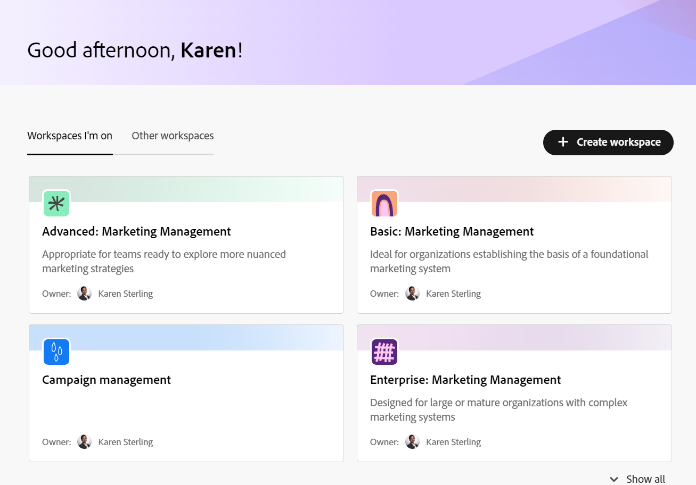

# Workspaces overview

{{planning-important-intro}}

A workspace is a collection of record types used by an organizational unit and it represents the unit's work lifecycle and processes. You can fully customize workspaces in Adobe Workfront Planning. 

## Considerations about workspaces

* You can create workspaces for specific organizational units within your organization, to match the unique way each unit works. 
* Workfront Planning does not come with any preconfigured workspaces. You must create them according to the needs of your organization. 
* You can create workspaces in the following ways: 

    * From scratch
    * Using a template. Templates contain a preconfigured number of record types and their fields. 

    For information, see [Create workspaces](/help/quicksilver/planning/architecture/create-workspaces.md). 
* Workspaces are frameworks within which your organizational units (a team, group, department, or division) work. They cannot be associated with fields. Only the record types within  a workspaces can be associated with fields. 

    For information, see [Record types overview](/help/quicksilver/planning/architecture/overview-of-record-types.md). 
* Depending on your Workfront license, workspaces display in the following tabs in the Planning area:

   * For system administrators, workspaces display in the following tabs: 

      * **Workspaces I'm on**: Displays workspaces you created or workspaces that are shared with you.
      * **Other workspaces**: Displays all other workspaces in the system.

   * For all other users, workspaces they created and workspaces others shared with them display in the Workspaces area. 

* The record types that a workspace contains should reflect the work lifecycle and concepts of an organizational unit. 

    For example, if a unit's work objects are campaigns, products, and regions, that unit's workspace should contain the record types of Campaign, Product, and Region. 
* When you create a workspace, only you have the permission to access and manage your workspace. You must share it with other users in order for them to collaborate with you in the same space. 

    For information, see [Share a workspace](/help/quicksilver/planning/access/share-workspaces.md). 
    
    System administrators can manage all workspaces, even the ones that they did not create. 

<!--make this live with the GA: * There is no limit for how many workspaces you can create in your environment. However, we recommend not to have too many workspaces, as they could become hard to manage and your workflows might be too fragmented.-->

* There are limits on how many workspace objects you can create in your instance of Workfront Planning. For information, see [Adobe Workfront Planning object limitations overview](/help/quicksilver/planning/general/limitations-overview.md). 

