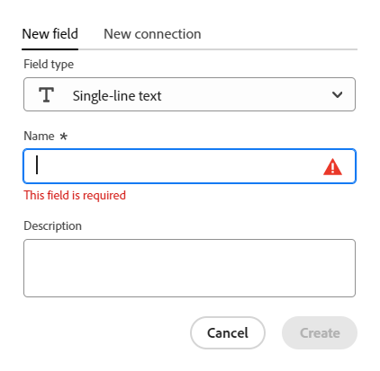
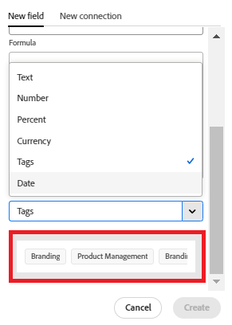

<!--Should the structure of this article be like this other one: https://experienceleague.adobe.com/docs/workfront/using/administration-and-setup/customize/custom-forms/custom-form-builder/use-the-custom-form-builder/add-a-custom-field-to-a-custom-form.html?lang=en ??-->

<!--will they add a way to create fields elsewhere than in a table?! - how will that change the structure of this article? -->

<!--Do we need this for FORMULAS: when we release permissions to RECORDS and we release referring lookup fields in a formula field, update considerations to say that lookup fields from linked records depends on the permissions to the record; if they have no permissions to view a linked record, they won't be able to use that records's lookup fields in a formula - not sure is needed??-->

# Create fields

<span class="preview">The highlighted information on this page refers to functionality not yet generally available. It is available only in the Preview environment for all customers. After the monthly releases to Production, the same features are also available in the Production environment for customers who enabled fast releases. </span>   

<span class="preview">For information about fast releases, see [Enable or disable fast releases for your organization](/help/quicksilver/administration-and-setup/set-up-workfront/configure-system-defaults/enable-fast-release-process.md). </span> 


{{planning-important-intro}}

In Adobe Workfront Planning, you can create custom fields for record types. You can then associate the fields with Workfront Planning records to enhance record information. 

You must create record types before you can create fields to associate with them. For information, see [Create record types](/help/quicksilver/planning/architecture/create-record-types.md). 

You can create fields in the following ways in Workfront Planning:

* From scratch
* By connecting record types
* By creating a record type
* By creating a workspace from a template
* By importing record types using an Excel or CSV file
* By importing copies of existing Workfront fields

For more information about Workfront Planning fields, see [Field overview](/help/quicksilver/planning/fields/fields-overview.md).

## Access requirements

+++ Expand to view access requirements. 

You must have the following access to perform the steps in this article:  

 <table style="table-layout:auto"> 
<col> 
</col> 
<col> 
</col> 
<tbody> 
    <tr> 
<tr> 
<td> 
   <p> Products</p> </td> 
   <td> 
   <ul><li><p> Adobe Workfront</p></li> 
   <li><p> Adobe Workfront Planning<p></li></ul></td> 
  </tr>   
<tr> 
   <td role="rowheader"><p>Adobe Workfront plan*</p></td> 
   <td> 
<p>Any of the following Workfront plans:</p> 
<ul><li>Select</li> 
<li>Prime</li> 
<li>Ultimate</li></ul> 
<p>Workfront Planning is not available for legacy Workfront plans</p> 
   </td> 
<tr> 
   <td role="rowheader"><p>Adobe Workfront Planning package*</p></td> 
   <td> 
<p>Any </p> 
<p>For more information about what is included in each Workfront Planning plan, contact your Workfront account manager. </p> 
   </td> 
 <tr> 
   <td role="rowheader"><p>Adobe Workfront platform</p></td> 
   <td> 
<p>Your organization's instance of Workfront must be onboarded to the Adobe Unified Experience to be able to access all the capabilities of Workfront Planning.</p> 
<p>For more information, see <a href="/help/quicksilver/workfront-basics/navigate-workfront/workfront-navigation/adobe-unified-experience.md">Adobe Unified Experience for Workfront</a>. </p> 
   </td> 
   </tr> 
  </tr> 
  <tr> 
   <td role="rowheader"><p>Adobe Workfront license*</p></td> 
   <td><p> Standard </p>
   <p>Workfront Planning is not available for legacy Workfront licenses</p> 
  </td> 
  </tr> 
  <tr> 
   <td role="rowheader"><p>Access level configuration</p></td> 
   <td> <p>There are no access level controls for Adobe Workfront Planning</p>   
</td> 
  </tr> 
<tr> 
   <td role="rowheader"><p>Object permissions</p></td> 
   <td>   <p>Manage permissions to a workspace <span class="preview">and record type</span> </a> </p>  
   <p>System Administrators have permissions to all workspaces, including the ones they did not create.</p> </td> 
  </tr> 
<tr> 
   <td role="rowheader"><p>Layout template</p></td> 
   <td> <p>In the Production environment, all users including the System Administrators must be assigned to a layout template that includes Planning.</p>
<p><span class="preview">In the Preview environment, Standard users and System Administrators have Planning enabled by default.</span></p></td> 
  </tr> 
</tbody> 
</table> 

 *For more information about Workfront access requirements, see [Access requirements in Workfront documentation](/help/quicksilver/administration-and-setup/add-users/access-levels-and-object-permissions/access-level-requirements-in-documentation.md).

+++   

## Create fields from scratch {#create-fields-from-scratch} 

<!--in a table (not sure if this can be done elsewhere?!-->

<!--the first 3 steps are the same as in Import fields from Workfront-->

{{step1-to-planning}}

1. Click the workspace whose records you want to create fields for.

    The workspace opens and the record types display. 

1. Click the card of a record type. 

    All existing records associated with the record type display in the rows of the table view. 

    >[!TIP]
    >
    >    If no records display, you might not have any records yet, or you might have a filter applied that limits what you see on the screen.

    All existing fields associated with the record type display in the columns of the table view. 

    >[!TIP]
    >
    >    Some fields might be hidden. Click Fields and enable the toggle of the fields you want to view as columns in the table view. 
   
1. Click the **+** icon in the upper-right corner of the table view

    Or
    
    Hover over the header of any column, click the downward-pointing arrow after the field name, then click **Insert left** or **Insert right** to add the new field.
1. In the **New field** tab, search for a field type in the **Field type** box, or select from the following field types:

    In the **New field** tab, search for a field type in the **Field type** box using any related keyword, or select from the field types listed below. 

    >[!TIP]
    >
    >    You can type "Budget" and the field types of Number and Currency display in a short list.


    * [Single-line text](#single-line-text)
    * [Paragraph](#paragraph)
    * [Multi-select](#multi-select)
    * [Single-select](#single-select)
    * [Date](#date)
    * [Number](#number) 
    * [Percentage](#percentage)
    * [Currency](#currency)
    * [Checkbox](#checkbox) 
    * [Formula](#formula)
    * [People](#people)
    * [Created by](#created-by)
    * [Created date](#created-date)
    * [Last modified by](#last-modified-by)
    * [Last modified date](#last-modified-date)
    <!--* [Object](#object-field-type)-->
    
    >[!IMPORTANT]
    >
    >You cannot change the Field type of the field after you save it. 

    <!--Add this to the IMPORTANT above and make it a NOTE - should do directly to Prod:
    * You can use any keyword that might be related to any of the field type names. For example, a search for "Budget" will display the Number or Currency field type.-->

1. Continue with adding each field, as described in the sections below.

### Single-line text {#single-line-text}

Single-line text fields capture limited alphanumeric information. For example,  you can capture the Owner, Stakeholder, Team, or Organizational unit information in a single-line text field. The content of a single-line text field can have up to 1,000 characters. <!-- used to be 250 but just tested with 1000 and it allowed this as a maximum. -->

1. Start creating a field as described in the section [Create fields from scratch](#create-fields-from-scratch) in this article, then select the **Single-line text** field type.

     

1. Add the following information in the **New field** tab:
     * **Name**: The name of the field type, as it will appear in a table or the Details page of the record. <!--ensure they updated this; and update the screen shot: it used to be "Label"-->
     * **Description**: Additional information about the field. The description of a field displays when you hover over the field's column header in a table, or  when you click the information icon next to the field name in the record's details page.
1. Click **Create**. 

    The new single-line field is added as a column to the record type, and its values can be associated with records. 


### Paragraph {#paragraph}

Paragraph fields capture additional alphanumeric information about a record, similar to the Description field. 

>[!TIP]
>
>* You can have a maximum of 20 paragraph fields for one record type.  
>
>* The content of a paragraph field can have up to 10,000 characters.
>* You can use Rich Text formatting to enhance the content of paragraph fields when they display in the table view or the Details page of a record. For information, see [Edit records](/help/quicksilver/planning/records/edit-records.md).
>
 

1. Start creating a field as described in the section [Create fields from scratch](#create-fields-from-scratch) in this article, then select the **Paragraph** field type.

    
 

1. Add the following information in the **New field** tab:
     * **Name**: The name of the field type, as it will appear in a table or the Details page of the record. <!--ensure they updated this; and update the screen shot: it used to be "Label"-->
     * **Description**: Additional information about the field. The description of a field displays when you hover over the field's column in a table, or when you click the information icon next to the field name in the record's details page.
1. Click **Create**. 

    The new paragraph field is added as a column to the record type, and its values can be associated with records.   


### Multi-select {#multi-select}

You can use a multi-select field to capture additional information in any format by selecting more than one option from a drop-down menu. 

1. Start creating a field as described in the section [Create fields from scratch](#create-fields-from-scratch) in this article, then select the **Multi-select** field type.

    
 

1. Add the following information in the **New field** tab:
     * **Name**: The name of the field type, as it will appear in a table or the Details page of the record. <!--ensure they updated this; and update the screen shot: it used to be "Label"-->
     * **Description**: Additional information about the field. The description of a field displays when you hover over the field's column in a table, or when you click the information icon next to the field name in the record's details page.
     * **Choices**: The options that users can select when updating this field. You can use both numbers and letters for the name of each choice. 
1. Click **Add choice** to add more choices. There is no limit to how many choices you can add to a multi-select field.
1. (Optional) Manually drag and drop each choice in the desired order, or select the 
**Sort choices A-Z** option if you want the choices to be automatically listed in alphabetical order. <!--Add this if they added this functionality: You cannot edit this option after you save the field.-->
1. (Optional) To remove a choice, click the **x** icon to the right of it.
1. Click the color swatch to the left of a choice to expand the color selector and customize the color of each option. 

1. Click **Swatches** to select a predefined color

    Or

   Click **Custom** to select a custom color using a color picker or a Hex code. 
1. Click outside the color box to close it.    
1. Click **Create**. 

    The new multi-select field is added as a column to the record type, and its values can be associated with records.  

### Single-select {#single-select}

Single-select fields capture additional information in any format by selecting one option from a drop-down menu. 

1. Start creating a field as described in the section [Create fields from scratch](#create-fields-from-scratch) in this article, then select the **Single-select** field type.

    
 

1. Add the following information in the **New field** tab:
     * **Name**: The name of the field type, as it will appear in a table or the Details page of the record. <!--ensure they updated this; and update the screen shot: it used to be "Label"-->
     * **Description**: Additional information about the field. The description of a field displays when you hover over the field's column in a table, or when you click the information icon next to the field name in the record's details page.
     * **Choices**: The options  available to select from the drop-down menu after the field is saved. You can have both numbers and letters for the name of each choice. 
     
1. Click **Add choice** to add more choices. There is no limit to how many choices you can add to a single-select field.     
1. (Optional) Manually drag and drop each choice in the desired order, or select the **Sort choices A-Z** option if you want the choices to be automatically listed in alphabetical order. <!--Add this if they added this functionality: You cannot edit this option after you save the field.-->
1. (Optional) To remove a choice, click the **x** icon to the right of it.
1. Click the color swatch to the left of a choice to expand the color selector and customize the color of each option. 
1. Click **Swatches** to select a predefined color

    Or

    Click **Custom** to select a custom color using a color picker or a Hex code. 

1. Click outside the color box to close it.
1. Click **Create**. 

    The new single-select field is added as a column to the record type, and its values can be associated with records.  

### Date {#date}

You can use a date field to capture additional information in date and time format. 

1. Start creating a field as described in the section [Create fields from scratch](#create-fields-from-scratch) in this article, then select the **Date** field type.

    
 

1. Add the following information in the **New field** tab:
     * **Name**: The name of the field type, as it will appear in a table or the record page. <!--ensure they updated this; and update the screen shot: it used to be "Label"-->
     * **Description**: Additional information about the field. The description of a field displays when you hover over the field's column in a table, or when you click the information icon next to the field name in the record's details page.
     * **Date Format**: The type of date format you want to display in this field. <!--update this casing - submitted bug for it-->
        
        Select from the following formats:
        * **Locale**: Matches the locale of your browser.
        * **Standard**: 05/16/2023
        * **Long**: May 16, 2023
        * **European**: 16/05/2023
        * **ISO**: 2023-05-16
        * **Include time**: Select this option if you want to include a time stamp. This is unselected by default. You cannot include a time after you safe the field. 
    
        Select from the following options:
        
        * **24hr**: For example: 18:00
        * **12hr**: For example: 6:00 PM

1. Click **Create**. 

    The new date field is added as a column to the record type, and its values can be associated with records.  

### Number {#number}

Number field types capture information in a number format.

>[!TIP]
>
>Number fields display as a Single-line text field type in a request form builder. 
>
>However, the field format is preserved and the values of these fields will display as numbers after the request is submitted, on the record type and in the request details page. 
>For information, see [Create and manage a request form in Adobe Workfront Planning](/help/quicksilver/planning/requests/create-request-form.md). 


1. Start creating a field as described in the section [Create fields from scratch](#create-fields-from-scratch) in this article, then select the **Number** field type.

    
1. Add the following information in the **New field** tab:

    * **Name**: The name of the field type, as it will appear in a table or the record page. 
    * **Description**: Additional information about the field. The description of a field displays when you hover over the field's column in a table, or when you click the information icon next to the field name in the record's details page. 
    * **Precision**: The number of decimal places that you want to record for the field. You can display up to 6 decimal places.
    * **Allow negative numbers**: Select this option if you want to allow negative numbers in this field. This option is unselected by default. 
    
    >[!NOTE]
    >
    >    If you select Allow negative numbers, and negative values are stored on the records the field is attached to, then you can no longer deselect the setting in the future.

1. Click **Create**.

    The new number field is added as a column to the record type, and its values can be associated with records.    

### Percentage {#percentage}

Percentage field types capture information in a number format followed by a percentage sign. 

>[!TIP]
>
>Percentage fields display as a Single-line text field type in a request form builder. 
>
>However, the field format is preserved and the values of these fields will display as percentages after the request is submitted, on the record type and in the request details page. 
>For information, see [Create and manage a request form in Adobe Workfront Planning](/help/quicksilver/planning/requests/create-request-form.md).


1. Start creating a field as described in the section [Create fields from scratch](#create-fields-from-scratch) in this article, then select the **Percentage** field type. 

    

1. Add the following information in the **New field** tab:
    * **Name**: The name of the field type, as it will appear in a table or the record page. 
    * **Description**: Additional information about the field. The description of a field displays when you hover over the field's column in a table, or when you click the information icon next to the field name in the record's details page.
    * **Precision**: The number of decimal places that you want to record for the field. You can display up to 6 decimal places.
    * **Allow negative numbers**: Select this option if you want to allow negative percentage values in this field. This option is unselected by default. 

        >[!NOTE]
        >
        >If you select Allow negative numbers, and negative values are stored on the records the field is attached to, then you can no longer deselect the setting in the future.
    
    * **Show as**: From the drop-down menu, choose how you want the percentage values to display in the table view. Select from the following options:
        * **Number**: The percent value displays as a number followed by the percentage sign. 
        * **Bar**: The percent value displays as a bar next to the percentage number. The fill color of the bar indicates the percent value. This is the default selection. 
        * **Circle**: The percent value displays as the outline of a circle next to the percentage number. The fill color of the circle's outline indicates the percent value.

    >[!NOTE]
    >
    >* The selection you make in the Show as field only applies to the percentage value visible in the table view. The percent value of the field displays as a number followed by the percentage sign everywhere else in Workfront Planning. This also applies to the percentage-type field when it displays as a lookup field in other records' table views.
    >* You can change the Show as selection when editing the field later. 

1. Click **Create**. 

    The new percentage field is added as a column to the record type, and its values can be associated with records.   

### Currency {#currency}

Currency field types capture information in a number format preceded by a currency symbol. 

>[!TIP]
>
>Currency fields display as a Single-line text field type in a request form builder. 
>
>However, the field format is preserved and the values of these fields will display as currency after the request is submitted, on the record type and in the request details page. 
>For information, see [Create and manage a request form in Adobe Workfront Planning](/help/quicksilver/planning/requests/create-request-form.md). 

1. Start creating a field as described in the section [Create fields from scratch](#create-fields-from-scratch) in this article, then select the **Currency** field type.

    

1. Add the following information in the **New field** tab:
     * **Name**: The name of the field type, as it will appear in a table or the record page. <!--ensure they updated this; and update the screen shot: it used to be "Label"-->
     * **Description**: Additional information about the field. The description of a field displays when you hover over the field's column in a table, or when you click the information icon next to the field name in the record's details page.
     * **Currency**: The type of currency you want to display in this field. This is a list of currencies according to the International Organizaton of Standardization (ISO). 
     * **Precision**: The number of decimal places that you want to record for the field. You can display up to 6 decimals.
     * **Allow negative numbers**: Select this option if you want to allow negative currency values in this field. This option is unselected by default. 

    >[!NOTE]
    >
    >    If you select Allow negative numbers, and negative values are stored on the records the field is attached to, then you can no longer deselect the setting in the future. 

1. Click **Create**. 

    The new currency field is added as a column to the record type, and its values can be associated with records.   

### Checkbox

You can use the Checkbox field type to add a single checkbox option to a record. You can use this field to indicate a specific attribute or status for that particular record. For example, you can use it as a flag for tracking completion, approval, or any other binary attribute for each record. 
 
1. Start creating a field as described in the section [Create fields from scratch](#create-fields-from-scratch) in this article, then select the **Checkbox** field type.
 
    

1. Add the following information in the **New field** tab:
     * **Name**: The name of the field type, as it will appear in a table or the record page. <!--ensure they updated this; and update the screen shot: it used to be "Label"-->
     * **Description**: Additional information about the field. The description of a field displays when you hover over the field's column in a table, or when you click the information icon next to the field name in the record's details page.
1. Click **Create**.

    The new checkbox field is added as a column to the record type, and its values can be associated with records.   

### Formula

Formula fields generate a new value using existing values from other fields in a record type and a function that indicates how the existing values should be calculated.

For more information, see [Formula fields overview](/help/quicksilver/planning/fields/formula-fields.md).
 
1. Start creating a field as described in the section [Create fields from scratch](#create-fields-from-scratch) in this article, then select the **Formula** field type.
 
    

1. Add the following information in the **New field** tab:

   * **Name**: Enter a name for the new field.
   * **Description**: Add information about the new field. The description of a field displays when you hover over the field's column in a table, or when you click the information icon next to the field name in the record's details page.
   * **Formula**: Start typing at least one character to access an expression, then select it when it displays in the list. 
  
1. Click the selected expression to reveal the definition and view its formatting. 

   

   For more information about what expressions are supported, see [Formula fields overview](/help/quicksilver/planning/fields/formula-fields.md).


    >[!TIP]
    >
    >You will receive a warning message when editing or creating a formula field that might cause a circular reference to itself or shared fields. You cannot save a formula field that either refers to itself or to items that are referenced in its calculation.


1. Add field names as they display in Workfront Planning to reference them in a formula. 

    >[!NOTE]
    >
    >* You cannot add Multi-select type fields in a formula.
    >
    >* You can reference a field that is up to 4 fields (and objects) away from the current record type. For example, if you are creating a formula field for an Activity record type (1), and the Activity is connected to the Campaign record type (2) which is connected to a Workfront Project (3), you can reference the project's Budget field (4) in the formula you are creating for the Activity record type. 
    >
    >
    >

1. In the **Format** field, select from the following choices to identify the format of the result displayed in the formula-type field:

    * **Text**: The result of the formula field displays as plain text. 
    * **Number**: The result of the formula field displays as a number. 
    * **Percent**: The result of the formula field displays as a number followed by a percentage symbol.  
    * **Currency**: The result of the formula field displays as a number preceded or followed by a currency symbol.  
    * **Tags**: The result of the formula field displays as a tag with the object's name. 
    
        >[!TIP]
        >
        >We recommend tags for fields that show arrays. In this case, each array member displays as a separate tag.
        
        

    * **Date**: The result of the formula field displays as a date. 

        A preview of what the result will look like displays under the **Format** field. 

        >[!WARNING]
        >
        >If the result of the formula does not match the selected format, the field will show an error message where it displays. 

1. Click **Create**.

     The new formula field is added as a column to the record type, and its values can be associated with records.

### People

You can use the People field type to add a user <!--, job role, or team--> to a record. This is a type-ahead field, and you can add only users<!--, roles, or teams--> that already exist in your Workfront instance.

>[!TIP]
>
>* When you add the name of a user in a People field, the name of the user and their primary job role display in the field.  
>
>* People fields display as a reference (or connection) field type in a request form builder. 
>
>For information, see [Create and manage a request form in Adobe Workfront Planning](/help/quicksilver/planning/requests/create-request-form.md). 

1. Start creating a field as described in the section [Create fields from scratch](#create-fields-from-scratch) in this article, then select the **People** field type.
 
   

1. Add the following information in the **New field** tab:
     * **Name**: The name of the field type, as it will appear in a table or the record page. 
     * **Description**: Additional information about the field. The description of a field displays when you hover over the field's column in a table, or when you click the information icon next to the field name in the record's details page.
     * **Allow multiple values**: Select this option if you want to allow users to add more than one user in this field. This option is unselected by default. 
    
    >[!NOTE]
    >
    >    If you select Allow multiple values, and multiple users are stored on the records the field is attached to, then you can no longer deselect the setting in the future, when editing this field. 
    
1. Click **Create**.

    The new People-type field is added as a column to the record type, and its values can be associated with records.   

### Created by

You can use the Created by field type to add the user who created the record to a record. This is a read-only field, and it automatically populates with the name of the user who was logged in when the record was created.
 
1. Start creating a field as described in the section [Create fields from scratch](#create-fields-from-scratch) in this article, then select the **Created by** field type.
 
   

1. Add the following information in the **New field** tab:

     * **Name**: The name of the field type, as it will appear in a table or the record page. <!--this might change and they might prepopulate it with "Created by"-->
     * **Description**: Additional information about the field. The description of a field displays when you hover over the field's column in a table, or when you click the information icon next to the field name in the record's details page.
    
1. Click **Create**.

    The new Created by-type field is added as a column to the record type and its values are prefilled with the name of the user who created each record.   


### Created date

You can use the Created date field type to add the date when the record was created to a record. This is a read-only field, and it automatically populates with the date (and optionally with the time) when the record was created.
 
1. Start creating a field as described in the section [Create fields from scratch](#create-fields-from-scratch) in this article, then select the **Created date** field type.
 
   

   <!--check the image above - added bug fix for UI text changes-->

1. Add the following information in the **New field** tab:

     * **Name**: The name of the field type, as it will appear in a table or the record page. <!--this might change and they might prepopulate it with "Created date"-->
     * **Description**: Additional information about the field. The description of a field displays when you hover over the field's column in a table, or when you click the information icon next to the field name in the record's details page.
     * **Date Format**: Select from the following formats:

        * **Locale**: Matches the locale of your browser.
        * **Standard**: 05/16/2023
        * **Long**: May 16, 2023
        * **European**: 16/05/2023
        * **ISO**: 2023-05-16
     * **Include a time field**: Select this option if you want to include a time stamp. This is unselected by default. <!--submitted a UI text change for this - check the UI-->
    
        Select from the following options:
        
        * **24hr**: For example: 18:00
        * **12hr**: For example: 6:00 PM 
    
1. Click **Create**.

    The new Created date-type field is added as a column to the record type and its values are prefilled with the date (or date and time) when the record was created.   


### Last modified by

You can use the Last modified by field type to add the user who last modified the record to a record. This is a read-only field, and it automatically populates with the name of the user who was logged in when the record was last updated.
 
1. Start creating a field as described in the section [Create fields from scratch](#create-fields-from-scratch) in this article, then select the **Last modified by** field type.
 
   

1. Add the following information in the **New field** tab:

     * **Name**: The name of the field type, as it will appear in a table or the record page. <!--this might change and they might prepopulate it with "Created by"-->
     * **Description**: Additional information about the field. The description of a field displays when you hover over the field's column in a table, or when you click the information icon next to the field name in the record's details page.
    
1. Click **Create**.

    The new Last modified by-type field is added as a column to the record type and its values are prefilled with the name of the user who last modified each record.   


### Last modified date

You can use the Last modified date field type to add the date when a record was last modified to a record. This is a read-only field, and it automatically populates with the date (and optionally with the time) when the record was last modified.
 
1. Start creating a field as described in the section [Create fields from scratch](#create-fields-from-scratch) in this article, then select the **Created date** field type.
 
   

   <!--check the image above - added bug fix for UI text changes-->

1. Add the following information in the **New field** tab:

     * **Name**: The name of the field type, as it will appear in a table or the record page. <!--this might change and they might prepopulate it with "Created date"-->
     * **Description**: Additional information about the field. The description of a field displays when you hover over the field's column in a table, or when you click the information icon next to the field name in the record's details page.
     * **Date Format**: Select from the following formats:

        * **Locale**: Matches the locale of your browser.
        * **Standard**: 05/16/2023
        * **Long**: May 16, 2023
        * **European**: 16/05/2023
        * **ISO**: 2023-05-16
     
     * **Include a time field**: Select this option if you want to include a time stamp. This is unselected by default. <!--submitted a UI text change for this - check the UI-->
    
        Select from the following options:
        
        * **24hr**: For example: 18:00
        * **12hr**: For example: 6:00 PM 
    
1. Click **Create**.

    The new Last modified date-type field is added as a column to the record type and its values are prefilled with the date (or date and time) when the record was last modified.   

<!--

## Object field type

You can use the Object field type when you need to store several fields that might include several pieces of information. For example, you can store the source, code, error message, or details of an object in one field. In this case, instead of having several separate single-line text fields for that, you can use an Object field to store all information in one place. 

For example, when using an Object-type field, you can store the following type of information: 

```
"{
""source"": ""string"",
""code"": ""string"",
""subCode"": ""string"",
""message"": ""string"",
""details"": ""string""
}"

```

You can also store an array of values in one field and you would rather rely on user input for each element of the array, instead of using a multi-select field type for the same purpose. For example, you can store information in the following format: 

`["EMEA", "APAC"] `

Consider the following when using Object-type fields:

* In addition to strings and arrays, you can store other value formats like HTML.
* There is no format validation for this field. 
* Object-type fields have a limit of 10,000 characters.

Create an Object field: 

1. Start creating a field as described in the section [Create fields from scratch](#create-fields-from-scratch) in this article, then select the **Created date** field type.

    

1. Add the following information in the **New field** tab:

     * **Name**: The name of the field type, as it will appear in a table or the record page. (***********this might change and they might prepopulate it with "Created date"********)
     * **Description**: Additional information about the field. The description of a field displays when you hover over the field's column in a table, or when you click the information icon next to the field name in the record's details page.

1. Click **Create**.

    The new Object-type field is added as a column to the record type.

-->

## Create fields by connecting record types 

You can create linked record fields when you add a new connection between two record types, or a record type and an object types from other applications. 
        
For information about connecting Workfront Planning record types, see [Connect record types](/help/quicksilver/planning/architecture/connect-record-types.md). 

<!--## Create fields by importing record types using an Excel or CSV file

For more information, see [Create record types](/help/quicksilver/planning/architecture/create-record-types.md).-->

## Create fields by creating a record type

When you create a record type, several fields associated with the new record type are also created by default. For more information, see [Create record types](/help/quicksilver/planning/architecture/create-record-types.md). 

## Create fields by creating a workspace from a template

Adobe Workfront Planning creates fields for record types when you create a workspace from a template. 

For information, see [Create workspaces](/help/quicksilver/planning/architecture/create-workspaces.md).


## Create fields when importing record types from a CSV or Excel file

You can import fields when you import record types using a CSV or Excel file. 

For information, see [Create record types](/help/quicksilver/planning/architecture/create-record-types.md).

## Create fields by importing them from Workfront

You can import copies of existing Workfront fields. 

Importing fields from Workfront creates a copy of each field for a Workfront Planning record type. 

After you copy the fields, the fields are independent from one another and they do not exchange information. 

For information, see [Import fields from Workfront](/help/quicksilver/planning/fields/import-fields-from-workfront.md). 


