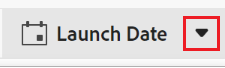

# Delete fields

<!--
The highlighted information on this page refers to functionality not yet generally available. It is available only in the Preview environment for all customers. After the release to Preview, the same features are also available monthly in the Production environment for customers who enabled fast releases.    

For information about fast releases, see [Enable or disable fast releases for your organization](/help/quicksilver/administration-and-setup/set-up-workfront/configure-system-defaults/enable-fast-release-process.md). 
-->

{{planning-important-intro}}

In Adobe Workfront Planning, you can create custom fields to store information about records. 

For information about creating custom fields in Workfront Planning, see [Create fields](/help/quicksilver/planning/fields/create-fields.md).

You can delete Workfront Planning fields that are no longer relevant. 

## Access requirements

+++ Expand to view the access requirements for the functionality in this article. 

<table style="table-layout:auto"> 
<col> 
</col> 
<col> 
</col> 
<tbody> 
    <tr> 
<tr> 
</tr>   
<tr> 
   <td role="rowheader">
Adobe Workfront package
</td> 
   <td> 
<ul> 
<li>
Any Workfront and any Planning package
</li>
Or
<li>
Any Workflow and any Planning package
</li></ul>

To delete fields from global record types:

<ul><li>
Any Workfront package and a Planning Plus package
</li>
Or
<li>
Any Workflow and Planning Prime and Ultimate packages
</li></ul>

For more information about what is included in each Workfront Planning package, contact your Workfront account representative. 
 
   </td> 
  <tr> 
   <td role="rowheader">
Adobe Workfront license
</td> 
   <td>
Standard

   </td> 
  </tr> 
  <tr> 
   <td role="rowheader">
Object permissions
</td> 
   <td>   
Manage permissions to a workspace
  
   
System Administrators have permissions to all workspaces, including the ones they did not create
  </td> 
  </tr>  
</tbody> 
</table> 

For more information about Workfront access requirements, see [Access requirements in Workfront documentation](/help/quicksilver/administration-and-setup/add-users/access-levels-and-object-permissions/access-level-requirements-in-documentation.md).

+++   

<!--
Old:

<table style="table-layout:auto"> 
<col> 
</col> 
<col> 
</col> 
<tbody> 
    <tr> 
<tr> 
<td> 
   
 Products
 </td> 
   <td> 
   <ul><li>
 Adobe Workfront
</li> 
   <li>
 Adobe Workfront Planning
</li></ul></td> 
  </tr>   
<tr> 
   <td role="rowheader">
Adobe Workfront plan*
</td> 
   <td> 

Any of the following Workfront plans:
 
<ul><li>Select</li> 
<li>Prime</li> 
<li>Ultimate</li></ul> 

Workfront Planning is not available for legacy Workfront plans
 
   </td> 
<tr> 
   <td role="rowheader">
Adobe Workfront Planning package*
</td> 
   <td> 

Any 
 

For more information about what is included in each Workfront Planning plan, contact your Workfront account manager. 
 
   </td> 
 <tr> 
   <td role="rowheader">
Adobe Workfront platform
</td> 
   <td> 

Your organization's instance of Workfront must be onboarded to the Adobe Unified Experience to be able to access Workfront Planning.
 

For more information, see <a href="/help/quicksilver/workfront-basics/navigate-workfront/workfront-navigation/adobe-unified-experience.md">Adobe Unified Experience for Workfront</a>. 
 
   </td> 
   </tr> 
  </tr> 
  <tr> 
   <td role="rowheader">
Adobe Workfront license*
</td> 
   <td>
 Standard 

   
Workfront Planning is not available for legacy Workfront licenses
 
  </td> 
  </tr> 
  <tr> 
   <td role="rowheader">
Access level configuration
</td> 
   <td> 
There are no access level controls for Adobe Workfront Planning
   
</td> 
  </tr> 
<tr> 
   <td role="rowheader">
Object permissions
</td> 
   <td>   
Manage permissions to a workspace and record type </a> 
  
   
System Administrators have permissions to all workspaces, including the ones they did not create
</td> 
  </tr> 
</tbody> 
</table>
-->

## Considerations about deleting Workfront Planning fields:

* You can delete a field only in the record type table view.
* You cannot delete the primary field of a record. 
* Any information stored in the field is deleted and cannot be recovered. 
* When you delete a connected record field, all the connected lookup fields are also deleted from the record type you connect from. The connected record fields of the record types you connect to are also deleted from the record you connect to.

   For example, when you connect Campaigns to another record type called Product, and you delete the Product connected field and the Product's Status lookup field from the campaign, the following are deleted:
      
   * The Product connected field from the campaign
   * The Product Status lookup field from the campaign
   * The Campaign connected field from the product 

   For more information, see [Connect record types](/help/quicksilver/planning/architecture/connect-record-types.md). 

<!-- this is not possible yet, since fields cannot be shared yet; maybe move this up a bit, in this bullet list: * When you delete a field, it is deleted from all records associated with the field.-->

* You cannot delete fields from global records that have been added to a secondary workspaces from the secondary workspaces.

## Delete fields

<!--When they release the sharing of fields between other records, revise this section.  -->

{{step1-to-planning}}
    
1. Click the workspace whose record fields you want to delete. 

    The workspace opens and the record types display. 

1. Click the card of a record type. 

1. (Conditional) If not already selected, click the tab of a **Table view** on the record type page. 

     All existing records associated with the record type display in the rows of the table view.
     
1. Find the field that you want to delete in the column headers, and hover over the column header, then click the downward-pointing arrow after the field name. 

   
   
1. Click **Delete**. <!-- check this: they might replace it with **Delete field**-->

    <!--insert screen shot when finalized-->

1. (Conditional) If the field you are deleting is part of a request form, the **Delete field** box displays to indicate the forms that will be impacted by your changes. Do one of the following:

   * Click the right-pointing arrow to display the forms impacted by the change, then click the form name to open the form in a new tab and decide whether you want to keep the field on the form or make additional changes to the form. 
   * Click **Delete** which will delete the field from all areas where it displays. 

   Deleted fields cannot be recovered.

   Depending on what type of field you deleted, the following happens: 
   
      * If you delete a field that belongs to the record you selected, the field is deleted and can no longer be associated with any records. If this field is added as a lookup field on other records, those fields are also deleted. 
      * If you delete a connection field, the field is deleted from the record you selected. Also, the corresponding connection field from its original record is also deleted. 
      * If you delete a lookup field that was added from a connected record, the field is deleted from the record type you selected, but it remains on its original record type. 
      * If you delete a field from a global record type in its primary workspace, it is deleted from all the workspaces where that record type has been added. You cannot delete fields from global record types from their secondary workspaces.
