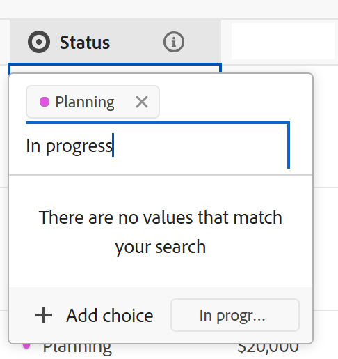

# Edit field settings

<!--The highlighted information on this page refers to functionality not yet generally available. It is available only in the Preview environment for all customers. After the monthly releases to Production, the same features are also available in the Production environment for customers who enabled fast releases.    

For information about fast releases, see [Enable or disable fast releases for your organization](/help/quicksilver/administration-and-setup/set-up-workfront/configure-system-defaults/enable-fast-release-process.md). -->

{{planning-important-intro}}

You can edit the settings of existing fields in Adobe Workfront Planning. 

For information about creating Adobe Workfront Planning fields, see [Create fields](/help/quicksilver/planning/fields/create-fields.md).

This article describes how you can edit the settings for Workfront Planning fields. For information about editing field values for records, see [Edit records](/help/quicksilver/planning/records/edit-records.md).

## Access requirements

+++ Expand to view the access requirements for the functionality in this article. 

<table style="table-layout:auto"> 
<col> 
</col> 
<col> 
</col> 
<tbody> 
    <tr> 
<tr> 
</tr>   
<tr> 
   <td role="rowheader">
Adobe Workfront package
</td> 
   <td> 
<ul> 
<li>
Any Workfront and any Planning package
</li>
Or
<li>
Any Workflow and any Planning packages</li></ul>

For more information about what is included in each Workfront Planning package, contact your Workfront account representative. 
 
   </td> 
  <tr> 
   <td role="rowheader">
Adobe Workfront license
</td> 
   <td>
Standard

   </td> 
  </tr> 
  <tr> 
   <td role="rowheader">
Object permissions
</td> 
   <td>   
Manage permissions to a workspace
  
   
System Administrators have permissions to all workspaces, including the ones they did not create
  </td> 
  </tr>  
</tbody> 
</table> 

For more information about Workfront access requirements, see [Access requirements in Workfront documentation](/help/quicksilver/administration-and-setup/add-users/access-levels-and-object-permissions/access-level-requirements-in-documentation.md).

+++     

<!--Old:

<table style="table-layout:auto"> 
<col> 
</col> 
<col> 
</col> 
<tbody> 
    <tr> 
<tr> 
<td> 
   
 Products
 </td> 
   <td> 
   <ul><li>
 Adobe Workfront
</li> 
   <li>
 Adobe Workfront Planning
</li></ul></td> 
  </tr>   
<tr> 
   <td role="rowheader">
Adobe Workfront plan*
</td> 
   <td> 

Any of the following Workfront plans:
 
<ul><li>Select</li> 
<li>Prime</li> 
<li>Ultimate</li></ul> 

Workfront Planning is not available for legacy Workfront plans
 
   </td> 
<tr> 
   <td role="rowheader">
Adobe Workfront Planning package*
</td> 
   <td> 

Any 
 

For more information about what is included in each Workfront Planning plan, contact your Workfront account manager. 
 
   </td> 
 <tr> 
   <td role="rowheader">
Adobe Workfront platform
</td> 
   <td> 

Your organization's instance of Workfront must be onboarded to the Adobe Unified Experience to be able to access Workfront Planning.
 

For more information, see <a href="/help/quicksilver/workfront-basics/navigate-workfront/workfront-navigation/adobe-unified-experience.md">Adobe Unified Experience for Workfront</a>. 
 
   </td> 
   </tr> 
  </tr> 
  <tr> 
   <td role="rowheader">
Adobe Workfront license*
</td> 
   <td>
 Standard 

   
Workfront Planning is not available for legacy Workfront licenses
 
  </td> 
  </tr> 
  <tr> 
   <td role="rowheader">
Access level configuration
</td> 
   <td> 
There are no access level controls for Adobe Workfront Planning
   
</td> 
  </tr> 
<tr> 
   <td role="rowheader">
Object permissions
</td> 
   <td>   
Manage permissions to a workspace and record type</a> 
  
   
System Administrators have permissions to all workspaces, including the ones they did not create
</td> 
  </tr> 
</tbody> 
</table> -->

## Considerations about editing field settings

You must consider the following before making changes to a field's configuration: 

* You can edit field settings only from the record type table. 
* You cannot edit a field's settings on the record page or in any other view, outside of the table view. 
* You cannot edit the Field type, after the field is saved.
* You cannot deselect the Allow negative numbers setting that was previously selected, for a Number, Percentage, or Currency field if there are already negative values stored on the records it is attached to. 
* You can edit the configuration of the following field elements, after you save the field:

    * The Name or the Description of any field
    * The Options of a Single-select or a Multi-select field.
    * The expression of a Formula field.

    >[!WARNING]
    >
    >When formula expressions change, or options are added or removed from a select-type field, there will be loss of data for the records that already have information stored in the fields whose configuration is modified. 
    >
    >There is no warning or indication that this data loss could happen when you change the configuration of fields. 
    >
    >There is no notification to other users that the field configuration has changed.
    
* You can edit existing lookup fields from connected records.
* In addition to editing the field as described in the [Edit field settings](#edit-field-settings-1) section in this article, you can edit a single- or multi-select field's choices when you edit a record in the table view, as you update the field values. For information, see the [Add new choices to an existing select field when editing records in the table view](#add-new-choices-to-an-existing-select-field-when-editing-records-in-the-table-view) section in this article. 

<!--at production - April 10, 2025 - remove the last bullet altogether-->

<!--this is not yet true, but it might come later:
* You can deselect Allow negative numbers option from a Number, Percentage, or Currency field after you save the field. 
-->

## Edit field settings

{{step1-to-planning}}

1. Click the workspace whose record fields you want to edit.

    The workspace opens and all the record types in the workspace display on cards. 

1. Click the card of a record type. 

   This opens the record type's page. 

1. (Conditional) Click the tab of a **Table view**.

    All existing records associated with the record type display in the rows of the table view.
1. Hover over the column header of a field you want to edit, then click the downward-pointing arrow after the field name, then click **Edit field**

    Or 
    
    Double-click the column header for the field.

    
    
1. Update information about the field and click **Save**. 
   
   For information, see [Create fields](/help/quicksilver/planning/fields/create-fields.md).

   <!--insert screen shot when finalized-->

    >[!TIP]
    >
    >* You cannot update the field type after the field is saved.
    >
    >* When you modify field configurations (field options or formula expressions), records that already contain information in the modified fields will update their values in real-time. There is no warning and no audit log for the value changes triggered by field configuration changes. All users who view the fields will immediately see the new values with the modifications.

    The field information updates for everyone with access to view the workspace. 

1. (Conditional) For connected record fields, click **Edit lookup fields** and add or remove any of the lookup fields from the connected record type.

    For more information, see [Connect record types](/help/quicksilver/planning/architecture/connect-record-types.md). 

## Add new choices to an existing select field when editing records in the table view

<!--some of this information is also available in Edit records article - update both when necessary-->

You can add new choices to an existing single- or multi-select field when editing records in the table view. 

>[!IMPORTANT]
>
>The functionality described in this section is available only in the table view. It is not available in any other areas where single- or multi-select fields display.

**EXAMPLE**

You might have a single-select field called Status that has the choices New and Closed, and you want to add a choice for an In progress status. You can add the choice by doing one of the following things:

* Editing the field. For information, see the section [Edit field settings](#edit-field-settings-1) in this article.
* Adding a new option while editing the record in the table view, as described below. 

To add a new choice to an existing select field when editing a record: 

1. Go to a record type page and open the table view. 
1. Add the single- or multi-select field that you would like to add a choice to in the table view as a new column. For information, see [Create fields](/help/quicksilver/planning/fields/create-fields.md). 
1. Start editing the field inline by double-clicking the cell for the field. 
1. Type the name of the choice you want to add, then click **Add choice**.

   

    The new choice is added immediately to the single-select field. 

