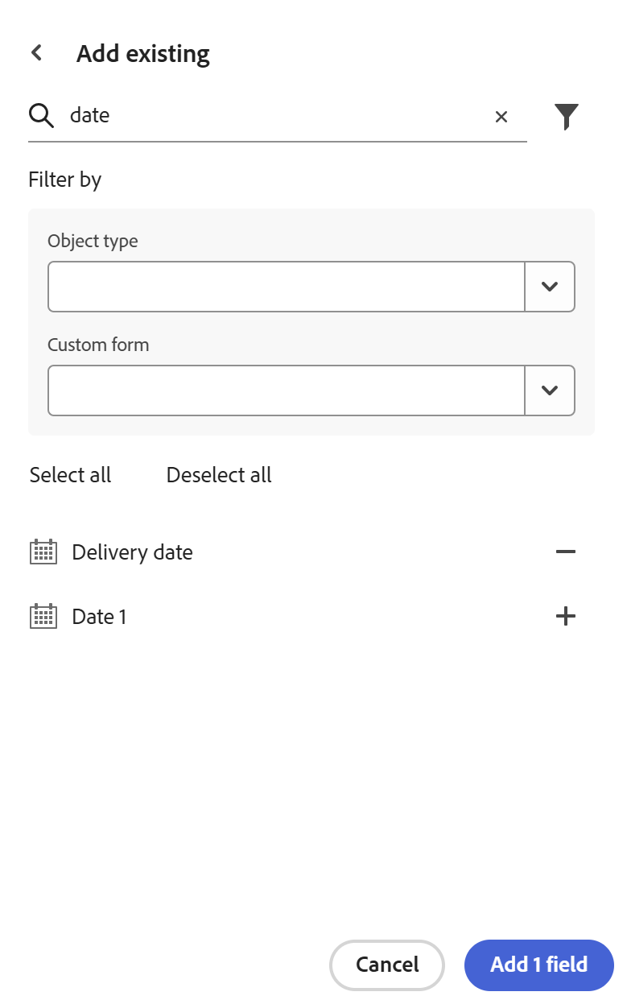

<!--Update this metadata when publishing this: 
---
title: Import Fields from Adobe Workfront
description: In Adobe Workfront Planning, you can create custom fields for each kind of record type. You can then associate the field with Workfront Planning records.
feature: Workfront Planning
role: User, Admin
author: Alina
recommendations: noDisplay, noCatalog
---
-->

<!--add to TOC-->

# Import fields from Adobe Workfront

The information on this page refers to functionality not yet generally available. It is available only in the Preview environment for all customers. After the monthly releases to Production, the same features are also available in the Production environment for customers who enabled fast releases.    

For information about fast releases, see [Enable or disable fast releases for your organization](/help/quicksilver/administration-and-setup/set-up-workfront/configure-system-defaults/enable-fast-release-process.md).    

{{planning-important-intro}}

You can import copies of existing Workfront fields. Importing fields from Workfront creates a copy of each field for a Workfront Planning record type. 

## Access requirements

+++ Expand to view access requirements for Workfront Planning. 

You must have the following access to perform the steps in this article:  

 <table style="table-layout:auto"> 
<col> 
</col> 
<col> 
</col> 
<tbody> 
    <tr> 
<tr> 
<td> 
   
 Products
 </td> 
   <td> 
   <ul><li>
 Adobe Workfront
</li> 
   <li>
 Adobe Workfront Planning
</li></ul></td> 
  </tr>   
<tr> 
   <td role="rowheader">
Adobe Workfront plan*
</td> 
   <td> 

Any of the following Workfront plans:
 
<ul><li>Select</li> 
<li>Prime</li> 
<li>Ultimate</li></ul> 

Workfront Planning is not available for legacy Workfront plans
 
   </td> 
<tr> 
   <td role="rowheader">
Adobe Workfront Planning package*
</td> 
   <td> 

Any 
 

For more information about what is included in each Workfront Planning plan, contact your Workfront account manager. 
 
   </td> 
 <tr> 
   <td role="rowheader">
Adobe Workfront platform
</td> 
   <td> 

Your organization's instance of Workfront must be onboarded to the Adobe Unified Experience to be able to access all the capabilities of Workfront Planning.
 

For more information, see <a href="/help/quicksilver/workfront-basics/navigate-workfront/workfront-navigation/adobe-unified-experience.md">Adobe Unified Experience for Workfront</a>. 
 
   </td> 
   </tr> 
  </tr> 
  <tr> 
   <td role="rowheader">
Adobe Workfront license*
</td> 
   <td>
 Standard 

   
Workfront Planning is not available for legacy Workfront licenses
 
  </td> 
  </tr> 
  <tr> 
   <td role="rowheader">
Access level configuration
</td> 
   <td> 
There are no access level controls for Adobe Workfront Planning
   
</td> 
  </tr> 
<tr> 
   <td role="rowheader">
Object permissions
</td> 
   <td>   
Manage permissions to a workspace</a> 
  
   
System Administrators have permissions to all workspaces, including the ones they did not create.
 </td> 
  </tr> 
<tr> 
   <td role="rowheader">
Layout template
</td> 
   <td> 
All users, including Workfront administrators,  must be assigned a layout template that includes the Planning area in the Main Menu. 
 </td> 
  </tr> 
</tbody> 
</table> 

 *For more information about Workfront access requirements, see [Access requirements in Workfront documentation](/help/quicksilver/administration-and-setup/add-users/access-levels-and-object-permissions/access-level-requirements-in-documentation.md).

+++   

## Considerations about importing fields from Workfront

* You can import native or custom Workfront fields to a record type in Workfront Planning. 
* Importing Workfront fields creates copies of the same fields and it preserves the field name in Workfront Planning. After they are copied to Workfront Planning, the fields are independent from the original Workfront fields and they do not share information.
<!--check this: * You do not need permissions or access to Workfront objects to be able to add their fields to Workfront Planning. -->
* You can add native or custom fields from the following Workfront objects:
    * Portfolio
    * Program
    * Project
    * Task
    * Issue
    * Document
    * Company
    * Group
    * User
    * Job Role
    * Assignment
    * Hour
    * Billing Record
    <!--Available only to Preview, but might not come to Prod:* Rate card-->
    * Expense
    * Iteration
    <!--* Non-labor resource-->
    <!--* Non-labour resource category-->
* Workfront fields might not preserve their field type, after they are imported in Workfront Planning. 

    The table below shows Workfront field types and their corresponding Workfront Planning field type.

    | Workfront field type                     | Workfront Planning field type |
    |------------------------------------------|-------------------------------|
    | Text-formatted single-line text          | Single-line text              |
    | Number-formatted single-line text        | Number                        |
    | Currency-formatted single-line text      | Currency                      |
    | Paragraph                                | Paragraph                     |
    | Text with formatting                     | Paragraph                     |
    | Single-select dropdown                   | Single-select                 |
    | Multi-select dropdown                    | Multi-select                  |
    | User typeahead Filters are not supported | People                        |
    | Calculated*                              | Formula                       |
    | Date                                     | Date                          |
    | Checkbox group                           | Multi-select                  |
    | Radio button                             | Multi-select                  | 

    *Calculated fields will be available at a later date.
    All other Workfront field types are not supported in Workfront Planning. 

## Import fields from Workfront

<!--the first 3 steps are the same as in Create fields-->

{{step1-to-planning}}

1. Click the workspace whose record types you want to create fields for.

    The workspace opens and the record types display. 

1. Click the card of a record type. 

    All existing records associated with the record type display in the rows of the table view. 

    >[!TIP]
    >
    >    Some fields might be hidden. Click **Fields** and enable the toggle for the fields you want to view as columns in the table view. 
   
1. Click the **+** icon in the upper-right corner of the table view

    Or
    
    Hover over the header of any column, click the downward-pointing arrow after the field name, then click **Insert left** or **Insert right** to add the new field.
1. Click **Add existing** in the lower-right corner of the **New field** tab. <!--check UI - did they change this??-->

    

1. Start typing the name of an existing Workfront field in the search area, then click **+** when it displays in the list. 
1. (Optional) Type another field, then click **+** when it displays in the list. 
1. (Optional) Click the **Filters** icon , then update one or both of the following fields: 

    * Object type: Select a Workfront object type whose fields you want to import. 
    * Custom form: Select one or several custom forms from Workfront. You may select a custom form without selecting an object type first. 
1. Click **+**, then **Add fields**.
    The fields are added to the table view and to the records' details pages. 

