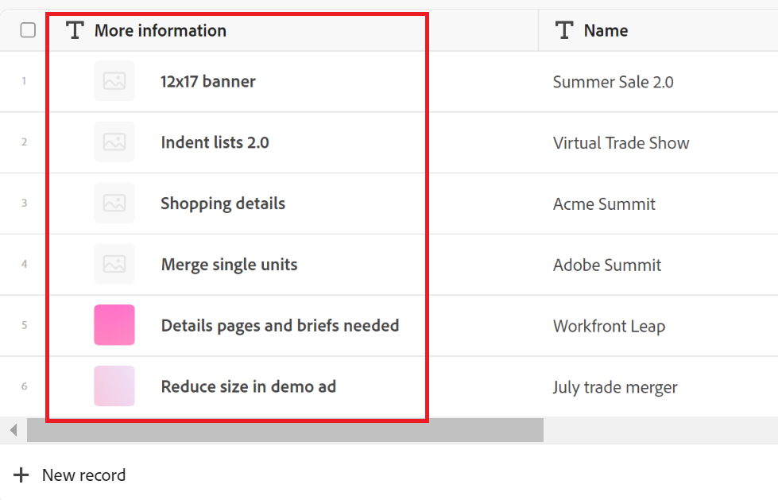

# Primary field overview

{{planning-important-intro}}

The primary field is the field that displays in the first column of a record type table view in Adobe Workfront Planning. 

By default, the Name field is the primary field. However, you can designate any fields of the following types as the primary fields of the records: 

* Single-line text field
* Number
* Formula

For information about how to designate a field as the primary field, see [Manage the table view](/help/quicksilver/planning/views/manage-the-table-view.md). 

## Overview of primary fields

* The information in the field designated as primary becomes a record's title. 

    >[!NOTE]
    >
    >    The names "primary field" and "record title" are synonymous in Workfront Planning. "Primary field" is preferred when viewing the record in the table view.

* A record's title displays in the following areas: 

    * The header area of the record's page and preview box
    * Connected record fields
    * Views
* You cannot move, hide, or delete the primary field in the table view, unless you designate another field as the primary field. 
* The primary field is always locked and it is not part of the horizontal scroll of the table view. 
* Changing the primary field in your table view affects the view for all other users who choose it.
* Changing the primary field in a table view affects all the table views of the record type. 
* The value listed in the primary field is always hyperlinked to the record's page.
* If you have Contribute or higher permissions to a workspace, you can edit the value of primary fields, except for formula fields. Formulas are calculations that update automatically.
