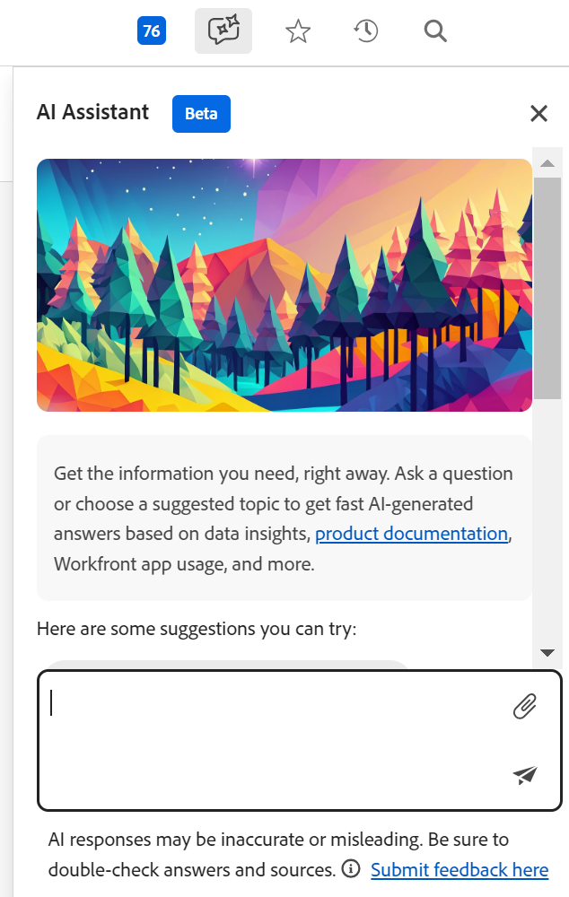

# Adobe Workfront Planning AI Assistant overview

<!-- update TOC and miniTOC when making this live-->

>[!IMPORTANT]
>
>The information in this article refers to Adobe Workfront Planning and to the Workfront AI Assistant (beta), which are new offerings from Adobe Workfront. 
>
>Currently, Workfront Planning is in an early access stage, and the Workfront AI Assistant is in a beta phase. 
>
>Workfront Planning and the AI Assistant (beta) are open to a limited number of customers. 
>
>You must be a Workfront customer to use these capabilities. 
>
>Your account representative will inform you if you are part of this stage.
>
>For more information, see [Adobe Workfront Planning overview](/help/quicksilver/planning/general/planning-overview.md).

You can use the AI Assistant to generate, update, or remove records based on the current page context and record structure. 

The user's commands and the AI's execution of those commands work together to ensure that changes made by the AI are accurately reflected in your environment. 

## Considerations about the AI Assistant

* The AI Assistant is available for Workfront administrators by default. 

* The Workfront administrator must enable the AI Assistant for all other users. For more information, see [Enable or disable AI Assistant](/help/quicksilver/workfront-basics/ai-assistant/enable-or-disable-assistant.md). 

* The AI Assistant works in the context of each page. The requests you are submitting for the AI Assistant must reference functionality that is available in the page that you have open. 

* The actions performed by the AI Assistant in the Planning area are in the context of your Workfront Planning permissions and your Workfront access level. For information, see the following articles: 

    * [Overview of sharing permissions in Adobe Workfront Planning](/help/quicksilver/planning/access/sharing-permissions-overview.md)
    * [License type overview when using Adobe Workfront Planning](/help/quicksilver/planning/access/license-type-overview.md)

* Changes made by the AI Assistant on the user's behalf are tracked in the record's history panel. 

* You can use commands to undo your actions. For example, you can type "Undo last change" to revert your change. 

## Functionality currently available for the AI Assistant

Currently, the AI Assistant is available in the Planning area of Workfront for the following pages:

* Workspace page
* Record type page
* Record page

You can use the AI Assistant to perform the following actions, at this time:

* Search for records. You can search by information contained in any record fields. 
* Create records. An ID with a link to the new record displays after the record is created. You can specify the fields you want to update during the creation process, like dates or description. 
* Create records based on a document that you upload. Workfront supports the following document formats for the AI Assistant:

    .pptx, .pdf, .docx, .xlsx, .ppt, .doc, .txt, and most image formats
* Update fields for the records you see on the screen
* Delete records
* Restore records that you just deleted

## Access the AI Assistant

1. Log in to Workfront, then go to the **Planning** area. 

1. Click a **workspace card**. 

1. (Optional) Click a **record type card**. 

1. (Optional) Click a **record** to open the record's **Details** page.

1. Click the **AI Assistant icon** in the upper-right corner of the screen in the global navigation bar. 

    

1. In the space provided, start typing commands for the AI Assistant, then click Enter when you are done. 

    

    For example, you may type one of the following:

    * Create a campaign with a start date of July 4 and end date of July 30
    * Update the Description field of the Summer Campaign record with date to be determined
    * Delete the last record
    * Restore the record 

    A visual indicator displays while the AI Assistant processes commands, setting expectations for response time.
    
    After receiving a successful response, follow the links provided or notice the changes on the left.
