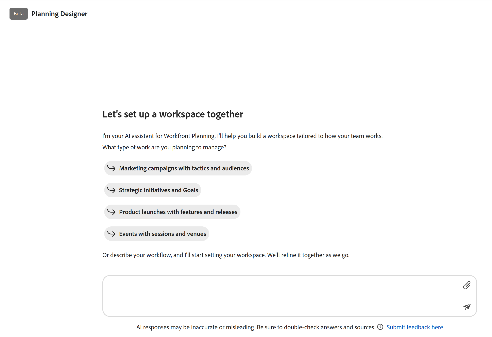
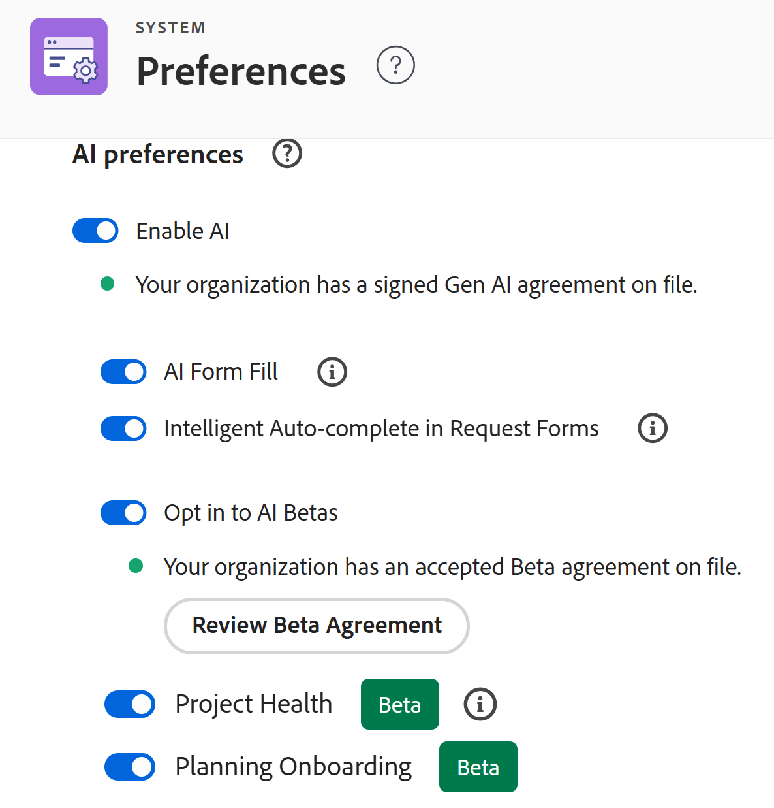

# Get started with the Adobe Workfront Planning Designer

<!--remove the Beta tags in the screen shots on this page when this is released to GA - maybe March 2, 2026-->

>[!IMPORTANT]
>
>The Planning Designer is currently only available for users participating in the Closed Beta program.
>
>The information in this article refers to Adobe Workfront Planning, an additional capability from Adobe Workfront. 
>
>For a list of requirements to access Workfront Planning, see [Adobe Workfront Planning access overview](/help/quicksilver/planning/access/access-overview.md). 
> 
>For general information about Workfront Planning, see [Get started with Adobe Workfront Planning](/help/quicksilver/planning/general/planning-overview.md).

You can use the Adobe Planning Designer powered by AI to configure your workspaces and data structures with ease. The Planning Designer supports everything from creating and configuring workspaces to defining fields and formulas, managing records, reviewing change history and building custom views. 

Whether used directly or through the AI Assistant, the Planning Designer provides a flexible, powerful environment for building and maintaining structured, connected information.

For information about Workfront Planning, see the following articles:

* [General information about Adobe Workfront Planning](/help/quicksilver/planning/planning-information.md)
* [Get started with Adobe Workfront Planning](/help/quicksilver/planning/general/planning-overview.md)
* [Adobe Workfront Planning access overview](/help/quicksilver/planning/access/access-overview.md)

## Access requirements <!--edit theses??-->

+++ Expand to view access requirements for the functionality in this article. 

<table style="table-layout:auto"> 
<col> 
</col> 
<col> 
</col> 
<tbody> 
<tr> 
   <td role="rowheader">
Adobe Workfront packages
</td> 
   <td> 

Any Workfront and Planning package

Any Workflow and Planning package

   </td> </tr>

  </tr> 
  <tr> 
   <td role="rowheader">
Adobe Workfront license
</td> 
   <td>
Standard
 
  </td> 
  </tr> 
  <tr> 
   <td role="rowheader">
Object permissions
</td> 
   <td>   
Manage permissions to a workspace</a> 
  
   
System Administrators have permissions to all workspaces, including the ones they did not create
  </td> 
  </tr>  
</tbody> 
</table> 

 For more information about Workfront access requirements, see [Access requirements in Workfront documentation](/help/quicksilver/administration-and-setup/add-users/access-levels-and-object-permissions/access-level-requirements-in-documentation.md).

+++

## Enroll in the Closed Beta program for the Planning Designer

Currently, you can request to participate in the Closed Beta program for the Planning Designer by sending us an email to sargism@adobe.com.

After we receive the email, our Engineering team will turn on the Planning Designer in your Workfront instance. 

>[!IMPORTANT]
>
>Your company must first accept the AI Assistant agreement before the Planning Designer is available in your system. 

## Submit feedback about the Planning Designer

You can submit feedback about the Planning Designer during the beta program. 

1. Log in to Workfront, then click the **Main Menu** icon  in the upper-left corner, then click **Planning**. 

    The **Planning** area opens. 

1. Click **Create with AI**. <!--update this tag name when they change it--> 

    The **Planning Designer** window opens.

1. Click **Submit feedback here** at the bottom of the page.
1. Add your feedback in the space provided, then click **Submit**.
    Your feedback is submitted to the Engineering and Product teams. 

## Considerations about the Planning Designer

* To use the Planning Designer, you first need to turn on the AI Assistant for your organization. The following must be in place for the AI Assistant to be available to everyone in your organization:

    * Workfront must make the AI Assistant available for your organization.

        For details, see [Prerequisites to AI Assistant](/help/quicksilver/workfront-basics/ai-assistant/ai-assistant-overview.md#prerequisites-to-ai-assistant).
    * After Workfront makes the AI Assistant available for your organization, the main Workfront administrator can access it. 

        For information, see [Configure basic information for your system](/help/quicksilver/administration-and-setup/get-started-wf-administration/configure-basic-info.md). 
    * The Workfront administrator must accept the AI Assistant agreement, and then turn on the AI Assistant for all other users.

        For more information, see [Enable or disable AI Assistant](/help/quicksilver/workfront-basics/ai-assistant/enable-or-disable-assistant.md). 
* After your System Administrator turned on the AI Assistant for your organization, the Planning Designer is available for all users, by default, if it has been made available for your organization.
* Actions performed by the Planning Designer can also be performed by the AI Assistant, when you use it in the Planning area.
* The actions performed by the AI Assistant in the Planning area or those performed by the Planning Designer are in the context of your Workfront Planning permissions and your Workfront access level. 

    For information, see the following articles: 

    * [Overview of sharing permissions in Adobe Workfront Planning](/help/quicksilver/planning/access/sharing-permissions-overview.md)
    * [License type overview when using Adobe Workfront Planning](/help/quicksilver/planning/access/license-type-overview.md)

* Changes made by the AI Assistant or the Planning Designer on the user's behalf are tracked in the record's history panel. 

* Actions done by the Planning Designer are permanent and could be irreversible. For example, deleting a field cannot be reversed. Review all actions that are proposed by the Designer before accepting them.

    >[!IMPORTANT]
    >
    >When creating, updating, or deleting an object through the Planning Designer, the prompt will ask for confirmation only for the actions that are irreversible. For example, deleting a record type or a workspace is irreversible. Deleting a record is not. The Planning Designer will ask for confirmation only when trying to delete a record type or workspace. 

* When you create workspaces and record types using the Planning Designer, views and fields are also created automatically. 

## Functionality currently available for the Planning Designer

You can use either the Planning Designer or the AI Assistant to perform any of the following actions: 

* Create and configure workspaces 

<!--On March 2: * Edit workspaces-->

* Create record types, including defining and adding global record types to workspaces

* Design fields or formula fields 

* Create, delete, duplicate, and restore records 

* Edit, update, append a field in a record 

* Link records to other records 

* Access record change history 

* Build custom views 

* Create records by importing a document

    For example, you can upload a picture of an org chart in your company, and the Planning Designer can create a workspace based on it.
    
    Creating objects from an imported document is available only in the Planning Designer, and not in the AI Assistant.

    >[!IMPORTANT]
    >
    >Although we support .XLSX and .CSV file types, they cannot be used for large-scale record import through the Planning Designer.
    >If you need to import a substantial number of records at this time, we recommend that you do so by using the manual capabilities available in Planning.
    >
    >For more information, see [Create records by importing information from a CSV or Excel file](/help/quicksilver/planning/records/import-file-to-create-records.md).
    >For file type limitations, see the "Get suggestions based on a document you upload" section in the [Use Form Fill powered by AI to fill in a request using prompts or documents](/help/quicksilver/manage-work/requests/create-requests/autofill-from-prompt-document.md). 

    <!--* Generate thumbnail and over image for a record (not available yet, maybe Q2) -->

## Create or update objects using the Planning Designer

You can create or update objects in Workfront Planning either by using the Planning Designer, or the AI Assistant, unless otherwise specified. 

1. Log in to Workfront, then click the **Main Menu** icon  in the upper-left corner, then click **Planning**. 

    The **Planning** area opens. <!--update screen shot when they change the name of the button-->

    

1. Click **Create with AI**. <!--update this when they change it to Generate with AI--> 

    The **Planning Designer** window opens. <!--remove the Beta tag here when this removes from Beta-->

    

1. In the space provided, start typing prompts for the AI Assistant, then click Enter when you are done. 

    <!--add screen shot-->

    For example, you may type prompts similar to the ones below:

    * Create and configure a workspace with five record types to manage campaigns

    * Create marketing campaigns for every month of the current year

    * Add a campaign field for Status for the Marketing Design workspace

    * Delete all records in a Status of Stale

    * Update all Planning campaigns to a status of Active

    * Connect Campaigns to Personas in the Marketing Design workspace 

    * Display the change history for the "Valentine's Day" campaign 

    * Build a timeline view for campaigns in the Marketing Design workspace

    * Create records by importing a document. Creating records from an imported document is available only in the Planning Designer, and not in the AI Assistant. 

    <!--* Generate thumbnail and over image for a record (not available yet, maybe Q2) -->
    
1. After receiving a successful response, follow the links provided in the prompt area to create, update or review the object of your request. 

    When you agree to create your objects, your changes display to the right of the prompt area. 

    You can view workspaces, record types, fields, views and records in the preview area to the right of the prompt. 

    >[!TIP]
    >
    >Some objects are created immediately, without need for confirmation. 

1. (Optional) Type additional prompts to edit your objects further.
1. (Optional) Click the **Show or hide preview screen** icon  to open or close the preview screen on the right.
1. Click the **Open workspace in new tab icon**  to open the workspace you're updating in a new tab. 
1. Click the **Close** icon **X** to close the Planning Designer and open the Workspaces area. 
1. Open the  workspace you edited using the Planning Designer and make further changes to its objects.

<!-- for March 2 -- replace the last step with this: 
1. (Optional) To edit a workspace, do one of the following:

    * Open the workspace and manually make changes to it. For information, see [Edit workspaces](/help/quicksilver/planning/architecture/edit-workspaces.md). 
    * Click **Edit with AI**. This opens the Planning Designer. Repeat the steps above to use AI and make further changes to the workspace.-->

## Turn off the Planing Designer for your organization

After your Workfront administrator accepts the AI Assistant agreement, the Planning Designer is turned on for everyone in your organization, by default. 

To turn it off: 

1. Log in to Workfront as a System Administrator. 
1. Click **Main Menu**  in the upper-left corner of the screen, then click **Setup**.
1. Click **System** >  in the left panel, then go to the **AI preferences** area.
1. Turn off the **Planning Onboarding** setting. <!--add new screen shot with info icon and new name of the toggle; ensure you don't show the AI Reviewer if it is not in Prod yet-->

     
1. Click **Save**.

    This removes the Planning Designer for all users in the system.
