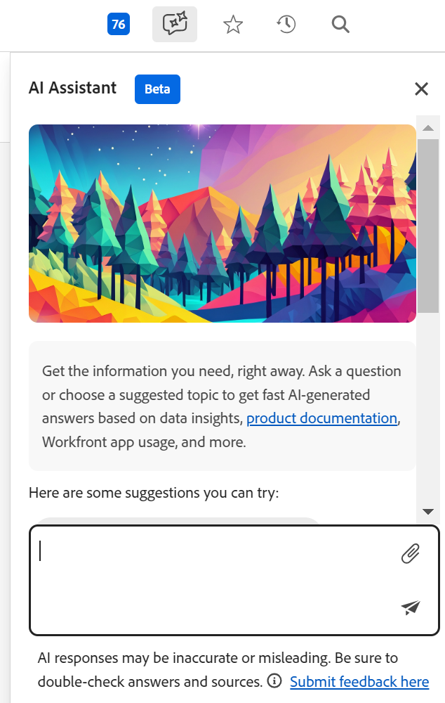

# Adobe Workfront Planning CX Coworker overview

The information on this page refers to functionality not yet generally available. It is available only in the Preview environment for all customers. After the release to Preview, the same features are also available monthly in the Production environment for customers who enabled fast releases.    

For information about fast releases, see [Enable or disable fast releases for your organization](/help/quicksilver/administration-and-setup/set-up-workfront/configure-system-defaults/enable-fast-release-process.md). 

{{planning-important-intro}}

The CX Coworker is a conversational interface where you describe a goal in plain language, and then it plans, executes, and validates the work across your Adobe and connected systems before bringing it back for your approval. 

The CX Coworker preserves everything AI Assistant does today while adding more powerful end-to-end capabilities in both a new full-screen experience and the Workfront right rail. 

It operates within your organization's existing product-level access controls, so users can only take actions they're already permitted to in Workfront, with read-only access by default and write access controlled by Workfront administrators.

## Access requirements

+++ Expand to view access requirements for the functionality in this article. 

<table style="table-layout:auto"> 
<col> 
</col> 
<col> 
</col> 
<tbody> 
<tr> 
   <td role="rowheader">
Adobe Workfront packages
</td> 
   <td> 

Any Workfront or Workflow with a Planning package

Or

Any Planning package when purchased as a standalone product

   </td> </tr>
 <tr> 
   <td role="rowheader">
Adobe Workfront license
</td> 
   <td>
Standard

   </td> 
  </tr> 
<tr> 
   <td role="rowheader">
Adobe Planning license
</td> 
   <td>
Standard

   </td> 
  </tr> 
<tr> 
   <td role="rowheader">
Access level configuration
</td> 
   <td>  
   
Your administrator must do the following to allow access to the CX Coworker in Planning:

   <ul>
   <li>
Add both a Workflow and a Planning license type to your access level when you have both a Workflow and a Planning package
</li>
   <li>
Deselect Disable the CX Coworker panel in Workfront setting in your access level. It is selected by default.
</li></ul>
</td> 
  </tr> 
  <tr> 
   <td role="rowheader">
Object permissions
</td> 
   <td>   
Manage permissions to a workspace</a> 
  
   
System Administrators have permissions to all workspaces, including the ones they did not create
  </td> 
  </tr>  

  <tr> 
   <td role="rowheader">
System settings
</td> 
   <td>   
Your Workfront administrator must select the Read-only and Write-only MCP tools in the System Preferences area of Setup. The Read-only MCP tools is selected by default.
 
    </td> 
  </tr> 
</tbody> 
</table> 

 For more information about Workfront access requirements, see [Access requirements in Workfront documentation](/help/quicksilver/administration-and-setup/add-users/access-levels-and-object-permissions/access-level-requirements-in-documentation.md).

+++

## Considerations for the the CX Coworker

* The CX Coworker must be enabled for your organization before  it is available for users in your company. 

  For information, see [CX Coworker overview](/help/quicksilver/workfront-basics/coworker-in-workfront/coworker-overview.md). 

* After Workfront has enabled the agent for your organization, it is available for the main Workfront administrator. For information, see [Configure basic information for your system](/help/quicksilver/administration-and-setup/get-started-wf-administration/configure-basic-info.md). 

* The Workfront administrator must enable the AI Assistant for all other users. For more information, see [Enable or disable AI Assistant](/help/quicksilver/workfront-basics/ai-assistant/enable-or-disable-assistant.md). 

* The AI Assistant works in the context of each page. The requests you are submitting for the AI Assistant must reference functionality that is available in the page that you have open. 

* The actions performed by the AI Assistant in the Planning area are in the context of your Workfront Planning permissions and your Workfront access level. For information, see the following articles: 

    * [Overview of sharing permissions in Adobe Workfront Planning](/help/quicksilver/planning/access/sharing-permissions-overview.md)
    * [License type overview when using Adobe Workfront Planning](/help/quicksilver/planning/access/license-type-overview.md)

* Changes made by the AI Assistant on the user's behalf are tracked in the record's history panel. 

* Actions done by the AI Assistant are permanent and could be irreversible. For example, deleting a field cannot be reversed. Review all actions that are proposed by the AI Assistant before accepting them.

* When creating, updating, or deleting an object through AI Assistant, AI Assistant displays the intended actions and asks for confirmation. You can then confirm or cancel the actions. 

## Functionality currently available for the AI Assistant

Currently, the AI Assistant is available in the Planning area of Workfront for the following pages:

* Workspace page
* Record type page
* Record page

You can use the AI Assistant to perform the following actions, at this time:

* Search for records. You can search by information contained in any record fields. 
* Create records. An ID with a link to the new record displays after the record is created. You can specify the fields you want to update during the creation process, like dates or description. 
* Create records based on a document that you upload. Workfront supports the following document formats for the AI Assistant:

    PPTX, PDF, DOCX, XLSX, PPT, DOC, TXT, and most image formats
* Update fields for the records you see on the screen
* Delete records
* Restore records that you just deleted

## Locate the AI Assistant in Workfront Planning

You can locate the AI Assistant in the following areas of Workfront Planning:

* The main navigation bar, in the upper-right corner of the screen.
* Inside the details area of a record, after you opened the record in the preview or after you opened the record's page.

## Access the AI Assistant in the Planning area

1. Log in to Workfront, then click the **Main Menu** icon  in the upper-left corner, then click **Planning**. 

    The Planning area opens. 

1. Click a **workspace card**. 

1. (Optional) Click a **record type card**. 

1. (Optional) Click a **record** to open the record's **Details** page.

1. Click the **AI Assistant icon** in the upper-right corner of the screen in the global navigation bar or in the upper-right corner of the record's preview or page.

    

1. In the space provided, start typing commands for the AI Assistant, then click Enter when you are done. 

    

    For example, you may type one of the following:

    * Create a campaign with a start date of July 4 and end date of July 30
    * Update the Description field of the Summer Campaign record with date to be determined
    * Delete the last record
    * Restore the record 

    A visual indicator displays while the AI Assistant processes commands, setting expectations for response time.
    
    After receiving a successful response, follow the links provided or notice the changes on the left.

