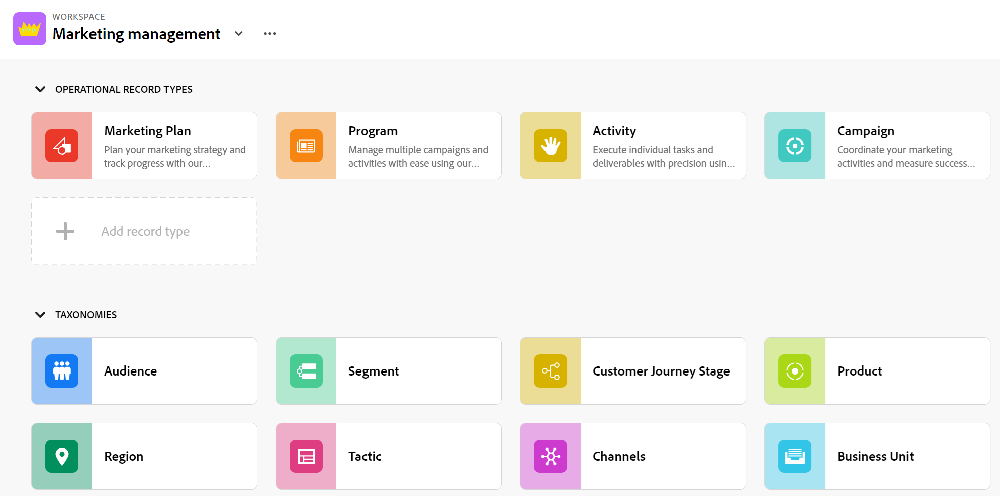
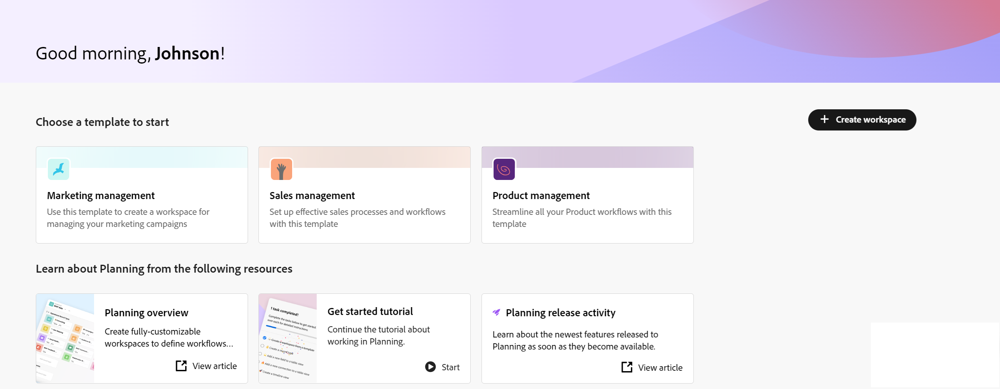
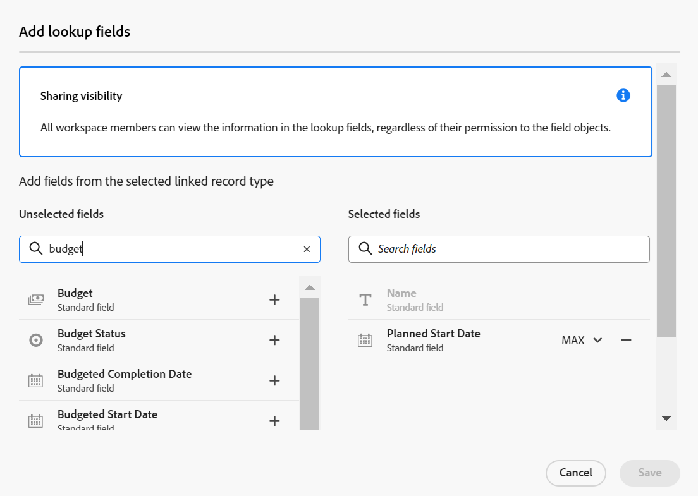
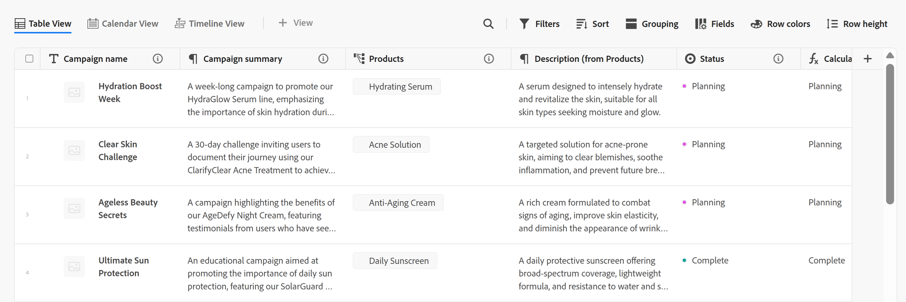
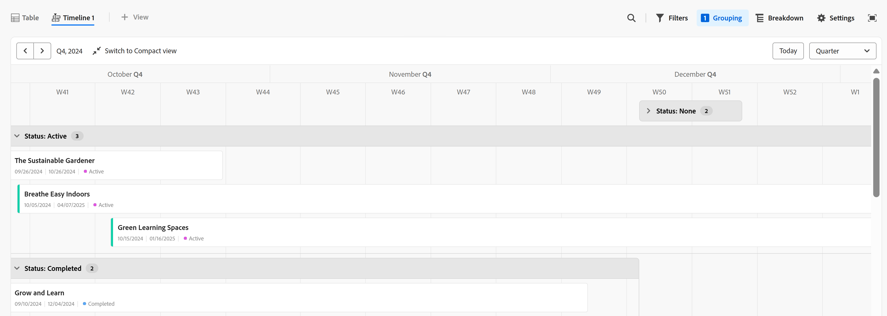
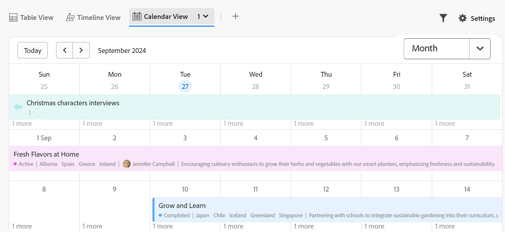

# Adobe Workfront Planning overview

<!--this article is linked to the WF Planning landing page - do not change URL or move it-->

<!--update the metadata with real information when making this available in TOC and in the left nav-->

<!-- remove the references to closed beta from the entire article-->

<!--update the video in the IMPORTANT below, when we have something better, especially after Open Beta - remove it-->

>[!IMPORTANT]
>
>The information in this article refers to Adobe Workfront Planning, a new offering from Adobe Workfront. 
>
>Currently, Adobe Workfront Planning is part of a beta program which is open to a limited number of customers. You must be a Workfront customer to use these capabilities.
>
>Contact your account representative for more information about joining the beta program for Workfront Planning.
>
>For a complete list of all sections and articles that document Workfront Planning, see [Adobe Workfront Planning: article index](/help/quicksilver/maestro/planning-information.md). 

<!--[View a video demonstration of Adobe Workfront Planning capabilities.](https://video.tv.adobe.com/v/3424253/){target=_blank}-->

## Introduction to Adobe Workfront Planning

Adobe Workfront Planning is a new offering from Adobe Workfront. The purpose of Workfront Planning is to unlock comprehensive visibility into the operational details of an organization, and answer critical business questions at each stage of the work management lifecycle. 

Teams and leadership need clear answers to questions like:  

* How many campaigns are we running in EMEA for Q4?
* Do we have any audience overlaps between concurrent campaigns?
* How well are the awareness programs doing right now?
* What do the assets look like for a particular campaign? Which of them must still be approved?

To answer these questions, leadership needs a solution that can provide a holistic view of every stage of work from planning to execution, from delivery to measuring the results. Currently, organizations have tools that can cover some parts of the process, but many do not have good connections to all phases of work, nor can they reliably provide results.  

The following are some of the main capabilities:

* Solve the problem of managing work across all stages and for all the stakeholders that participate in the work process.  
* Fully customize your workflows, from deciding what object types (or record types) your organization uses to configuring how these objects link to one another.  
* Link to object types from other systems, creating a coherent framework for all your processes.  

## Currently available Adobe Workfront Planning features

The following table illustrates the main features that will be available in Workfront Planning, and a timeline of their availability. The list does not include all features.

For information about new features and when they are released, see [Adobe Workfront Planning release activity](/help/quicksilver/maestro/general/release-activity.md). 

|       Feature                                      |     Available now  |     Available soon   |     In research  |
|----------------------------------------------------|:-----------------------------:|:--------------------------------:|:----------------:|
|     Create workspaces                              |   ✓                           |                                  |                  |
|     Create record types                |   ✓                           |                                  |                  |
|     Create record custom fields                    |   ✓                           |                                  |                  |
|     Import record types and fields using an Excel  or CSV file*                              |   ✓                           |                                  |                  |
|     Link records                                   |   ✓                           |                                  |                  |
|     View records in a table                        |   ✓                           |                                  |                  |
|     View records in a timeline                     |   ✓                           |                                  |                  |
|     View records in a calendar                     |   ✓                           |                                  |                  |
|     Filter records                                 |   ✓                           |                                  |                  |
|     Group records in the timeline view             |   ✓                           |                                  |                  |
|     Group records in the table view                | ✓                              |                                 |                  |
|     Sort records in the table view                                 |  ✓                             |                                 |                  |
|     Sort records in the timeline view                                 |                               |   ✓                              |                  |
|     Sort groupings in the table view                                 |                               |   ✓                              |                  |
|     Sort groupings in the timeline view                                 |                               |   ✓                              |                  |
|     Connect workspaces                                |                               |   ✓                              |                  |
|   Search for records in the table view    | ✓    |   |
|   Search for records in the timeline view    | ✓    |   |
|     Connect Workfront Planning records to Workfront projects, programs, portfolios, companies, groups  |   ✓                            |                                 |                  |
|     Connect Workfront Planning records to Adobe Experience Manager assets                                  |      ✓                         |                                  |                 | 
|     Record page with detailed information                            |   ✓                           |                                  |                  |
|     Update the layout of the record's page              |    ✓                           |                                 |                  |
|  Share workspaces | ✓| |  |
|  Share views |✓ | |  |
|  Duplicate views |✓ | |  |
|     Submit requests                                |                               |                                  |   ✓              |
|     Creative brief                                 |                               |                                  |   ✓              |
|     Customize the color and icon of a record                                 |      ✓                         |                                  |                 |
|     Add comments to records                                 | ✓                              |                                  |                 |
|     Receive in-app notifications                                 | ✓                              |                                  |                 |
|     Receive email notifications                                 | ✓                              |                                  |                 |
|     Add thumbnails to records                                 | ✓                              |                                  |                 |
|     View history of changes on a record                                 | ✓                              |                                  |                 |
|     Rich Text formatting for Paragraph fields                                 |      ✓                         |                                  |                 | 
|     Adobe Workfront Planning modules for Adobe Workfront Fusion                                 |      ✓                         |                                  |                 | 
|     Copy and paste information from one field to another                                  |      ✓                         |                                  |                 | 

## Enable Adobe Workfront Planning for the users in your Workfront instance

Your organization must enroll in the Adobe Workfront Planning closed beta program before you can access the planning capabilities. Contact your account representative for information about enrolling in the beta program. 

For more information about granting access to and enabling others to use Workfront Planning, see [Access overview](/help/quicksilver/planning/access/access-overview.md). 

## Adobe Workfront Planning terminology

Although Workfront Planning is part of Workfront, it comes with proprietary concepts and terminology. Ensure you are familiar with the new concepts before embarking on setting up Workfront Planning for your organization. 

The framework for Workfront Planning is fully customizable. You can create all record types, their attributes, and any fields associated with them to suit the exact needs of your organization. 

The following are the main Workfront Planning objects and concepts: 

* **Workspace**: A collection of record types that define the operational lifecycle of a certain organization. A workspace is the work frame of an organizational unit. 

    One Workfront instance can have a maximum of 1,000 workspaces.

     
    
    For more information, see [Create workspaces](/help/quicksilver/planning/architecture/create-workspaces.md). 

* **Record Type**: The object type or Workfront Planning.  
    
    Unlike Workfront, where the object types are predefined, in Workfront Planning, you can create your own object types.  
    
    For example, in Workfront the object types of Program, Portfolio, Project, Task, or Issue are already created.  
    
    In Workfront Planning, you can create any record types that meet your organization's workflows. Later, you can define how the record types relate to one another or form dependencies. 
    
    For more information, see [Record types overview](/help/quicksilver/maestro/architecture/overview-of-record-types.md).

* **Record**: An instance of a record type. 

    
       
    After adding a record type to a workspace, you can start adding records of that type on the record type's page. 

    For example, "Campaign" can be a record type and "Summer Campaign for EMEA" is a record of the Campaign record type
        
    For more information, see [Create records](/help/quicksilver/planning/records/create-records.md).

* **Workspace template**: You can create a workspace using predefined templates. You can use the predefined record types and fields that come in a template, or you can add your own. 

    

    Adobe Workfront Planning comes with a Sales, Marketing, and Product Management workspace template. 
    
    For more information, see [Create workspaces](/help/quicksilver/planning/architecture/create-workspaces.md).

* **Fields**: Fields are attributes that you can add to record types. Fields contain information about the record type. <!--check the shot below, "Connection" needs to be in lowercase-->

    

    Considerations about record fields:
    
    * The fields you add for a record type automatically become associated with all records of that type and can be used to capture data about those records. 

    * Fields display as columns in the Table view applied to a record  type page. They also display in the record's page. 

    * Fields are unique to a record type and do not transfer from one record type to another. 

    * Fields are fully customizable and are accessible only in Workfront Planning. You cannot access Workfront Planning fields from Workfront. 

    For more information, see [Create fields](/help/quicksilver/planning/fields/create-fields.md).
    
    A new record type is associated with the following predefined fields, by default: 

    * Name
    * Description
    * Start Date
    * End Date
    * Status

    You can create custom fields of the following types:  

    * Single-line text 
    * Paragraph   
    * Multi-select 
    * Single-select 
    * Date 
    * Number 
    * Percentage 
    * Currency
    * Checkbox 
    * Formula 
    * People
    * Created by
    * Created date
    * Last modified by
    * Last modified date
   
* **Linked record types**, **Linked records**, and **Linked record fields** or **Connected record types**, **Connected records**, and **Connected fields**:  You can create a connection between the following entities in Workfront Planning:
    
    * Two record types.
    * A record type and a Workfront project, program, portfolio, company, or group object type. 
    * A record type and an Adobe Experience Manager asset or folder. 

        You must have an Adobe Experience Manager license to link record types with Experience Manager objects.

        

    After you establish a connection between the record types, you can connect individual records of those types to one another. The connection between the records displays as a linked record field.

* **Linked fields** (or lookup fields): After you establish the connection between two record types and you link individual records together, you can reference the linked records' fields on the record you are connecting from.

    For example, if you connect a Campaign record type with a Workfront Project object type, you can display the Project Owner field of connected projects on the campaign records. 

    

    For information about linking record types, records, and creating linked fields, see the following articles:

    * [Connect record types](/help/quicksilver/planning/architecture/connect-record-types.md)
    * [Connect records](/help/quicksilver/planning/records/connect-records.md)

<!--not yet:* Fields are reusable across Record Types.  -->

* **Views**: Records display under their respective record type page in different types of views.

    

    Views contain personalized settings of a specific view type, such as the list of fields (columns), a list of records (rows), their order (sort), an applied or applicable filter and grouping.  
    
    The following are view types that you can apply to the record type page: 

    * **Table view**: Displays records and their fields in a table format. The rows of the table are the individual records, and the columns are the record fields. This is the default view. 

        

    * **Timeline view**: Displays records that have at least two Date-type fields in a chronological timeline. 

        

    * **Calendar view**: Displays records that have at least two Date-type fields in a calendar format. 
    

For more information, see [Manage record views](/help/quicksilver/planning/views/manage-record-views.md).

## Adobe Workfront Planning object limitations

The following table shows the limits for how many objects you can create in Workfront Planning. The limitations are subject to change as we move into the next phases of development. 

<!--consider making the table view a stand-alone article when we go to GA-->

|       Adobe Workfront Planning  object                                                          |                                                        Limit                                                    |
|-------------------------------------------------------------------------------|:---------------------------------------------------------------------------------------------------------------:|
|     Number of Workspaces for one Workfront instance                                      |   1,000                                                                                                         |
|     Number of sections for one workspace                                      |   50                                                                                                         |
|     Number of Record Types for one workspace                                            |   1,000 (this includes record types from all sections and those that are created when using a workspace template)  |
|     Number of records for one record type                                               |   50,000                                                                                                        |
|     Number of fields for one record type or taxonomy                            |   500                                                                                                           |
|     Number of characters for a text field                                                               |   1,000 characters                                                                                              |
|     Size of file that you can paste in a record type table                    |   1MB                                                                                                           |
|     Size of file that you can import through the API for a record type table  |   1.5MB                                                                                                         |
|     The rate at which API requests can be made                                    |   200 requests per minute                                                                                       |
| Size of CSV of Excel file you can import* | 5MB |
| Number of views one user can create for one record type | 100 |

<!--add to the table above: Maximum number of views created by one use 100 -->

>[!IMPORTANT]
>
>*This functionality has been temporarily disabled and it will be available at a later date.

## Locate Adobe Workfront Planning

Ensure that your organization has received access to Workfront Planning and that your system or group administrator has added the Planning area to your Main Menu. For information, see [Access overview](/help/quicksilver/planning/access/access-overview.md).

To locate Workfront Planning:   

1. Log in to Adobe Workfront. 

1. Click the **Main Menu**  in the upper-right corner, or click the **Main Menu**  in the upper-left corner, if it's available. 

1. Click **Planning** .

    The Workspaces area opens.

1. (Optional and recommended) Continue with some of the following actions, to build your work structure: 

    1. Create a workspace from scratch or using a template. 

    1. Add sections to the new workspace. 
    1. Rename the existing sections in the new workspace. 
    1. Add record types to the new workspace. 

    1. Click the name of a record type to open the record type's page. The record type page opens in the Table view, by default.

        You can also create a Timeline or a Calendar view. 
    
    1. In the table view, start adding records by adding rows

        Or

        Start adding record fields by adding columns. 

## Adobe Workfront Planning release activity 

We are releasing new features to Workfront Planning regularly. 

For an up-to-date list of released features, see [Adobe Workfront Planning release activity](/help/quicksilver/maestro/general/release-activity.md)

