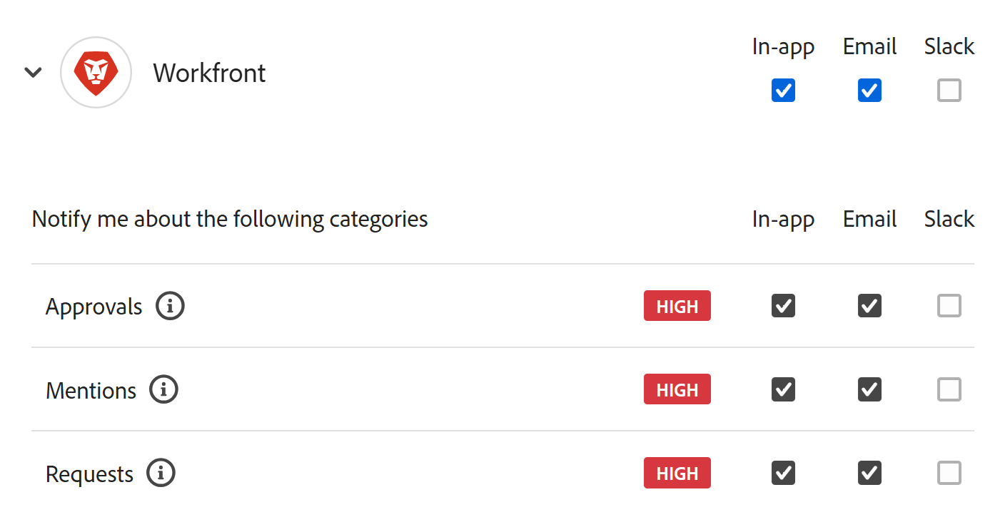

# Manage Adobe Workfront Planning notification preferences 

{{planning-important-intro}}

You may receive in-app or email notification when the following actions occur in Workfront Planning: 

* Someone adds you to a comment on the record page
* Someone asks for permission to access a view or a workspace
* Someone grants you permission to access a view or a workspace <!--I could not test this but Isk confirmed-->

## Access requirements

+++ Expand to view access requirements for Workfront Planning. 

You must have the following to be able to access Workfront Planning:  

 <table style="table-layout:auto"> 
<col> 
</col> 
<col> 
</col> 
<tbody> 
    <tr> 
<tr> 
<td> 
   
 Products
 </td> 
   <td> 
   <ul><li>
 Adobe Workfront
</li> 
   <li>
 Adobe Workfront Planning
</li></ul></td> 
  </tr>   
<tr> 
   <td role="rowheader">
Adobe Workfront plan*
</td> 
   <td> 

Any of the following Workfront plans:
 
<ul><li>Select</li> 
<li>Prime</li> 
<li>Ultimate</li></ul> 

Workfront Planning is not available for legacy Workfront plans
 
   </td> 
<tr> 
   <td role="rowheader">
Adobe Workfront Planning plan*
</td> 
   <td> 

Any 
 

For more information about what is included in each Workfront Planning plan, see <a href="https://business.adobe.com/products/workfront/pricing.html">Adobe Workfront pricing and packaging</a>. 
 
   </td> 
 <tr> 
   <td role="rowheader">
Adobe Workfront platform
</td> 
   <td> 

Your organization's instance of Workfront must be onboarded to the Adobe Unified Experience.
 

For more information, see <a href="/help/quicksilver/workfront-basics/navigate-workfront/workfront-navigation/adobe-unified-experience.md">Adobe Unified Experience for Workfront</a>. 
 
   </td> 
   </tr> 
  </tr> 
  <tr> 
   <td role="rowheader">
Adobe Workfront license*
</td> 
   <td>

Standard, Light, or Contributor
   
Workfront Planning is not available for legacy Workfront licenses
 
  </td> 
  </tr> 
  <tr> 
   <td role="rowheader">
Access level configuration
</td> 
   <td> 
There are no access level controls for Adobe Workfront Planning
   
</td> 
  </tr> 
<tr> 
   <td role="rowheader">
Object permissions
</td> 
   <td>   
View or higher permissions to a workspace</a> 
  
   
System Administrators have permissions to all workspaces, including the ones they did not create
 </td> 
  </tr> 
<tr> 
   <td role="rowheader">
Layout template
</td> 
   <td> 
All users, including Workfront administrators,  must be assigned a layout template that includes the Planning area in the Main Menu. 
 </td> 
  </tr> 
</tbody> 
</table> 

 *For more information about Workfront access requirements, see [Access requirements in Workfront documentation](/help/quicksilver/administration-and-setup/add-users/access-levels-and-object-permissions/access-level-requirements-in-documentation.md).

+++   

For more information about Workfront Planning notifications, also see the following articles: 
    
* For information about comments on records, see [Manage record comments](/help/quicksilver/planning/records/manage-record-comments.md). 
* For information about in-app notifications from Workfront Planning, see [Manage in-app notifications for Adobe Workfront Planning](/help/quicksilver/planning/notifications/manage-planning-in-app-notifications.md).
* For information about email notifications from Workfront Planning, see [Manage email notifications for Adobe Workfront Planning](/help/quicksilver/planning/notifications/manage-planning-email-notifications.md). 
<!--

OLD: 

<table style="table-layout:auto">
 <col>
 </col>
 <col>
 </col>
 <tbody>
    <tr>
<tr>
<td>
   
 Product
 </td>
   <td>
   
 Adobe Workfront
 
   
In order to receive in-app notifications from Workfront Planning and manage notification preferences, your organization's instance of Workfront must be onboarded to the Adobe Unified Experience. For information, see <a href="/help/quicksilver/workfront-basics/navigate-workfront/workfront-navigation/adobe-unified-experience.md">Adobe Unified Experience for Workfront</a>.

   </td>
  </tr>  
 <td role="rowheader">
Adobe Workfront agreement
</td>
   <td>

Your organization must be enrolled in the early access stage for Workfront Planning 

   </td>
  </tr>
  <tr>
   <td role="rowheader">
Adobe Workfront plan
</td>
   <td>

Any

   </td>
  </tr>
  <tr>
   <td role="rowheader">
Adobe Workfront license
</td>
   <td>
   
Any
 
  </td>
  </tr>
  
  <tr>
   <td role="rowheader">
Access level configuration
</td>
   <td> 
There are no access level controls in Workfront Planning. 
  
</td>
  </tr>
<tr>
   <td role="rowheader">
Permissions
</td>
   <td> 
View or higher permissions to a workspace</a> 
  
   
System Administrators have permissions to all workspaces, including the ones they did not create

</td>
  </tr>

<tr>
   <td role="rowheader">
Layout template
</td>
   <td> 
Your Workfront or group administrator must add the Planning area in your layout template. For information, see <a href="/help/quicksilver/planning/access/access-overview.md">Access overview</a>. 
  
</td>
  </tr>
 </tbody>
</table>
-->

## Manage notification preferences  

1. Log in to Workfront with your Adobe Experience Cloud credentials. 
1. Click the **account menu** icon  in the upper-right of the screen, then click **Preferences**.
1. Under the **Notifications** section, click **Workfront**.
1. Select the notifications you want to receive.
   Or
   Deselect the notifications you want to stop receiving.

   
1. The following notifications are available for Workfront:

   * **Mentions**: You receive a notification when someone tags you in a comment in Workfront Planning
   * **Requests**: You receive a notification when someone requests or grants you permission to a Workfront Planning object

   For more information about managing notifications, see [Account preferences and notifications](https://experienceleague.adobe.com/en/docs/core-services/interface/features/account-preferences).

<!--OLD: notifications are not available to non-IMS customers: 

When someone adds you to a comment in the record page, you may receive an in-app as well as an email notification about the comment. 

The following scenarios exist:   

* Adobe Unified Experience customers receive both an in-app notification and an email notification. They can manage their in-app and email notification preferences in the Preferences area of their Adobe Experience Cloud profile for the Workfront product. 

    For more information, see [Account preferences and notifications](https://experienceleague.adobe.com/en/docs/core-services/interface/features/account-preferences).

* Customers who are not on the Adobe Unified Experience receive only an email notification. They cannot manage their email notifications preferences and will always receive an email when someone adds them to a comment on a record in Workfront Planning.   

-->
