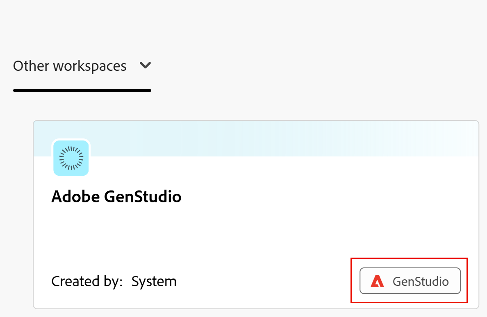
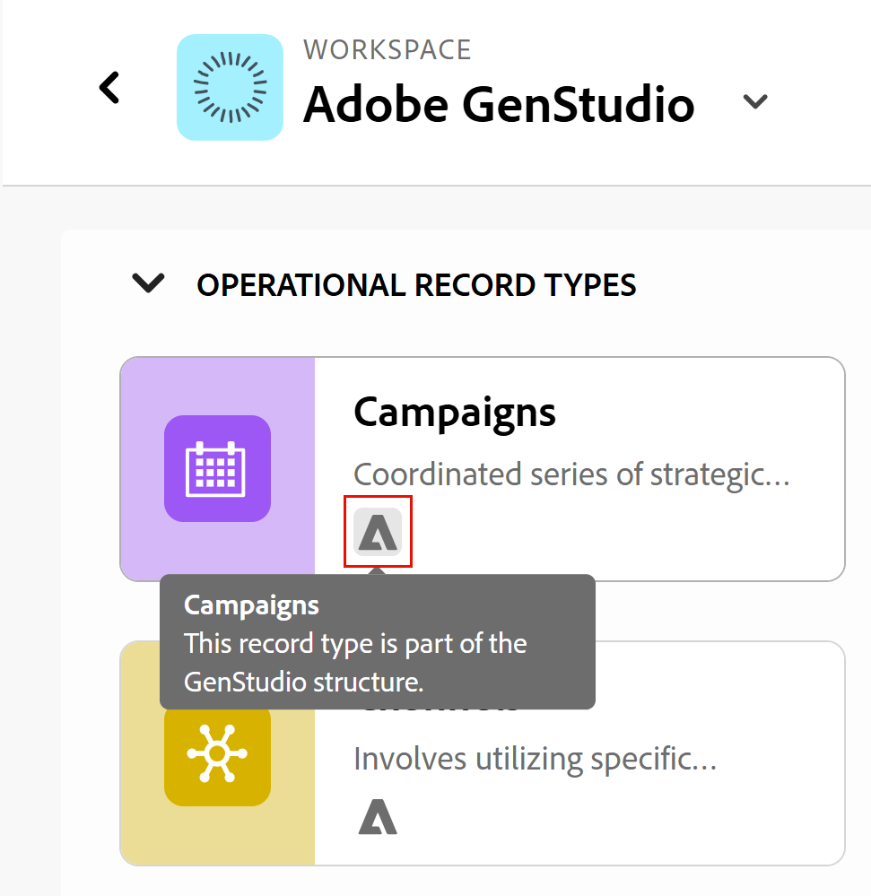

<!--Better metadata, at publishing:
---
title: Manage the GenStudio Workspace in Adobe Workfront Planning
description: The GenStudio for Performance Marketing workspace is available in Adobe Workfront Planning when your company has purchased both products and your instance of Workfront is integrated with your company's instance of GenStudio. You can view the GenStudio workspace from Planning and update information in both systems.
feature: Workfront Planning
role: User, Admin
author: Alina
recommendations: noDisplay, noCatalog
---
-->

<!--MUST update the access requirements below - not complete!!!!!!!!!-->

# Manage the GenStudio workspace in Adobe Workfront Planning

<!--The information on this page refers to functionality not yet generally available. It is available only in the Preview environment for all customers. After the monthly releases to Production, the same features are also available in the Production environment for customers who enabled fast releases.    

For information about fast releases, see [Enable or disable fast releases for your organization](/help/quicksilver/administration-and-setup/set-up-workfront/configure-system-defaults/enable-fast-release-process.md). -->

The Adobe GenStudio for Performance Marketing workspace is available in Adobe Workfront Planning when your company has purchased both products and your instance of Workfront is integrated with your company's instance of GenStudio. 

You can view the GenStudio workspace from Planning and update information in both systems.

For information about using and managing the GenStudio workspace from GenStudio Performance Marketing, see [Adobe GenStudio for Performance Marketing User Guide](https://experienceleague.adobe.com/en/docs/genstudio-for-performance-marketing/user-guide/home). 

For general information about the GenStudio to Workfront Planning integration, see [Get started with the Adobe Workfront Planning and Adobe GenStudio for Performance Marketing integration](/help/quicksilver/planning/planning-and-genstudio-integration/get-started-with-workfront-planning-and-genstudio-integration.md). 

>[!IMPORTANT]
>
>The steps described in this article illustrate how you can update the GenStudio workspace from Workfront Planning when you have Manage permissions to it. 
> Not all capabilities are available when you have Contribute permissions to the GenStudio workspace. 
>
>If your company has multiple instances of Workfront, all users get Contribute permissions on the GenStudio workspace in Workfront Planning. 

## Access requirements

+++ Expand to view the access requirements for the functionality in this article. 

<table style="table-layout:auto"> 
<col> 
</col> 
<col> 
</col> 
<tbody> 
    <tr> 
<tr> 
</tr>   
<tr> 
   <td role="rowheader">
Adobe Workfront package
</td> 
   <td> 
<ul> 
<li>
Any Workfront and any Planning package
</li>
Or
<li>
Any Workflow and any Planning packages</li></ul>

For more information about what is included in each Workfront Planning package, contact your Workfront account representative. 
 
   </td> 
   <tr> 
<td> 
   
 Additional products
 </td> 
   <td> 
   
 Adobe GenStudio for Performance Marketing
</td> 
  </tr>
  <tr> 
   <td role="rowheader">
Adobe Workfront license
</td> 
   <td>
Standard

   </td> 
  </tr> 
  <tr> 
   <td role="rowheader">
Adobe GenStudio for Performance Marketing user roles
</td> 
   <td>
<ul><li>Any GenStudio user role to access Campaigns, Products, and Personas</li>
   <li>GenSudio System Manager to access Activations <!--and Events--></li></ul>
   For information, see <a href="https://experienceleague.adobe.com/en/docs/genstudio-for-performance-marketing/user-guide/intro/user-roles">User roles and permissions</a>. 
   

  </td> 
  </tr>   
<tr> 
   <td role="rowheader">
Object permissions
</td> 
   <td>  
   
In Workfront Planning: 

   <ul>
   <li>
Manage permissions to the GenStudio workspace to add new fields or record types to the GenStudio workspace
</li>
   <li>
Contribute permissions to the GenStudio workspace to add, update, or delete records in the GenStudio workspace
 </li>  
   </ul>
   
No users can remove GenStudio for Performance Marketing record types or fields from the GenStudio workspace in Workfront Planning

   
In Adobe GenStudio for Performance Marketing: 

   <ul>
   <li>
 Any permissions in Adobe GenStudio for Performance Marketing
</li>
   <li>
 Create permissions in Adobe GenStudio for Performance Marketing to create items
</li></ul>
   </td>  
</tbody> 
</table> 

For information about Adobe Workfront Planning access, see [Adobe Workfront Planning access overview](/help/quicksilver/planning/access/access-overview.md).

For more information about Adobe GenStudio for Performance Marketing, see [Adobe GenStudio for Performance Marketing User Guide](https://experienceleague.adobe.com/en/docs/genstudio-for-performance-marketing/user-guide/home).

+++   

<!--Old:

<table style="table-layout:auto"> 
<col> 
</col> 
<col> 
</col> 
<tbody> 
    <tr> 
    <td role="rowheader">
Adobe Workfront package
</td> 
   <td> 

Any Workfront package

Any Planning package
  

   </td> </tr>
   <tr> 
<td> 
   
 Additional products
 </td> 
   <td> 
   
 Adobe GenStudio for Performance Marketing
</td> 
  </tr>
  <tr> 
   <td role="rowheader">
Adobe Workfront license
</td> 
   <td>
 Standard

  </td> 
  </tr> 
   
  <tr> 
   <td role="rowheader">
Adobe GenStudio for Performance Marketing user roles
</td> 
   <td>
<ul><li>Any GenStudio user role to access Campaigns, Products, and Personas</li>
   <li>GenSudio System Manager to access Activations ****** and Events*********</li></ul>
   For information, see <a href="https://experienceleague.adobe.com/en/docs/genstudio-for-performance-marketing/user-guide/intro/user-roles">User roles and permissions</a>. 
   

  </td> 
  </tr>   
<tr> 
   <td role="rowheader">
Object permissions
</td> 
   <td>  
   
In Workfront Planning: 

   <ul>
   <li>
Manage permissions to the GenStudio workspace to add new fields or record types to the GenStudio workspace
</li>
   <li>
Contribute permissions to the GenStudio workspace to add, update, or delete records in the GenStudio workspace
 </li>  
   </ul>
   
No users can remove GenStudio for Performance Marketing record types or fields from the GenStudio workspace in Workfront Planning

   
In Adobe GenStudio for Performance Marketing: 

   <ul>
   <li>
 Any permissions in Adobe GenStudio for Performance Marketing
</li>
   <li>
 Create permissions in Adobe GenStudio for Performance Marketing to create items
</li></ul>
   </td> 
  </tr> 
</tbody> 
</table> -->

## Considerations for managing a GenStudio workspace in Workfront Planning

* Your organization must purchase Adobe GenStudio for Performance Marketing before you can view a GenStudio workspace in Workfront Planning.

* Depending on how many Workfront instances your organization has, you automatically have the following permissions to the GenStudio workspace in Planning:  

   <!--this table is also in the Get started article-->

   <table style="table-layout:auto"> 
   <col> 
   </col> 
   <col> 
   </col> 
   <tbody> 
      <tr> 
      <td role="rowheader">
One instance of Workfront
</td> 
      <td> 
   
The GenStudio workspace is visible in your instance of Workfront Planning

   
Workfront administrators have Manage permissions to the GenStudio workspace in Planning

   
All other users have Contribute access to the GenStudio workspace in Planning

   </td> </tr>
      <tr> 
   <td> 
      
 Multiple instances of Workfront
 </td> 
      <td> 
      
The GenStudio workspace is visible from all Workfront instances

   
All users with access to GenStudio for Performance Marketing and Workfront Planning have Contribute permissions on the GenStudio in Planning
 </td> 
   </tr>
      </tbody> 
   </table> 

* Updating the workspace configuration, record types, views, and fields for a GenStudio workspace is identical with updating a Workfront Planning workspace with its elements. 

<!--
## Manage GenStudio workspace from Workfront Planning

CAN YOU DO THIS?? 
- OPTIONS FROM THE WORKSPACE CARD ??
- OPTIONS FROM THE MORE MENU ON A WORKSPACE ??
-->

## Manage the GenStudio workspace from Workfront Planning

>[!NOTE]
>
>Before managing the GenStudio workspace, see the article [Get started with the Workfront Planning and GenStudio for Performance Marketing integration](/help/quicksilver/planning/planning-and-genstudio-integration/get-started-with-workfront-planning-and-genstudio-integration.md) for more information. 
>

1. Log in to Workfront as a user who also has access to GenStudio. 
1. Click the **[!UICONTROL Main Menu]** icon  in the upper-left corner, then click **[!UICONTROL Planning]**.

   The Workfront Planning main page opens. 
    
1. Click **Other workspaces** and find a workspace that has an indication that was created by the **System** and has the **GenStudio** tag on its card. 

    

1. Click the **GenStudio workspace card** to open the GenStudio workspace in Workfront Planning. 
1. By default, the following GenStudio record types are created and visible from Workfront Planning:

    * Campaigns
    * Products
    * Personas
    * Activations
    * Channels
    * Regions

    There is an indication on the GenStudio record type card that they were originally created in GenStudio. 

    <!--check screen shot-->

    

1. Click the **More** menu  to the right of the workspace name, then click one of the following:

   * **Edit** 

      For information, see [Edit workspaces](/help/quicksilver/planning/architecture/edit-workspaces.md).
   <!--* **Delete** - this will generate an error message, per Iskuhi, so don't document as an option/ possibility-->

      <!--For information, see [Delete workspaces](/help/quicksilver/planning/architecture/delete-workspaces.md). -->

1. Click **Share** in the upper-right corner to share the workspace with others.

   For information, see [Share workspaces](/help/quicksilver/planning/access/share-workspaces.md)

1. Click any of the record type cards to view records for that type. 

   To manage the record type, views, and fields, see the section [Manage GenStudio record types from Workfront Planning](#manage-genstudio-record-types-from-workfront-planning) in this article. 

## Manage record types, views, and records from the GenStudio workspace in Workfront Planning

>[!NOTE]
>
>Before managing the GenStudio workspace, see the article [Get started with the Workfront Planning and GenStudio for Performance Marketing integration](/help/quicksilver/planning/planning-and-genstudio-integration/get-started-with-workfront-planning-and-genstudio-integration.md) for more information. 
>

1. Go to the GenStudio workspace in Workfront Planning and open a record type page, as described in the section [Manage the GenStudio workspace from Workfront Planning](#manage-the-genstudio-workspace-from-workfront-planning) in this article.

1. Click the **More** menu  to the right of a record type name, then click one of the following:

   * **Edit**

      For information, see [Edit record types](/help/quicksilver/planning/architecture/edit-record-types.md).
   * **Manage automations**

      For information, see [Configure Adobe Workfront Planning automations](/help/quicksilver/planning/records/configure-automations-to-create-records.md).
   * **Manage request forms**

      You can create multiple request forms. The request forms will be available in the Requests area of Workfront and you can also share them publicly, or with a link. 

      For information, see [Create and manage a request form in Adobe Workfront Planning](/help/quicksilver/planning/requests/create-request-form.md).

1. To share a view or the record type, do the following: 

   * Click **Share** in the upper-right corner of the record type page, then click one of the following:
      * **Share the record type**
         For information, see [Share record types](/help/quicksilver/planning/access/share-record-types.md).
      * **Share the current view**
         For information, see [Share views](/help/quicksilver/planning/access/share-views.md).
      * **Copy the view link** 
         A link to the view is copied to your clipboard. 
      * **Export the current view** 
         For information, see [Export records from the table view](/help/quicksilver/planning/records/export-records-from-the-table-view.md).

1. To manage the record type views, do the following: 

   * Click **+ View** to create a view for the GenStudio record type.  

      For information, see [Manage record views](/help/quicksilver/planning/views/manage-record-views.md). 

   * Click the **Full screen** icon  to open any view in full-screen mode. 
   
   * Manage a view's elements from any views. 

      For example, you can change the filter, groupings, sort, settings of a view, where available. 

      For information, see [Manage record views](/help/quicksilver/planning/views/manage-record-views.md). 

1. To add records, do one of the following: 

   * Click **New record** from any view to create records from scratch

   * Import records using an Excel or CSV file in the table view

   * Click anywhere in the timeline or calendar views to add records. 

      For information, see [Create records](/help/quicksilver/planning/records/create-records.md).

      Records are visible from both Workfront and GenStudio.

      >[!NOTE]
      >
      >You cannot add records for the Activations record type.

1. To edit records, do one of the following: 

   * Edit records inline from the table view
   
   * Click a record from any view to open its details page. 

      For information, see [Edit records](/help/quicksilver/planning/records/edit-records.md).  

      The changes you make from the GenStudio workspace in Planning are immediately visible from GenStudio. 

1. Select a record in the table view, then click **Delete**.

      For information, see [Delete records](/help/quicksilver/planning/records/delete-records.md). 

      Deleted records are immediately removed from GenStudio. 

      >[!TIP]
      >
      >Deleted records can be recovered from the table view Recently deleted bin in Workfront Planning. Records deleted from GenStudio can also be recovered from the Recently deleted bin in Workfront Planning.       

      For information, see [Restore deleted records](/help/quicksilver/planning/records/restore-deleted-records.md)

1. Click the + icon in the upper-right corner of the table view to create the following:

   * Record fields

      For information, see [Create fields](/help/quicksilver/planning/fields/create-fields.md)
   
   * Record connections

      For information, see [Connect record types](/help/quicksilver/planning/architecture/connect-record-types.md)

      Fields created from the GenStudio workspace are visible in the following areas:

      * Workfront Planning views
      * Workfront Planning record details 
      * GenStudio record details

      >[!TIP]
      >
      >Fields created in Workfront Planning are not visible in the list view in GenStudio.

1. Hover over a field in the table view, then click the drop-down menu to do one of the following:

   * Sort by it
   * Hide it 
   * Edit its settings
   <!--* Delete it - not possible now, per Iskuhi; the link is there but it will generate an error-->

      <!--GenStudio-native fields are note removed from GenStudio. -->

      >[!NOTE]
      >
      >You can edit a field's configuration and add more fields only when you have Manage permissions in GenStudio.

