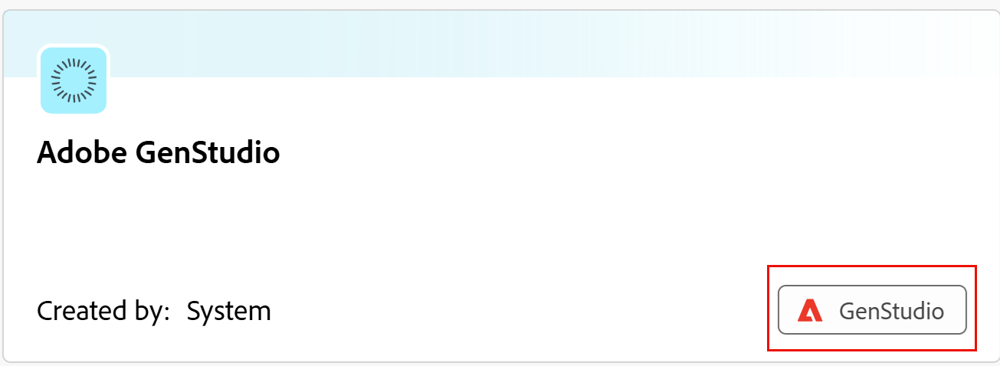

# Manage the GenStudio workspace in Adobe Workfront Planning

<!--Better metadata, at publishing:
---
title: Manage the GenStudio Workspace in Adobe Workfront Planning
description: The GenStudio for Performance Marketing workspace is available in Adobe Workfront Planning when your company has purchased both products and your instance of Workfront is integrated with your company's instance of GenStudio. You can view the GenStudio workspace from Planning and update information in both systems.
feature: Workfront Planning
role: User, Admin
author: Alina
recommendations: noDisplay, noCatalog
---
-->

The GenStudio for Performance Marketing workspace is available in Adobe Workfront Planning when your company has purchased both products and your instance of Workfront is integrated with your company's instance of GenStudio. You can view the GenStudio workspace from Planning and update information in both systems.

For information about using GenStudio for Performance Marketing, see [Adobe GenStudio for Performance Marketing User Guide](https://experienceleague.adobe.com/en/docs/genstudio-for-performance-marketing/user-guide/home). 

## Access requirements

+++ Expand to view access requirements. 

<table style="table-layout:auto"> 
<col> 
</col> 
<col> 
</col> 
<tbody> 
    <tr> 
<tr> 
<td> 
   
 Products
 </td> 
   <td> 
   <ul><li>
 Adobe Workfront
</li> 
   <li>
 Adobe Workfront Planning
</li>
   
<li> Adobe GenStudio for Performance Marketing
</li>
   </ul></td> 
  </tr>   
<tr> 
   <td role="rowheader">
Adobe Workfront plan*
</td> 
   <td> 

Any of the following Workfront plans:
 
<ul><li>Select</li> 
<li>Prime</li> 
<li>Ultimate</li></ul> 

Workfront Planning is not available for legacy Workfront plans
 
   </td> 
<tr> 
   <td role="rowheader">
Adobe Workfront Planning package
</td> 
   <td> 

Any 
 

For more information about what is included in each Workfront Planning package, contact your Workfront account manager. 
 
   </td> 
 <tr> 
   <td role="rowheader">
Adobe Workfront platform
</td> 
   <td> 

Your organization's instance of Workfront must be onboarded to the Adobe Unified Experience to be able to access Workfront Planning.
 

For more information, see <a href="/help/quicksilver/workfront-basics/navigate-workfront/workfront-navigation/adobe-unified-experience.md">Adobe Unified Experience for Workfront</a>. 
 
   </td> 
   </tr> 
  </tr> 
  <tr> 
   <td role="rowheader">
Adobe Workfront license*
</td> 
   <td>
 Standard

   
Workfront Planning is not available for legacy Workfront licenses
 
  </td> 
  </tr> 
  <tr> 
   <td role="rowheader">
Access level configuration
</td> 
   <td> 
There are no access level controls for Adobe Workfront Planning
   
</td> 
  </tr> 
<tr> 
   <td role="rowheader">
Object permissions
</td> 
   <td>   
Contribute or higher permissions to a workspace and record type  
  
   
System Administrators have permissions to all workspaces, including the ones they did not create
 </td> 
  </tr> 
</tbody> 
</table> 

 *For more information about Workfront access requirements, see [Access requirements in Workfront documentation](/help/quicksilver/administration-and-setup/add-users/access-levels-and-object-permissions/access-level-requirements-in-documentation.md).

+++   

## Considerations for managing a GenStudio workspace in Workfront Planning

* Your organization must purchase Adobe GenStudio for Performance Marketing before you can view a GenStudio workspace in Workfront Planning.

    For more information about GenStudio, see [Adobe GenStudio for Performance Marketing User Guide](https://experienceleague.adobe.com/en/docs/genstudio-for-performance-marketing/user-guide/home). 

    For more information about the GenStudio and Workfront Planning integration, see [Get started with the Workfront Planning and GenStudio for Performance Marketing integration](/help/quicksilver/planning/planning-and-genstudio-integration/get-started-with-workfront-planning-and-genstudio-integration.md)

* Workfront users must have access to GenStudio to be able to see the GenStudio workspace in Workfront Planning. 

## Manage the GenStudio workspace in Workfront Planning

>[!NOTE]
>
>Before managing the GenStudio workspace, see the article [Get started with the Workfront Planning and GenStudio for Performance Marketing integration](/help/quicksilver/planning/planning-and-genstudio-integration/get-started-with-workfront-planning-and-genstudio-integration.md). 

1. Log in to Workfront as a system administrator. 
1. Click the **[!UICONTROL Main Menu]** icon  in the upper-right corner of Adobe Workfront, or (if available), click the **[!UICONTROL Main Menu]** icon  in the upper-left corner, then click **[!UICONTROL Planning]**.

   The Workfront Planning landing page opens. 
    
1. Click **Other workspaces** and find a workspace that has an indication that was created by the System and has the GenStudio tag on its card. 

    

1. Click the **GenStudio workspace card** to open the GenStudio workspace in Workfront Planning. 
1. By default, the following GenStudio record types are created and visible from Workfront Planning:

    * Campaigns
    * Products
    * Activations
    * Channels
    * Regions

    There is an indication on the GenStudio record types that they were originally created in GenStudio. 

    

1. Click any of the record type cards to view records for that type. 

1. Do one of the following:

    * Click **Share**, then click **Copy the view link** to share a link to the record type, or **Export the current view** to export it to a file. You can only export the table view.

    * Click **+ View** to create a view for the GenStudio record type.
   
    * Manage the view elements from any of the view. 

      For example, you can change the filter, groupings, sort, settings of a view, where available. 

      For information, see [Manage record views](/help/quicksilver/planning/views/manage-record-views.md). 

   * Add records in the table or the timeline view. 

      You can only create records from scratch or by importing a CSV or Excel file. 

      For information, see [Create records](/help/quicksilver/planning/records/create-records.md).

      Records are visible from both Workfront and GenStudio. 

   * Delete records in the table view. 

      Deleted records can be recovered from the table view recycle bin in Workfront Planning, if they are deleted from Workfront. For information, see [Restore deleted records](/help/quicksilver/planning/records/restore-deleted-records.md)
