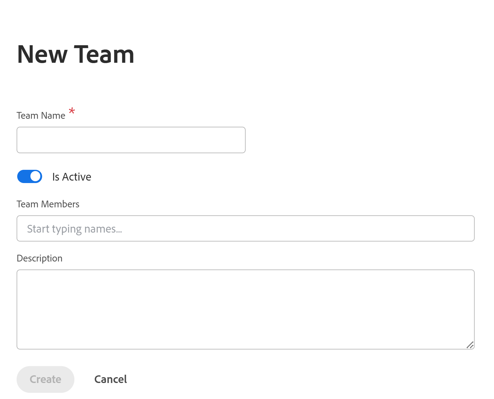

# Manage teams in Adobe Workfront Planning as a standalone product

>[!IMPORTANT]
>
>The information in this article refers to Adobe Workfront Planning, when purchased as a standalone product. Refer to this article when your company purchased an Adobe Workfront Planning only package, and they did not purchase a Workfront Workflow package. 
>
>For information about Adobe Workfront Planning when purchased together with a Workfront package, see [Get started with Adobe Workfront Planning](/help/quicksilver/planning/general/planning-overview.md). 
>

You can manage teams in Adobe Workfront Planning as a standalone product in a similar way that you manage them in Adobe Workfront, but there are some limitations. 

## Access requirements

+++ Expand to view the access requirements for the functionality in this article. 

<table style="table-layout:auto"> 
<col> 
</col> 
<col> 
</col> 
<tbody> 
    <tr> 
<tr> 
</tr>   
<tr> 
   <td role="rowheader">
Adobe Workfront Planning package
</td> 
   <td> 

Any Workfront Planning as a standalone package

</td> </tr>
  <tr> 
   <td role="rowheader">
Adobe Workfront license
</td> 
   <td>
Planning Administrator

   </td> 
  </tr> 
  
</tbody> 
</table>

For more information about access needed for Workfront as a standalone package, see [Access needed for Adobe Workfront Planning as a standalone product](/help/quicksilver/planning/planning-sta/access-needed-for-planning-sta.md).
+++    

## Manage teams in Adobe Workfront Planning

1. As a Planning Administrator, log in to Workfront from the Adobe CX Enterprise Home. 
1. Click **Main Menu** > **Setup** > Teams > **New Team**.

    

1. Update the following information:

    * Team Name
    * Is Active: To indicate that the team is active, turn on this setting. Users can assign it to permissions and other users. 
    * Team Members: Add team members to the team. The users must first be created in the Adobe Admin Console and in Workfront Planning before they are available to add as team members. 
    * Description: Include a description for the team. 
1. Click **Create** to create the team. 
1. (Optional) To edit an existing team, do one of the following: 

    * Hover over the team name in the list, then click the **More** menu  > **Edit Team**
    * Select the team in the list, then click **Edit Team** on the blue toolbar at the bottom of the page
1. (Optional) To delete a team, do one of the following: 

    * Hover over the team name in the list, then click the **More** menu  > **Delete Team**
    * Select the team in the list, then click **Delete Team** on the blue toolbar at the bottom of the page
1. Click **Yes, Delete** it to confirm.
