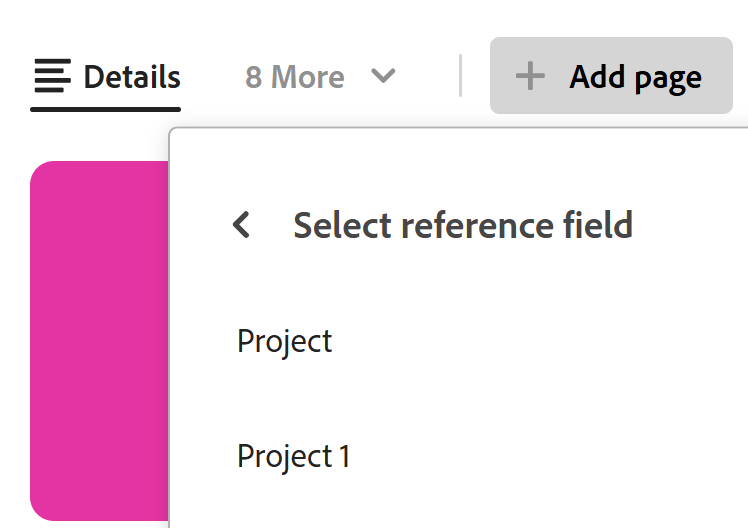
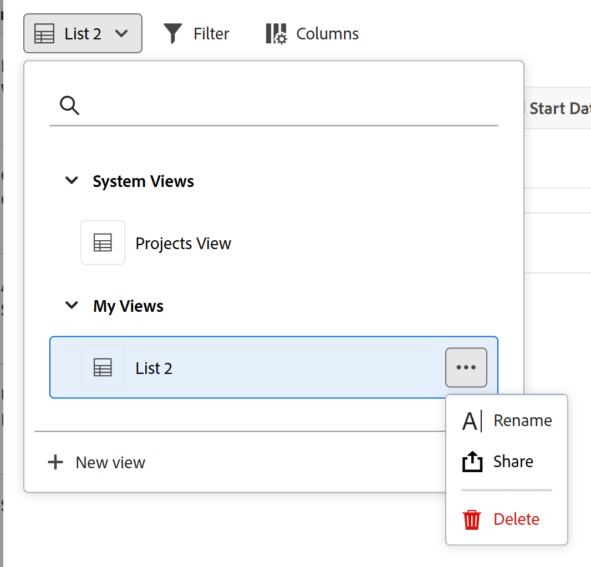
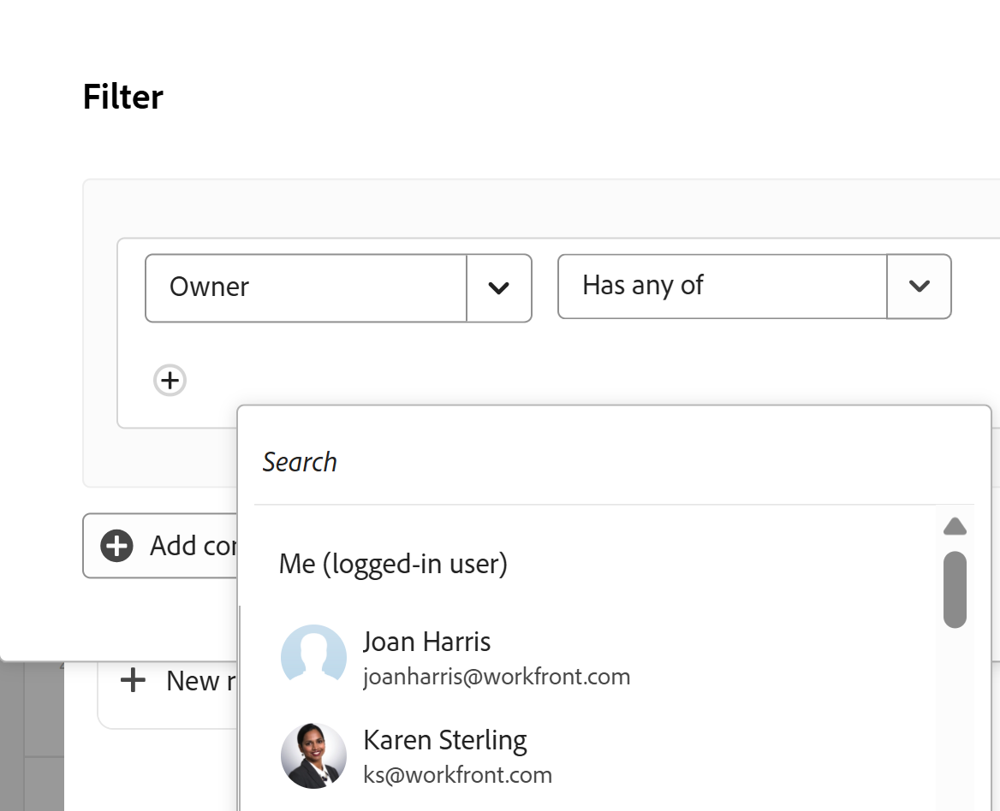

# Add a Connected records page to a record

The highlighted information on this page refers to functionality not yet generally available. It is available only in the Preview environment for all customers. After the monthly releases to Production, the same features are also available in the Production environment for customers who enabled fast releases.    

For information about fast releases, see [Enable or disable fast releases for your organization](/help/quicksilver/administration-and-setup/set-up-workfront/configure-system-defaults/enable-fast-release-process.md). 

You can view information from connected records or objects by adding a tab for a Connected records page to a record in Adobe Workfront Planning. This adds the connected records in a table view to the tab.

Consider the following when adding a Connected records page to a record: 

* You can add a Connected records page to a record after you connected record or object types to the record type from the table view of a record type.

* You can add a Connected records page from a record's preview area or the record's page.

* Connected records pages display only the connected objects or records from one object or record type. The page does not display all records of that type. 

* You can display the objects in a connected records page in the table view.

<!--replace the above bullet with this: 

* You can display the objects in a connected records page in the following types of views:

   * Table
   * Timeline
   * Calendar

* You can create one page per one object or record type. For example, you cannot create two connected record pages for connected projects or tactics.

-->

* You can add Connected records pages for the following connected record or object types:

   * Workfront Planning record types
   * Workfront projects
   
      You can view the connected Workfront projects even when you do not have permissions to access them in Workfront. 

## Access requirements

+++ Expand to view the access requirements for the functionality in this article. 

<table style="table-layout:auto"> 
<col> 
</col> 
<col> 
</col> 
<tbody> 
    <tr> 
<tr> 
</tr>   
<tr> 
   <td role="rowheader">
Adobe Workfront package
</td> 
   <td> 

Any Workfront and any Planning package

Any Workflow and any Planning package

For more information about what is included in each Workfront Planning package, contact your Workfront account representative. 
 
   </td> 
<tr>
<td> 
   
 Additional products
 </td> 
   <td> 
   
 In addition to Adobe Workfront, you must have the following, if you want to add a connected record page for objects from the following applications:

   <ul><li>
An Adobe Experience Manager Assets license and an integration between AEM Assets and Workfront to connect AEM assets with Planning record types.

   
For information, see <a href="/help/quicksilver/documents/adobe-workfront-for-experience-manager-assets-essentials/workfront-for-aem-asset-essentials.md">Adobe Workfront for Experience Manager Assets and Assets Essentials: article index</a>. 
</li>
   <li>
 An Adobe GenStudio for Performance Marketing license to connect record types with GenStudio Brands

   
For information, see <a href="https://experienceleague.adobe.com/en/docs/genstudio-for-performance-marketing/user-guide/get-started">Get started with Adobe GenStudio for Performance Marketing</a>.
</li></ul>
   </td> 
  </tr> 

  <tr> 
   <td role="rowheader">
Adobe Workfront license
</td> 
   <td>
Standard

   </td> 
  </tr> 
  <tr>
   <td role="rowheader">
Object permissions
</td>
   <td>
   
Contribute or higher permissions to a workspace and record type 
  
   
System Administrators have permissions to all workspaces, including the ones they did not create
 
  </td>
  </tr>   
</tbody> 
</table> 

For more information about Workfront access requirements, see [Access requirements in Workfront documentation](/help/quicksilver/administration-and-setup/add-users/access-levels-and-object-permissions/access-level-requirements-in-documentation.md).

+++   

## Add a Connected records page to a record

You must first connect record types with other record types or Workfront projects before adding a connected records page to a record. 

1. Click the name of the record to open it from any view of a record type page. 
1. Click **Add page** from one of the following areas: 

   * The record's preview window
   * The record's details page, after clicking the **Open in new tab** icon  in the upper-right corner of the preview page.  

   The **Create page** box opens.

    

1. Add the **Page name**, click **Connected records page** for the **Page type**, then click **Create**.
1. (Optional) Click the name of a connected record or object type in the list, or search for it, then click it when it displays in the list to create the page for that record or object type.

1. (Optional and conditional) If more than one connected field of the record or object type you are building the page for displays, click the field whose records or objects you want to display in the connected records page from the **Select reference field** list. 

   

   One of the following pages is added to the connected records page:

      * The table view of a record type 
      * The list view of a project object type
   
   The records or projects that are connected to the current record display in the table or list view.  

      >[!TIP]
      >
      >You must add connected records in the table or Details area of a record before you can display them in a connected records page. Otherwise, the table or list are empty.

   The first five fields of the connected records display by default. <!--No lookup fields display by default.-->

   

1. (Conditional) Depending on what type of records you display in the connected record page, do one of the following:

   * Manage the records' table view
      For information, see the section [Manage the record table view in the connected records page](#manage-the-record-table-view-in-the-connected-records-page) in this article.
   * Manage the projects' list view
      For information, see the section [Manage the project list view in the connected records page](#manage-the-project-list-view-in-the-connected-records-page) in this article.

1. (Optional) Double-click the name of the **Connected records page** tab

   Or

   Hover over the name of the tab, then click **More** , then click **Rename** to rename to new connected records page tab.

   <!--1. (Optional) Click the dropdown menu to the right of the view name, then click **New view** to add a view. For more information, see the section [Manage multiple views from the connected records page](#manage-multiple-views-from-the-connected-records-page) in this article. --> 
   
1. (Optional)  Hover over the name of the connected records page tab, click **More** , then click **Delete** to remove to tab.

### Manage the record table view in the connected records page

When you create a connected records page for  connected Planning records, do the following: <!--or AEM Assets--> <!--AEM is not available yet?? see note below-->

1. Go to a record type page and click the name of a record. This opens the record's preview page.
1. Click the tab for a connected records page that display Planning records.
   The records connected to the record you selected display in the table view. 
1. Click **Connect** at the bottom of the table view to connect existing records, select them from the connection box, then click outside the box to close it. The records are automatically added to the tabl and connected to the record you selected. The records must exist before you can add them.

   For more information, see [Connect records](/help/quicksilver/planning/records/connect-records.md).
1. Edit any information from the connected records inline in the table view. 
1. Hover over a connected record's name, then click the **More** menu 

   Or 
   
   Select one of the records, then click one of the following options in the blue bar at the bottom of the list: 

   * **View** to open the record page in a new tab
   * **Copy link** to copy a link to the record page
   * **Edit thumbnail** to open the **Record thumbnail** box and edit the record's thumbnail image
   * **Duplicate** to duplicate the connected record. The duplicated record is also connected to the current record.
   * **Insert record above or below** to add new records to the connected record type. New records added here are also connected to the current record. This option is not available in the blue bar when selecting a record in the table.
   * **Delete** to delete the record. Deleting a connected record deletes it from its record type and from everywhere where the record is connected. The deleted records move to the **Recently deleted** bin of their record type.

      For information about editing records in the table view, see [Edit records](/help/quicksilver/planning/records/edit-records.md). 

      >[!TIP]
      >
      >You can select more than one record or object to delete them.

1. Inline edit any of the records in the table on the connected records page.
1. Use any of the following view elements in the toolbar of a connected record page to manage the table view:

   * **Filters**
   * **Sort**
   * **Grouping**
   * **Fields**, to display, hide, or rearrange fields
   * **Row height**
   * **Search**

   For information, see [Manage the table view](/help/quicksilver/planning/views/manage-the-table-view.md). 

   >[!NOTE]
   >
   >You cannot create, edit, or delete fields in the table view of a connected record's tab.

   <!--No longer possible: 1. (Optional and conditional) When you create a connected records page for the following Workfront object types:
         * Portfolios
         * Programs
         * Groups
         * Companies
      Do any of the following in the table view of the connected records page: 
      * Click the name of a object. This opens the object's page in a new tab. 
      * Click **Connect** at the bottom of the table view to connect existing objects, select them from the connection box, then click outside the box to close it. The objects are automatically added to the table. The objects must exist before you can add them.
      For more information, see [Connect records](/help/quicksilver/planning/records/connect-records.md).
      * Select one of the objects in the table view, then click one of the following options in the blue bar at the bottom of the list: 
      * **View** to open the record page in a new tab
      * **Copy link** to copy a link to the record page
      * **Disconnect** to disconnect the object from the record you are viewing. 
      >[!TIP]
      >
      >You can select more than one record or object to disconnect them.
      -->

### Manage the project list view in the connected records page

When you create a connected records page for connected Workfront projects, do the following:

1. Go to a record type page and click the name of a record. This opens the record's preview page.
1. Click the tab for a connected records page that display Workfront projects.
   The projects connected to the record you selected display in the list view. 
1. Click **Connect records** in the upper-right corner of the connected record page to connect existing projects.

   For information, see [Connect records](/help/quicksilver/planning/records/connect-records.md).
1. Inline edit project information in the table.
1. Click **New row** to create a project without a template. The new project is automatically connected to the current record.

   For more information, see [Create Workfront objects from Workfront Planning as you connect them to records](/help/quicksilver/planning/records/create-workfront-objects-from-workfront-planning.md)
1. Hover over a project name in the list and click the **More** menu [More menu](assets/more-menu.png)
     
   Or

   Select one or more projects, and notice the blue bar at the bottom of the list, then click one of the following:
      
   * **Delete** to delete the project. Deleting a project disconnects it from the record and moves it to the Workfront's Recycle Bin. Workfront administrators can recover deleted projects up to 30 days after they were deleted.
   * **Disconnect** to disconnect the project from the record. Disconnecting a project removes it and all the values of its lookup fields from the current record.

   >[!TIP]
   >
   >You can select more than one project to disconnect or delete them.
1. Click the views dropdown menu, and click **New view** to add a new view for the page, then do the following:
   1. Add a **View name**.
   1. Select **List** from the **View type** area.
   1. Click **Create**.
      A new list view is added to the views dropdown menu.
   1. (Optional) Hover over the name of a view you created, click the **More** menu , then click one of the following options: 
      * **Rename**, to add a new name for the view.
      * **Share**

         For more information, see [Share views](/help/quicksilver/planning/access/share-views.md).

         >[!NOTE]
         >
         >You cannot share a default view that was created by Workfront.

      * **Delete**
         For information, see [Delete record views](/help/quicksilver/planning/views/delete-record-views.md).

         
   1. Click the **Filter** icon , and use the filter to display specific projects. 

      >[!TIP]
      >
      >For people-type fields, like **Owner**, or **Sponsor**, you can use a wildcard to show projects where the logged in user is assigned to these roles.
      >
      >
      >
   1.  Click the **Columns** icon  to hide or show columns in the list.
   1. Click the **+** icon in the upper-right corner of the table view to add existing fields to the table. Fields must exist before you can add them. 

      The **Column manager** box opens. Do the following:

      1. Search for an existing object field in the **Available** column, then click **+** to the right of the field name it to add it to the **Selected** column. 
         
         The fields you select are added to the table view in the connected records page. 
      1. Click **-** to the right of a field in the **Selected** column to remove it from the table view.  
      1. Click **Save** to save the connected record page table view.

<!--

## Manage multiple views from the connected records page

You can add and manage multiple view types from the connected records page of a record. 

The views you create in the Connected records page of a record type are available everywhere in Workfront Planning where that record type page displays. Views created for the same record type anywhere else in Workfront Planning are also accessible in all connected records pages of that record type. 

To manage multiple views from the connected records page: 

1. From the connected records page of a record, click the dropdown menu to the right of the view name, then click **New view** to add a view, then select from the following options: 

   * **Table**. For more information, see [Manage the table view](/help/quicksilver/planning/views/manage-the-table-view.md). 
   * **Timeline**. For more information, see [Manage the timeline view](/help/quicksilver/planning/views/manage-the-timeline-view.md).
   * **Calendar**. For more information, see [Manage the calendar view](/help/quicksilver/planning/views/manage-the-calendar-view.md). 

1. (Optional) Hover over the name of a view in the Connected records page, then click the **More** menu , then click one of the following: *************check to make sure these are all possible*********

   * **Rename**
   * **Share**. For more information, see [Share views](/help/quicksilver/planning/access/share-views.md).

   >[!TIP]
   >
   >Sharing views from Connected records pages makes them accessible to users in all areas of Workfront Planning where the view displays. 
   >Also, if a view is shared from any other area of Workfront Planning, it is also available to the same users in Connected records pages. 

   * **Export** 
   * **Duplicate**. For more information, see [Duplicate record views](/help/quicksilver/planning/views/duplicate-record-views.md).

      >[!TIP]
      >
      >Duplicating a view from Connected records pages makes it available in all other areas of Workfornt planning, when viewing the same record types. 

 -->