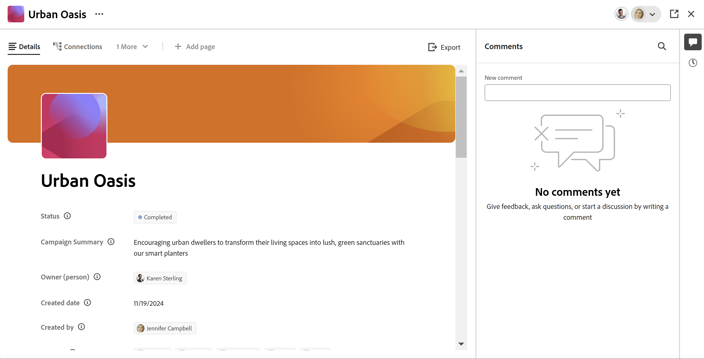

# Add a cover image to a record

{{planning-important-intro}}

You can personalize records by adding a cover image to the record page in Adobe Workfront Planning, when editing a record.

For information about editing records, see [Edit records](/help/quicksilver/planning/records/edit-records.md). 

You must create record types before you can start creating and editing records. 

For information, see [Create record types](/help/quicksilver/planning/architecture/create-record-types.md).

## Access requirements

+++ Expand to view access requirements for Workfront Planning. 

You must have the following to be able to access Workfront Planning:  

 <table style="table-layout:auto"> 
<col> 
</col> 
<col> 
</col> 
<tbody> 
    <tr> 
<tr> 
<td> 
   
 Products
 </td> 
   <td> 
   <ul><li>
 Adobe Workfront
</li> 
   <li>
 Adobe Workfront Planning
</li></ul></td> 
  </tr>   
<tr> 
   <td role="rowheader">
Adobe Workfront plan*
</td> 
   <td> 

Any of the following Workfront plans:
 
<ul><li>Select</li> 
<li>Prime</li> 
<li>Ultimate</li></ul> 

Workfront Planning is not available for legacy Workfront plans
 
   </td> 
<tr> 
   <td role="rowheader">
Adobe Workfront Planning plan*
</td> 
   <td> 

Any 
 

For more information about what is included in each Workfront Planning plan, see <a href="https://business.adobe.com/products/workfront/pricing.html">Adobe Workfront pricing and packaging</a>. 
 
   </td> 
 <tr> 
   <td role="rowheader">
Adobe Workfront platform
</td> 
   <td> 

Your organization's instance of Workfront must be onboarded to the Adobe Unified Experience to be able to access all the capabilities of Workfront Planning.
 

For more information, see <a href="/help/quicksilver/workfront-basics/navigate-workfront/workfront-navigation/adobe-unified-experience.md">Adobe Unified Experience for Workfront</a>. 
 
   </td> 
   </tr> 
  </tr> 
  <tr> 
   <td role="rowheader">
Adobe Workfront license*
</td> 
   <td>
 Standard

   
Workfront Planning is not available for legacy Workfront licenses
 
  </td> 
  </tr> 
  <tr> 
   <td role="rowheader">
Access level configuration
</td> 
   <td> 
There are no access level controls for Adobe Workfront Planning
   
</td> 
  </tr> 
<tr> 
   <td role="rowheader">
Object permissions
</td> 
   <td>   
Manage permissions to a workspace 
  
   
System Administrators have permissions to all workspaces, including the ones they did not create
 </td> 
  </tr> 
<tr> 
   <td role="rowheader">
Layout template
</td> 
   <td> 
All users, including Workfront administrators,  must be assigned a layout template that includes the Planning area in the Main Menu. 
 </td> 
  </tr> 
</tbody> 
</table> 

 *For more information about Workfront access requirements, see [Access requirements in Workfront documentation](/help/quicksilver/administration-and-setup/add-users/access-levels-and-object-permissions/access-level-requirements-in-documentation.md).

+++   

<!--

OLD: 
<table style="table-layout:auto">
 <col>
 </col>
 <col>
 </col>
 <tbody>
    <tr>
<tr>
<td>
   
 Product
 </td>
   <td>
   
 Adobe Workfront
 </td>
  </tr>  
 <td role="rowheader">
Adobe Workfront agreement
</td>
   <td>

Your organization must be enrolled in the early access stage for Workfront Planning 

   </td>
  </tr>
  <tr>
   <td role="rowheader">
Adobe Workfront plan
</td>
   <td>

Any

   </td>
  </tr>
  <tr>
   <td role="rowheader">
Adobe Workfront license*
</td>
   <td>
   
New: Standard
  
   
Current: Plan
   
  </td>
  </tr>
  
  <tr>
   <td role="rowheader">
Access level configurations
</td>
   <td> 
There are no access controls for Workfront Planning 
  
</td>
  </tr>
<tr>
   <td role="rowheader">
Permissions
</td>
   <td> 
Manage permissions to a workspace 
  
   
System Administrators have permissions to all workspaces, including the ones they did not create

</td>
  </tr>
<tr>
   <td role="rowheader">
Layout template
</td>
   <td>  
All users, including Workfront administrators,  must be assigned a layout template that includes the Planning area in the Main Menu. 
 
For information, see <a href="/help/quicksilver/planning/access/access-overview.md">Access overview</a>. 
  
</td>
  </tr>

 </tbody>
</table>

*For more information, see [Access requirements in Workfornt documentation](/help/quicksilver/administration-and-setup/add-users/access-levels-and-object-permissions/access-level-requirements-in-documentation.md). 

-->

## Considerations about record page cover images

You can personalize a record's page by adding a cover image to it. 

Consider the following: 

* A cover image is unique to one record, and it does not apply to all records of the same type. 
* You can add only image files as cover images.
   <!--above: when you know exactly what type of files are allowed, add the exact extensions above-->
* You can add a cover image to individual records from the record preview in any view, or from the record page. 
* You cannot add cover images from a record view. 
* Workfront automatically uploads a cover image every time you create a record. You can later modify this image.

## Add a cover image to a record

You can personalize a record by adding a cover image at the top of the record preview or page. 

{{step1-to-planning}}

1. Click the workspace whose records you want to personalize,

    Or

    From a workspace, expand the downward-pointing arrow to the right of an existing workspace name, search for a workspace, then select it when it displays in the list.

    The workspace opens and the record types display.

1. Click a record type card. 

    The record type page opens. 

1. From a view of any type, click a record 

    Or 
    
    From the table table view, click the **Open details** icon  in the first column. 
    
    The record's preview opens in the view.

     

1. (Optional) Click the **Open in new tab** icon  <!--check the icon; they are changing it--> in the upper-right corner of the record preview to open the record's page in a new tab. 

    The record page opens. 

    

1. In the record preview or page, click **Add cover** 

    
    Or
    
    Hover over an existing cover image, click the **More** menu  , then click **Upload**. <!--check the casing here; I logged a bug for this-->
    The **Record cover** box opens in the **Upload** tab. 

    

1. Click **Browse images** and browse for a picture on your computer to select and add it. 

1. (Optional) To remove the image before it is saved, click the **Upload new image** icon  , and upload a new image.

1. (Optional) Click the **Gallery** tab, then click an image in the gallery of images. The gallery of images cannot be modified.

    

1. Click **Use image**.

    The image is uploaded at the top of the record preview or page and changes are saved automatically. 

    

1. (Optional) Hover over the image, then click the **More** menu  in the lower-right corner of the cover image, then do one of the following: 

    * Click **Upload** if you want to replace the cover image and repeat Step 6 to upload and save a new image.
    * Click **Reposition**, and use the **Reposition** tool  to center the cover image, then click **Save** when done. 
    * Click **Remove** to remove the cover image. 

    Workfront automatically saves your changes.
