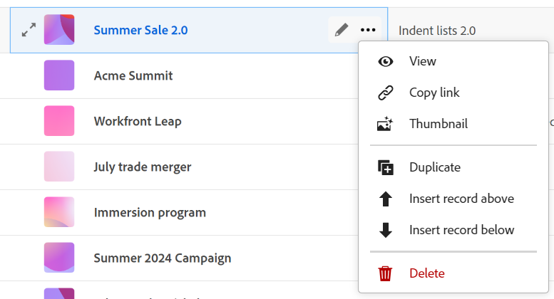
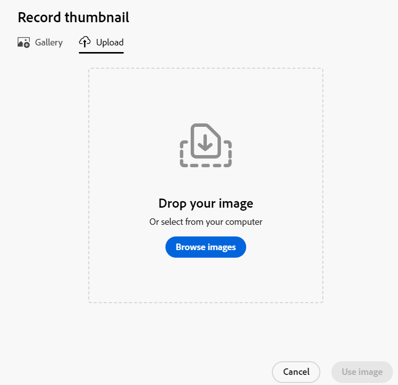
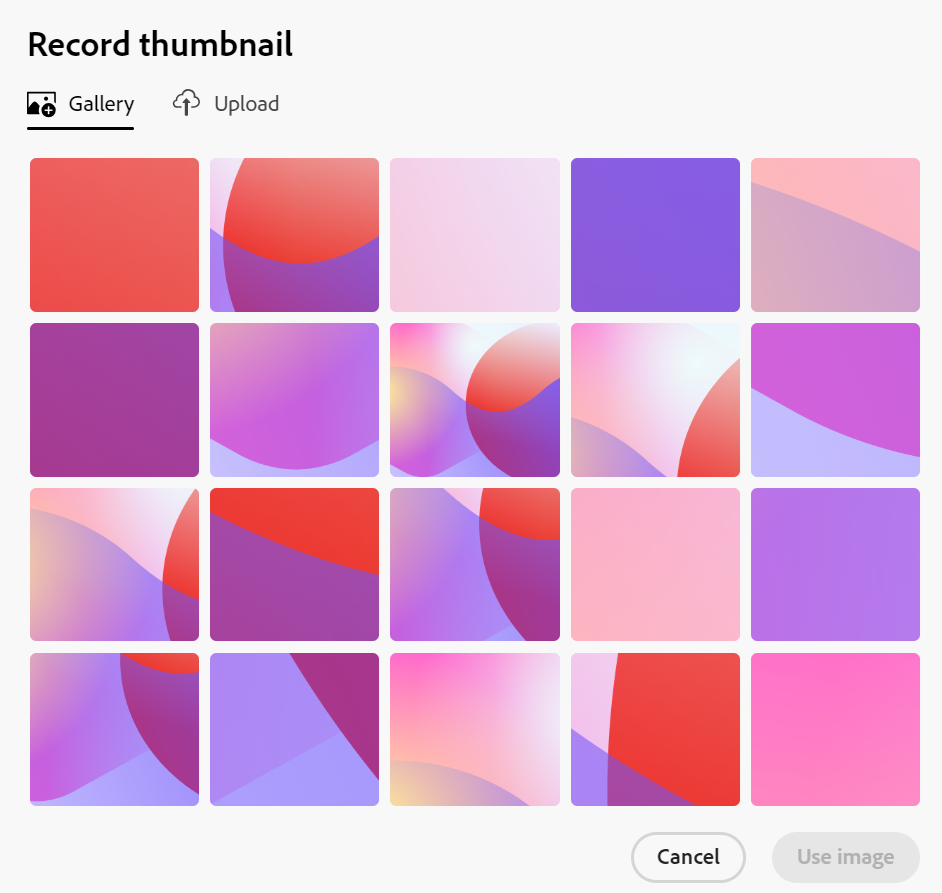

<!--update the metadata with real information-->

# Add a thumbnail to a record

{{planning-important-intro}}

You can associate records with unique thumbnails in Adobe Workfront Planning, to make them easily recognizable. 

You must create record types before you can start creating and editing records. 
For information, see [Create record types](/help/quicksilver/planning/architecture/create-record-types.md).

## Access requirements

<!--************double-check permissions here - asking Isk and Lilit what permissions users need for adding thumbnails-->

+++ Expand to view access requirements for Workfront Planning. 

<table style="table-layout:auto">
 <col>
 </col>
 <col>
 </col>
 <tbody>
    <tr>
<tr>
<td>
   
 Product
 </td>
   <td>
   
 Adobe Workfront
 </td>
  </tr>  
 <td role="rowheader">
Adobe Workfront agreement
</td>
   <td>

Your organization must be enrolled in the early access stage for Workfront Planning 

   </td>
  </tr>
  <tr>
   <td role="rowheader">
Adobe Workfront plan
</td>
   <td>

Any

   </td>
  </tr>
  <tr>
   <td role="rowheader">
Adobe Workfront license*
</td>
   <td>
   
New: Standard
 
   
Current: Plan

    
  </td>
  </tr>
  
  <tr>
   <td role="rowheader">
Access level configurations
</td>
   <td> 
There are no access controls for Workfront Planning 
  
</td>
  </tr>
<tr>
   <td role="rowheader">
Permissions
</td>
   <td> 
Manage permissions to a workspace 
  
   
System Administrators have permissions to all workspaces, including the ones they did not create

</td>
  </tr>
<tr>
   <td role="rowheader">
Layout template
</td>
   <td>  
All users, including Workfront administrators,  must be assigned a layout template that includes the Planning area in the Main Menu. 
 
For information, see <a href="/help/quicksilver/planning/access/access-overview.md">Access overview</a>. 
  
</td>
  </tr>

 </tbody>
</table>

*For more information, see [Access requirements in Workfornt documentation](/help/quicksilver/administration-and-setup/add-users/access-levels-and-object-permissions/access-level-requirements-in-documentation.md). 

+++

## Considerations about record thumbnails

To visually distinguish between records in a table view,  you can associate a unique thumbnail image with each record. 

Consider the following: 

* A thumbnail is unique to one record, and it does not apply to all records of the same type.
* You can add only image files as thumbnails.
   <!--above: when you know exactly what type of files are allowed, add the exact extensions above-->
* You can add a thumbnail image to individual records in the table view or from the record's page or preview box.
* Workfront automatically uploads a thumbnail image every time you create a record. You can later modify this image. 
* Thumbnails belong to the record information and they display in areas where records display. For example, thumbnails display alongside record information in the following areas:

   * The primary field of a record in the table view
   * The record bar in the timeline view. 
   * The record's details preview and page. 

## Add a thumbnail to a record

You can add a thumbnail in the following ways:

* [Add a thumbnail to a record from the table view](#add-a-thumbnail-to-a-record-from-the-table-view)
* [Add a thumbnail to a record from the details page](#add-a-thumbnail-to-a-record-from-the-details-page)

### Add a thumbnail to a record from the table view

{{step1-to-planning}}

1. Click the workspace for whose records you want to add thumbnails, then click the record type card. 

   This opens the record type page. 
1. Select a table view from the **View** drop-down menu. All records of the type you selected display in a table. 
1. Hover over the primary field information, click the **More** menu , then click **Thumbnail**. 

   

      >[!TIP]
      >
      >   The primary field is the field that displays in the first column of a table view. The primary field is always frozen and cannot be hidden or relocated. The Thumbnail option is not available in the More menu when the primary field is a formula field. 

   The **Upload** tab opens by default in the **Record thumbnail** box.

   For more information about uploading the thumbnail, see the section [Add a thumbnail to a record from the details page](#add-a-thumbnail-to-a-record-from-the-details-page) in this article, starting with Step 6. <!--see if this is accurate--> 

<!--
    

  *****update screen shot with correct casing****

1. Drag and drop a file to add as a thumbnail
   
   Or
   
   Click **Browse images**, then browse for an image file to add. The file must be saved on your computer. 
1. (Optional) After the image uploads in the **Record thumbnail** box, use the sizing tool to crop and resize the image.
1. (Optional) Click the **Upload new image** icon  to upload another image. 
1. (Optional) To remove a thumbnail before it is saved, click  **Remove uploaded image** icon  to the right of the image. 
1. (Optional) Click the **Gallery** tab, then click an image. The gallery of images cannot be modified.

   
1. Click **Use image** to add the image as a thumbnail. 
   This closes the **Record thumbnail** box.
   The thumbnail displays in areas of Workfront Planning where the record displays. 

   >[!TIP]
   >
   >   You must enable the Thumbnail field in the table view to display thumbnails in this view. It is disabled by default.

1. (Optional) To remove the thumbnail after it is saved, hover over the primary field and click the **More** menu > **Thumbnail** > the **Remove** icon , then click **Save changes**. -->

### Add a thumbnail to a record from the details page

{{step1-to-planning}}

1. Click the workspace for whose records you want to add thumbnails, then click the record type card. 

   This opens the record type page. 
1. From any view, click a record to open it. 

   The details preview box displays.
1. (Optional) Click the **Open in new tab** icon  in the upper-right corner.

   The record's details page opens. 
1. Hover over the thumbnail image or icon , then click the **More** menu  > **Edit thumbnail**. 

   The **Upload** tab opens by default in the **Record thumbnail** box. 

    

1. Drag and drop a file to add as a thumbnail
   
   Or
   
   Click **Browse images**, then browse for an image file to add. The file must be saved on your computer. 

1. (Optional) After the image uploads in the **Record thumbnail** box, use the sizing tool to crop and resize the image.
1. (Optional) Click the **Upload new image** icon  to upload another image. 
1. (Optional) Click the **Gallery** tab, then click an image. The gallery of images cannot be modified. 

   

1. (Optional) To remove the thumbnail before it is saved, click the **Remove** icon  to the right of the image. 

1. Click **Use image** to add the image as a thumbnail. 
   This closes the **Record thumbnail** box.
   The thumbnail displays in areas of Workfront Planning where the record displays. 

   >[!TIP]
   >
   >   You must enable the Thumbnail field in the table view to display thumbnails in this view. It is disabled by default.

1. (Optional) To remove the thumbnail after it is saved, click a record in any view to open the details page, then hover over the thumbnail image and click the **More** menu > **Remove** icon . The thumbnail image is removed. 

<!--
### Generate a thumbnail for a record

{{step1-to-planning}}

1. Click the workspace for whose records you want to add thumbnails, then click the record type card. 

   This opens the record type page. 
1. Select a table view from the **View** drop-down menu. All records of the type you selected display in a table. 
1. Hover over the primary field information, click the **More** menu , then click **Thumbnail**. 

   

      >[!TIP]
      >
      >   The primary field is the field that displays in the first column of a table view. The primary field is always frozen and cannot be hidden or relocated. 

   The **Record thumbnail** box opens.

(*************** update the screenshot below*************)
    

1. Click the **Generate** tab, and type a prompt describing the type of image you want to add in the space provided. 
1. Click **Generate**. 

   A set of four suggested images displays. 

1. Click an image to select it, then click **Use image**. 

   The Record thumbnail box closes and the thumbnail is attached to the record. All users who can view the records can now see the selected thumbnail. 
1. (Optional) Click the **More** menu  to the right of the record name in the table view, then click **Thumbnail**. 

   The generated image opens in the **Upload** tab where you can modify or remove it, as described in the section [Upload a thumbnail to a record](#upload-a-thumbnail-to-a-record) in this article. 
--> 