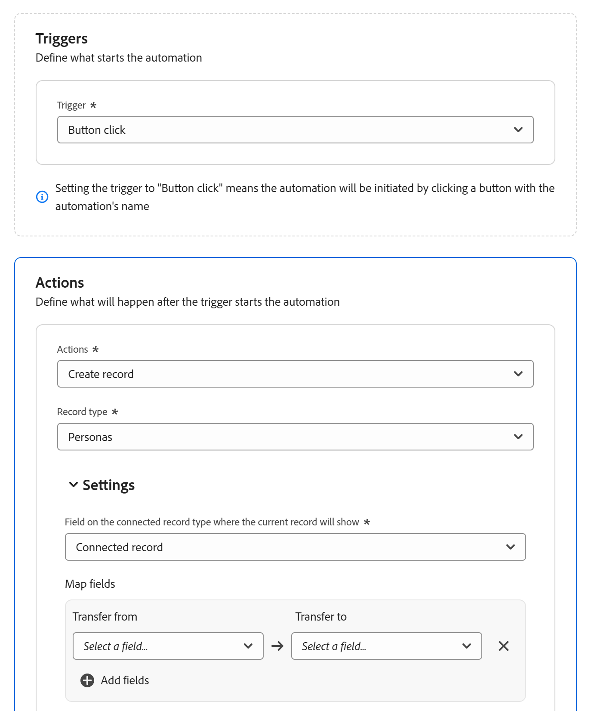
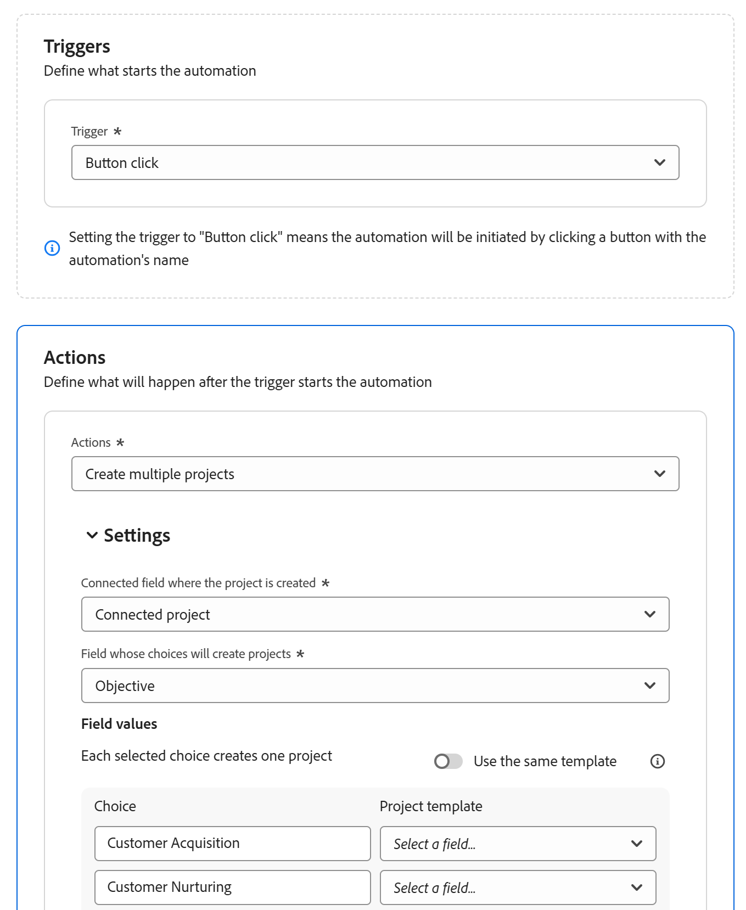

# Configure Adobe Workfront Planning automations

<!--add screen shots when UI is finalized AND redo all the steps - some things got changed and moved around-->

<!--you might need to add something about notifications and emails?!-->
<!--add a new section to this article to mention a new way to create objects: help/quicksilver/planning/records/create-records.md-->
<!-- add a new section to this article to mention a new way to create WF objects from Planning: help/quicksilver/planning/records/create-workfront-objects-from-workfront-planning.md-->

<!-- if they give access to use the automation to people with LESS than Manage permissions to a workspace, split this article in two: the Configure section should be for admins and the "Use a Workfront Planning automation to create an object" should be for all other users-->

<!--The highlighted information on this page refers to functionality not yet generally available. It is available only in the Preview environment for all customers. After the monthly releases to Production, the same features are also available in the Production environment for customers who enabled fast releases.    

For information about fast releases, see [Enable or disable fast releases for your organization](/help/quicksilver/administration-and-setup/set-up-workfront/configure-system-defaults/enable-fast-release-process.md). -->

You can configure automations in Adobe Workfront Planning that, when activated, create objects in Workfront or records in Workfront Planning when triggered from a Planning record. The created objects or records are automatically connected to the records you are triggering the automation from. 

You can configure and activate the automation in the record type's page in Workfront Planning. 

For example, you could create an automation that takes a Workfront Planning campaign and creates a project in Workfront to track that campaign's progress. 

This article describes how you can manage automations, including how to edit, disable, delete, and trigger them to create objects and records.

For information about how you create records or objects using an existing automation, see [Create objects using Adobe Workfront Planning record automations](/help/quicksilver/planning/records/create-wf-objects-using-planning-automations.md). 

## Access requirements

+++ Expand to view the access requirements for the functionality in this article. 

<table style="table-layout:auto"> 
<col> 
</col> 
<col> 
</col> 
<tbody> 
    <tr> 
<tr> 
</tr>   
<tr> 
   <td role="rowheader">
Adobe Workfront package
</td> 
   <td> 

Any Workfront and any Planning package
 
Any Workflow and any Planning package

For more information about what is included in each Workfront Planning package, contact your Workfront account representative. 
 
   </td> 
  <tr> 
   <td role="rowheader">
Adobe Workfront license
</td> 
   <td>
Standard

   </td> 
  </tr> 
  <tr> 
   <td role="rowheader">
Object permissions
</td> 
   <td> 
Manage permissions to the workspace and to the record type where you want to create automations. 

   
System Administrators have Manage permissions to all workspaces, including the ones they did not create

   </td> 
  </tr>  
</tbody> 
</table> 

For more information about Workfront access requirements, see [Access requirements in Workfront documentation](/help/quicksilver/administration-and-setup/add-users/access-levels-and-object-permissions/access-level-requirements-in-documentation.md).

+++   

<!--Old:
<table style="table-layout:auto"> 
<col> 
</col> 
<col> 
</col> 
<tbody> 
    <tr> 
<tr> 
<td> 
   
 Products
 </td> 
   <td> 
   <ul><li>
 Adobe Workfront
</li> 
   <li>
 Adobe Workfront Planning
</li></ul></td> 
  </tr>   
<tr> 
   <td role="rowheader">
Adobe Workfront plan*
</td> 
   <td> 

Any of the following Workfront plans:
 
<ul><li>Select</li> 
<li>Prime</li> 
<li>Ultimate</li></ul> 

Workfront Planning is not available for legacy Workfront plans
 
   </td> 
<tr> 
   <td role="rowheader">
Adobe Workfront Planning package*
</td> 
   <td> 

Any 
 

For more information about what is included in each Workfront Planning plan, contact your Workfront account manager. 
 
   </td> 
 <tr> 
   <td role="rowheader">
Adobe Workfront platform
</td> 
   <td> 

Your organization's instance of Workfront must be onboarded to the Adobe Unified Experience to be able to access Workfront Planning.
 

For more information, see <a href="/help/quicksilver/workfront-basics/navigate-workfront/workfront-navigation/adobe-unified-experience.md">Adobe Unified Experience for Workfront</a>. 
 
   </td> 
   </tr> 
  </tr> 
  <tr> 
   <td role="rowheader">
Adobe Workfront license*
</td> 
   <td> Standard
   
Workfront Planning is not available for legacy Workfront licenses
 
  </td> 
  </tr> 
  <tr> 
   <td role="rowheader">
Access level configuration
</td> 
   <td> 
There are no access level controls for Adobe Workfront Planning
 
   
Edit access with access to Create objects in Workfront for the object types that you want to create (projects, portfolios, programs). 
  
</td> 
  </tr> 
<tr> 
   <td role="rowheader">
Object permissions
</td> 
   <td> 
Manage permissions to the workspace and to the record type where you want to create automations. 

   
System Administrators have Manage permissions to all workspaces, including the ones they did not create

   </td> 
  </tr> 
</tbody> 
</table> -->

## Configure an automation in Workfront Planning

You must configure an automation for a record type in Workfront Planning before you can use it to create objects.

{{step1-to-planning}}

1. Click a record type card, then click the name of a record. 

   The record type page opens. 
1. Click the **More** menu  to the right of the record type name, then click **Manage automations**. 

   The list of available automations for the selected record type opens.

1. Click **New automation** in the upper-right corner of the screen. The **New automation** box opens.
1. Update the following fields:

   * Replace **Untitled automation** with the text that you want to appear on the automation button. Users will click this button when using the automation to create a Workfront object or a Planning record.
   * **Description**: Add a description to identify the purpose of the automation.
1. Click **Save**.
   The automation details page opens. 

1. On the automation's details page, update the following fields in the **Triggers** section: 

   * **Trigger**: Select the action that will trigger the automation. For example, select **Button click**. <!--update this step with a list of all possible triggers; right now only Button click is available-->

1. Update the following fields in the **Actions** section: <!--submitted bugs for these fields - see if they need changing here-->
   * **Actions**: Select the action that you want Workfront to perform when triggering the automation. This is a required field. 
   Select one of the following actions: 

      * Create multiple projects
      * Create a single project
      * Create project
      * Create record
      * Create program
      * Create portfolio
      * Create group
         
     >[!TIP]
     >
     >After you saved the automation, you can no longer change the action selected in this field.

1. (Conditional) Depending on what action you selected, update the following fields:

   * **Create a single project**: <!--replace to the left: Create a single project-->
      * **Connected field where the project is created**: This is the connected field where the new project will display. This is a required field. 
      * **Project template**: Select a project template that Workfront will use to create the project.  
   
   * Create multiple projects:
      * **Connected field where the project is created**: This is the connected field where the new project will display. This is a required field. 
      * **Field whose choices will create the records**: Choose a multi- or single-select field from the selected record type. Workfront creates a project for each field choice that is currently selected on the record from where you trigger the automation. 

      >[!TIP]
      >
      >A project is created only for the options that are currently selected on the multi- or single-select field of the record you are running the automation from, and not for all possible choices for that field.
      >

      * **Use the same template**: Select this option to use the same template for each new project. If the option is deselected, select a **Project template** for each field choice.   
      * **Project template**: If you selected the **Use the same template** option, select a project template that Workfront will use to create the projects. 
   
   * **Create portfolio**:
      * **Connected field where the portfolio is created**: This is the connected field where the new portfolio will display. This is a required field.
      * **Custom form to attach to the new portfolio**: Select a custom form to attach to the new portfolio. You must create a portfolio custom form before you can select it. 
   * **Create program**: 
      * **Connected field where the program is created**: This is the connected field where the new program will display. This is a required field.
      * **Program portfolio**: Select a portfolio where the new program will be added. This is a required field.
      * **Custom form to attach to the new program**: Select a custom form to attach to the new program. You must create a program custom form before you can select it. 
   * **Create group**:
      * **Connected field where the group is created**: This is the connected field where the new group will display. This is a required field.
      * **Custom form to attach to the new group**: Select a custom form to attach to the new program. You must create a program custom form before you can select it. 
   * **Create record**: 
      * **Record type**: Select the record type you want to create. 

         The **Settings** sub-section displays. Update the following fields in the **Settings** sub-section: 

         * **Field on the connected record type where the current record will show**: This is the connected field on the record type selected for the action where the current record will display. 
      
         For example, if you are creating an automation for campaigns to connect Product records from, this is the connected field on the Product record type where the campaigns will display, after the products are created using the automation. 
      
         This is a required field. 
      
         <!--submitted a change in functionality and UI text for this - revise??-->
         In the **Map fields** area, update the following information: 

         * **Transfer from**: Select fields from the record type the automation is created for to map them to the fields of the connected record type. 
         * **Transfer to**: Select fields from the newly created record that will populate with information from the record you are running the automation from. 

         >[!TIP]
         >
         >* The field types from the original record type must match the field types from the newly created record type.
         >* If you choose no fields, the names of the new records will be **Untitled record**.

1. (Optional and conditional) If you selected to create a record, click **Add fields** to map additional lookup fields from one record to another.
1. (Conditional) If there are no connection fields between the original record type and the record type selected in the **Record type** field, click **Add connected field**. 

   

   The following two fields are created: 

   * A new connection field named **Connected record** is created for the record type you indicated in the **Record type** field.
   * A new connection field with the same name as the one indicated in the **Record type** field is created for the record type you are configuring the automation for. 

      For example, if you are configuring an automation for Campaigns to automatically create another record type called Brands and you click **Add connected field**, the following fields are created: 
      
      * The **Connected record** connection field is created for the **Brands** record type.
      * The **Brands** connection field is created for the **Campaigns** record type. 
   
1. (Optional) If there are no connection fields between the original record type and the Workfront object selected in the Actions area, click **Add connected field**. 

   

   The following are created: 

   * A new connection field named **Connected < name of Workfront object >** is created for the record type you build the automation for. For example, a **Connected project** field is created for the record type you're building the automation for, when you choose to automatically create projects. 
   * A new record type card is added to the Planning section of a Workfront project, in Workfront with the name of the record type you are configuring the automation for. 

1. Click **Save** in the upper-right corner of the automation details page. 

   The automation displays on the list of automations, and is available to use in records.

## Manage existing automations

{{step1-to-planning}}

1. Click a record type card, then click the name of a record. 

   The record type page opens. 
1. Click the **More** menu  to the right of the record type name, then click **Manage automations**. 

   The list of available automations for the selected record type opens.

1. (Optional) To edit, disable, or delete an automation, do one of the following:

   1. From the list of automations, hover over the name of a saved automation, then click the **More** menu .

   1. Click **Edit** to update the following information:
   
      * Click the **More** menu  to the right of the automation name, then click **Edit** to change the name of the automation. 
      * Any fields in the automation, except for the **Actions** field.

         >[!TIP]
         >
         >You cannot change the action you originally selected for an automation. 
   

   1. Click **Disable** to remove the automation from the record's table view and prevent users from using it to create records or objects. 

      Records that have been created using a disabled automation remain connected to the record originally selected.
   
      To make it available again, click the **More** menu  again, then click **Activate**.
   1. Click **Delete** to delete the automation. A deleted automation cannot be recovered. 
   
      Records that have been created using a deleted automation remain connected to the record originally selected.
