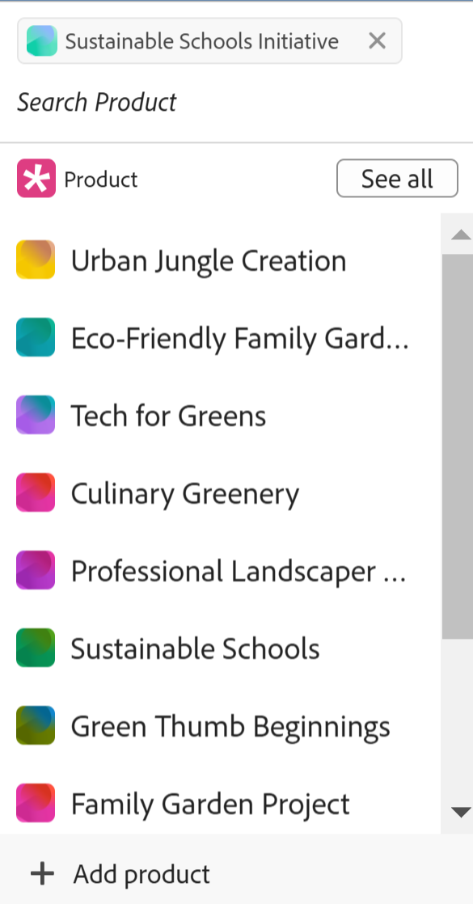
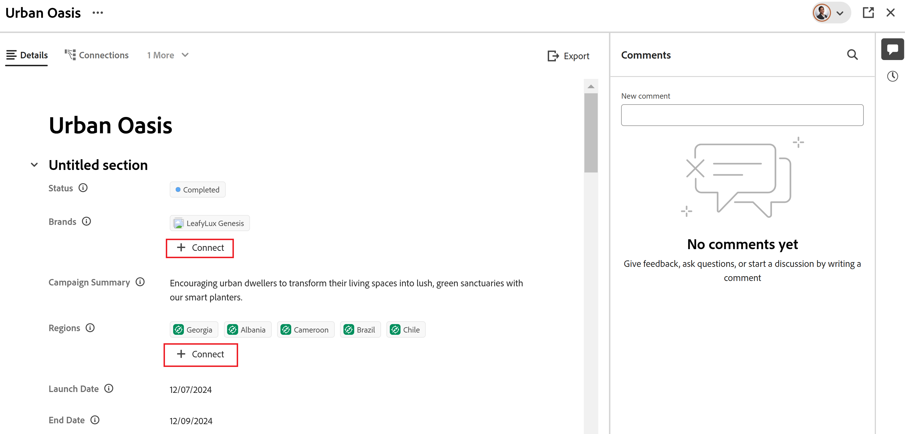
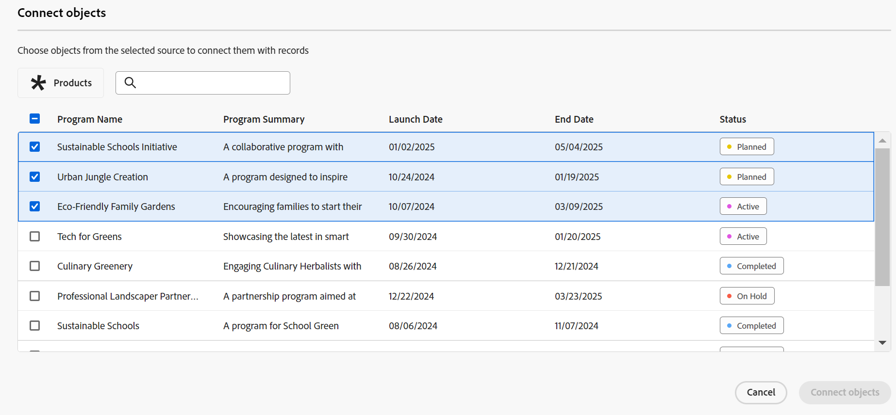
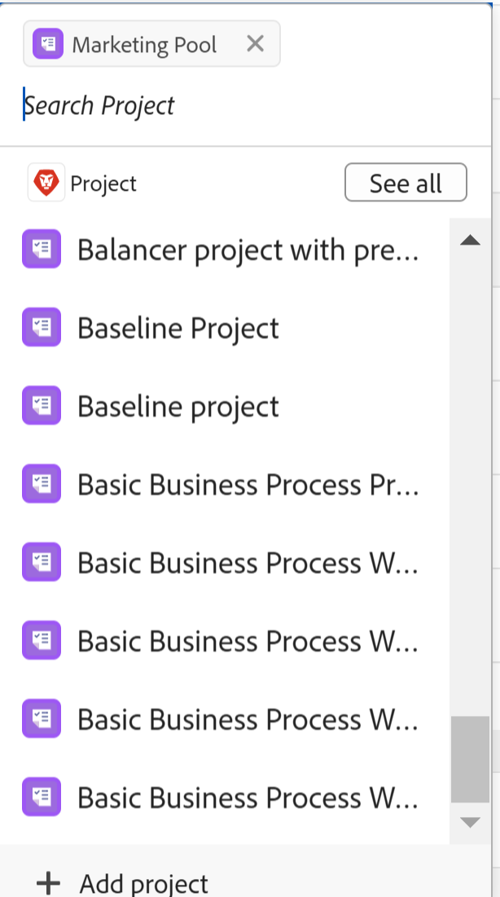
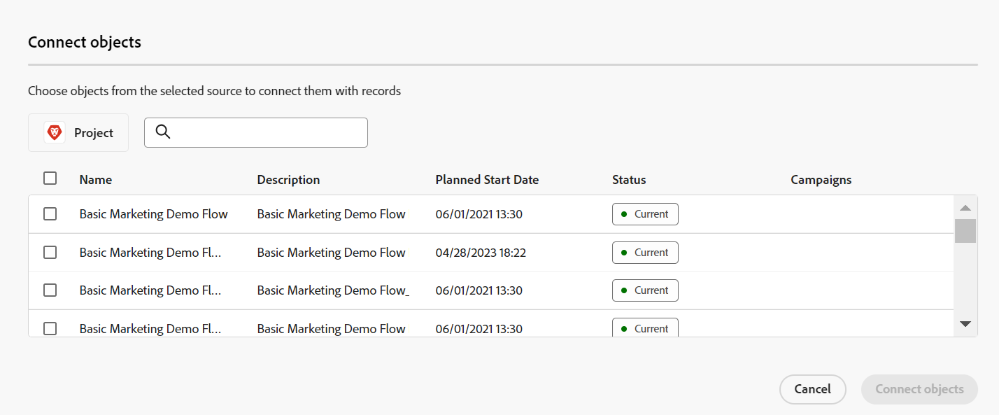
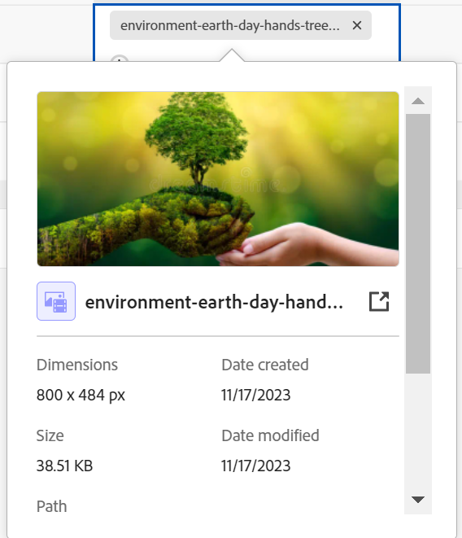
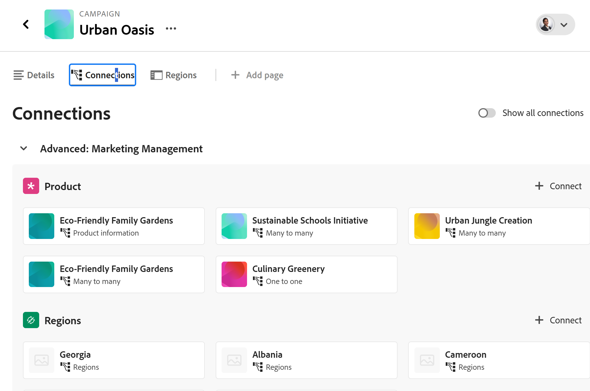
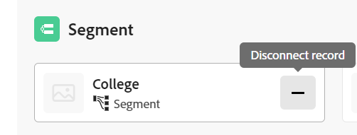

<!--when you make this live, update the metadata above to this: 
---
title: Connect records and objects
description: In addition to connecting records to one another, you can also connect records to objects from other applications.  
topic: Architecture
role: User
hidefromtoc: yes
hide: yes
---
-->
<!--update the metadata with real information when making this available in TOC and in the left nav-->

# Connect records 

{{planning-important-intro}}

You can connect Adobe Workfront Planning records to one another or to objects from other applications. 

This article describes how you can connect records. For more general information about connecting records, see [Connected records overview](/help/quicksilver/planning/records/connected-records-overview.md). 

You must first connect two record types to each other, or a record type to an object type from another application. This creates linked record fields. You can then connect records to one another or records to other objects from other applications using the linked record fields. 

Connecting records is similar to connecting records to objects from another application. 

For information about connecting record types to one another or to object types from other applications, see [Connect record types](/help/quicksilver/planning/architecture/connect-record-types.md). 

For an example of connecting record types, see [Example of connecting record types and records](/help/quicksilver/planning/architecture/example-connect-record-types-and-records.md).

You can connect the following: 

* Adobe Workfront Planning records
* Adobe Workfront Planning records with objects from other applications. 

  You can connect records to objects of the types listed below from the following applications:
  
  * Adobe Workfront

    * Projects
    * Portfolios
    * Programs
    * Company
    * Group

  * Adobe Experience Manager Assets

    * Image files
    * Folders

  <!--when you add more objects, fix the Access Requirements below which right now refer only to projects-->

## Access requirements

+++ Expand to view access requirements for Workfront Planning. 

You must have the following to be able to access Workfront Planning:  

 <table style="table-layout:auto"> 
<col> 
</col> 
<col> 
</col> 
<tbody> 
    <tr> 
<tr> 
<td> 
   
 Products
 </td> 
   <td> 
   <ul><li>
 Adobe Workfront
</li> 
   <li>
 Adobe Workfront Planning
</li></ul></td> 
  </tr>   
<tr> 
   <td role="rowheader">
Adobe Workfront plan*
</td> 
   <td> 

Any of the following Workfront plans:
 
<ul><li>Select</li> 
<li>Prime</li> 
<li>Ultimate</li></ul> 

Workfront Planning is not available for legacy Workfront plans
 
   </td> 
<tr> 
   <td role="rowheader">
Adobe Workfront Planning plan*
</td> 
   <td> 

Any 
 

For more information about what is included in each Workfront Planning plan, see <a href="https://business.adobe.com/products/workfront/pricing.html">Adobe Workfront pricing and packaging</a>. 
 
   </td> 
 <tr> 
   <td role="rowheader">
Adobe Workfront platform
</td> 
   <td> 

Your organization's instance of Workfront must be onboarded to the Adobe Unified Experience to be able to access all the capabilities of Workfront Planning.
 

For more information, see <a href="/help/quicksilver/workfront-basics/navigate-workfront/workfront-navigation/adobe-unified-experience.md">Adobe Unified Experience for Workfront</a>. 
 
   </td> 
   </tr> 
  </tr> 
  <tr> 
   <td role="rowheader">
Adobe Workfront license*
</td> 
   <td> Standard
   
Workfront Planning is not available for legacy Workfront licenses
 
  </td> 
  </tr> 
  <tr> 
   <td role="rowheader">
Access level configuration
</td> 
   <td> 
There are no access level controls for Adobe Workfront Planning
   
</td> 
  </tr> 
<tr> 
   <td role="rowheader">
Object permissions
</td> 
   <td>   
Manage permissions to a workspace to connect records 
  
   
View or higher permissions to a workspace to view all connections to objects and fields from other applications, regardless of your access in the other application. 

   
View or higher permissions to the objects you want to link from Workfront or Experience Manager Assets. 

   
System Administrators have permissions to all workspaces, including the ones they did not create.
 </td> 
  </tr> 
<tr> 
   <td role="rowheader">
Layout template
</td> 
   <td> 
All users, including Workfront administrators,  must be assigned a layout template that includes the Planning area in the Main Menu 
 </td> 
  </tr> 
</tbody> 
</table> 

 *For more information about Workfront access requirements, see [Access requirements in Workfront documentation](/help/quicksilver/administration-and-setup/add-users/access-levels-and-object-permissions/access-level-requirements-in-documentation.md).   

<!--OLD:

<table style="table-layout:auto">
 <col>
 </col>
 <col>
 </col>
 <tbody>
    <tr>
<tr>
<td>Product
 </td>
   <td>
   
 Adobe Workfront
 
   
To connect Adobe Workfront Planning records with Experience Manager Assets, you must have an Adobe Experience Manager Assets license and your organization's instance of Workfront must be onboarded to the Adobe Unified Experience. For information, see <a href="/help/quicksilver/workfront-basics/navigate-workfront/workfront-navigation/adobe-unified-experience.md">Adobe Unified Experience for Workfront</a>.

   </td>
  </tr>  
 <td role="rowheader">
Adobe Workfront agreement
</td>
   <td>

Your organization must be enrolled in the early access stage for Workfront Planning 

   </td>
  </tr>
  <tr>
   <td role="rowheader">
Adobe Workfront plan
</td>
   <td>

Any

   </td>
  </tr>
  <tr>
   <td role="rowheader">
Adobe Workfront license*
</td>
   <td>
   
New: Standard

   
Current: Plan
 
  </td>
  </tr>
  
  <tr>
   <td role="rowheader">
Access level configuration
</td>
   <td> 
There are no access level controls for Workfront Planning
  
</td>
  </tr>
<tr>
   <td role="rowheader">
Permissions
</td>
   <td> 
Manage permissions to a workspace to connect records 
  
   
View or higher permissions to a workspace to view all connections to objects and fields from other applications, regardless of your access in the other application. 

   
View or higher permissions to the objects you want to link from Workfront or Experience Manager Assets. 

   
System Administrators have permissions to all workspaces, including the ones they did not create.

</td>
  </tr>

<tr>
   <td role="rowheader">
Layout template
</td>
   <td> 
Your Workfront or group administrator must add the Planning area in your layout template. For information, see <a href="/help/quicksilver/planning/access/access-overview.md">Access overview</a>. 
  
</td>
  </tr>

 </tbody>
</table>

*For more information, see [Access requirements in Workfront documentation](/help/quicksilver/administration-and-setup/add-users/access-levels-and-object-permissions/access-level-requirements-in-documentation.md). -->

+++

## Prerequisites for connecting records

To connect records with other records or objects, you must have the following:

* At least one workspace, record type, and record. 

  For more information, see the following articles:

  * [Create workspaces](/help/quicksilver/planning/architecture/create-workspaces.md)
  * [Create record types](/help/quicksilver/planning/architecture/create-record-types.md)
  * [Create records](/help/quicksilver/planning/records/create-records.md)

* Connections between record types, or between record types and objects from other applications. For information, see [Connect record types](/help/quicksilver/planning/architecture/connect-record-types.md).

## Connect records from Workfront Planning

You can connect records from Workfront Planning in the following areas of a Planning record:

* The connected record fields in the table view.
* The record's preview or page in the connected record fields on the Details tab.
* The record's preview or page on the Connections tab.

### Connect Adobe Workfront Planning records from the table view or the Details tab of the record page

{{step1-to-planning}}

1. Click the workspace whose records you want to connect

    The workspace opens and the record types display as cards.
1. Click the card of a record type to open the record type page. 
1. Click the name of a table view to open it. 
1. (Optional) Add records to the record type that you selected by adding a new row to the table. For information, see [Create records](/help/quicksilver/planning/records/create-records.md). 
1. (Conditional) After you connected the selected record type with another record type, go to the linked record column and double-click the cell corresponding to the record that you want to link with other records.

    

1. Do one of the following:

    * Click a connected record's name from the list to add it to the selected record. The record is added automatically.
    * Start typing the name of a record and click it when it displays in the list. The record is added automatically. 

1. (Optional) If you cannot find a record or an object to connect, and you want to add it, click **+ Add** to add a new record. For more information, see the "Create records as you connect them" in the article [Create records](/help/quicksilver/planning/records/create-records.md).
    
    >[!TIP]
    >
    >    You can open a record's page and connect other records by doing the following in the table view:
    >1. Click the name of the record in the view.
    >1. Find the linked record field and double-click the field (if there are records already connected)
    >Or
    >Click **Connect records** (if the field is empty) to add records from the connected record or object type. 
    >
    >

1. (Optional) Click **See all** to display all records. 

1. (Conditional) If you clicked **See all** in the previous step, the **Connect objects** box displays. 

    

1. Start typing the name of a record in the search box, then select it when it displays in the list

    Or

    Select the name of one or multiple records in the box, then click **Connect objects**.

    The following are added:

    * The linked records display in the linked record field of the record that you selected in a previous step. 
    * The linked fields are populated with the information from the linked records, if you added linked lookup fields when you connected the record types. 
    
    Updating the linked records updates the linked fields for the records that you are linking from automatically. You cannot manually edit linked fields. 
        
      >[!TIP]
      >
      >*  We use "linked fields" and "lookup fields" interchangeably. 
      >
      >* When you choose to connect multiple records when you connected the record types, the field values from the multiple objects are either displayed separated by commas or are aggregated according to the aggregator you chose when connecting the record types.
    
1. (Optional) Close the record type page and go to the workspace you selected. 
1. Click the card for the record type that you linked to. 

    For example, if you connected the **Campaign** record with the Product record, click the **Product** card. 
  
    The record type card should open in the table view. If not, select a table view. 
  
    Notice that the **Campaign** linked record field displays the names of the campaigns you linked to products in the Product record type page. Updating the Campaign information automatically updates the Campaign linked record field for the Product record type.

### Connect Adobe Workfront Planning records to Workfront objects from the table view or the Details tab of the record page

<!--when we will have more applications to link to from Planning, change the title to something like: Connect Workfront Planning records to objects from other applications-->

After you created a connection between a record type and a Workfront object type, you can connect individual records to objects in Workfront. The Workfront fields you connected are automatically populated on the records you are linking the objects from.

>[!NOTE]
>
>You cannot connect Workfront object types with Workfront Planning record types from Workfront.

{{step1-to-planning}}

1. Click the workspace whose records you want to connect.

    The workspace opens and the record types display as cards.
1. Click the card of a record type to open the record type page. 
1. Select a **Table** view from the **View** drop-down menu.

1. Click **New record**  to add individual records to the record type that you selected. For information, see [Create records](/help/quicksilver/planning/records/create-records.md). 

1. (Conditional) After you connected the selected record type with a Workfront object type, go to  the linked object column and double-click the cell corresponding to the record that you want to link with objects from Workfront.

    

1. Do one of the following:

    * Click an object from the list to add it to the selected record. Objects are listed alphabetically. The object is added automatically.
    * Start typing the name of an object and click it when it displays in the list. The object is added automatically. 

    >[!TIP]
    >
    >You can open a record's page from the view, double-click the linked record field, or click **Connect** in the field to add objects from the connected object type.

1. (Optional) If you cannot find an object to connect, and you want to add it, click **+ Add** to create and add a new project or portfolio. 

    You can only add projects without a template or portfolios when connecting them to Planning records. You cannot add new programs, users, or companies. 

1. (Optional) Click **See all** to display all objects you have at least permissions to view.

1. (Conditional) If you clicked **See all** in the previous step, the **Connect objects** box displays. 

    

1. Start typing the name of a Workfront object in the search box, then select it when it displays in the list

    Or

    Select the name of one or multiple objects in the box, then click **Connect objects**. 

    >[!IMPORTANT]
    >
    >* You can only add Workfront objects you have access to view. 
    >
    >* Once you add Workfront objects, everyone with View or higher permissions to the workspace can view the Workfront objects and their field information, regardless of their permissions or access in Workfront.

    The following are added: 

    * The selected Workfront objects are added to the linked record field. 
    * If you added them when you connected the record type with Workfront, the linked fields (or the lookup fields) of the Workfront objects are automatically populated with information from Workfront.

    For more information about connecting record types with objects from another application, see [Connect record types](/help/quicksilver/planning/architecture/connect-record-types.md).
     
1. (Optional) Click the name of a Workfront object connected to a Workfront Planning record either in the linked field of a table view or from the linked field in the record page.

    This opens the Workfront object in Workfront, if you have at least View permissions to the object. 

   >[!TIP]
   >
   >* When you choose to connect multiple records when connecting the record types, the values of the lookup fields are either displayed separated by commas or are aggregated according to the aggregator you chose.
   >
   >* A linked record field is not created for the linked Workfront objects in Workfront.

1. (Optional) From the table view of the record type, hover over the column header of the linked Workfront object, and click the drop-down menu, then click **Edit lookup fields**.

1. Add Workfront object fields from the **Unselected fields** area

    Or

    Remove Workfront object fields fro the **Selected fields** area. 

    This adds or removes linked fields from the Workfront Planning records. The information associated with the removed fields remains in Workfront. 

### Connect Workfront Planning records to Adobe Experience Manager objects from the table view or the Details tab of the record page

<!--when we will have more applications to link to from Planning, change the title to something like: Connect Workfront Planning records to objects from other applications-->

>[!IMPORTANT]
>
>You must have an Adobe Experience Manager Assets license, and your organization's instance of Workfront must be onboarded to the Adobe Business Platform or the Adobe Admin Console to be able to connect Workfront Planning records to Adobe Experience Manager Assets.
>
>If you have questions about onboarding to the Adobe Admin Console, see the [Adobe Unified Experience FAQ](/help/quicksilver/workfront-basics/navigate-workfront/workfront-navigation/unified-experience-faq.md).

After you create a connection between a record type and Adobe Experience Manager Assets, you can connect individual records to Experience Manager assets. The asset fields you connected from Experience Manager Assets when you created the connection automatically populate on the record type you linked from.

>[!NOTE]
>
>Planning records and their fields are accessible from Experience Manager Assets when your Workfront administrator configures the metadata mapping through the integration between Workfront and Adobe Experience Manager Assets. For more information, see [Configure asset metadata mapping between Adobe Workfront and Experience Manager Assets](https://experienceleague.adobe.com/docs/experience-manager-cloud-service/content/assets/integrations/configure-asset-metadata-mapping.html?lang=en).

To connect records with AEM assets: 

{{step1-to-planning}}

1. Click the workspace whose records you want to connect. 

    The workspace opens and the record types display.
1. Click the card of a record type to open the record type page. 
1. Select a **Table** view from the **View** drop-down menu in the upper-right corner of the record type page.

1. (Optional) Click **New record** to add new records to the record type that you selected. For information, see [Create records](/help/quicksilver/planning/records/create-records.md). 
1. (Conditional) After you connected the selected record type with Experience Manager Assets, go to the linked object column and hover over the cell corresponding to the record that you want to link with other objects from Experience Manager, then click the **+** icon. 

    >[!TIP]
    >
    >  You can add click the **+** icon in the linked object field in the record page to connect assets to the record.

    The **Select Assets** box displays. <!--we might change this to Connect assets-->

    

1. Click to select some of the following types of assets:

    * Images
    * Folders

    You can select multiple assets. 

    >[!IMPORTANT]
    >
    > You can connect only assets you have access to view in Experience Manager. Once connected, all Workfront Planning users can view the assets in Workfront Planning, regardless of their access in Experience Manager Assets. 

1. Click **Select**. <!-- we might change this to Connect-->

    The following are added: 

    * The selected Experience Manager assets are added to the linked record field. 
    * The linked fields (or lookup fields) populate with information from the Experience Manager connected assets. 
    
      Any existing information from the fields of the Experience Manager assets displays in the linked or lookup fields automatically. 

      >[!TIP]
      >
      >* When you select to connect multiple records when connecting the record types, the values of the multiple objects display either separated by commas or aggregated according to the aggregator you choose.
      >
      >* A linked record field to the Workfront Planning linked records is not created for the linked Experience Manager assets in the Experience Manager Assets application. 
     
1. (Optional) Go to the record type you linked to Experience Manager Assets from and click the name of an asset in the linked record field. The Experience Manager details of the asset display in a pop-up window. 

    

    The following fields display for an image file:

    * A thumbnail of the image
    * The image file name
    * Dimensions
    * Size
    * Description
    * The file path in Experience Manager
    * The asset type
    * Date created
    * Date modified 

1. (Optional) To open the Experience Manager assets record page in Experience Manager, go to the record type page of the record you are linking from, click the name of an asset in the linked record field to open the pop-up window, then click the **Open in AEM** icon  to open the asset. 

   This opens the Experience Manager asset in Adobe Experience Manager Assets.  

1. (Optional) From the table view of the record type, hover over the column header of the linked Experience Manager asset, and click the drop-down menu, then click **Edit lookup fields**.

1. Add Experience Manager Assets object fields from the **Unselected fields** area

    Or

    Remove Workfront object fields fro the **Selected fields** area. 

    This adds or removes linked fields from the records. The information associated with the removed fields remains in Adobe Experience Assets.

### Connect Workfront Planning records with other records or object from the Connections tab of the record page

1. Go to any view of a record type that has been connected to other Planning record types or object types from other applications. 
1. Follow the steps described in the previous subsections to find a record in the view that you want to connect with other records or objects. 
1. Click the name of a record. 

    The preview page opens. 
1. (Optional) Click the **Open in new tab** icon  to open the record's page. 
1. Click the **Connections** tab in the record's preview or page. 

    

    All record or object types that are linked to the selected record type display as sections. Connected records or objects display under their record or object type names on cards. 

    >[!TIP]
    >
    >    Only connected records that have individual records connected display by default.

1. (Optional) Click **Show all connections** to show all connected record types, including the ones without connected records. 

1. (Optional) Click the downward-pointing arrow to the left of a section to collapse it. 

1. (Conditional) Click **Connect** to add more records or objects of the same type. 
1. Follow the steps described in the previous sections to connect records from Workfront Planning or objects from Workfront or Experience Manager Assets. 
    The records and objects are added immediately.
1. (Optional) Hover over the connected card of a record or object, then click the **Disconnect record** icon **-** to disconnect it from the selected record. 

    

    The record is immediately disconnected from all areas of Workfront Planning or from other applications where it might show as connected. Any lookup field values are also removed. 

## Connect records from Workfront objects

You must have the following to connect Workfront Planning records from Workfront objects: 

* Connections between record types and Workfront object types that are established in Workfront Planning.
* Your Workfront or group administrator must add the Planning section to the Workfront projects, portfolios, and programs in your Layout Template. 

For more information, see [Manage records in the Planning section of Adobe Workfront objects](/help/quicksilver/planning/records/manage-records-in-planning-section.md).
