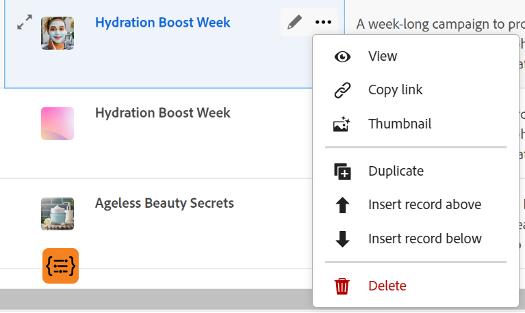
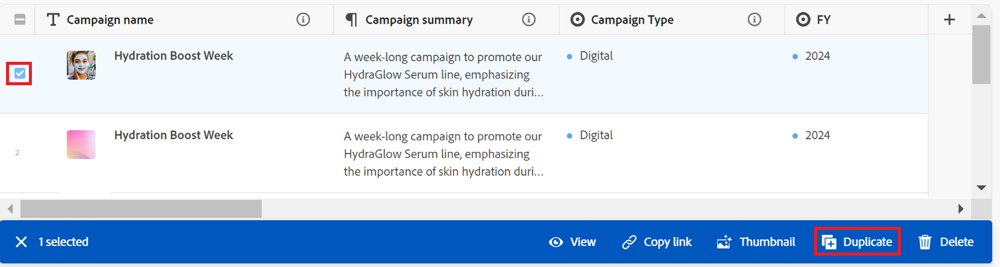

# Duplicate records

<!--The highlighted information on this page refers to functionality not yet generally available. It is available only in the Preview environment for all customers. After the monthly releases to Production, the same features are also available in the Production environment for customers who enabled fast releases.    

For information about fast releases, see [Enable or disable fast releases for your organization](/help/quicksilver/administration-and-setup/set-up-workfront/configure-system-defaults/enable-fast-release-process.md). -->

{{planning-important-intro}}

In Adobe Workfront Planning, a record is an instance of a record type. 

You can duplicate an existing record in the table view. An identical copy of the existing record is added to the record type page.

## Access requirements

+++ Expand to view the access requirements for the functionality in this article. 

<table style="table-layout:auto"> 
<col> 
</col> 
<col> 
</col> 
<tbody> 
    <tr> 
<tr> 
</tr>   
<tr> 
   <td role="rowheader">
Adobe Workfront package
</td> 
   <td> 

Any Workfront and any Planning package
 
Any Workflow and any Planning package

For more information about what is included in each Workfront Planning package, contact your Workfront account representative. 
 
   </td> 
  <tr> 
   <td role="rowheader">
Adobe Workfront license
</td> 
   <td>
Standard

   </td> 
  </tr> 
  <tr> 
   <td role="rowheader">
Object permissions
</td> 
   <td>   
Contribute or higher permissions to a workspace and record type  
  
   
System Administrators have permissions to all workspaces, including the ones they did not create
 </td> 
  </tr>   
</tbody> 
</table> 

For more information about Workfront access requirements, see [Access requirements in Workfront documentation](/help/quicksilver/administration-and-setup/add-users/access-levels-and-object-permissions/access-level-requirements-in-documentation.md).

+++   

<!--Old:

<table style="table-layout:auto"> 
<col> 
</col> 
<col> 
</col> 
<tbody> 
    <tr> 
<tr> 
<td> 
   
 Products
 </td> 
   <td> 
   <ul><li>
 Adobe Workfront
</li> 
   <li>
 Adobe Workfront Planning
</li></ul></td> 
  </tr>   
<tr> 
   <td role="rowheader">
Adobe Workfront plan*
</td> 
   <td> 

Any of the following Workfront plans:
 
<ul><li>Select</li> 
<li>Prime</li> 
<li>Ultimate</li></ul> 

Workfront Planning is not available for legacy Workfront plans
 
   </td> 
<tr> 
   <td role="rowheader">
Adobe Workfront Planning package*
</td> 
   <td> 

Any 
 

For more information about what is included in each Workfront Planning plan, contact your Workfront account manager. 
 
   </td> 
 <tr> 
   <td role="rowheader">
Adobe Workfront platform
</td> 
   <td> 

Your organization's instance of Workfront must be onboarded to the Adobe Unified Experience to be able to access Workfront Planning.
 

For more information, see <a href="/help/quicksilver/workfront-basics/navigate-workfront/workfront-navigation/adobe-unified-experience.md">Adobe Unified Experience for Workfront</a>. 
 
   </td> 
   </tr> 
  </tr> 
  <tr> 
   <td role="rowheader">
Adobe Workfront license*
</td> 
   <td>
 Standard

   
Workfront Planning is not available for legacy Workfront licenses
 
  </td> 
  </tr> 
  <tr> 
   <td role="rowheader">
Access level configuration
</td> 
   <td> 
There are no access level controls for Adobe Workfront Planning
   
</td> 
  </tr> 
<tr> 
   <td role="rowheader">
Object permissions
</td> 
   <td>   
Contribute or higher permissions to a workspace and record type</a> 
  
   
System Administrators have permissions to all workspaces, including the ones they did not create
 </td> 
  </tr> 
</tbody> 
</table> -->

## Duplicate a record <!--in a record type table (I don't think you can create them elsewhere right now)-->

You can create records in the table view of a record type page by duplicating an existing one. A record identical to the existing one is created and added under the original record.  

{{step1-to-planning}}
  
1. Click the workspace where you want to add records.

    The workspace opens and the record types display as cards.

1. Click a record type card. For information about creating a record type, see [Create record types](/help/quicksilver/planning/architecture/create-record-types.md). 

    The record type page opens in the view that you last accessed. By default, a record type page opens in the table view. 
    All the records of the selected type display in the view. 

1. (Conditional) Select a table view. 

1. Do one of the following:

    * Hover over the name of a record then click the **More** menu inline with the record name, then click the **Duplicate** icon  .

        

    * Select a record, then click the **Duplicate** icon  in the toolbar at the bottom of the page. 

        

    An identical record with an identical name is created underneath the original record. All fields of the new record are populated with the same information as in the original record.

1. (Optional) Start updating information about the new record in the fields available in the table view, or click the record and update information in the record preview or page. 

    >[!NOTE]
    >
    >  * There are no mandatory fields for records. However, we recommend that you add information for the primary field of a record, as it is helpful to identify records when linking records to one another. For more information about primary fields, see [Manage the table view](/help/quicksilver/planning/views/manage-the-table-view.md) and [Primary field overview](/help/quicksilver/planning/fields/primary-field-overview.md). 
    >
    >  * Fields that refer to other record types or calculated fields are read-only fields. 

    For more information about editing records, see [Edit records](/help/quicksilver/planning/records/edit-records.md). 

1. (Optional) Use the following keyboard shortcuts to undo or redo adding new records or their information, when adding them in the table view: 

    * CTRL + Z (⌘ + Z for Mac) to undo a change 
    * CTRL + Shift + Z (⌘ + Shift + Z for Mac) to redo a change.
