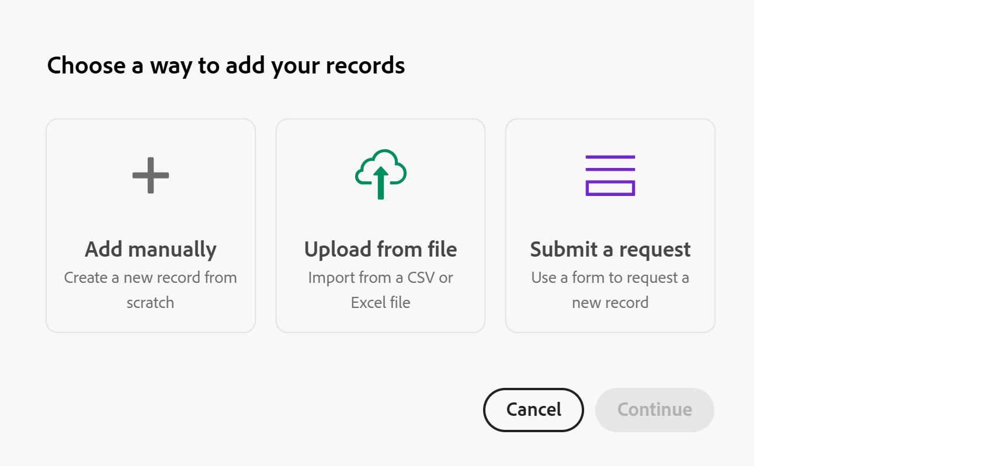
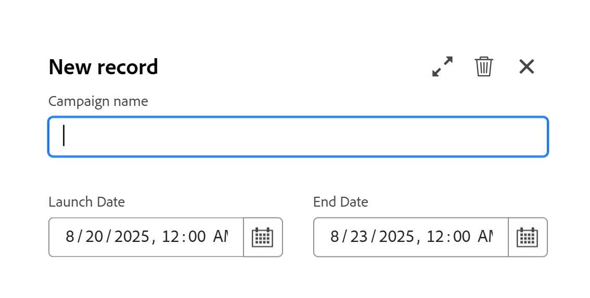

# Create records

The highlighted information on this page refers to functionality not yet generally available. It is available only in the Preview environment for all customers. After the monthly releases to Production, the same features are also available in the Production environment for customers who enabled fast releases.    

For information about fast releases, see [Enable or disable fast releases for your organization](/help/quicksilver/administration-and-setup/set-up-workfront/configure-system-defaults/enable-fast-release-process.md). 

{{planning-important-intro}}

In Adobe Workfront Planning, a record is an instance of a record type. 

You can create records by doing one of the following:

* [Use the New record or Request record button from any record type view](#create-records-using-the-new-record-or-request-record-button-from-any-record-type-view)
* [Add them inline from the record type table view](#create-records-by-adding-them-inline-from-the-record-type-table-view)

* [Add them in the record type timeline view](#create-records-by-adding-them-in-the-record-type-timeline-view)

* [Copy and paste a list of records from an external list](#create-records-by-copying-and-pasting-them-from-an-external-list)
* [Duplicate records from a table view](#create-records-by-duplicating-them)
* [Connect them from other records](#create-records-as-you-connect-them)
* [Submit a request form to a record type](#create-records-by-submitting-a-request-form-to-a-record-type)
* [Import information from a CSV or Excel file](#create-records-by-importing-records-from-a-csv-or-excel-file)
* [Use automations](#create-records-by-using-automations)

For information about managing records in the table or timeline views, see the following articles:

* [Manage the table view](/help/quicksilver/planning/views/manage-the-table-view.md)
* [Manage the timeline view](/help/quicksilver/planning/views/manage-the-timeline-view.md)

## Access requirements

+++ Expand to view access requirements.  

 <table style="table-layout:auto"> 
<col> 
</col> 
<col> 
</col> 
<tbody> 
    <tr> 
<tr> 
<td> 
   
 Products
 </td> 
   <td> 
   <ul><li>
 Adobe Workfront
</li> 
   <li>
 Adobe Workfront Planning
</li></ul></td> 
  </tr>   
<tr> 
   <td role="rowheader">
Adobe Workfront plan*
</td> 
   <td> 

Any of the following Workfront plans:
 
<ul><li>Select</li> 
<li>Prime</li> 
<li>Ultimate</li></ul> 

Workfront Planning is not available for legacy Workfront plans
 
   </td> 
<tr> 
   <td role="rowheader">
Adobe Workfront Planning package*
</td> 
   <td> 

Any 
 

For more information about what is included in each Workfront Planning plan, contact your Workfront account manager. 
 
   </td> 
 <tr> 
   <td role="rowheader">
Adobe Workfront platform
</td> 
   <td> 

Your organization's instance of Workfront must be onboarded to the Adobe Unified Experience to be able to access Workfront Planning.
 

For more information, see <a href="/help/quicksilver/workfront-basics/navigate-workfront/workfront-navigation/adobe-unified-experience.md">Adobe Unified Experience for Workfront</a>. 
 
   </td> 
   </tr> 
  </tr> 
  <tr> 
   <td role="rowheader">
Adobe Workfront license*
</td> 
   <td> Standard
   
Workfront Planning is not available for legacy Workfront licenses
 
  </td> 
  </tr> 
  <tr> 
   <td role="rowheader">
Access level configuration
</td> 
   <td> 
There are no access level controls for Adobe Workfront Planning
 
   
Edit access in Workfront for the object types that you want to create (projects, programs, and portfolios) as you connect the records to them. 
  
</td> 
  </tr> 
<tr> 
   <td role="rowheader">
Object permissions
</td> 
   <td> 
Contribute or higher permissions to the workspace and record type where you want to add records. 

   
View or higher permissions to the workspace and record type to create records using the Request record button on the record page

   
System Administrators have permissions to all workspaces, including the ones they did not create

   
Manage permissions to Workfront objects (portfolios) to add children objects (projects).

   </td> 
  </tr> 

</tbody> 
</table> 

 *For more information about Workfront access requirements, see [Access requirements in Workfront documentation](/help/quicksilver/administration-and-setup/add-users/access-levels-and-object-permissions/access-level-requirements-in-documentation.md).   

+++

## Create records using the New record or Request record button from any record type view

Users with View permissions to the workspace and record type can create records only using the Request record button on the record type page.

Users with Contribute and Manage permissions to the workspace and record type can create records using the New record button on the record type page. 

>[!IMPORTANT]
>
>A workspace manager must create a request form for the record type in order for users with View permissions to add records using a request form. Otherwise, View-permission users cannot create records. 

{{step1-to-planning}}
  
1. Click the workspace where you want to add records.

    The workspace opens and the record types display as cards.

1. Click a record type card. For information about creating a record type, see [Create record types](/help/quicksilver/planning/architecture/create-record-types.md). 

    The record type page opens in the view that you last accessed. By default, a record type page opens in the table view. 
    All the records of the selected type display in the view. 

1. (Conditional) From any view, click of the following in the upper-right corner of your screen, depending on the workspace and record type permissions:

    * Click **New record**, if you have Contribute or higher permissions on the workspace and record type

        Or

    * Click **Request record**, if you have View permissions on the workspace and record type. 

1. (Conditional) If you clicked **New record**, do the following:

    1. Click one of the following ways to create a record, then click **Continue**:

        * **Add manually**. The record's preview box opens.  
            Add information about the record, as described in the [Create records by adding them inline from the record type table view](#create-records-by-adding-them-inline-from-the-record-type-table-view) section in this article, starting with step 6. <!--insure this stays accurate-->
        * **Upload from file**
            Add records, as described in the article [Create records by importing information from a CSV or Excel file](/help/quicksilver/planning/records/import-file-to-create-records.md), starting with step 6. <!--ensure this stays accurate-->
        * **Submit a request**
            The request form of the record type opens. 
            
            A workspace manager must create a request form to be able to add a record using a request form. 

            >[!TIP]
            >
            >Some record types may have multiple forms. Click one to open it. 

            Add the record, as described in the article [Submit Adobe Workfront Planning requests to create records](/help/quicksilver/planning/requests/submit-requests.md), starting with step 6. <!--ensure this stays accurate-->
 
        

1. (Conditional) If you clicked **Request record**, do the following:

    1. (Conditional) If the record type has more than one request form, click one to choose it. 
    2. Continue adding information in the form to create the record, as described in the article [Submit Adobe Workfront Planning requests to create records](/help/quicksilver/planning/requests/submit-requests.md), starting with step 6. <!--ensure this stays accurate-->

1. (Conditional) Review the new records. 

    Depending on how you chose to add the record, some of the following things may occur:

    * A new record is added to the record type, unless you chose to add it using a request form with an approval process. The approval must be granted by all approvers before the record is created. 
    * Multiple records are added to the record type, if you added records using a CSV or Excel spreadsheet. 
    * A new request is added in the Planning tab of the Workfront Requests area, if you added the request by submitting a request form. 

<!-- this is not possible anymore: 

## Create records by connecting them from another application

You can import records from other applications by linking them to existing records. This creates a linked record for the other application's connected object. 

1. Create a record type, as described in the [Create record types](/help/quicksilver/planning/architecture/create-record-types.md).

1. Create records for the record type you created in the previous step. For information, see the section [Create records by manually adding them to a record type](#create-records-by-manually-adding-them-to-a-record-type) in this article. 

1. Create a connection to an object type from another application for the record type you created. For information, see [Connect record types](/help/quicksilver/planning/architecture/connect-record-types.md).

1. Add objects from another application to the records you created above using the linked record field you created in the previous step. For information, see [Connect records](/help/quicksilver/planning/records/connect-records.md). 

    The following items are created in Workfront Planning:

    * A read-only record type that refers to the other application's record type you linked to in the connected record field. 

      For example, if you connect a Planning record type to Workfront project, a read-only record type named "Workfront project" is created in the same workspace. You can access the read-only Workfront record types from the table view of the Planning records you're linking from. 
   
-->

## Create records by adding them inline from the record type table view

You can create records in the table view of a record type page, as you add them inline. 

For information about editing record information, see [Edit records](/help/quicksilver/planning/records/edit-records.md). 

{{step1-to-planning}}
  
1. Click the workspace where you want to add records.

    The workspace opens and the record types display as cards.

1. Click a record type card. For information about creating a record type, see [Create record types](/help/quicksilver/planning/architecture/create-record-types.md). 

    The record type page opens in the view that you last accessed. By default, a record type page opens in the table view. 
    Records of the selected type display in the view. 

1. (Conditional) From the table view, do one of the following: 

    * Click **New record** in the last row of the table, or after the last record in a grouping

        >[!TIP]
        >
        >When you add a new record after the last record in a grouping or subgrouping, Workfront automatically populates the fields included in the groupings. You can manually edit these fields, if needed, and the records might be removed from the grouping.  

    * Click **Shift + Enter** on your keyboard from any column or row of the table. This adds an empty row under the record you start from. 
    * Hover over a record's primary field, click the **More** menu  to the right of the field, then click **Insert record above** or **Insert record below**. 

    

    Workfront automatically uploads a thumbnail to each new record. You can later  modify these images. For information, see [Add a cover image to a record](/help/quicksilver/planning/records/add-a-cover-image-to-a-record.md).    

    A new record is added in the table. 

1. Click the new record's primary field 

    Or
    
    Click the **Open details** icon  to the left of the record name. 
    
    The preview box opens in the table.  

1. Start typing information about the new record in the fields you see in the preview box. 

    >[!NOTE]
    >
    >  * There are no mandatory fields for records. However, we recommend that you add information for the primary field of a record, as it is helpful to identify records when linking records to one another. For more information about primary fields, see [Manage the table view](/help/quicksilver/planning/views/manage-the-table-view.md) and [Primary field overview](/help/quicksilver/planning/fields/primary-field-overview.md). 
    >
    >  * Fields that refer to other record types or calculated fields are read-only fields. 

1. (Conditional) When adding records in the table, before opening the record's preview box, continue adding information on each row, then click **Enter** on your keyboard to save your changes.

    Or 
    
    Click the new record's name or the **Open details** icon  to the left of the record name to open the preview box and edit the record's information in the details area. 

    >[!TIP]
    >
    >You can access the **Open details** icon only from the name field of the record when the Name field is a primary field. 

1. (Optional) From the record's preview box, click the **Open in new tab** icon  in the upper-right corner to open the record's page in a new tab. Continue editing the record on the record page. For information, see [Edit records](/help/quicksilver/planning/records/edit-records.md).

    Workfront automatically saves your changes. 

1. (Optional) Close the preview box or click the back arrow to the left of the record name, if you opened the record's page. 

1. (Optional) From the table view, use the following keyboard shortcuts to undo or redo adding new records or their information, when adding them in the table view: 

    * CTRL + Z (⌘ + Z for Mac) to undo a change 
    * CTRL + Shift + Z (⌘ + Shift + Z for Mac) to redo a change

## Create records by adding them in the record type timeline view

You can create records in the timeline view of a record type page, by double-clicking in the timeline. 

For information about creating a timeline view, see [Manage the timeline view](/help/quicksilver/planning/views/manage-the-timeline-view.md).

{{step1-to-planning}}
  
1. Click the workspace where you want to add records.

    The workspace opens and the record types display as cards.

1. Click a record type card. 

    The record type page opens in the view that you last accessed. 

1. Click to open a timeline view, or create a timeline view, first. 

    >[!NOTE]
    >
    >You can create a timeline view only if there are at least two date fields associated with the record type.
1. Double-click anywhere in the timeline. 

    A new record box opens. <!--might need a new screen shot for Production - might add a title etc-->

    
1. Update the following information:

    * **Name**: Enter the name of the record. If you leave it empty, Workfront names it **Untitled** by default. The name will not be visible in the record bar if left empty. 
    * **Record date fields**: Update the dates of the record. 
        
        The names of the date fields are customized according to the fields selected for the Start and End dates when the timeline view was created.

        By default, date values are preselected depending on how you display the timeline view. The following scenarios exist:

        * By **Year**: The record start and end dates span a month.
        * By **Quarter**: The record start and end dates span a week. 
        * By **Month**: The record start and end dates span three days.

1. (Optional) Click one of the following icons: 

    * **Expand**  to open the record details in the preview window. 
    * **Delete**  to delete the record.
    * **Close**   to close the new record box. 

    The record is added to the timeline as well as to the table and calendar views immediately, unless you clicked the **Delete** icon. 

1. (Optional) Click the record bar in the timeline to open the record's details window and update its information, delete it, or add comments. 

    >[!TIP]
    >
    >By default, Workfront associates the record with a thumbnail and a cover image.
    >
    >The thumbnail displays in the timeline view only when it is enabled in the Settings of the view. 

## Create records by copying and pasting them from an external list

1. Start creating records in the Table view, as described in the section [Create records by manually adding them to a record type](#create-records-by-manually-adding-them-to-a-record-type) in this article. 

    Ensure that the table view has the columns (or the fields) that you want to populate with the new record information. 

1. Click **New < Record type name >** in the last row of the table to add as many new rows to the table as you want your new records to be. 

    For example, add 10 rows to the table view if you want to paste the information for 10 new records from another application. 

1. In another application, create a list of records that you want to import. 
    
    For example, you can use an Excel spreadsheet to create your list. 

    The list should contain information in a tabular format.

    >[!TIP]
    >
    > The columns of the list should contain information for the existing fields you have in Workfront. 
    >
    > Ensure you have the desired fields already created in Workfront and that the information in your sheet displays in the correct format that matches that of each field in Workfront.

1. From another application, select several rows and columns, then paste the information in the record type table view, starting with the first new record. 

    The following information is imported in the Workfront Planning area:
    
    * The rows contain the new records
    * The columns populate information for the fields of the records.

## Create records by duplicating them

For information about duplicating records, see [Duplicate records](/help/quicksilver/planning/records/copy-or-duplicate-records.md).

## Create records as you connect them

You can create the following object types as you connect them from other records:

* Workfront Planning records
* Workfront objects 

This section describes how you can create Workfront Planning records as you connect them from other records. 

>[!NOTE]
>
>Creating Workfront projects and portfolios as you connect them to Workfront Planning records is similar to creating Planning records as you connect them from other records.
>
>For information about creating Workfront objects from Workfront Planning, see [Create Workfront objects from Workfront Planning as you connect them to records](/help/quicksilver/planning/records/create-workfront-objects-from-workfront-planning.md). 

You must have the following before you can add new records by connecting them from existing records:

* Connected record types. For information, see [Connect record types](/help/quicksilver/planning/architecture/connect-record-types.md).
* Records.
* The correct access and permissions in Workfront Planning and Workfront, as described in the section [Access requirements](#access-requirements) in this article. 

To create records as you are connecting them from other records: 

1. Start connecting Workfront Planning records, as described in the article [Connect records](/help/quicksilver/planning/records/connect-records.md). You can connect records from the following areas: 

    * A connection field in following areas of Workfront Planning:

        * The table view
        * The details page or preview box of a record

    * A connection field in the the Planning section of a project, portfolio, or program in Workfront. 
    
        For information, see [Manage record connections from Workfront objects](/help/quicksilver/planning/records/manage-records-in-planning-section.md).  

1. (Conditional) If you can't find a record when trying to connect it, click **+ Add**

    Or
    Start typing a name, then click **+ Add**. The **+ Add** button is followed by the name of the record type you are connecting to. For example, "Add brands" when adding a brand to an existing campaign. The name you typed also follows the Add button. 

    

    The record is created and added to the connected record field. 

    >[!IMPORTANT]
    >
    >* You can create only projects, portfolios, and programs in Workfront when connecting them from a record. 
    >
    >* You cannot create groups or companies when connecting them from a record in Workfront Planning. 
    > 

1. (Optional) Go to the table view of the record type whose record you created. A new record displays in the last row of the view. 
1. (Optional) Start adding information for the new record in the table view
Or
Click its name to open the details page and add information there. 

## Create records by submitting a request form to a record type

After someone creates a request form for a record type and shares a link to it with you, you can submit a request which creates a record for that record type. 

For information, see [Create and manage a request form in Adobe Workfront Planning](/help/quicksilver/planning/requests/create-request-form.md).

Both Workfront users and users external to your organization can submit requests to Planning record types and create records, if they have a link to the request form.

For information, see [Submit Adobe Workfront Planning requests to create records](/help/quicksilver/planning/requests/submit-requests.md).

## Create records when importing record types from a CSV or Excel file

You can import records when you import record types using a CSV or Excel file. 

For information, see [Create record types](/help/quicksilver/planning/architecture/create-record-types.md).

## Create records by importing records from a CSV or Excel file

You can import records for existing record types when you import information from a CSV or Excel file. 

For information, see [Create records by importing information from a CSV or Excel file](/help/quicksilver/planning/records/import-file-to-create-records.md). 

## Create records by using automations

You can configure automations in Workfront Planning that, when activated, create records when triggered from a Planning record. The created records are automatically connected to the records you are triggering the automation from.

You can configure and activate the automation in the record's page in Workfront Planning. The connected record that is created is placed in the connected field of the record type you run the automation from.

For information, see [Create objects using Adobe Workfront Planning record automations](/help/quicksilver/planning/records/create-wf-objects-using-planning-automations.md). 

