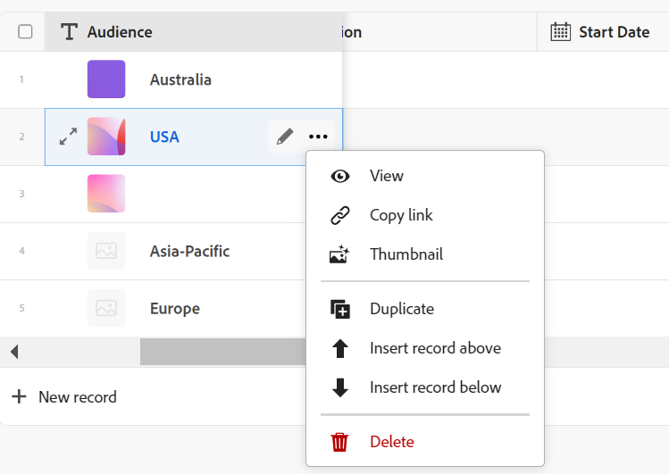
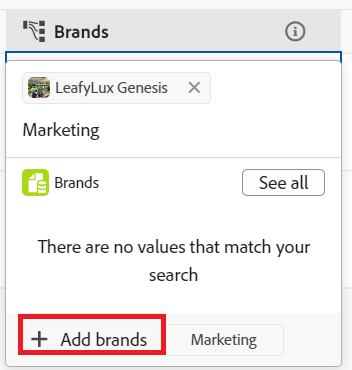

<!--update the metadata with real information when making this available in TOC and in the left nav-->

# Create records

{{planning-important-intro}}

In Adobe Workfront Planning, a record is an instance of a record type. 

You can create records by doing one of the following:

* Add them from the record type page in the table view
* Copy and paste a list of records from an external list
* Duplicate them
* Create them as you connect them from other records

This article describes how you can create records. 

For information about managing records in the table or timeline views, see the following articles:

* [Manage the table view](/help/quicksilver/planning/views/manage-the-table-view.md)
* [Manage the timeline view](/help/quicksilver/planning/views/manage-the-timeline-view.md)

## Access requirements

<!--Updated for GA-->

+++ Expand to view access requirements for Workfront Planning. 

You must have the following to be able to access Workfront Planning:  

 <table style="table-layout:auto"> 
<col> 
</col> 
<col> 
</col> 
<tbody> 
    <tr> 
<tr> 
<td> 
   
 Products
 </td> 
   <td> 
   <ul><li>
 Adobe Workfront
</li> 
   <li>
 Adobe Workfront Planning
</li></ul></td> 
  </tr>   
<tr> 
   <td role="rowheader">
Adobe Workfront plan*
</td> 
   <td> 

Any of the following Workfront plans:
 
<ul><li>Select</li> 
<li>Prime</li> 
<li>Ultimate</li></ul> 

Workfront Planning is not available for legacy Workfront plans
 
   </td> 
<tr> 
   <td role="rowheader">
Adobe Workfront Planning plan*
</td> 
   <td> 

Any 
 

For more information about what is included in each Workfront Planning plan, see <a href="https://business.adobe.com/products/workfront/pricing.html">Adobe Workfront pricing and packaging</a>. 
 
   </td> 
 <tr> 
   <td role="rowheader">
Adobe Workfront platform
</td> 
   <td> 

Your organization's instance of Workfront must be onboarded to the Adobe Unified Experience to be able to access all the capabilities of Workfront Planning.
 

For more information, see <a href="/help/quicksilver/workfront-basics/navigate-workfront/workfront-navigation/adobe-unified-experience.md">Adobe Unified Experience for Workfront</a>. 
 
   </td> 
   </tr> 
  </tr> 
  <tr> 
   <td role="rowheader">
Adobe Workfront license*
</td> 
   <td> Standard
   
Workfront Planning is not available for legacy Workfront licenses
 
  </td> 
  </tr> 
  <tr> 
   <td role="rowheader">
Access level configuration
</td> 
   <td> 
There are no access level controls for Adobe Workfront Planning
 
   
Edit access in Workfront for the object types that you want to create (projects and portfolios) as you connect the records to them. 
  
</td> 
  </tr> 
<tr> 
   <td role="rowheader">
Object permissions
</td> 
   <td> 
Manage permissions to the workspace you want to add records to. 
  
   
System Administrators have permissions to all workspaces, including the ones they did not create

   
Manage permissions to Workfront objects (portfolios) to add children objects (projects).

   </td> 
  </tr> 
<tr> 
   <td role="rowheader">
Layout template
</td> 
   <td> 
All users, including Workfront administrators,  must be assigned a layout template that includes the Planning area in the Main Menu 
 </td> 
  </tr> 
</tbody> 
</table> 

 *For more information about Workfront access requirements, see [Access requirements in Workfront documentation](/help/quicksilver/administration-and-setup/add-users/access-levels-and-object-permissions/access-level-requirements-in-documentation.md).   

<!--OLD info: 

<table style="table-layout:auto">
 <col>
 </col>
 <col>
 </col>
 <tbody>
    <tr>
<tr>
<td>
   
 Product
 </td>
   <td>
   
 Adobe Workfront
 </td>
  </tr>  
 <td role="rowheader">
Adobe Workfront agreement
</td>
   <td>

Your organization must be enrolled in the early access stage for Workfront Planning 

   </td>
  </tr>
  <tr>
   <td role="rowheader">
Adobe Workfront plan
</td>
   <td>

Any

   </td>
  </tr>
  <tr>
   <td role="rowheader">
Adobe Workfront license*
</td>
   <td>
   
New: Standard

   
Current: Plan
  
  </td>
  </tr>
  
  <tr>
   <td role="rowheader">
Access level configurations
</td>
   <td> 
There are no access controls for Adobe Workfront Planning 
  
</td>
  </tr>
<tr>
   <td role="rowheader">
Permissions
</td>
   <td> 
Contribute or higher permissions to a workspace</a> 
  
   
System Administrators have permissions to all workspaces, including the ones they did not create

</td>
  </tr>
<tr>
   <td role="rowheader">
Layout template
</td>
   <td> 
Your Workfront or group administrator must add the Planning area in your layout template. For information, see <a href="/help/quicksilver/planning/access/access-overview.md">Access overview</a>. 
  
</td>
  </tr>

 </tbody>
</table>

*For more information, see [Access requirements for Workfront documentation](/help/quicksilver/administration-and-setup/add-users/access-levels-and-object-permissions/access-level-requirements-in-documentation.md). -->

+++

## Create records by adding them to a record type <!--in a record type table (I don't think you can create them elsewhere right now)-->

You can create records in the table view of a record type page. 

For information about editing record information, see [Edit records](/help/quicksilver/planning/records/edit-records.md). 

{{step1-to-planning}}
  
1. Click the workspace where you want to add records.

    The workspace opens and the record types display as cards.

1. Click a record type card. For information about creating a record type, see [Create record types](/help/quicksilver/planning/architecture/create-record-types.md). 

    The record type page opens in the view that you last accessed. By default, a record type page opens in the table view. 
    All the records of the selected type display in the view. 

1. (Conditional) Depending on which view you display, do one of the following: 

    * From the table view: 

        * Click **New record** in the last row of the table 

        * Click **Shift + Enter** on your keyboard from any column or row of the table. This adds an empty row under the record you start from. 
        * Hover over a record's primary field, click the **More** menu  to the right of the field, then click **Insert record above** or **Insert record below**. 

        

    * From any view: 
    
        * Click **New record** in the upper-right corner of the page. The record preview box opens. 

        Workfront automatically uploads a thumbnail and a cover image to each new record. You can later  modify these images. For information, see the following articles:

        * [Add a cover image to a record](/help/quicksilver/planning/records/add-a-cover-image-to-a-record.md)
        * [Add a thumbnail to a record](/help/quicksilver/planning/records/add-thumbnails-to-records.md)

1. Start typing information about the new record in the fields you see in the preview box. 

    >[!NOTE]
    >
    >  * There are no mandatory fields for records. However, we recommend that you add information for the primary field of a record, as it is helpful to identify records when linking records to one another. For more information about primary fields, see [Manage the table view](/help/quicksilver/planning/views/manage-the-table-view.md) and [Primary field overview](/help/quicksilver/planning/fields/primary-field-overview.md). 
    >
    >  * Fields that refer to other record types or calculated fields are read-only fields. 

1. (Conditional) When adding records in the table, continue adding information on each row, then click **Enter** on your keyboard to save your changes.

    Or 
    
    Click the new record's name or the **Open details** icon  to the left of the record name. A preview with the record's detailed information opens in the table. 

    >[!TIP]
    >
    >You can access the **Open Details** icon only from the name field of the record when the Name field is a primary field. 

1. Start editing the record's information in the record's preview. Workfront automatically saves your changes. 
1. (Optional) Click the **Open in new tab** icon  in the upper-right corner of the record's preview to open the record's page in a new tab. Continue editing the record on the record page. For information, see [Edit records](/help/quicksilver/planning/records/edit-records.md).

1. (Optional) Use the following keyboard shortcuts to undo or redo adding new records or their information, when adding them in the table view: 

    * CTRL + Z (⌘ + Z for Mac) to undo a change 
    * CTRL + Shift + Z (⌘ + Shift + Z for Mac) to redo a change

<!-- this is not possible anymore: 

## Create records by connecting them from another application

You can import records from other applications by linking them to existing records. This creates a linked record for the other application's connected object. 

1. Create a record type, as described in the [Create record types](/help/quicksilver/planning/architecture/create-record-types.md).

1. Create records for the record type you created in the previous step. For information, see the section [Create records by manually adding them to a record type](#create-records-by-manually-adding-them-to-a-record-type) in this article. 

1. Create a connection to an object type from another application for the record type you created. For information, see [Connect record types](/help/quicksilver/planning/architecture/connect-record-types.md).

1. Add objects from another application to the records you created above using the linked record field you created in the previous step. For information, see [Connect records](/help/quicksilver/planning/records/connect-records.md). 

    The following items are created in Workfront Planning:

    * A read-only record type that refers to the other application's record type you linked to in the connected record field. 

      For example, if you connect a Planning record type to Workfront project, a read-only record type named "Workfront project" is created in the same workspace. You can access the read-only Workfront record types from the table view of the Planning records you're linking from. 
   
-->

## Create records by copying and pasting them from an external list

1. Start creating records in the Table view, as described in the section [Create records by manually adding them to a record type](#create-records-by-manually-adding-them-to-a-record-type) in this article. 

    Ensure that the table view has the columns (or the fields) that you want to populate with the new record information. 

1. Click **New < Record type name >** in the last row of the table to add as many new rows to the table as you want your new records to be. 

    For example, add 10 rows to the table view if you want to paste the information for 10 new records from another application. 

1. In another application, create a list of records that you want to import. 
    
    For example, you can use an Excel spreadsheet to create your list. 

    The list should contain information in a tabular format.

    >[!TIP]
    >
    > The columns of the list should contain information for the existing fields you have in Workfront. 
    >
    > Ensure you have the desired fields already created in Workfront and that the information in your sheet displays in the correct format that matches that of each field in Workfront.

1. From another application, select several rows and columns, then paste the information in the record type table view, starting with the first new record. 

    The following information is imported in the Workfront Planning area:
    
    * The rows contain the new records
    * The columns populate information for the fields of the records.

## Create records by duplicating them

For information about duplicating records, see [Duplicate records](/help/quicksilver/planning/records/copy-or-duplicate-records.md).

## Create records as you connect them

You can create records or Workfront objects as you connect them from other records. 

You must have the following before you can add new records or Workfront objects by connecting them from existing records:

* Connected record types. For information, see [Connect record types](/help/quicksilver/planning/architecture/connect-record-types.md).
* Connected records. For information, see [Connect records](/help/quicksilver/planning/records/connect-records.md).
* The correct access and permissions in Workfront Planning and Workfront, as described in the section [Access requirements](#access-requirements) in this article. 

>[!NOTE]
>
>Creating Workfront projects and portfolios as you connect them to Workfront Planning records is similar to creating Planning records as you connect them from other records.

To create records as you are connecting them from other records: 

1. Start connecting Workfront Planning records, as described in the article [Connect records](/help/quicksilver/planning/records/connect-records.md). 
1. (Conditional) If you cannot find a record when trying to add it from the connected record field of another record, search for a record, then click **+ Add**. The **+ Add** button is followed by the name of the record type you are connecting from. 

    

    The record is created and added to the connected record field. 
1. (Optional) Go to the table view of the record type whose record you created. A new record displays in the last row of the view. 
1. (Optional) Start adding information for the new record in the table view
Or
Click its name to open the details page and add information there. 

