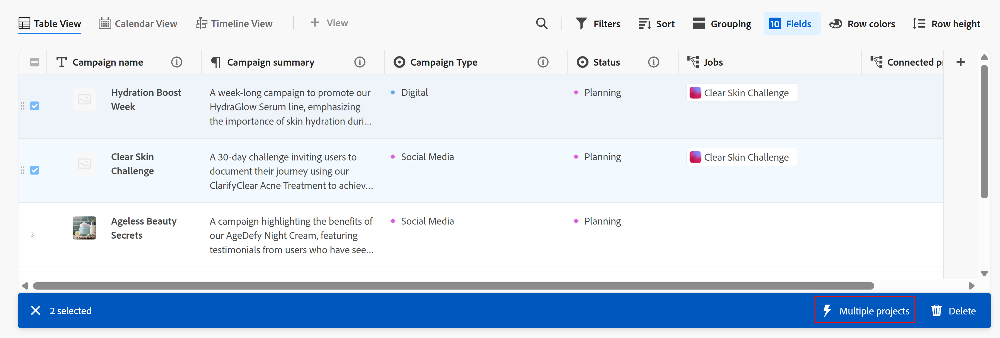

# Create objects using Adobe Workfront Planning record automations

<!--you might need to add something about notifications and emails?!-->

<!--The highlighted information on this page refers to functionality not yet generally available. It is available only in the Preview environment for all customers. After the monthly releases to Production, the same features are also available in the Production environment for customers who enabled fast releases.    

For information about fast releases, see [Enable or disable fast releases for your organization](/help/quicksilver/administration-and-setup/set-up-workfront/configure-system-defaults/enable-fast-release-process.md). -->

After you configured and activated automations in Adobe Workfront Planning, you can use them to create objects in Adobe Workfront or records in Adobe Workfront Planning. 

For example, you could use an existing automation that takes a Workfront Planning campaign and creates a project in Workfront to track that campaign's progress. The project would be connected to the Workfront Planning campaign in the Connected Project field on the campaign.

This article describes how you can create Workfront Planning records or Workfront objects using an existing automation. 

For information about creating automations for a record type, see [Configure Adobe Workfront Planning automations to create records](/help/quicksilver/planning/records/configure-automations-to-create-records.md).

After you create records or Workfront objects using automations, they will be automatically linked to the records you are running the automation from. 

For more information about connected records, see [Connected records overview](/help/quicksilver/planning/records/connected-records-overview.md).

You can create the following items using automations in Workfront Planning:

* A Workfront Planning record
* One or several projects
* A group
* A program
* A portfolio
* A project

## Access requirements

+++ Expand to view the access requirements for the functionality in this article. 

<table style="table-layout:auto"> 
<col> 
</col> 
<col> 
</col> 
<tbody> 
    <tr> 
<tr> 
</tr>   
<tr> 
   <td role="rowheader">
Adobe Workfront package
</td> 
   <td> 
<ul> 
<li>
Any Workfront and any Planning package
</li>
Or
<li>
Any Workflow and any Planning packages</li></ul>

For more information about what is included in each Workfront Planning package, contact your Workfront account representative. 
 
   </td> 
  <tr> 
   <td role="rowheader">
Adobe Workfront license
</td> 
   <td>
Standard

   </td> 
  </tr> 
  <tr> 
   <td role="rowheader">
Access level configuration
</td> 
   <td> 
There are no access level controls for Adobe Workfront Planning
 
   
Edit access with access to Create objects in Workfront for the object types that you want to create (projects, portfolios, programs). 
  
</td> 
  </tr> 
<tr> 
   <td role="rowheader">
Object permissions
</td> 
   <td> 
Contribute or higher permissions to the workspace and to the record type where you want to create objects using existing automations. 
  
   
Manage permissions to Workfront objects (portfolios) to add children objects (programs or projects).

   
System Administrators have Manage permissions to all workspaces, including the ones they did not create

   </td> 
  </tr> 
</tbody> 
</table> 

For more information about Workfront access requirements, see [Access requirements in Workfront documentation](/help/quicksilver/administration-and-setup/add-users/access-levels-and-object-permissions/access-level-requirements-in-documentation.md).

+++   

<!--Old:

<table style="table-layout:auto"> 
<col> 
</col> 
<col> 
</col> 
<tbody> 
    <tr> 
<tr> 
<td> 
   
 Products
 </td> 
   <td> 
   <ul><li>
 Adobe Workfront
</li> 
   <li>
 Adobe Workfront Planning
</li></ul></td> 
  </tr>   
<tr> 
   <td role="rowheader">
Adobe Workfront plan*
</td> 
   <td> 

Any of the following Workfront plans:
 
<ul><li>Select</li> 
<li>Prime</li> 
<li>Ultimate</li></ul> 

Workfront Planning is not available for legacy Workfront plans
 
   </td> 
<tr> 
   <td role="rowheader">
Adobe Workfront Planning package*
</td> 
   <td> 

Any 
 

For more information about what is included in each Workfront Planning plan, contact your Workfront account manager. 
 
   </td> 
 <tr> 
   <td role="rowheader">
Adobe Workfront platform
</td> 
   <td> 

Your organization's instance of Workfront must be onboarded to the Adobe Unified Experience to be able to access Workfront Planning.
 

For more information, see <a href="/help/quicksilver/workfront-basics/navigate-workfront/workfront-navigation/adobe-unified-experience.md">Adobe Unified Experience for Workfront</a>. 
 
   </td> 
   </tr> 
  </tr> 
  <tr> 
   <td role="rowheader">
Adobe Workfront license*
</td> 
   <td> Standard
   
Workfront Planning is not available for legacy Workfront licenses
 
  </td> 
  </tr> 
  <tr> 
   <td role="rowheader">
Access level configuration
</td> 
   <td> 
There are no access level controls for Adobe Workfront Planning
 
   
Edit access with access to Create objects in Workfront for the object types that you want to create (projects, portfolios, programs). 
  
</td> 
  </tr> 
<tr> 
   <td role="rowheader">
Object permissions
</td> 
   <td> 
Contribute or higher permissions to the workspace and to the record type where you want to create objects using existing automations. 
  
   
Manage permissions to Workfront objects (portfolios) to add children objects (programs or projects).

   
System Administrators have Manage permissions to all workspaces, including the ones they did not create

   </td> 
  </tr> 

</tbody> 
</table> -->

## Considerations about creating objects and records using an automation

* The name of the object or record created by an automation is the same as the record name from which you create it, when you create a single object. 

* When you create multiple projects, they are automatically named according to the following pattern: 

   `[ Name of the record ] Name of the field choice`

   For more information, see the [Use a Workfront Planning automation to create an object or a record](#use-a-workfront-planning-automation-to-create-an-object-or-a-record) section in this article.

* New objects or records don't override existing ones in the same field. Triggering the same automation multiple times for the same record adds the new objects or records in the same connected field of the original record, in addition to the ones created before. 

<!--hide this for now; they are trying to remove this limitation: * The automation adds additional objects only in the Many to many or One to many connection type fields. In the all other cases, the automation creates the object, but it does not connect it to the original record from which the automation is triggered.-->
 

## Use a Workfront Planning automation to create an object or a record

1. In Workfront Planning, open the record type page that contains the automation you want to use to automatically create and connect records or objects. 
1. Open the table view. 
1. Select one or more records.
   
   A blue bar displays at the bottom of the table with additional buttons, including automation buttons. 
1. Click the automation button on the blue bar. 

   

   The following things occur: 

   * A confirmation message displays at the bottom of the screen, if the automation successfully created an object or a record. 

   * The new object displays in the connected field indicated in the setup of the automation button. You might need to refresh your page before viewing the new object. The new object has the same name as the original record.

   * If multiple projects were created based on the choices of multi- or single-select fields, the projects are automatically named according to the following pattern: 

      `[ Name of the record ] Name of the field choice`

      For example, if a campaign named `Summer breeze` generated a project from a field choice of `EMEA`, the project is named `[ Summer breeze ] EMEA`.

   * The record you are triggering the automation from is added to the connected field of the new records.

   >[!NOTE]
   >
   >We recommend checking that the objects or records were created and connected as expected.

1. (Optional) Click the new object in the connected field. The object page opens and you can make additional changes to the new object. 

<!--ORIGINAL AUTOMATION FUNCTIONALITY - BEFORE FEB. 20, 2025

You can configure automations in Adobe Workfront Planning that, when activated, create objects in Workfront or records in Workfront Planning when triggered from a Planning record. The created objects or records are automatically connected to the records you are triggering the automation from. 

You can configure and activate the automation in the record type's page in Workfront Planning. The connected object that is created is placed in the connected field of the record type you run the automation from. 

For example, you could create an automation that takes a Workfront Planning campaign and creates a project in Workfront to track that campaign's progress. The project would be connected to the Workfront Planning campaign in the Connected Project field on the campaign.

For more information on connected records, see [Connected records overview](/help/quicksilver/planning/records/connected-records-overview.md).

## Access requirements

+++ Expand to view access requirements. 

You must have the following access to perform the steps in this article:  

 <table style="table-layout:auto"> 
<col> 
</col> 
<col> 
</col> 
<tbody> 
    <tr> 
<tr> 
<td> 
   
 Products
 </td> 
   <td> 
   <ul><li>
 Adobe Workfront
</li> 
   <li>
 Adobe Workfront Planning
</li></ul></td> 
  </tr>   
<tr> 
   <td role="rowheader">
Adobe Workfront plan*
</td> 
   <td> 

Any of the following Workfront plans:
 
<ul><li>Select</li> 
<li>Prime</li> 
<li>Ultimate</li></ul> 

Workfront Planning is not available for legacy Workfront plans
 
   </td> 
<tr> 
   <td role="rowheader">
Adobe Workfront Planning package*
</td> 
   <td> 

Any 
 

For more information about what is included in each Workfront Planning plan, contact your Workfront account manager. 
 
   </td> 
 <tr> 
   <td role="rowheader">
Adobe Workfront platform
</td> 
   <td> 

Your organization's instance of Workfront must be onboarded to the Adobe Unified Experience to be able to access Workfront Planning.
 

For more information, see <a href="/help/quicksilver/workfront-basics/navigate-workfront/workfront-navigation/adobe-unified-experience.md">Adobe Unified Experience for Workfront</a>. 
 
   </td> 
   </tr> 
  </tr> 
  <tr> 
   <td role="rowheader">
Adobe Workfront license*
</td> 
   <td> Standard
   
Workfront Planning is not available for legacy Workfront licenses
 
  </td> 
  </tr> 
  <tr> 
   <td role="rowheader">
Access level configuration
</td> 
   <td> 
There are no access level controls for Adobe Workfront Planning
 
   
Edit access in Workfront for the object types that you want to create (projects, portfolios, programs). 
  
</td> 
  </tr> 
<tr> 
   <td role="rowheader">
Object permissions
</td> 
   <td> 
Manage permissions to the workspace you want to add records to. 
  
   
System Administrators have permissions to all workspaces, including the ones they did not create

   
Manage permissions to Workfront objects (portfolios) to add children objects (projects).

   </td> 
  </tr> 
<tr> 
   <td role="rowheader">
Layout template
</td> 
   <td> 
All users, including Workfront administrators,  must be assigned a layout template that includes the Planning area in the Main Menu 
 </td> 
  </tr> 
</tbody> 
</table> 

 *For more information about Workfront access requirements, see [Access requirements in Workfront documentation](/help/quicksilver/administration-and-setup/add-users/access-levels-and-object-permissions/access-level-requirements-in-documentation.md).   

+++

## Considerations about creating objects and records using an automation

* The new object or record name is the same as the record name from which you create it. 
* New objects or records don't override existing ones in the same field. Triggering the same automation multiple times for the same records adds the new objects or records in the same connected field of the original record, in addition to the ones created before. 
* The automation adds additional objects only in the Many to many or One to many connection type fields. In the all other cases, the automation creates the object, but it does not connect it to the original record from which the automation is triggered. 

## Configure an automation in Workfront Planning

You must configure an automation for a record type in Workfront Planning, before you can use it to create objects.

{{step1-to-planning}}

1. Click a record type card, then click the name of a record. 

   The record type page opens. 
1. Click the **More** menu  to the right of the record type name, then click **Manage automations**. 

   The list of available automations for the selected record type opens.

1. Click **New automation** in the upper-right corner of the screen. The **New automation** box opens.
1. Update the following fields:

   * Replace **Untitled automation** with the text that you want to appear on the automation button. Users will click this button when using the automation to create a Workfront object or a Planning record.
   * **Description**: Add a description to identify the purpose of the automation.
1. Click **Save**.
   The automation details page opens. 

1. On the automation's details page, update the following fields in the **Triggers** section: 

   * **Trigger**: Select the action that will trigger the automation. For example, select **Button click**. (********update this step with a list of all possible triggers; right not only Button click is available***********)

1. Update the following fields in the **Actions** section: <********submitted bugs for these fields - see if they need changing here*********)
   * **Object type**: Select the object that you want the automation to create. This is a required field.
      
      You can create the following objects from Workfront Planning records: 

      * Project
      * Portfolio
      * Program
      * Group
      * Record

      >[!TIP]
      >
      >After you saved the automation, you can no longer change the object type in this field.

1. (Conditional) Depending on what type of object you want to create, update the following fields:

   * **Project**: 
      * **Connected field where the object is created**: This is the connected field where the new project will display. This is a required field. 
      * **Template from which to create the project**: Select a project template that Workfront will use to create the project.  
   * **Portfolio**:
      * **Connected field where the object is created**: This is the connected field where the new portfolio will display. This is a required field.
      * **Custom form to attach to the new portfolio**: Select a custom form to attach to the new portfolio. You must create a portfolio custom form before you can select it. 
   * **Program**: 
      * **Connected field where the object is created**: This is the connected field where the new program will display. This is a required field.
      * **Program portfolio**: Select a portfolio where the new program will be added. This is a required field.
      * **Custom form to attach to the new program**: Select a custom form to attach to the new program. You must create a program custom form before you can select it. 
   * **Group**:
      * **Connected field where the object is created**: This is the connected field where the new group will display. This is a required field.
      * **Custom form to attach to the new group**: Select a custom form to attach to the new program. You must create a program custom form before you can select it. 
   * **Record**: 
      * **Connected record type**: Select the record type you want to create. 
      * **Connected field where the record is created**: This is the connected field where the new record will display. This is a required field. (******this might need revision as right now it shows the field on the connected record table where the current record will display; submitted a bug to correct this label*********)
      * **Map fields**
         * **Transfer from**: Select fields from the record type the automation is created for to map them to the fields of the connected record type. 
      * **Transfer to**: Select fields from the newly created record that will populate with information from the record you are running the automation from. 
1. (Optional and conditional) If you selected to create a record, click **Add fields** to map additional lookup fields from one record to another.
1. (Optional and conditional) If you don't have a connection field for a Workfront object type, click the **Create a connection field** icon  to add a field.

   The new field is automatically created and named **Connected < Workfront object name >**. For example, when a portfolio connected field is created for the record, it is named "Connected portfolio." 

1. Click **Save** in the upper-right corner of the automation details page. 

   The automation displays on the list of automations, and is available to use in records.
1. (Optional) To edit, disable, or delete an automation, do the following:

   1. From the list of automations, hover over the name of a saved automation, then click the **More** menu .

   1. Click **Edit** to update information about and configure fields on the automation.
   1. Click **Disable** to remove the automation from the table view and prevent users from using it to create records or objects. To make it available again, click the **More** menu  again, then click **Activate**.
   1. Click **Delete** to delete the automation. A deleted automation cannot be recovered. Records that have been created using the automation remain connected to the record originally selected.  

## Use a Workfront Planning automation to create an object or a record

1. In Workfront Planning, open the record type page that contains the records you want to use to create Workfront objects or Planning records. 
1. Open the table view. 
1. Select one or more records.
   
   A blue bar displays at the bottom of the table with additional buttons, including automation buttons. 
1. Click the automation button near the lower-right corner of the screen. 

   

   A confirmation message displays at the bottom of the screen, if the automation successfully created an object or a record. 

   The new object displays in the connected field you indicated in the setup of the automation button. You might need to refresh your page before viewing the new object. 

   >[!NOTE]
   >
   >We recommend checking that the object was created and connected as expected.

1. (Optional) Click the new object in the connected field. The object page opens and you can make additional changes to the new object. 

-->

