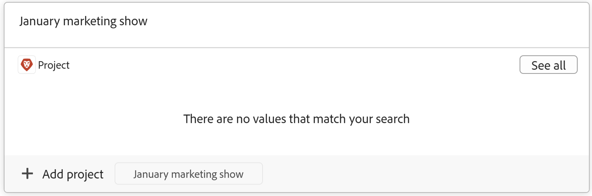
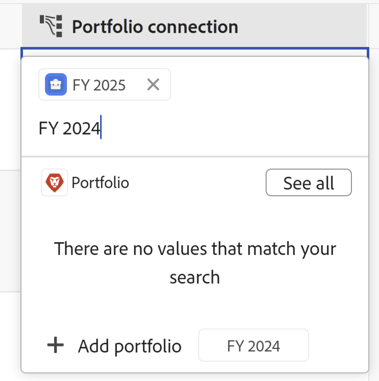

<!--update the metadata with real information when making this available in TOC and in the left nav-->

# Create Workfront objects from Workfront Planning

The information on this page refers to functionality not yet generally available. It is available only in the Preview environment for all customers. After the monthly releases to Production, the same features are also available in the Production environment for customers who enabled fast releases.    

For information about fast releases, see [Enable or disable fast releases for your organization](/help/quicksilver/administration-and-setup/set-up-workfront/configure-system-defaults/enable-fast-release-process.md). 

{{planning-important-intro}}

You can create the following types of Workfront objects from Workfront Planning:

* Projects
* Portfolios

You can create Workfront projects and portfolios from Workfront Planning when you connect a Workfront Planning record with a project or portfolio.

>[!IMPORTANT]
>
>* You can create only projects and portfolios in Workfront when connecting them from a record. 
>
>* You cannot create programs, groups, or companies when connecting them from a record in Workfront Planning. 
>
<!--* You cannot create a project from a template when when you create projects by connecting them from a record. You must manually add tasks and project information or a template to the new project after you add it to the record.-->

For information about connecting Planning records with Workfront objects, see [Connect records](/help/quicksilver/planning/records/connect-records.md). 

## Access requirements

+++ Expand to view access requirements for Workfront Planning. 

You must have the following access to perform the steps in this article:  

 <table style="table-layout:auto"> 
<col> 
</col> 
<col> 
</col> 
<tbody> 
    <tr> 
<tr> 
<td> 
   
 Products
 </td> 
   <td> 
   <ul><li>
 Adobe Workfront
</li> 
   <li>
 Adobe Workfront Planning
</li></ul></td> 
  </tr>   
<tr> 
   <td role="rowheader">
Adobe Workfront plan*
</td> 
   <td> 

Any of the following Workfront plans:
 
<ul><li>Select</li> 
<li>Prime</li> 
<li>Ultimate</li></ul> 

Workfront Planning is not available for legacy Workfront plans
 
   </td> 
<tr> 
   <td role="rowheader">
Adobe Workfront Planning package*
</td> 
   <td> 

Any 
 

For more information about what is included in each Workfront Planning plan, contact your Workfront account manager. 
 
   </td> 
 <tr> 
   <td role="rowheader">
Adobe Workfront platform
</td> 
   <td> 

Your organization's instance of Workfront must be onboarded to the Adobe Unified Experience to be able to access all the capabilities of Workfront Planning.
 

For more information, see <a href="/help/quicksilver/workfront-basics/navigate-workfront/workfront-navigation/adobe-unified-experience.md">Adobe Unified Experience for Workfront</a>. 
 
   </td> 
   </tr> 
  </tr> 
  <tr> 
   <td role="rowheader">
Adobe Workfront license*
</td> 
   <td> Standard
   
Workfront Planning is not available for legacy Workfront licenses
 
  </td> 
  </tr> 
  <tr> 
   <td role="rowheader">
Access level configuration
</td> 
   <td> 
There are no access level controls for Adobe Workfront Planning
 
   
Edit access in Workfront for the object types that you want to create (projects and portfolios) as you connect the records to them. 
  
</td> 
  </tr> 
<tr> 
   <td role="rowheader">
Object permissions
</td> 
   <td> 
Manage permissions to the workspace you want to add records to. 
  
   
System Administrators have permissions to all workspaces, including the ones they did not create

   
Manage permissions to Workfront objects (portfolios) to add children objects (projects).

   </td> 
  </tr> 
<tr> 
   <td role="rowheader">
Layout template
</td> 
   <td> 
All users, including Workfront administrators,  must be assigned a layout template that includes the Planning area in the Main Menu 
 </td> 
  </tr> 
</tbody> 
</table> 

 *For more information about Workfront access requirements, see [Access requirements in Workfront documentation](/help/quicksilver/administration-and-setup/add-users/access-levels-and-object-permissions/access-level-requirements-in-documentation.md).   

+++

## Prerequisites for creating Workfront objects when connecting them with records from Workfront Planning

You must have the following before you can add new projects or portfolios by connecting them from existing records:

* Record types connected to Workfront projects or portfolios. For information, see [Connect record types](/help/quicksilver/planning/architecture/connect-record-types.md).
* Records. For information, see [Create records](/help/quicksilver/planning/records/create-records.md).
* The correct access and permissions in Workfront Planning and Workfront, as described in the section [Access requirements](#access-requirements) in this article. 

## Create projects when connecting them with records from Workfront Planning

To create projects as you are connecting them from other records: 

1. Go to a record's details page or to the record type's table and start connecting Workfront Planning records with Workfront projects, as described in the article [Connect records](/help/quicksilver/planning/records/connect-records.md). 

    You can connect projects from a connection field in following areas of Workfront Planning:

    * The table view of a record type
    * The details page or preview box of a record
    
1. (Conditional) If you cannot find a project when trying to add it from the connected record field of another record, add a name, then click **+ Add**. The **+ Add** button is followed by the name of the object type you are connecting to. For example, "Add project", when adding a new project to an existing campaign. The Add button is also followed by the project name you typed. 

    

    The **Create project** box opens.

1. (Optional) Update the **Project name**. By default, the project is named after what you added as your search item when connecting it from the record. 
1. (Optional) Select a **Project template**. If you do not select a template, Workfront creates a blank project, with no tasks. 
1. Click **Create**. 
1. (Conditional) If you selected to create a project from a template, follow the steps in the article [Create a project using a template](/help/quicksilver/manage-work/projects/create-projects/create-project-from-template.md) article to finish adding the project.

    The new project is created and added to the connected field of the selected record. 

1. (Optional) Click the name of the new project from Workfront Planning to open the project's page in Workfront and make additional updates to the project. 
 
## Create portfolios when connecting them with records from Workfront Planning

To create portfolios as you are connecting them from other records: 

1. Go to a record's details page or to the record type's table and start connecting Workfront Planning records with Workfront portfolios, as described in the article [Connect records](/help/quicksilver/planning/records/connect-records.md). 

    You can connect portfolios from a connection field in following areas of Workfront Planning:

    * The table view of a record type
    * The details page or preview box of a record
    
1. (Conditional) If you cannot find a portfolio when trying to add it from the connected record field of another record, add a name, then click **+ Add**. The **+ Add** button is followed by the name of the object type you are connecting to. For example, "Add portfolio", when adding a new portfolio to an existing campaign. The Add button is also followed by the portfolio name you typed. 

    

    The portfolio is created and added to the connection field of the record you selected. 

1. (Optional) Click the name of the new portfolio from Workfront Planning to open the portfolio's page in Workfront and make additional updates to the portfolio. 
