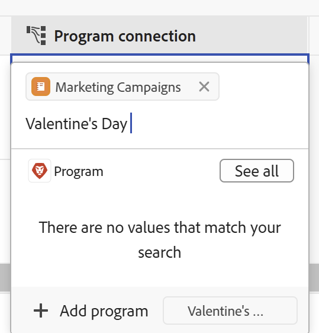

<!--update the metadata with real information when making this available in TOC and in the left nav-->

# Create Workfront objects from Workfront Planning as you connect them to records

<!-- update the title (and all the links to this article) at preview, to be this: Create Workfront objects from Workfront Planning as you connect them to records-->
<!-- remove preview and production at release time-->

The information highlighted on this page refers to functionality not yet generally available. It is available only in the Preview environment for all customers. After the monthly releases to Production, the same features are also available in the Production environment for customers who enabled fast releases.    

For information about fast releases, see [Enable or disable fast releases for your organization](/help/quicksilver/administration-and-setup/set-up-workfront/configure-system-defaults/enable-fast-release-process.md). 

{{planning-important-intro}}

You can create Adobe Workfront objects from Workfront Planning in the following ways: 

* As you connect Workfront objects from Planning records

    This article describes how to create Workfront objects from Workfront Planning as you connect them from Planning records. 
* When you use automations from a record's page. 

    For information about creating Workfront objects using automations, see [Create objects using Adobe Workfront Planning record automations](/help/quicksilver/planning/records/create-wf-objects-using-planning-automations.md). 

You can create the following types of Workfront objects from Workfront Planning when you connect a Workfront Planning record with the following Workfront object types:

* Projects
* Portfolios
* Programs

>[!IMPORTANT]
>
>* You can create only projects, portfolios, and programs in Workfront when connecting them from a record. 
>
>* You cannot create groups or companies when connecting them from a record in Workfront Planning. 
>

You can connect projects, portfolios, and programs from a connection field in following areas of Workfront Planning:

* The table view of a record type
* The Details page or preview box of a record
* The Connections tab of a record

For information about connecting Planning records with Workfront objects, see [Connect records](/help/quicksilver/planning/records/connect-records.md). 

## Access requirements

+++ Expand to view access requirements. 

You must have the following access to perform the steps in this article:  

 <table style="table-layout:auto"> 
<col> 
</col> 
<col> 
</col> 
<tbody> 
    <tr> 
<tr> 
<td> 
   
 Products
 </td> 
   <td> 
   <ul><li>
 Adobe Workfront
</li> 
   <li>
 Adobe Workfront Planning
</li></ul></td> 
  </tr>   
<tr> 
   <td role="rowheader">
Adobe Workfront plan*
</td> 
   <td> 

Any of the following Workfront plans:
 
<ul><li>Select</li> 
<li>Prime</li> 
<li>Ultimate</li></ul> 

Workfront Planning is not available for legacy Workfront plans
 
   </td> 
<tr> 
   <td role="rowheader">
Adobe Workfront Planning package*
</td> 
   <td> 

Any 
 

For more information about what is included in each Workfront Planning plan, contact your Workfront account manager. 
 
   </td> 
 <tr> 
   <td role="rowheader">
Adobe Workfront platform
</td> 
   <td> 

Your organization's instance of Workfront must be onboarded to the Adobe Unified Experience to be able to access Workfront Planning.
 

For more information, see <a href="/help/quicksilver/workfront-basics/navigate-workfront/workfront-navigation/adobe-unified-experience.md">Adobe Unified Experience for Workfront</a>. 
 
   </td> 
   </tr> 
  </tr> 
  <tr> 
   <td role="rowheader">
Adobe Workfront license*
</td> 
   <td> Standard
   
Workfront Planning is not available for legacy Workfront licenses
 
  </td> 
  </tr> 
  <tr> 
   <td role="rowheader">
Access level configuration
</td> 
   <td> 
There are no access level controls for Adobe Workfront Planning
 
   
Edit access with access to Create objects in Workfront for the object types that you want to create (projects, portfolios, programs). 
  
</td> 
  </tr> 
<tr> 
   <td role="rowheader">
Object permissions
</td> 
   <td> 
Manage permissions to the workspace and record type where you want to add records. 
  
   
System Administrators have permissions to all workspaces, including the ones they did not create

   
Manage permissions to Workfront objects (portfolios) to add children objects (projects).

   </td> 
  </tr> 
<tr> 
   <td role="rowheader">
Layout template
</td> 
   <td> 
In the Production environment, all users including the System Administrators must be assigned to a layout template that includes Planning.

In the Preview environment, Standard users and System Administrators have Planning enabled by default.
 </td> 
  </tr> 
</tbody> 
</table> 

 *For more information about Workfront access requirements, see [Access requirements in Workfront documentation](/help/quicksilver/administration-and-setup/add-users/access-levels-and-object-permissions/access-level-requirements-in-documentation.md).   

+++

## Prerequisites for creating Workfront objects when connecting them with records from Workfront Planning

You must have the following before you can add new projects or portfolios by connecting them from existing records:

* Record types connected to Workfront projects, portfolios, or programs. For information, see [Connect record types](/help/quicksilver/planning/architecture/connect-record-types.md).
* Records. For information, see [Create records](/help/quicksilver/planning/records/create-records.md).
* The correct access and permissions in Workfront Planning and Workfront, as described in the section [Access requirements](#access-requirements) in this article. 

## Create projects as you connect them with records from Workfront Planning

To create projects as you are connecting them from other records: 

1. Go to a record's details page or to the record type's table and start connecting Workfront Planning records with Workfront projects, as described in the article [Connect records](/help/quicksilver/planning/records/connect-records.md). 
    
1. (Conditional) Click **Add project** 
    Or 
    Start typing the name of a project, then click **Add project** if you cannot find it. The Add button is followed by the project name you typed. 

    

    The **Create project** box opens.

1. (Optional) Update the **Project name**. By default, the project is named after what you added as your search item when connecting it from the record. 
1. (Optional) Select a **Project template**. If you do not select a template, Workfront creates a blank project, with no tasks. 
1. Click **Create**. 
1. (Conditional) If you selected to create a project from a template, follow the steps in the article [Create a project using a template](/help/quicksilver/manage-work/projects/create-projects/create-project-from-template.md) article to finish adding the project.

    The new project is created and added to the connected field of the selected record. 

1. (Optional) Click the name of the new project from Workfront Planning to open the project's page in Workfront and make additional updates to the project. 
 
## Create portfolios as you connect them with records from Workfront Planning

To create portfolios as you are connecting them from Planning records: 

1. Go to a record's details page or to the record type's table and start connecting Workfront Planning records with Workfront portfolios, as described in the article [Connect records](/help/quicksilver/planning/records/connect-records.md).
    
1. (Conditional) Click **Add portfolio**

    Or
    
    Start typing the name of a portfolio, then click **Add portfolio** if you cannot find it. The Add button is followed by the portfolio name you typed. 

    

    The portfolio is created and added to the connection field of the record you selected. 

1. (Optional) Click the name of the new portfolio from Workfront Planning to open the portfolio's page in Workfront and make additional updates to the portfolio.

## Create programs as you connect them with records from Workfront Planning

To create programs as you are connecting them from Planning records: 

1. Go to a record's details page or to the record type's table and start connecting Workfront Planning records with Workfront portfolios, as described in the article [Connect records](/help/quicksilver/planning/records/connect-records.md). 
    
1. Click **Add program** 

    Or 
    
    Start typing the name of a program, then click **Add program** if you cannot find it. The Add button is followed by the program name you typed. 

    

    The **Create program** box opens.

1. Update the **Program name**. This is a required field.
1. Choose a **Portfolio** from the drop-down, or start typing the name of a portfolio, then select it when it displays in the list. This is a required field. 
1. Click **Create**.

    The program is created and added to the connection field of the record you selected. 

1. (Optional) Click the name of the new program from Workfront Planning to open the program's page in Workfront and make additional updates to it. 

