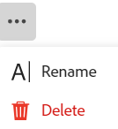

<!--update the metadata with real information when making this available in TOC and in the left nav-->

# Delete records

{{planning-important-intro}}

You can delete records that are no longer relevant in Adobe Workfront Planning. 

## Access requirements

You must have the following access to perform the steps in this article: 

<table style="table-layout:auto">
 <col>
 </col>
 <col>
 </col>
 <tbody>
    <tr>
<tr>
<td>
   
 Product
 </td>
   <td>
   
 Adobe Workfront
 </td>
  </tr>  
 <td role="rowheader">
Adobe Workfront agreement
</td>
   <td>

Your organization must be enrolled in the early access stage for Workfront Planning 

   </td>
  </tr>
  <tr>
   <td role="rowheader">
Adobe Workfront plan
</td>
   <td>

Any

   </td>
  </tr>
  <tr>
   <td role="rowheader">
Adobe Workfront license

   </td>
   <td>
   
Any
 
  </td>
  </tr>
  
  <tr>
   <td role="rowheader">
Access level configurations
</td>
   <td> 
There are no access level controls for Adobe Workfront Planning 
  
</td>
  </tr>

  <tr>
   <td role="rowheader">
Permissions
</td>
   <td> 
Contribute or higher permissions to a workspace</a> 
  
   
System Administrators have permissions to all workspaces, including the ones they did not create

</td>
  </tr>
<tr>
   <td role="rowheader">
Layout template
</td>
   <td> 
Your Workfront or group administrator must add the Planning area in your layout template. For information, see <a href="/help/quicksilver/planning/access/access-overview.md">Access overview</a>. 
  
</td>
  </tr>

 </tbody>
</table>

<!--Maybe enable this at GA - but Planning is not supposed to have Access controls in the Workfront Access Level: 
>[!NOTE]
>
>If you don't have access, ask your Workfront administrator if they set additional restrictions in your access level. For information on how a Workfront administrator can change your access level, see [Create or modify custom access levels](/help/quicksilver/administration-and-setup/add-users/configure-and-grant-access/create-modify-access-levels.md). -->

## Considerations about deleting records

* You can delete records that you or another user created. 
* You cannot recover deleted records. <!--the above statements (and in the metadata description) will change with access levels and recycle bin??-->
* If the deleted records are linked to other records, the linked records are not deleted, but the information from the deleted record is also deleted. 
* You cannot delete records in bulk. <!--this will probably change-->
* You cannot delete records from the timeline view. 

## Delete records

You can delete a record from the following areas:

* [From the record's page](#delete-a-record-from-the-records-page)
* [From the table view of a record type](#delete-a-record-from-the-record-type-table-view) 

### Delete a record from the record's page

{{step1-to-planning}}

   The workspace that you access last opens. 

1. Click a record type. 

    The record type page opens. 
1. Do one of the following:

    * From a Table view, click the name of a record. 
    * From the Table view, hover over the name of a record, then click the **More** menu , then click **View**

        
    * From a Timeline view, click a record bar. 

    The record page opens.  
  
1. Click the **More** menu  to the right of the record name, then click **Delete**, then **Delete** again to confirm. 

     <!--ensure the options have not changed or been renamed-->
    The record is deleted and cannot be recovered. 

### Delete a record from the record type table view

{{step1-to-planning}}

  The workspace that you accessed last opens. 

1. Click a record type. 

    The record type page opens. 
1. (Conditional) From the **View** drop-down menu in the upper-left corner of the table, select a Table view. This should be the default view, unless you viewed the record type in the timeline view when you accessed it last. 

    The records associated with the selected record type display in the table view. 
1. Do one of the following:

    * Right-click a record row, then click **Delete**. 
    * Click the **More** menu  to the right of the record name, then click **Delete**

        
    
    * Click the **Open details** icon  to open the box with the record's detailed information, and click **More**  to the right of the record name, then **Delete**.

    The record is deleted and cannot be recovered.

1. (Optional) Use the following keyboard shortcuts to undo or redo deleting a record:

    * CTRL + Z (⌘ + Z for Mac) to undo a change 
    * CTRL + Shift + Z (⌘ + Shift + Z for Mac) to redo a change 
