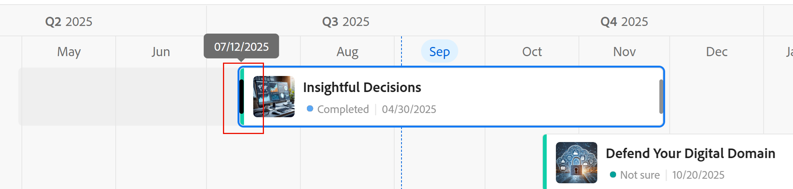
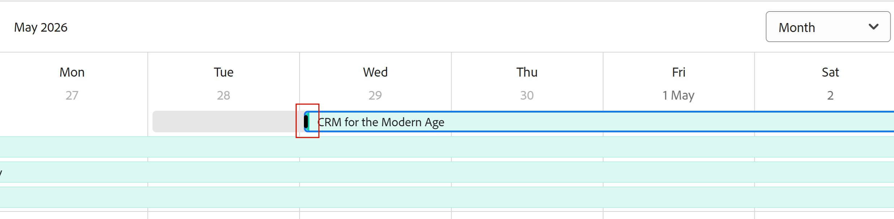
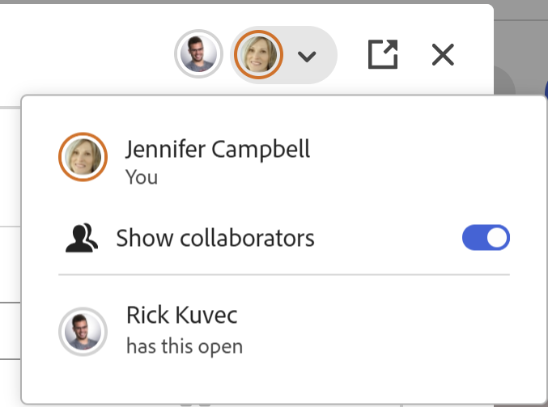

# Edit records

The highlighted information on this page refers to functionality not yet generally available. It is available only in the Preview environment for all customers. After the monthly releases to Production, the same features are also available in the Production environment for customers who enabled fast releases.    

For information about fast releases, see [Enable or disable fast releases for your organization](/help/quicksilver/administration-and-setup/set-up-workfront/configure-system-defaults/enable-fast-release-process.md). 

{{planning-important-intro}}

You can edit record information in Adobe Workfront Planning by editing the values of the fields associated with the records. 

You must create record types before you can start creating and editing records. 

For information, see [Create record types](/help/quicksilver/planning/architecture/create-record-types.md).

For information about creating records, see [Create records](/help/quicksilver/planning/records/create-records.md). 

<!-- mention in here that the fields in the Details view are the same as the ones in the table view -- this article is linked from the Manage record views one to refer to this info-->

## Access requirements

+++ Expand to view access requirements.

<table style="table-layout:auto"> 
<col> 
</col> 
<col> 
</col> 
<tbody> 
    <tr> 
<tr> 
<td> 
   
 Products
 </td> 
   <td> 
   <ul><li>
 Adobe Workfront
</li> 
   <li>
 Adobe Workfront Planning
</li></ul></td> 
  </tr>   
<tr> 
   <td role="rowheader">
Adobe Workfront plan*
</td> 
   <td> 

Any of the following Workfront plans:
 
<ul><li>Select</li> 
<li>Prime</li> 
<li>Ultimate</li></ul> 

Workfront Planning is not available for legacy Workfront plans
 
   </td> 
<tr> 
   <td role="rowheader">
Adobe Workfront Planning package*
</td> 
   <td> 

Any 
 

For more information about what is included in each Workfront Planning plan, contact your Workfront account manager. 
 
   </td> 
 <tr> 
   <td role="rowheader">
Adobe Workfront platform
</td> 
   <td> 

Your organization's instance of Workfront must be onboarded to the Adobe Unified Experience to be able to access Workfront Planning.
 

For more information, see <a href="/help/quicksilver/workfront-basics/navigate-workfront/workfront-navigation/adobe-unified-experience.md">Adobe Unified Experience for Workfront</a>. 
 
   </td> 
   </tr> 
  </tr> 
  <tr> 
   <td role="rowheader">
Adobe Workfront license*
</td> 
   <td> 
Standard
 
   
Workfront Planning is not available for legacy Workfront licenses
 
  </td> 
  </tr> 
  <tr> 
   <td role="rowheader">
Access level configuration
</td> 
   <td> 
There are no access level controls for Adobe Workfront Planning
   
</td> 
  </tr> 
<tr> 
   <td role="rowheader">
Object permissions
</td> 
   <td>  
Contribute or higher permissions to a workspace and record type </a> 
  
   
System Administrators have permissions to all workspaces, including the ones they did not create
  </td> 
  </tr> 

</tbody> 
</table> 

 *For more information about Workfront access requirements, see [Access requirements in Workfront documentation](/help/quicksilver/administration-and-setup/add-users/access-levels-and-object-permissions/access-level-requirements-in-documentation.md).

+++   

## Considerations about editing records

* You can edit records that you created or records created by others, if you were given permissions to the workspace. 
* You can edit record fields from the following areas:

    * The record's preview in a record view
    * The record's details page
    * Inline, in a table view. 
<!--* You can edit a record's dates from the following areas:
        * All areas listed above
        * In a timeline view, by resizing the record bars
         * In a calendar monthly view, by resizing the record bars
        For information, see [Create records](/help/quicksilver/planning/records/create-records.md). -->

<!-- when drag and drop is available replace the last 2 points with this:

* In a timeline view, by resizing the record bars or dragging and dropping the record bars in a new position
* In a calendar view, by resizing the record bars when viewing it by month, or by dragging and dropping the record bars in a new position
    For information, see [Create records](/help/quicksilver/planning/records/create-records.md).
-->

* When a user edits a record in a view, the changes are visible immediately in all views and the record pages to all other users.

* The following types of fields are automatically updated, and you cannot edit their values manually: 
    * Linked fields from other records
    * Formula-type fields
    * System fields (Created by, Created date, Last modified by, Last modified date) 
* If the records you display are linked to other records, the new information of the records that you are editing reflects on the linked records. 
* You cannot edit records in bulk. <!--this will probably change-->
* URLs are recognized as links in single-line text field types only when they start with the following: http://, https://, ftp://, or www. . 
* You can add a cover image to each record. The image is unique for each record, and it does not apply to all records of the same time. 
* You can edit the order of the fields in a record page and add a cover image for a record. For more information, see [Manage the record page layout](/help/quicksilver/planning/records/manage-the-record-page.md).

## Edit records

You can edit a record from the following areas:

* [The table view](#edit-a-record-inline-in-the-table-view-of-a-record-type)
* [The timeline view](#edit-a-record-in-the-timeline-view-of-a-record-type)
* [The calendar view](#edit-a-record-in-the-calendar-view-of-a-record-type)
* [The record's preview in a view](#edit-a-record-from-the-records-preview-in-a-view)
* [The record's page](#edit-a-record-from-the-records-page)
* [A Workfront object in the Planning section](#edit-a-record-from-a-workfront-object-in-the-planning-section)

To edit the records' dates, do the following:

* [Resize the records' bars in the timeline and calendar view]

### Edit a record inline in the table view of a record type

When you edit records from the table view, there is an indication which field is being edited by other users at the time you are viewing the record. 

For more information, see [Manage record views](/help/quicksilver/planning/views/manage-record-views.md). 

When you add a new record after the last record in a grouping or subgrouping, Workfront automatically updates the fields included in the groupings for the new records. You can manually edit these fields, if needed, and the records might be removed from the grouping. 

For information, see [Create records](/help/quicksilver/planning/records/create-records.md). 

{{step1-to-planning}}

1. Click the workspace whose records you want to edit

    The workspace opens and the record types display as cards.
1. Click a record type card. 

    The record type page opens. 
1. (Conditional) Click the tab of a table view or click **+ View** to create a table view. The table view should be the default view, unless you viewed the record type in another type of view when you accessed it last.

    The records associated with the selected record type display in the table view. 
1. Click inside the row of a record to start editing information about the record inline.

    

    >[!TIP]
    >
    >  You cannot edit information for the following fields, as they are read-only and Workfront updates them automatically: 
    >  
    >  * Linked fields that are created by connecting record types. For more information, see [Connect record types](/help/quicksilver/planning/architecture/connect-record-types.md).
    >  * Fields of the following types: Created by, Created date, Last modified by, Last Modified date, Formula fields.

1. (Optional and conditional) When you edit a Paragraph-type field, use the following **Rich Text** formatting options: 

    * Bold
    * Italic
    * Underline 
    * Add a link
    * Add a bulleted list
    * Add a numbered list

    

1. (Optional) Double-click a connected record field to add connected records or objects to another record. For more information, see [Connect records](/help/quicksilver/planning/records/connect-records.md). 
1. Press **Enter** on your keyboard or click outside of a row to save your changes. The changes are saved automatically. A **Saved** indicator displays briefly in the upper-right corner of the table view to show that the changes were saved. 

1. (Optional) To copy and paste information from one field to another, do one of the following:       

    * Copy one or multiple existing values of one field, then paste them into a field of the same type on another record
    * Click the column header of a column to select it and copy it, then click the column header of another column and paste the contents of the copied column. The columns must contain similar field types. 
    * With your Shift key pressed, click to select several rows in a table, copy the information in the selected rows, then click a different row and paste the selected information in the new row and the following rows after that. 
    * Copy the information from one cell, then select multiple cells and paste the same information in multiple cells. You can select multiple cells and paste the same information in multiple cells from adjacent rows and columns. 
    * Select the lower-right corner of an existing cell that contains the information you want to copy, then drag and drop it across the adjacent cells where you want to paste the same information. All cells must contain the same type of information. 

        
    
  
    * Copy one or multiple cells from an external source (for example, an Excel file), then paste them in one of the the following fields types:

        * Workfront Planning connection fields.  
        * People fields. Only fields with one value are supported. 

        You cannot copy information from an external source and paste it in any other field types, including Workfront or AEM Assets connection fields.

    >[!NOTE]
    >
    >Consider the following:   
    >
    >* Use the following keyboard shortcuts for copying and pasting information:
    >   * Copy: CTRL + C (⌘ + C for Mac)
    >   * Paste: CTRL + V (⌘ + V for Mac) 
    >
    >* You cannot copy and paste field values in the record page. This functionality is supported only in the table view of a record type.  
    >* You cannot copy and paste field values for the following field types:   
    >
    >    * Lookup fields that are created when connecting record types. You can copy and paste linked record fields. For more information, see [Connect record types](/help/quicksilver/planning/architecture/connect-record-types.md). 
    >    * Fields of the following types: Created by, Created date, Last modified by, Last Modified date 
    
1. (Optional) Use the following keyboard shortcuts to undo or redo editing or copying and pasting record information: 

    * CTRL + Z (⌘ + Z for Mac) to undo a change 
    * CTRL + Shift + Z (⌘ + Shift + Z for Mac) to redo a change 

    >[!TIP]
    >
    >    You can use the keyboard shortcuts multiple times in a row to undo multiple changes.

1. (Optional) Add a thumbnail to a record. For information, see [Add a thumbnail to a record](/help/quicksilver/planning/records/add-thumbnails-to-records.md).

### Edit a record in the timeline view of a record type

<!--add another step about drag and drop here when that is available-->

1. Open the record type page in a timeline view. For information, see [Manage the timeline view](/help/quicksilver/planning/views/manage-the-timeline-view.md).

1. Hover over the ends of a record's bar, click, drag and drop its margin to another date. This automatically updates either the start or end date of the record.  

    

1. Click the bar of a record to open its details area and edit all fields. 

    For information, see the [Edit a record from the record's preview in a view](#edit-a-record-from-the-records-preview-in-a-view) section in this article. 

### Edit a record in the calendar view of a record type

<!--add another step about drag and drop here when that is available-->

1. Open the record type page in a calendar view. For information, see [Manage the calendar view](/help/quicksilver/planning/views/manage-the-calendar-view.md).
1. (Conditional) Select **Month** in the upper-right dropdown menu.
1. Hover over the ends of a record's bar, click, drag and drop its margins to another date. This automatically updates either the start or end date of the record.  

    

1. Click the bar of a record to open its details area and edit all fields. 

    For information, see the [Edit a record from the record's preview in a view](#edit-a-record-from-the-records-preview-in-a-view) section in this article. 

### Edit a record from the record's preview in a view

{{step1-to-planning}}

1. Click the workspace whose records you want to edit

    The workspace opens and the record types display as cards. 

1. Click a record type card. 

    The record type page opens. 

1. From a view of any type, click the record 

    Or 
    
    From the table view, click the **Open details** icon  in the first column. The record's preview opens in the view.

     

1. (Optional) Click the **More** menu to the right of the record's title, then click **Rename**. This updates the field that displays as the record's title.

    The record's title is the primary field of the record when viewed in a table view. For information, see [Primary field overview](/help/quicksilver/planning/fields/primary-field-overview.md). 

1. Start editing the field information in the record's preview.  

    >[!TIP]
    >
    >  You cannot edit information for the following fields, as they are read-only and Workfront updates them automatically: 
    >  
    >  * Lookup fields from other records that are created by connecting record types. For more information, see [Connect record types](/help/quicksilver/planning/architecture/connect-record-types.md).
    >  * Fields of the following types: Created by, Created date, Last modified by, Last Modified date, Formula fields.

1. (Optional) Click **Add cover** to add a cover image to the record. For more information, see [Add a cover image to a record](/help/quicksilver/planning/records/add-a-cover-image-to-a-record.md). 

1. (Optional) Hover over the thumbnail icon, then click **More**  > **Edit thumbnail** to add a thumbnail image. For information, see [Add a thumbnail to a record](/help/quicksilver/planning/records/add-thumbnails-to-records.md). 

    Workfront automatically saves your changes.

1. (Optional) Click the **real-time indicator**  in the upper-right corner of the record's preview box, then enable the **Show collaborators** setting to highlight the fields being edited by others in real time. 

    The names and avatars of all users accessing the record at the same time display in this area.  

    When the setting is disabled, the avatars and names are listed in the real-time indicator area, and the fields that are being edited are not highlighted. 
    
    

1. (Optional) Click the **Export** menu  to export the record's details. For information, see [Export a record's details](/help/quicksilver/planning/records/export-the-record-page.md).

1. (Optional) Click the **Open in new tab** icon  <!--check the icon; they are changing it--> in the upper-right corner of the record's preview to open the record's page in a new tab. Continue editing the record as described in [Edit a record from the record's page](#edit-a-record-from-the-records-page) section in this article. 

### Edit a record from the record's page

{{step1-to-planning}}

1. Click the workspace whose records you want to edit

    The workspace opens and the record types display as cards. 

1. Click a record type card. 

    The record type page opens. 

1. Do one of the following:

    * From any view, access the record's preview, as described in the [Edit a record from the record's preview in a view](#edit-a-record-from-the-records-preview-in-a-view) section in this article, then click the **Open in new tab** icon  <!--check the icon; they are changing it--> in the upper-right corner of the record preview to open the record's page in a new tab. 

    * From the **Table** view, hover over the name of a record, then click the **More** menu , then click **View**

        
    
        The record page opens.

        

1. (Optional) Click the **More** menu to the right of the record's title, then click **Rename**. This updates the field that displays as the record's title.

    The record's title is the primary field of the record when viewed in a table view. For information, see [Manage the table view](/help/quicksilver/planning/views/manage-the-table-view.md). 
    
1. Click any editable field on the record page to edit it. 

    >[!TIP]
    >
    >  You cannot edit information for the following fields, as they are read-only and Workfront updates them automatically: 
    >  
    >  * Linked fields that are created by connecting record types. For more information, see [Connect record types](/help/quicksilver/planning/architecture/connect-record-types.md).
    >  * Fields of the following types: Created by, Created date, Last modified by, Last Modified date, Formula fields.

1. (Optional) Click the information icon to the right of any field that displays it to view the description of a field. 
1. (Optional) Click **Add cover** to add a cover image to the record
    
    Or
    
    Hover over the existing cover image, then click the **More** menu  > **Upload** to add a new cover image for the record. 
    
    For more information, see [Add a cover image to a record](/help/quicksilver/planning/records/add-a-cover-image-to-a-record.md). 

1. (Optional) Hover over an existing thumbnail, or the **thumbnail icon** , then click the **More** menu  > **Edit thumbnail** to add a thumbnail for the record. 

    For more information, see [Add a thumbnail to a record](/help/quicksilver/planning/records/add-thumbnails-to-records.md).

    Workfront automatically saves your changes.

1. (Optional) Click the **real-time indicator**  in the upper-right corner of the record's page, then enable the **Show collaborators** setting to highlight the fields being edited by others in real time. 

    The names and avatars of all users accessing the record at the same time display in this area.  

    When the setting is disabled, the avatars and names are listed in the real-time indicator area, and the fields that are being edited are not highlighted.
    
    

1. (Optional) Click the **Export** menu  to export the record's details. For information, see [Export a record's details](/help/quicksilver/planning/records/export-the-record-page.md).
    

## Edit a record from a Workfront object in the Planning section

After you connect records with Workfront objects, you can edit Workfront Planning records in Workfront from the object's Planning section. 

For more information, see [Manage record connections from Workfront objects](/help/quicksilver/planning/records/manage-records-in-planning-section.md). 

## Edit information on single- or multi-select fields

<!--some of this information is also available in Edit fields article - update both when necessary-->

When editing information in a single-or multi-select field, you can add new choices to the field, without having to edit the field. 

>[!IMPORTANT]
>
>The functionality described in this section is available only in the table view. It is not available in any other areas where single- or multi-select fields display.

**EXAMPLE**

You might have a single-select field called Status that has the choices New and Closed, and you want to add a choice for an In progress status. You can add the choice by doing one of the following things:

* Editing the field. For information, see [Edit fields](/help/quicksilver/planning/fields/edit-fields.md)
* Adding a new option while editing the record in the table view, as described below. 

To add a new choice to an existing select field when editing a record: 

1. Go to a record type page and open the table view. 
1. Add the single- or multi-select field that you would like to add a choice to in the table view as a new column. For information, see [Create fields](/help/quicksilver/planning/fields/create-fields.md). 
1. Start editing the field inline by double-clicking the cell for the field. 
1. Type the name of the choice you want to add, then click **Add choice**.

    

    The new choice is added immediately to the single-select field. 

